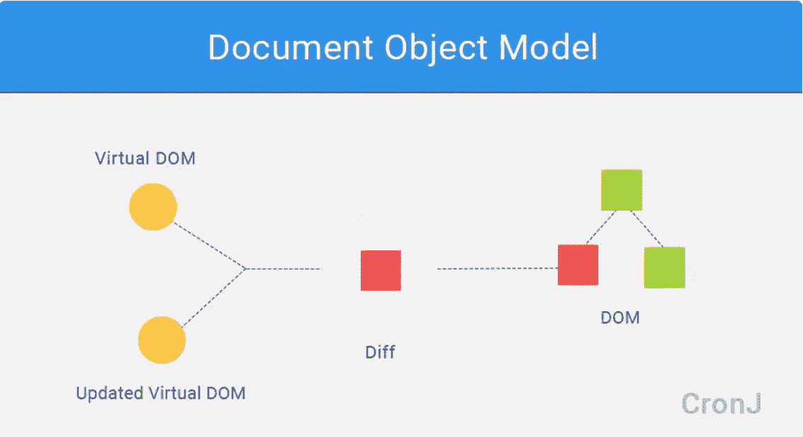

# 虚拟 DOM:为什么在 React js 中

> 原文：<https://medium.com/nerd-for-tech/virtual-dom-and-react-1232be73e028?source=collection_archive---------0----------------------->

## 什么是虚拟 DOM (VDOM)

先说 reactjs.org 的定义

> 虚拟 DOM (VDOM)是一个编程概念，其中 UI 的理想或“虚拟”表示保存在内存中，并通过 ReactDOM 之类的库与“真实”DOM 同步。这个过程叫做和解。

那是一个地狱般的定义，让我们试着去理解它。

虚拟 DOM 是一个由浏览器 API 上的库实现的概念。每当浏览器发生变化时，JS 都会遍历整个 DOM，而不是只呈现需要变化的部分。这既耗时又昂贵。

通俗地说，假设你的汽车引擎需要修理，那么你将修理引擎，而不是修理你的整辆汽车。虚拟 DOM 也是如此，不是呈现整个 DOM，而是只呈现发生更改的元素。

图片提供:谷歌

React 使用 Diff 算法来比较新树和最近树之间的变化(这里的树只是指新 VDOM 和最近 VDOM 所做的变化)。这种比较过程叫做调和。

React 使用广度优先搜索(BFS)解析树。

请记住，虚拟 DOM 实际上并不存在，它是真实 DOM 的内存表示或蓝图。

让我们再举一个例子:您正在构建一个包含两个输入字段的表单。现在，您必须添加另一个输入字段，当您添加第三个输入字段时，VDOM 是根据您的更改创建的，而真实的 DOM 不受影响。现在，VDOM 和真实 DOM 之间的比较发生了，只在需要的地方对 div 进行了更改。

**为什么是虚拟 DOM？**简单，这就是反应快的原因。这是通过虚拟 DOM diffing 实现的。比较新旧两个虚拟树，然后只对真实 DOM 进行必要的修改。

不要混淆 VDOM 是 React js 开发的，VDOM 是 React js 使用的一个概念。虚拟 DOM 本质上是 DOM 在给定时间的截图。每当发生变化时，组件被重新渲染，生成一个新的 VDOM。

虚拟 DOM 越来越受欢迎，因为它使您的应用程序速度更快，并消除了整个页面不必要的渲染。这既节省了时间又节省了金钱。

> 我希望你喜欢这篇文章，并发现它是有帮助的。如果我错过了什么，请在评论区告诉我。