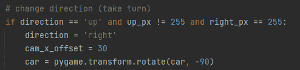
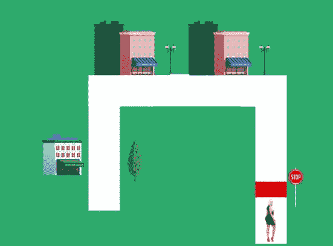
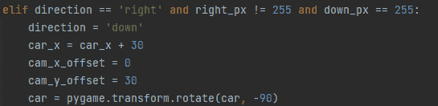
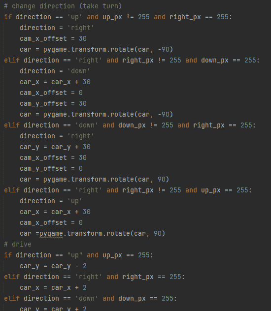

# 虚拟自动驾驶特斯拉

> 原文：<https://medium.com/nerd-for-tech/virtual-self-driving-tesla-4c57a3078559?source=collection_archive---------26----------------------->

在我之前的项目中，我用模拟自动驾驶汽车建立了一个车道检测程序。在此基础上，我用 Pygame 制作了一辆虚拟自动驾驶汽车，这是一套为视频游戏编码而设计的 Python 模块。虚拟汽车能够在五条不同的赛道上行驶，这些赛道随着复杂性和长度的增加而增加。尽管真正的自动驾驶汽车需要考虑许多因素，如其他车辆、交通灯、车道线等，但我的虚拟自动驾驶汽车通过能够识别车道、进行适当的转弯和在目的地停下来，捕捉了自动驾驶汽车在道路上的基本信息。

路线 1 |编程英雄

上面的图像显示了我用来编程这辆车的第一个轨道。这是最简单的赛道，它只要求赛车沿直线行驶，并在路的尽头停下来。在这条赛道上，我们的目标是首先将赛车定位在道路的起点。为此，我将汽车的坐标设置为(150，300)，以便汽车现在位于正确的位置。我还在汽车上加了一个摄像头，看起来像一个绿色的小圆圈。这条赛道最重要的一步是确保赛车不再检测到白色时停下来。这样，只要汽车继续检测到白色，它就知道它正在道路上行驶。由于像素强度是在 0 到 255 的范围内测量的，0 是黑色，255 是白色，我们可以简单地告诉汽车当它上面的像素不再是 255 时停下来。

轨道 1 +汽车

轨道 2

在下一个赛道，赛车需要右转才能到达目的地。我们如何告诉汽车向右转？嗯，我们需要告诉汽车，每当它检测到道路即将结束时，它可以向右寻找白色像素，并继续向那个方向移动，直到道路结束。在这条轨迹中，代码基本上会说，如果汽车向上行驶，汽车上方的像素不等于 255，但右边的像素是 255，它将向右转向。同样重要的是，要向汽车说明它需要顺时针旋转，或-90 度，以便当它改变方向时，汽车面向正确的方向。下面的代码显示了我们如何命令汽车右转。

编码方向

轨道 3

对于第三条赛道，唯一的区别是，我们现在需要告诉赛车在遇到路的尽头时向下看。我们可以这样说，如果汽车向右行驶，右边的像素不是 255，但它下面的像素是，汽车将改变方向，向底部行驶。类似于我们之前的赛道，我们也必须将赛车旋转另一个-90 度，让它面朝下。

最终轨道

跳到我们的最后一条赛道，赛车现在需要多转几圈。然而，无论轨道的方向或长度如何，代码都遵循相同的原则。对于每条赛道，我们只需要输入新的方向变化以及它应该如何响应。在这种情况下，当汽车面向右侧时，我们需要告诉它左转或向上。

最终编码方向

当每个方向都被编码后，汽车就可以在剩余的赛道上自己行驶了。我们从最简单到最复杂的轨道进行工作，因为每个附加轨道的新代码有助于下一个轨道的初始导航。对于最后一条赛道的剩余部分，赛车可以利用我们为之前的赛道输入的代码，成功地通过蜿蜒的街道。

虽然这种虚拟自动驾驶远没有真正的自动驾驶汽车复杂，但这个项目展示了自动驾驶汽车的核心原理；主要目标是确保汽车能够沿着道路行驶，并在遇到停车标志或到达目的地时停下来。

本文基于《编程英雄》在 Youtube 上制作的一段视频。