# 视觉变形器用例:没有 CNN 的卫星图像分类

> 原文：<https://medium.com/nerd-for-tech/vision-transformers-use-case-satellite-image-classification-without-cnns-2c4dbeb06f87?source=collection_archive---------2----------------------->

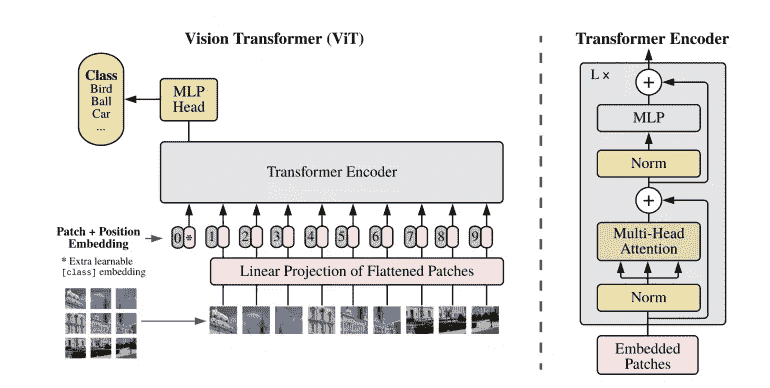

视觉转换器架构

近年来，卷积神经网络作为现有技术已经广泛用于计算机视觉任务。图像的分类、检测和分割使用卷积滤波器从输入图像中提取特征图，为下一层执行其指定任务提供元素。然而，一种不使用卷积的架构称为视觉变压器(ViT ),在图像分类和对象检测等任务中显示出令人鼓舞的结果。CNN 的统治要结束了吗？

# 卷积神经网络

要了解更多关于 CNN 的信息，请访问下面的链接:

 [## 卷积神经网络综合指南 ELI5 方法

### 人工智能见证了人类能力差距的巨大增长…

towardsdatascience.com](https://towardsdatascience.com/a-comprehensive-guide-to-convolutional-neural-networks-the-eli5-way-3bd2b1164a53) 

# 变形金刚(电影名)

论文“[注意力是你所需要的全部](https://arxiv.org/abs/1706.03762)”介绍了一种叫做变压器的新颖架构。正如标题所示，它使用了我们之前看到的注意力机制。像 LSTM 一样，Transformer 是一种借助两个部分(编码器和解码器)将一个序列转换为另一个序列的架构，但它不同于先前描述的/现有的序列到序列模型，因为它不意味着任何递归网络(GRU、LSTM 等)。).

更多:

 [## 什么是变压器？

### 机器学习中的变压器和序列对序列学习介绍

medium.com](/inside-machine-learning/what-is-a-transformer-d07dd1fbec04) 

# 视觉变形金刚

论文，[一幅图像相当于 16×16 个字:用于大规模图像识别的变形金刚](https://arxiv.org/pdf/2010.11929.pdf)介绍了变形金刚在图像分类中的应用。CNN 使用像素阵列，而 Visual Transformer (ViT)将图像划分为视觉标记。首先，将图像分割成小块。在 NLP 中，图像补丁被视为单词。我们有输入到变压器块的补丁嵌入层。图像序列将有它自己的向量。因为一张图片是 16 乘以 16 个字的区域变换器。

“图像被分成小块，比如说 9 个，每个小块可能包含 16×16 个像素。输入序列由来自大小为 16×16 的面片的像素值的展平矢量(2D 到 1D)组成。每个展平的元素被送入一个线性投影层，这将产生他们所谓的“补丁嵌入”。

然后，位置嵌入被线性地添加到图像补片序列中，使得图像可以保留它们的位置信息。它注入了序列中图像碎片的相对或绝对位置信息。

根据图像补片的位置，将额外的可学习(类)嵌入附加到序列中。这种类别嵌入用于预测输入图像在被自关注更新后的类别。

分类是通过在变换的顶部，在我们添加到序列中的额外可学习嵌入的位置，堆叠一个 MLP 头来执行的。"([https://www . analyticsvidhya . com/blog/2021/03/an-image-is-worth-16x 16-words-transformers-for-image-recognition-at-scale-vision-transformers/](https://www.analyticsvidhya.com/blog/2021/03/an-image-is-worth-16x16-words-transformers-for-image-recognition-at-scale-vision-transformers/))

ViT 也被用于物体检测，在论文中:[用变压器进行端到端的物体检测](https://arxiv.org/pdf/2005.12872.pdf)。有关更多信息，请访问:

 [## 你准备好接受视觉变形器(ViT)了吗？

### 《一张图像抵得上 16x16 个字:大规模图像识别的变形金刚》可能会给计算机带来又一次突破…

towardsdatascience.com](https://towardsdatascience.com/are-you-ready-for-vision-transformer-vit-c9e11862c539)  [## 视觉变形者-视觉任务的注意。

### 最近在 open-review 上有一篇论文“一幅图像值 16x16 个字:大规模图像识别的变形金刚”。它…

becominghuman.ai](https://becominghuman.ai/vision-transformers-attention-for-vision-task-d0ef0fafe119)  [## 变形金刚会取代计算机视觉中的 CNN 吗？

### 几分钟后，您将了解如何通过一种新的方式将 transformer 架构应用于计算机视觉

pub.towardsai.net](https://pub.towardsai.net/will-transformers-replace-cnns-in-computer-vision-55657a196833) 

# 遥感图像分析中的变压器

在遥感图像的分析中，开始探索 ViT 的使用，例如，Bazi 等人(2021)使用航空图像数据集(AID)和 Merced 数据集进行图像分类的任务。

【https://www.mdpi.com/2072-4292/13/3/516/htm 

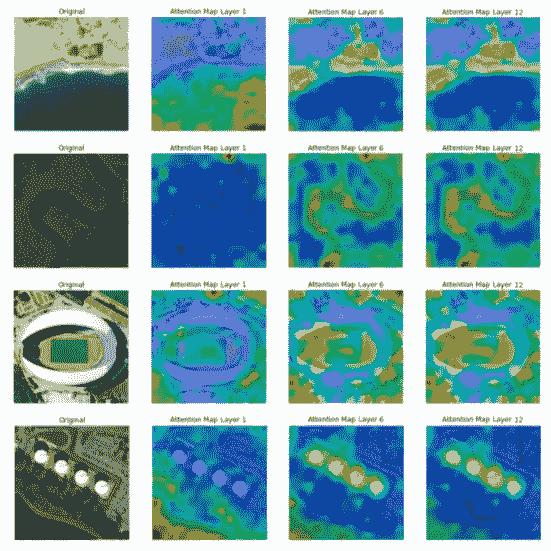

这项工作的结果表明，这种架构是非常有前途的，比使用卷积的统一架构获得更高的价值。

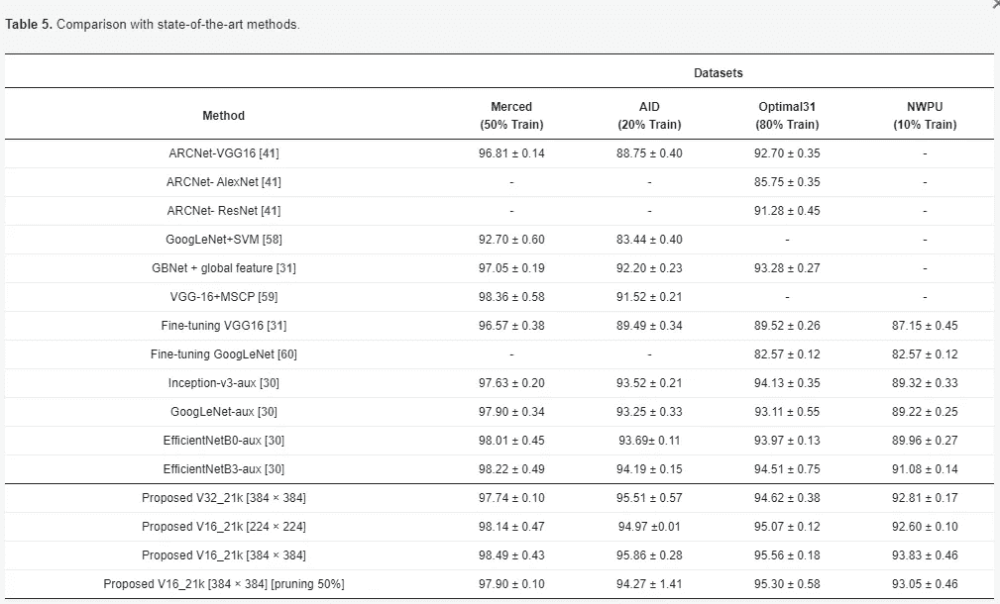

# 研究案例:欧洲卫星数据库

我们将使用 Eurosat 数据集来评估 ViT 在图像分类中的使用。该数据集包含 27000 幅 13 个光谱带的图像，分为 10 个不同的土地利用和土地覆盖类别。

[https://arxiv.org/abs/1709.00029](https://arxiv.org/abs/1709.00029)

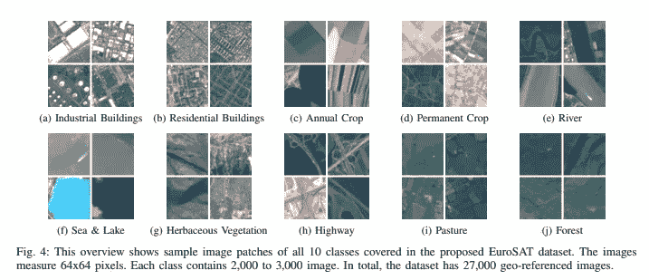

我们将使用 Google Colab 来构建和训练我们的 ViT。利用 Colab 与 Google Drive 的集成，我们将数据集存储在 Drive 中，以便于访问。首先，让我们绘制一个条形图，显示每类图像的数量:

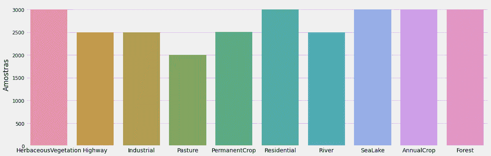

分类样本

我们注意到这些类包含了 2000 到 3000 张图片，部分是平衡的。因此，我们可以执行预处理步骤并构建我们将在此比较中使用的模型。

神经网络模型:

*   自定义 CNN
*   VGG16
*   ResNet-50
*   维生素 t

## 自定义 CNN

用于欧洲卫星数据集分类的第一个模型将是一个定制的有线电视新闻网，有些层和参数由用户配置。

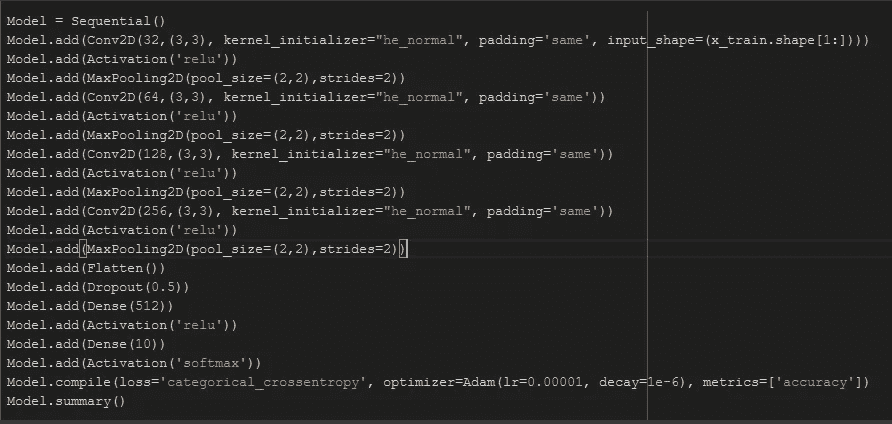

自定义 CNN

在 300 个训练时期之后，测试数据集具有 0.93 的准确度。

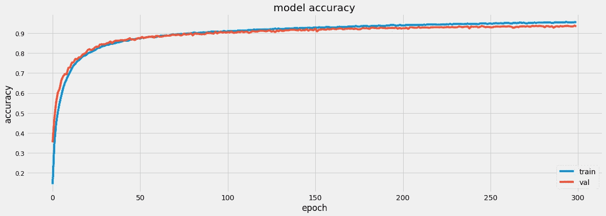

模型精确度图表

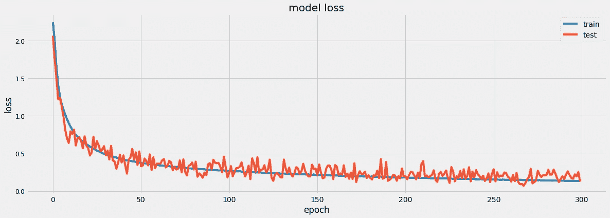

模型损失图

所以我们可以按类绘制混淆矩阵，表示模型预测的数量:

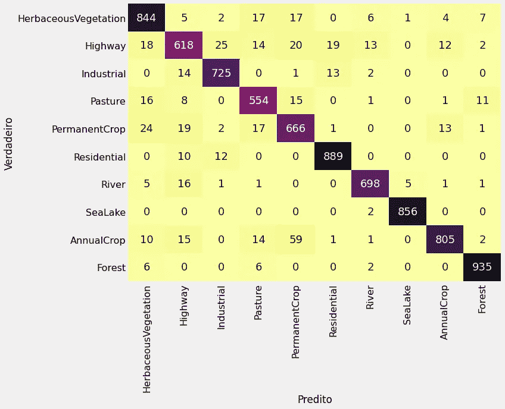

混淆矩阵

## VGG16

现在，我们将数据输入 VGG16，并对其进行训练以验证结果:

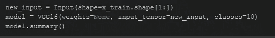

VGG16

我们还将对这个模型进行 300 个纪元的训练。在测试数据集中获得的准确度为 0.95，略好于定制的 CNN。

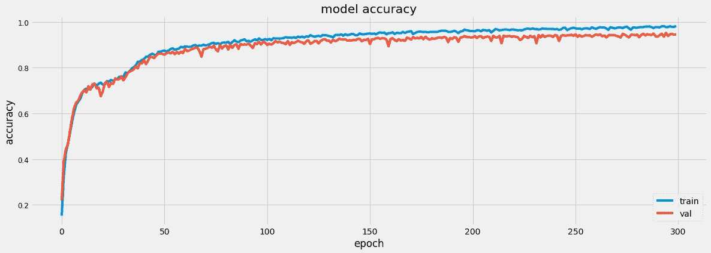

型号 Acuraccy VGG16

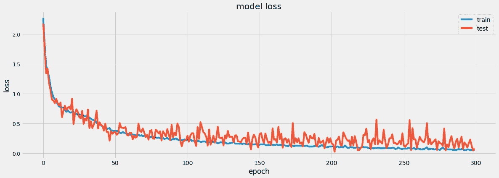

模型损耗 VGG16

混淆矩阵:

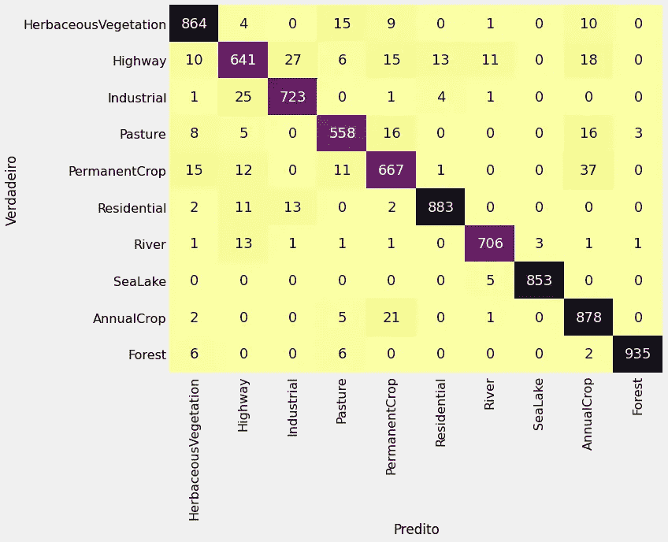

混淆矩阵

## ResNet-50

我们将使用 ResNet50，这是一种非常著名的架构，广泛用于计算机视觉任务。与 VGG16 一样，ResNet-50 也由 Keras 提供。

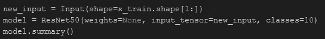

ResNet-50

经过 300 个训练时期后，该模型在测试数据集中显示了 0.83 的准确性，远低于以前模型获得的值。

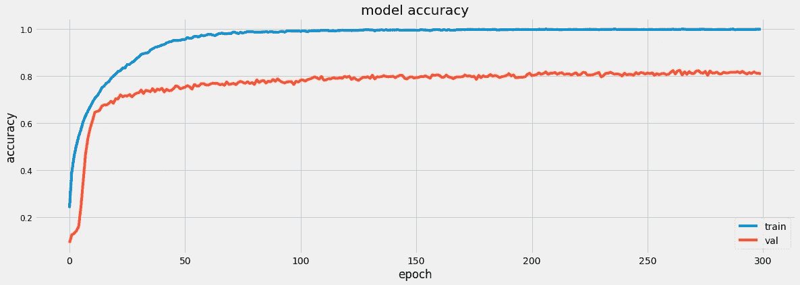

精度 ResNet-50 型

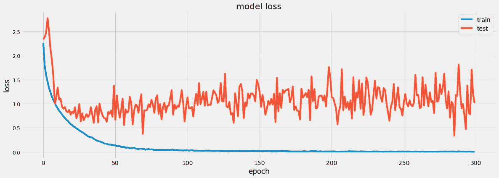

模型损失 ResNet-50

混淆矩阵:

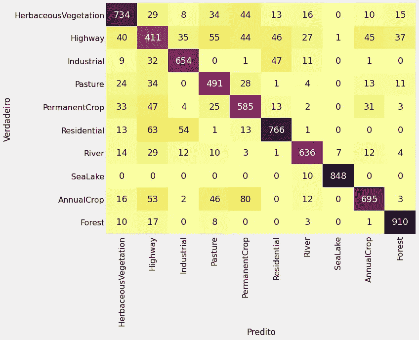

混淆矩阵

## 视觉变形金刚

为了构建此模型，我们将使用下面链接的示例，其中 ViT 体系结构是在 cifar10 数据集中创建和训练的:

 [## Keras 文档:使用视觉转换器进行图像分类

### 作者:Khalid Salama 创建日期:2021/01/18 最近修改时间:2021/01/18 描述:实现愿景…

keras.io](https://keras.io/examples/vision/image_classification_with_vision_transformer/) 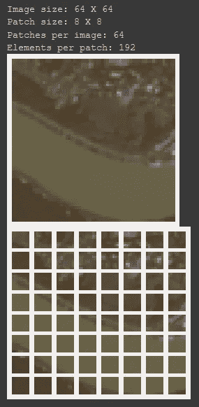

补丁创建

因此，在使用 100 个时期进行训练后，该模型在测试数据集中获得了 0.92 的准确度。

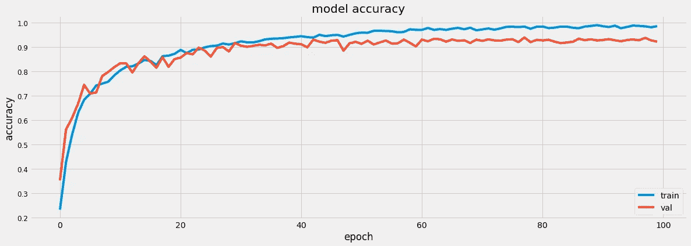

模型精度 ViT

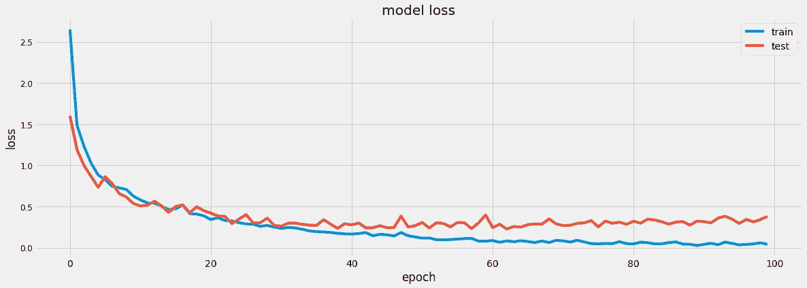

模型损耗 ViT

混淆矩阵:

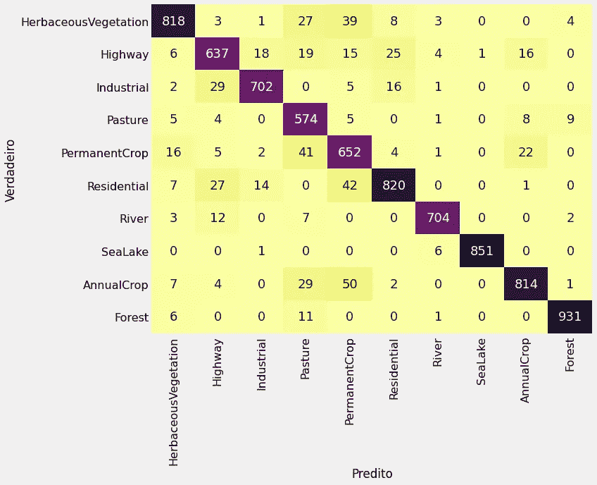

混淆矩阵

# 结论

正如在上述工作中，我们的案例研究表明，视觉变压器的图像分类结果是非常令人兴奋的。还有其他作品将卷积和 ViT 结合起来用于计算机视觉任务，但正如我们在许多文章中看到的那样，卷积网络的统治可能即将结束…

在 LinkedIn 上关注我:[https://www . LinkedIn . com/in/jo % C3 % A3o-OTA VIO-firigato-4876 B3 aa/](https://www.linkedin.com/in/jo%C3%A3o-otavio-firigato-4876b3aa/)

谢谢！