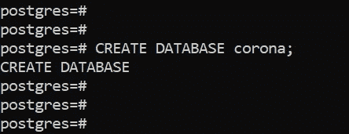
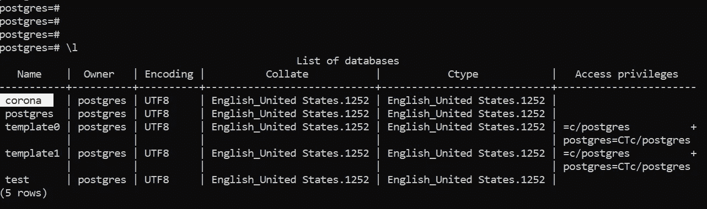
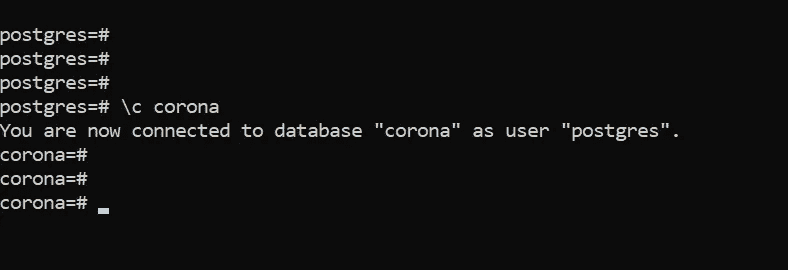
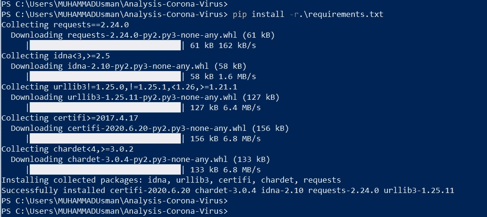
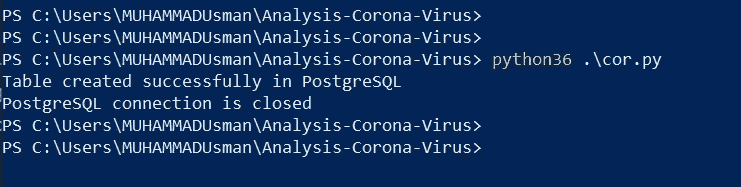
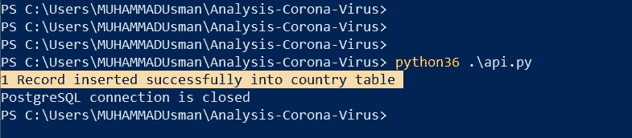
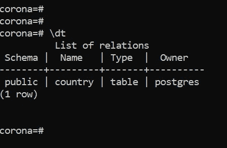
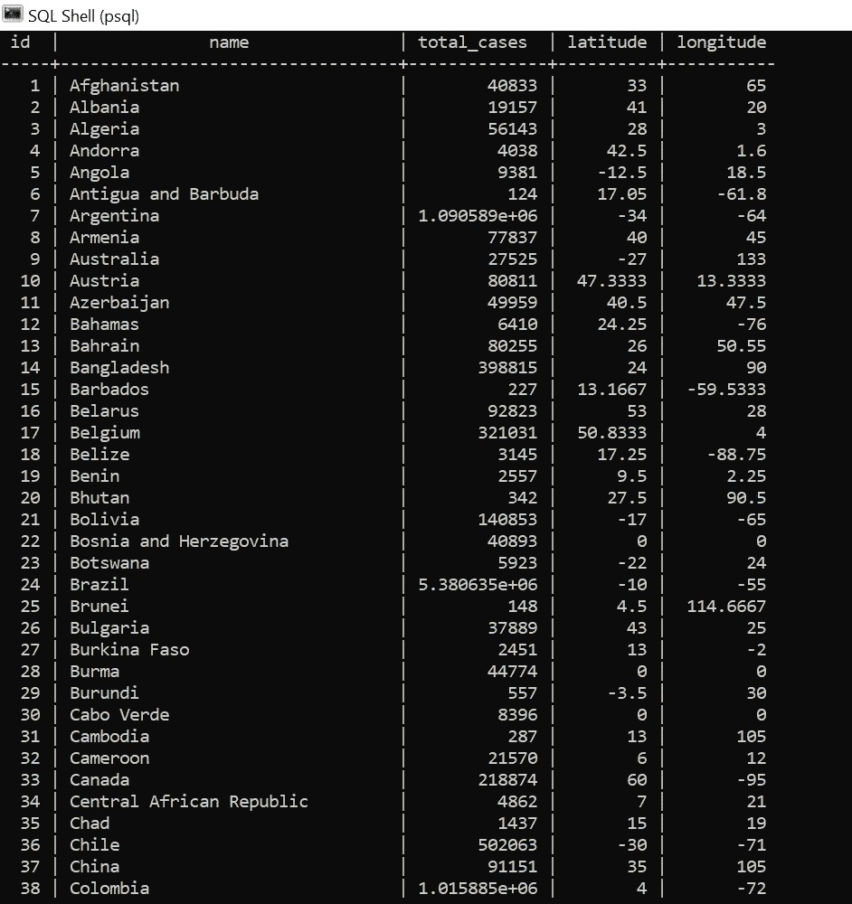

# 使用 PostgreSQL 的 Grafana 新冠肺炎可视化分析(上)

> 原文：<https://medium.com/nerd-for-tech/visual-analytics-of-covid-19-in-grafana-using-postgresql-part-1-913c71d8ed3?source=collection_archive---------18----------------------->

**冠状病毒**病( **COVID** - **19** )是一种由病毒引起的传染病，可以在人与人之间传播。

它不仅仅局限于一个国家，而是遍及全世界。每个国家都有或多或少的冠状病毒症状，影响人口和经济增长。

这篇文章帮助您创建我们自己的新冠肺炎仪表板，我们可以查看全球以及特定国家的所有案例。

我使用的数据集由约翰·霍普金斯大学系统科学与工程中心(CSSE)[***新冠肺炎数据仓库***](https://github.com/CSSEGISandData/COVID-19) 和[***Rodrigo Pombo***](https://github.com/pomber/covid19)做了大量的 API 工作，以 JSON 格式返回新冠肺炎的时间序列数据。


图片来自谷歌

# 先决条件

*   [***python***](https://www.python.org/downloads/)***—***应该安装在你的系统中。其他的你可以从官方网站下载并安装。
*   [***pip***](https://pypi.org/project/pip/)***—***是一个事实上的标准包管理系统，用于安装和管理用 Python 编写的软件包。应该安装 pip 包；否则你可以通过观看[教程](https://www.youtube.com/watch?v=Ko9b_vC6XY0)来安装。

# 装置

你需要安装*(用于可视化)和 ***PostgreSQL*** (用于存储数据集)。我之前的文章《 ***用 PostgreSQL 数据库配置 Grafana***》帮助你以一种非常简单的方式下载、安装和设置 Grafana 和数据库。*

# *设置数据库以存储新冠肺炎数据集*

1.  *通过以下命令创建一个单独的数据库来插入 corona 数据集:*

```
*CREATE DATABASE corona;*
```

**

*执行命令后的控制台输出*

*2.验证数据库是否创建成功；我们需要执行下面的命令，列出 PostgreSQL 中存在的所有数据库。*

*检查您创建的数据库名称是否在列表中。*

```
*\l*
```

**

*CMD 输出列出所有当前数据库*

*3.通过运行以下命令切换到您的数据库:*

```
*\c*
```

**

*命令行输出*

*现在我们的数据库准备好了。下一步是将新冠肺炎数据集转储到数据库中。*

# *在 PostgreSQL 中填充新冠肺炎数据集*

*为了获得新冠肺炎的数据，我使用下面的 API[**Rodrigo Pombo**](https://github.com/pomber)**，它以 JSON 格式返回每个国家的时间序列数据。***

```
***[https://pomber.github.io/covid19/timeseries.json](https://pomber.github.io/covid19/timeseries.json)***
```

***为此，我编写了一些 python 脚本来获取 JSON 数据并插入到我们的数据库中。遵循以下步骤:***

1.  ***首先创建 ***requirements.txt*** 文件。其中我们添加了所有需要的 python 包，***

***[**Requests**](https://pypi.org/project/requests/) —是一个 Python HTTP 库，用于使 HTTP 请求更简单、更人性化。***

***[**Psycopg2**](https://pypi.org/project/psycopg2/) —是 Python 编程语言最流行的 PostgreSQL 数据库适配器。***

***[**simple json**](https://pypi.org/project/simplejson/)—是一个简单、快速、完整、正确且可扩展的 Python 用 JSON 编码器和解码器。***

***复制下面的代码并粘贴到 requirements.txt 文件中。***

```
***requests==2.24.0
psycopg2==2.8.4
simplejson==3.16.0***
```

***2. ***安装*** 以上 ***包*** 都是 requirements.txt 中提到的，打开 Power Shell 终端，执行下面的命令。***

```
***pip install -r .\requirements.txt***
```

******

***python 包安装的输出***

***3.为了在数据库中填充数据集，我们需要一个表来存储它们。于是 ***创建*** 一个 ***表*** 【国家】数据库中的‘电晕’。***

***创建一个 python 脚本 cor.py，并将以下代码粘贴到脚本中。***

```
***# -*- coding: utf-8 -*-
"""
Created on Thu Mar 26 12:11:27 2020
[@author](http://twitter.com/author): MUHAMMADUsman
"""import psycopg2
from psycopg2 import Errortry:
    connection = psycopg2.connect(database="corona", user="postgres", password="admin", host="127.0.0.1", port="5432")cursor = connection.cursor()

    create_table_query = '''CREATE TABLE country
          (ID INT PRIMARY KEY     NOT NULL,
          NAME           TEXT    NOT NULL,
          TOTAL_CASES         REAL,
          LATITUDE   REAL,
          LONGITUDE   REAL); '''

    cursor.execute(create_table_query)
    connection.commit()
    print("Table created successfully in PostgreSQL ")except (Exception, psycopg2.DatabaseError) as error :
    print ("Error while creating PostgreSQL table", error)
finally:
    #closing database connection.
        if(connection):
            cursor.close()
            connection.close()
            print("PostgreSQL connection is closed")***
```

***4.通过以下命令执行上述脚本:***

```
*****python** .\cor.py***
```

******

***执行脚本后控制台上的输出***

***5.现在创建了表。你只需要将 ***插入***COVID 19***数据*** 。***

***创建一个 python 脚本‘API . py’并粘贴下面的代码。***

```
***# importing the requests library 
import requests 
import psycopg2
from psycopg2 import Error
import json# api-endpoint 
URL = "[https://pomber.github.io/covid19/timeseries.json](https://pomber.github.io/covid19/timeseries.json)"# sending get request and saving the response as response object 
r = requests.get(url = URL)# extracting data in json format 
data = r.json() 
# [https://ourworldindata.org/coronavirus-testing-source-data](https://ourworldindata.org/coronavirus-testing-source-data)
country_info = {}sum = 0for country in sorted(data.keys()):
 country_info[country] = data[country][len(data[country])-1]["confirmed"]# open the countries json file to read the country info and map the corona cases accordingly
with open('countries.json') as f:
  data = json.load(f)country = {}for index in range(0,len(data["data"])):
 temp = {}
 temp["latitude"] = data["data"][index][1]
 temp["longitude"] = data["data"][index][2]
 country[data["data"][index][0]] = temptry:
   connection = psycopg2.connect(database="corona", user="postgres", password="admin", host="127.0.0.1", port="5432")
   cursor = connection.cursor()postgres_insert_query = """ INSERT INTO country (ID, NAME, TOTAL_CASES, LATITUDE, LONGITUDE) VALUES (%s,%s,%s,%s,%s)"""
   id = 0
   for key in country_info.keys():
     id = id + 1
     if key in country.keys():
      record_to_insert = (id, key, country_info[key], country[key]["latitude"], country[key]["longitude"])
     else:
      record_to_insert = (id, key, country_info[key], 0, 0)
     cursor.execute(postgres_insert_query, record_to_insert)connection.commit()
   count = cursor.rowcount
   print (count, "Record inserted successfully into country table")except (Exception, psycopg2.Error) as error :
    if(connection):
        print("Failed to insert record into country table", error)finally:
    #closing database connection.
    if(connection):
        cursor.close()
        connection.close()
        print("PostgreSQL connection is closed")***
```

***这个脚本从 API 获取 JSON 数据并转储到数据库表中。***

***通过以下命令执行上述脚本:***

```
*****python** .\api.py***
```

******

***执行上述脚本后的控制台输出***

***6. ***验证数据*** 是否正确插入:在显示表名的 SQL Shell 终端上键入以下命令。***

```
***\dt***
```

******

***db 包含我们的“国家”关系***

***7. ***显示******表*** 数据通过运行以下命令:***

```
*****SELECT** * FROM **country**;***
```

******

***现在新冠肺炎数据集出现在我们的数据库中。现在让我们开始 grafana 的可视化，这是我的第二篇文章“ ***使用 PostgreSQL 可视化 Grafana 的新冠肺炎(第二部分)*** ”。***

***你可以在我的公共 GitHub 库中获得以上所有的脚本和代码。***

***[](https://github.com/muhammad-usman-108/Analysis-Corona-Virus) [## 穆罕默德-乌斯曼-108/分析-电晕-病毒

### 此时您不能执行该操作。您已使用另一个标签页或窗口登录。您已在另一个选项卡中注销，或者…

github.com](https://github.com/muhammad-usman-108/Analysis-Corona-Virus)***