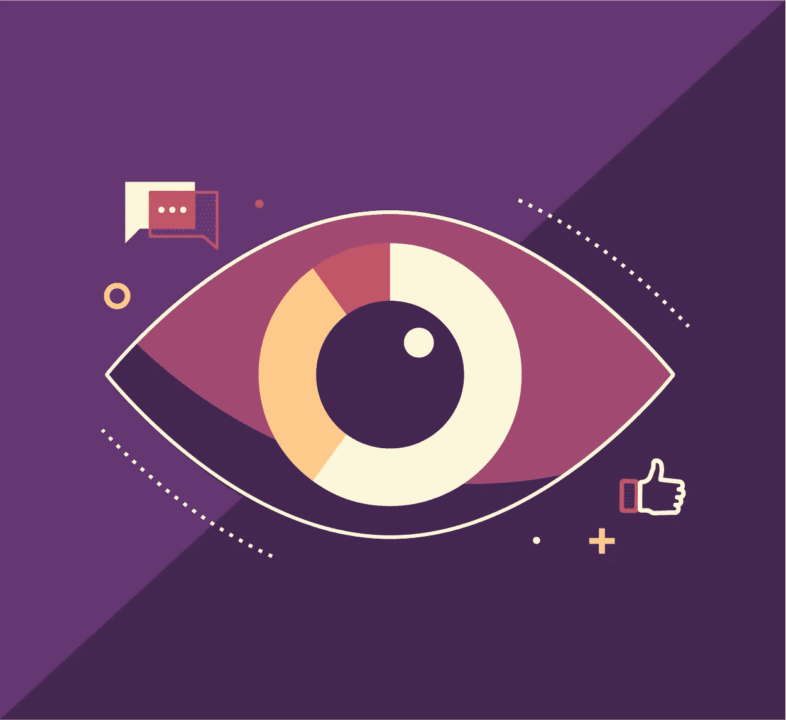

# UX 学科中的视觉设计

> 原文：<https://medium.com/nerd-for-tech/visual-design-in-ux-discipline-cd7e02b2e9d3?source=collection_archive---------17----------------------->

[*来源*](https://res.cloudinary.com/killer-infographics-inc/image/upload/v1582153148/Complete%20Guide%20to%20Visual%20Communication/5_Basics%20of%20visual%20communication%20icon.jpg)

我们看到的比我们听到的更有影响力。这是众所周知的，现在是所有领域中最广泛的应用之一。从教育到商业，接触潜在客户的视觉方式正在飞速发展。

[视觉设计](https://bit.ly/32PdtBP)是第一件旨在提高产品的可用性和网站及应用程序的美观性的事情。一个成功的视觉强化了门户的内容和本质，而不是压制了它。增强用户体验是视觉设计的关键功能之一。

微创意信息图显示，约 61%的营销人员认为视觉效果是任何成功营销活动不可或缺的一部分。 [Mockitt](https://bit.ly/3ewCXuz) 认为视觉效果是扩大忠诚客户基础的关键，使用有效的图形可以帮助访问者无缝地跟踪信息。

# 什么是视觉设计？

视觉设计是设计在线门户时要考虑的最重要的因素之一。它与审美情趣有关，使[网站](https://bit.ly/3gv7GJC)看起来比其他网站更友好、更有用。使用[信息图](https://bit.ly/2RTbf1Y)、[图像](https://bit.ly/3en861V)、[图表](https://bit.ly/2QGiXfb)、表格、[图标](https://bit.ly/3xcY4cd)，以及各种视觉[元素](https://bit.ly/3dHfN41)，增强显示，增加信任。

更好的用户体验视觉设计的关键要素如下:

## **点、线和形状**

视觉设计的基础是正确使用点、线和形状。它包括使用基本的几何形状和设计元素来创建复杂信息的简单表示。线条和形状应该通过适当的划分和描述门户的概念来充当连接点。

## [**调色板**](https://bit.ly/3tG4YVt)

在[调色盘](https://bit.ly/3tG4YVt)中有无数种颜色可供选择。对比色[和区别色调](https://bit.ly/3tGQ01n)的使用为视觉中使用的图像提供了深度。颜色的正确使用增加了设计的意义和感觉。调色板的选择也应该与页面的性质相联系，比如冥想网站应该使用柔和的色调，而儿童故事应该使用明亮的调色板。

## **排版**

字体和排列的使用对于创造一个有冲击力的视觉效果是很重要的。与内容的其余部分相比，标题应该相对较大。此外，标题的视觉效果应该确保适当的间距和对齐。正确使用排版的所有因素是管理正面和负面影响的关键。人们应该避免使用高度创造性的字体，因为它们会使阅读变得复杂。

## **平衡、节奏和对比度**

平衡门户的各种影响非常重要。确保节奏和对比保持完美是设计有重量的视觉效果的关键。优雅而轻松的设计平衡了页面上的光线和效果。色调的对比应该不会给观看者的眼睛带来压力，而是提供一种舒缓和平静的体验。

## **刻度**

视觉内容应该遵循从大到小的主题。缩放内容和图像对于让用户知道哪个部分更重要，哪个部分不重要是很重要的。使用正确的尺寸不仅使内容和视觉效果有效，而且也是肯定的。

## **纹理和图案**

纹理和图案通常指背景、设计和边界的性质。虽然这些被认为是配件，但没有经验法则来决定它们的使用。这些是用来给一个三维的效果，所以必须小心使用。

## **形式和框架**

当在内容中使用任何类型的图像或图表来辅助视觉设计时，将它们恰当地嵌入到框架中是很重要的。它将突出显示图形图像，并确保用户可以分别识别它们。一个合适的带有框架的表单会吸引用户的注意力。

## **视觉概念**

视觉概念背后的想法是利用视觉效果来最有效、最轻松地传达你想要传达的信息。设计应该基于门户的本质，将用户连贯地连接起来。

## **统一和完形**

这里的想法是在网站的不同页面和部分之间建立和谐，让它们以强制而不是混乱的方式出现。主题需要保持一致。格式塔指的是从顾客的角度设计视觉效果，以便更好地吸引顾客。

# 日常视觉设计的一个例子

视觉设计 UX 不仅适用于数字世界，也适用于物理世界。从报纸到广告牌和网站，每一种将信息传播给最终用户的方法，视觉效果都被用来使信息更加清晰。

就想一份报纸。没有任何图像或数据图表，甚至没有广告，这将是一个长长的打字单词列表，提供信息，但读起来很无聊。甚至在教室里在 smartboard 上做的演示也没有伴随视觉设计；人们将会消除交互学习的本质。

除了当用户登陆像 [ET](https://economictimes.indiatimes.com/) 甚至 [Wikipedia](https://www.wikipedia.org/) 这样提供商业或新闻信息的网站时，添加在页面上的图像和表格是视觉设计，作为帮助人们学习和找到他们正在寻找的信息的辅助手段。

明信片、传单、小册子、[横幅](https://bit.ly/3gvuUz2)，甚至[社交媒体](https://bit.ly/3xg3F1t)广告都使用视觉设计来推广他们的业务，并与潜在客户建立联系。用户体验视觉设计是一个不断发展的概念，适用范围广泛，在吸引潜在客户方面非常重要。

# 视觉设计的常见用途

关于视觉设计的使用，我们可以举出无数的例子。视觉设计是一种广泛使用的技能，通过为客户创造引人注目和引人入胜的视觉效果，成为企业发展和提高业绩的动力，在很大程度上增强了整体客户体验。

视觉设计最常见的用途是:

*   设计[标识](https://bit.ly/3sG1xfV)和企业品牌
*   在出版物中创建互动和直观的[书籍](https://bit.ly/3eqeOnV)、报纸[、杂志](https://bit.ly/32CXmak)和漫画。
*   在广告牌、印刷媒体和社交媒体平台上做广告的绝佳工具。
*   作为网站和应用程序上的[用户界面](https://bit.ly/32DNfSo)与客户沟通的基础。
*   包装和促销产品的最佳工具
*   开发不仅有趣，而且互动和有影响力的游戏。

[*来源*](https://bantersa.com/wp-content/uploads/2014/01/What-is-Viscomm.jpg)

# 视觉设计与 UX 的关系

视觉设计是与用户体验密切相关的技能之一，旨在为用户提供更好的服务。虽然有效的视觉设计有不同的方面，但和谐地使用，它会提供一个很好的体验。定义视觉设计和 UX 之间关系的关键因素是:

*   有效且高效的视觉设计提供了更高程度的 [**可用性**](https://bit.ly/3grb7ks) **和性能**，增强了整体用户体验。
*   当视觉效果美丽迷人时，它们会在用户和系统之间提供一种连接感。
*   通过有效地遵循视觉设计原则，设计师激发了**用户的情感和幸福感**。
*   如果视觉系统很强，它会直接影响客户，从而建立更强的品牌价值。
*   通过正确地拉动所有的线，视觉设计师在顾客的眼中创造出一个美学上且战略上正确的品牌形象，**提高忠诚度**和顾客体验。

# 结论

一个精心的、战略性的视觉设计对于让浏览者感觉和商业有联系是很重要的。一个有影响力的、最简单地传达基本思想的设计要比高度创造性和复杂的要好。用户体验视觉设计是一个宽泛的概念，它专注于与客户轻松交流。

最有效的视觉设计的关键是保持它的简单性、解释性和直观性，从而吸引用户并让他们感到满意。

感谢您花时间阅读这篇文章。了解更多关于摩奇特的信息

我们为 UX 初学者创建了一个[终极指南](https://bit.ly/2OLPPlW)，它收集了来自多个 UXers 的知识、经验和建议。

订阅我们的 [YouTube](https://www.youtube.com/channel/UCESxamaRS8nOGpWYvP1VSqA) [脸书](https://www.facebook.com/mockitt) [Instagram](https://www.instagram.com/wondershare.mockitt/)

*原载于*[*https://mockitt.wondershare.com*](https://bit.ly/2RBEJkD)*。*