# Visual Studio 2019 调试生产力提示

> 原文：<https://medium.com/nerd-for-tech/visual-studio-2019-debugging-productivity-tips-420d6c5aac61?source=collection_archive---------2----------------------->

# 介绍

我们假设读者了解 Visual Studio 中调试的基础知识，但我们将深入探讨调试中的一些主要概念。

许多开发人员用这个足够强大的知识包来处理他们的调试会话。然而，Visual Studio 调试工具提供了更多的功能。以下是 Visual Studio 调试生产率提示的列表。注意，那些提示和快捷方式已经用***Visual studio 2019 16.6***验证过，没有安装扩展。

# 运行到光标处

使用快捷键 Ctrl+F10，可以让调试器运行到光标指向的那一行。

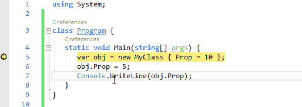

# 通过简单的鼠标点击运行执行

在调试一个*运行执行通过这里*时，悬停在源代码上，会出现一个绿色图标。这个字形可以点击。

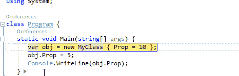

# 将下一条语句设置在此处

通过按住 Ctrl 键，可以将通过 here 绿色字形的 Run 执行转换为 set next statement to here。它不同于 Run execution through，因为中间的语句没有被执行。因此，在下面的小动画中，我们可以在监视窗口中看到引用 obj 仍然为空:中间的 MyClass 构造函数尚未执行。

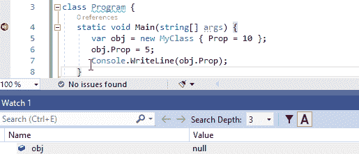

# 数据断点命中:当值改变时

如果将断点设置为非静态属性设置器，则在更改所有对象的属性值时将会遇到该断点。由于本地(或监视)窗口右键单击:当值改变菜单时中断，可以为单个对象获得相同的行为。

上面的动画演示了这一功能。只有当 obj2。Prop 改变，obj 不变。道具变了。

请注意，在调试会话期间，数据断点被绑定到一个活动对象。因此，一旦被调试的进程停止，它就会丢失，不能在将来的调试会话中重用。

请注意，当值改变时菜单中断，当右键单击本地窗口中的字段时也可用，但不幸的是调试器没有中断现场更改，我不确定这是一个错误还是一个尚未实现的功能？

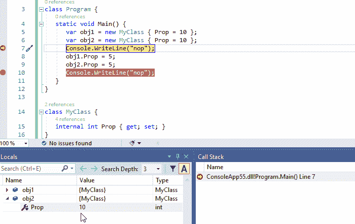

# 条件断点

一个条件可以附加到一个断点上，以便只在特定的情况下中断。在下面的动画中，我们用循环中的条件 I *> 6* 来定义断点。然后我们单击 Continue，可以看到一旦断点停止，Ivalue 实际上是 7。

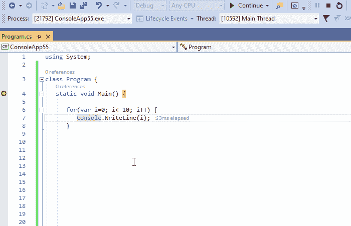

# 跟踪断点

暂停程序执行是遇到断点时最常见的操作。然而，您可以选择在*输出*窗口中不暂停(或暂停)地打印一些轨迹。下面的动画展示了这种可能性，我们在*输出*窗口中从 0 到 9 追踪 I 的值。请注意，跟踪断点在代码编辑器的装订线中具有菱形形状。

请注意，条件和跟踪操作都可以在断点上指定。

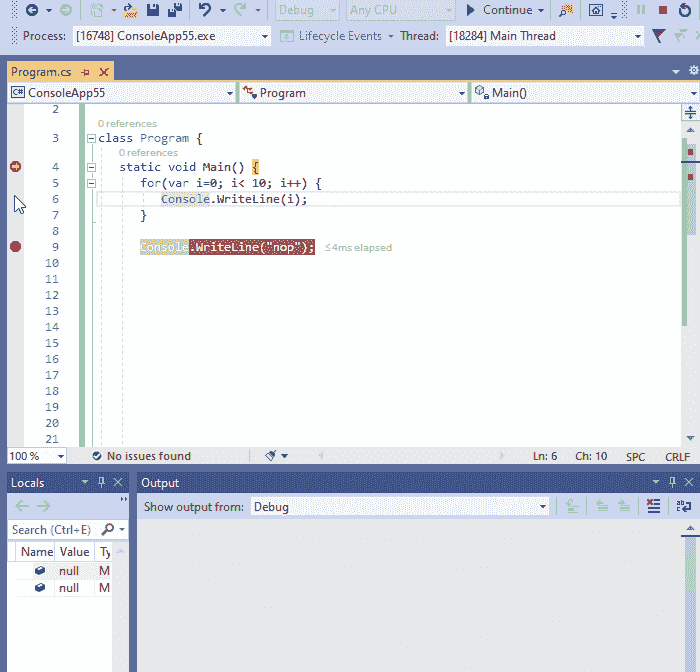

# 跟踪引用超出范围的对象

在*观察器中，*窗口对象通过它们在当前执行的作用域中的引用名来跟踪。然而，当这种被跟踪的引用超出范围时，它在*观察*窗口的上下文中变得没有意义，并且被禁用，即使被引用的对象仍然是活动的。

在许多情况下，我们希望继续跟踪超出范围的对象的状态。为此，在*观察*窗口中右键单击该引用，单击菜单制作对象 ID 并在要观察的项目中添加$1(或$2 或$3…取决于您已经创建了多少个对象 ID)。

下面的动画显示了如何跟踪范围外对象的属性 getter 的状态，该属性 getter 以字符串形式返回实际日期时间。它很好地显示了当引用 *obj* 在 *Fct()* 的上下文中超出范围时，要监视的 *obj* 项被禁用， *$1。道具*仍然会更新。

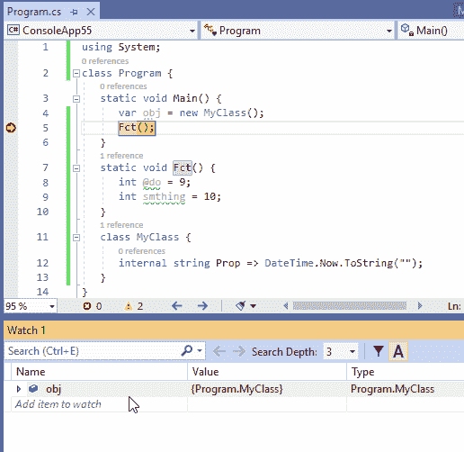

# 查看函数返回的值

源代码有时会忽略函数返回的值。或者有时这个值在调试时显然不可访问。

这种返回值可以在调试>窗口>自动窗口中显示。[伪变量](https://docs.microsoft.com/en-us/visualstudio/debugger/pseudovariables?view=vs-2019) $ReturnValue 也可以在*立即*和*观察*窗口中查看最后一次函数调用返回的值。

请注意，只有当 Visual Studio 调试器附加到进程并且程序被调试器暂停时，菜单“调试”>“窗口”>“自动”才可用。

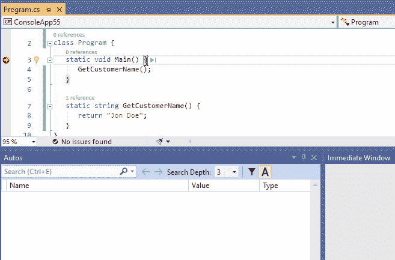

# 重新附加到进程

自从 Visual Studio 2017 提出了*重附着到进程* Shift+Alt+P 设施，它非常方便。一旦您将调试器附加到一个进程，Visual Studio 就会记住它，并建议将调试器重新附加到同一个进程。 *Same* 是斜体，因为这里有一个关于进程身份的启发:

*   如果你附加的进程还活着*重新附加到进程*重新附加到它。
*   否则，Visual Studio 会尝试查找具有相同先前进程名称的单个进程，并将调试器重新附加到该进程。
*   如果发现多个进程具有该名称，则*附加到进程*对话框打开，仅显示具有相同名称的进程
*   如果找不到该名称的进程，显示*附加到进程*对话框

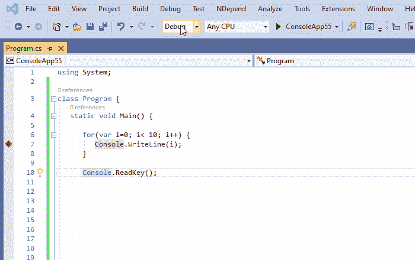

重新附加到进程也适用于涉及多个进程的调试会话。在这种情况下，Visual Studio 会尝试使用与上述相同的试探法来查找它已经附加到的所有进程。

# 过程无副作用表达式评估

有时，当在*立即*或*监视*窗口中对表达式求值时，某些状态会发生变化。这种行为通常是不可取的，你不希望仅仅因为你需要计算一个表达式的值，就破坏你被调试程序的状态。

为了避免改变任何状态，你可以在你的表达式后面加上 nse(无副作用)。下面的动画演示了这种可能性(在*观察*窗口中观察*_ 状态*值是否改变)。

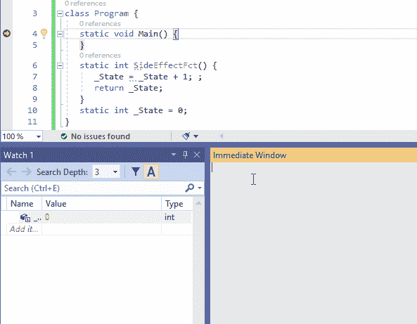

这里 nse 用于*手表*窗口。由于*sideffectfct()*被监视项目中的*刷新*评估按钮，此示例与上一个相比有所不同。

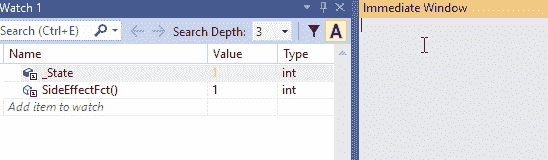

“监视”窗口中没有副作用表达式求值

# 在源代码中显示线程

众所周知，调试多线程应用程序非常复杂。希望*显示源代码中的线程*按钮能有所帮助。它在编辑器栏中引入了标记图标，以跟踪其他线程暂停的位置。这个标记可以用来显示线程 id，并最终切换到另一个线程。请注意，如果至少有两个线程暂停在同一位置，则会显示不同的标记符号。

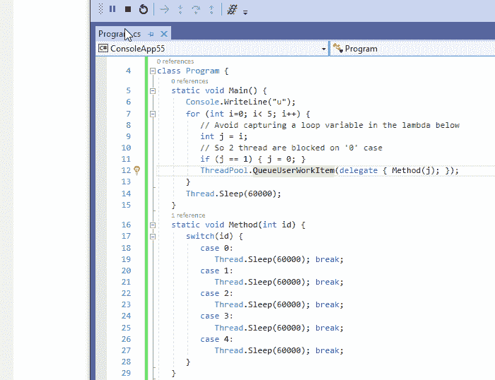

调试多线程应用程序的更多技巧可在本 Microsoft 文档中找到:[调试多线程应用程序入门(C#、Visual Basic、C++)](https://docs.microsoft.com/en-us/visualstudio/debugger/get-started-debugging-multithreaded-apps?view=vs-2019)

这是这个小演示的源代码，如果你想玩的话，

# 将 IL 代码反编译成可以调试的源代码

我们经常依赖一些黑盒组件:没有源代码的程序集。

然而，当调试一个复杂的行为时，观察甚至调试嵌套在引用的黑盒中的逻辑是很方便的。这也是为什么从 16.5 版本开始 Visual Studio 2019 可以从编译后的程序集生成一些源代码。这样的源代码然后是可调试的。该功能基于 OSS 项目 [ILSpy](https://github.com/icsharpcode/ILSpy) 。

反编译菜单可以在*模块*窗口的汇编右键菜单中提出(如下图动画所示)，也可以在*源文件未找到*或*无符号加载*对话框中提出。

将 IL 代码反编译成源代码不可能是完美的，因为在编译时会丢失一些源信息。因此，这个特性有一些限制，在这个官方文档的最后解释如下:[从。在调试](https://docs.microsoft.com/en-us/visualstudio/debugger/decompilation?view=vs-2019)时使用. NET 程序集。

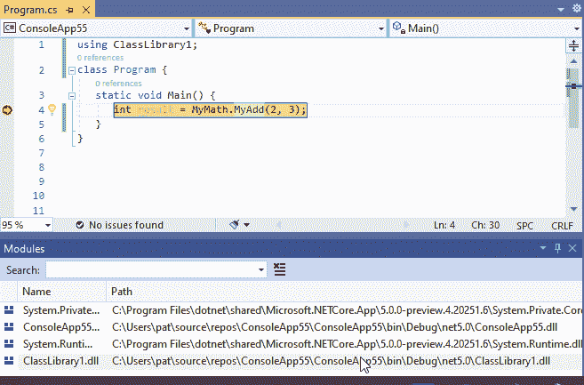

# 结论

Visual Studio 大放异彩，但在调试方面尤其出色。在这里，我试着选择一些既隐蔽又有用的提示，我希望它们能帮助你提高工作效率。

…..继续学习！！！！