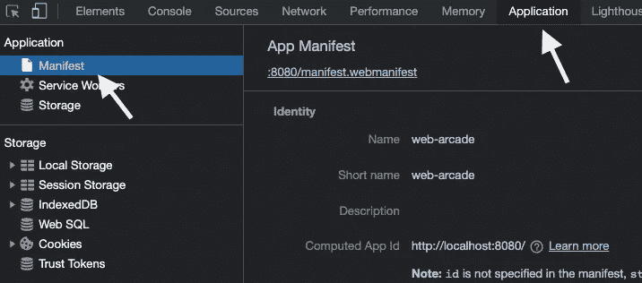
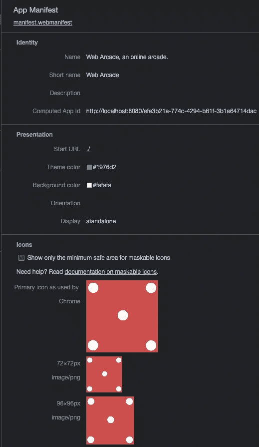
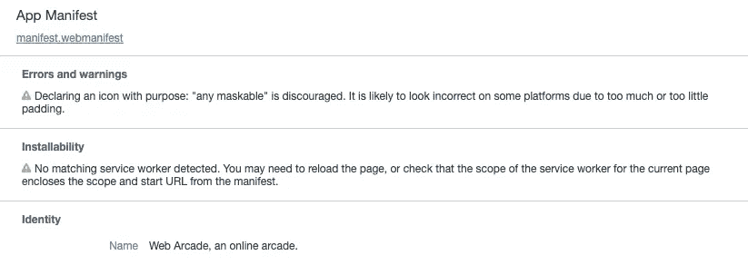

# Chrome:可视化应用清单

> 原文：<https://medium.com/nerd-for-tech/visualize-application-manifest-ebd771b325d8?source=collection_archive---------3----------------------->

## 调试渐进式 Web 应用程序变得简单

## 使用 Chrome 开发工具来可视化和调试渐进式网络应用程序(PWA)。该工具有助于轻松检查清单文件内容，发现问题并推荐最佳做法。


渐进式 web 应用程序(PWA)在本地应用程序和 Web 应用程序之间架起了一座桥梁。它们提供了安装 web 应用程序和缓存请求/响应的能力。

通常很难识别可安装 web 应用程序的问题。您可能会注意到 PWA 没有显示安装按钮。不太清楚为什么应用程序不能安装。Chrome 开发工具拯救——它不仅有助于识别问题，还能推荐最佳实践。

> 当我们探索 Chrome 开发工具时，请注意这篇文章中描述的选项不仅适用于 Google Chrome，也适用于 Microsoft Edge 和 Opera web 浏览器。开发工具是开源 Chromium 项目的一部分。您可能会在基于该项目的浏览器上找到这些选项。

# *货单*文件

Web 清单文件是 PWA 的重要组成部分，它提供了安装应用程序所需的配置。

让我们用 Chrome 开发工具来研究一下清单文件。启动开发工具(菜单→更多工具→开发工具)，导航到应用程序选项卡并选择清单。



用 Chrome 开发工具可视化清单

请注意标题为*应用清单*下突出显示的蓝色链接。该工具借助文件 *manifest.webmanifest.* 预览清单，浏览器支持扩展。webmanifest”或。json (manifest.json)。

接下来，让我们在 Chrome 开发工具的帮助下预览清单文件上的各个字段。



**名称**:已安装的 App 名称。

**短名称:**在空间有限的情况下，清单中的 *short_name* 属性被用作应用名称。

**描述:**app 的详细描述

**计算的应用 Id:** 浏览器使用清单中的 *id* 属性来唯一地标识 PWA。如果 id 匹配，它使用安装的应用程序。如果 id 不匹配，即使 URL 相同，它也会创建一个新的 PWA。

**开始 Url** 由清单文件中的属性 *start_url* 定义。当安装的应用程序启动时，它为应用程序配置起始点。

**主题颜色**由字段*主题颜色定义。*指定工具栏颜色，任务切换器等的预览颜色之一。

**背景色**由 background_color 定义，配置闪屏的背景色。

**显示:**显示属性可能具有下列值之一

*   *全屏*:占据整个显示区域。不显示浏览器用户界面。
*   *独立*:隐藏标准浏览器元素。在自己的窗口中打开。
*   *minimal-ui* :提供浏览器的最小导航元素，如重新加载和后退按钮。
*   *浏览器*:在典型的浏览器窗口中启动应用程序。

**图标:**各种图标，有多种大小和尺寸，供 app 使用。每个图标由以下字段配置，

```
{
   "src": "assets/icons/icon-128x128.png",
   "sizes": "128x128",
   "type": "image/png",
   "purpose": "any"
},
```

*   src:配置图标的位置
*   size:以像素为单位配置图标的尺寸
*   类型:图像格式
*   目的:a)当不支持屏蔽时，使用值 *any* 。图像应该是全尺寸的，没有填充。b)使用一个值 *maskable，*假定图像上有填充。很少有平台(例如 Android)将图像裁剪成不同的形状和大小。启用遮罩的填充图像有助于仅裁剪图像上不重要的边框。它确保所需的图像或实际内容不会丢失。

# 调试渐进式 Web 应用程序

Chrome dev 工具突出显示错误和警告，这有助于识别渐进式 Web 应用程序的问题。考虑下面的例子。



PWA 的错误和警告

*   请注意，图标上的警告与属性的*任何可屏蔽的*值，*目的。*以下配置导致警告。该警告表明使用 any(图标上没有填充)或 maskable 是一个好的做法；不是两者都有。

```
{
   "src": "assets/icons/icon-72x72.png",
   "sizes": "72x72",
   "type": "image/png",
 **"purpose": "maskable any"** },
```

*   第二个警告是关于可安装性。它表示服务人员不可用或配置不正确。请验证服务人员代码以解决此问题。

# 参考

*   横幅图像—印度海得拉巴 Golkonda 堡。[了解更多](https://en.wikipedia.org/wiki/Golconda_Fort)
*   维基百科关于铬的页面— [链接](https://en.wikipedia.org/wiki/Chromium_(web_browser))
*   关于添加 Web 应用程序清单的 Web.dev 文档— [链接](https://web.dev/add-manifest/)
*   关于可屏蔽图标的 Web.dev 文档— [链接](https://web.dev/maskable-icon/)
*   Chrome 开发者页面描述了在 web 清单文件中使用 id 属性— [链接](https://developer.chrome.com/blog/pwa-manifest-id/)