# 使用 Flowmap.blue 可视化 OD 数据

> 原文：<https://medium.com/nerd-for-tech/visualize-od-data-with-flowmap-blue-1f800c70b743?source=collection_archive---------7----------------------->

创作者 Ilya Boyandin 的 Flowmap.blue 演示

# 什么是 Flowmap.blue？

[Flowmap.blue](https://flowmap.blue/) 是一个开源工具，可以帮助可视化两个地理位置之间的移动。它由创造者伊利亚·博扬丁于 2019 年首次推出，伊利亚·博扬丁是 Teralytics *的数据可视化工程师。*如果你对技术细节感兴趣，请点击查看博扬丁的媒体文章[。](/teralytics/visualizing-mobility-data-the-scalability-challenge-2575fe819702)

# 关于始发地-目的地(OD)数据的详细信息

[OD 数据](https://cran.r-project.org/web/packages/stplanr/vignettes/stplanr-od.html)或“流量数据”，用于表示地理运动。它要么以“长”的形式出现，要么以矩阵的形式出现。在第一种情况下，每一行都有 OD 对(始发地和目的地)以及始发地和目的地之间的出行次数。

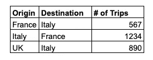

“长”形数据

矩阵是一个枢纽。每行包含始发地，每列包含目的地-所有累计的旅行次数将在始发地和目的地之间进行映射。如果有很多起点和终点，这种方法就变得不实用了(注意下图中 N/a 的数量)。如果是这样的话，最好还是坚持“长”的形式。

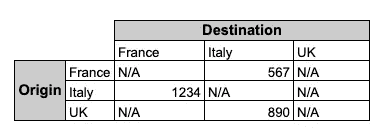

OD 矩阵

Flowmap.blue 有一个[矩阵转换器](https://flowmap.blue/od-matrix-converter)，允许您将矩阵转换为长格式，并在电子表格中复制/粘贴表格输出。要在 Google Sheets 中解算矩阵，可以参考[这篇文章](https://www.benlcollins.com/spreadsheets/unpivot-in-google-sheets/)(我就是用的这个)。在 Flowmap.blue 中，您需要使用长格式数据。

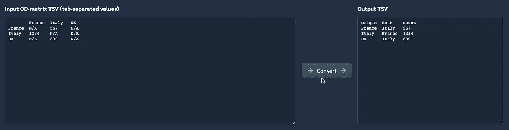

Flowmap.blue OD 矩阵转换器

# 我为什么要关心 OD 分析？

OD 分析有助于许多原因:城市规划、交通网络设计、房地产投资、供应链物流、人口迁移政策等。移动性数据对于了解现代地理空间中存在哪些低效问题非常重要，有助于制定更好的应对措施:常用路线上的专用自行车道、减少数百万人往返于相同位置的旅行时间、在欢迎大量人口的区域分配资源，以及许多其他使用案例。简而言之，OD 分析有助于确定今天的地理差距，以便明天更好地分配资源。

在本文中，我将使用旧金山湾区 2021 年的 [BART 乘客数据](https://www.bart.gov/about/reports/ridership)从头到尾向您介绍如何使用 Flowmap.blue。我们开始吧！

# 使用 Flowmap.blue

一旦你选择了你想要处理的数据并清理了数据集，去 Flowmap.blue 的[网站](https://flowmap.blue/)并复制一份[模板](https://docs.google.com/spreadsheets/d/1aEgwtGUGc0TdnsO0jIm50hshCZ-m4DHms3P0Qq9IYdA/edit#gid=1438429083)到你的 Google Drive。

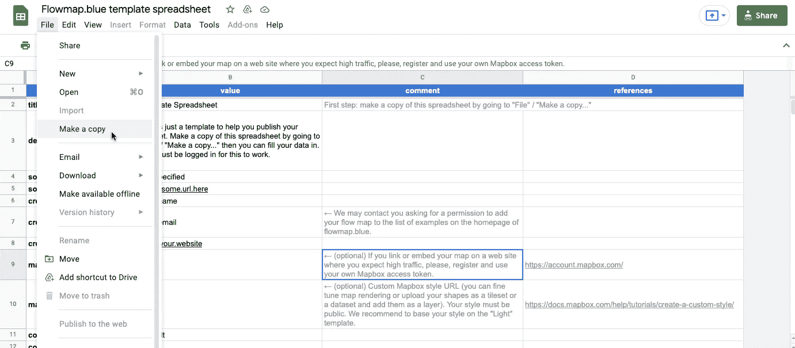

您需要填写 3 个选项卡，“属性”、“位置”和“流量”。让我演示如何为每个必需的部分填充电子表格。

## 性能

properties 选项卡是您将要使用 Flowmap.blue 创建的可视化的元数据。首先，您需要输入关键信息，如图表标题、描述、数据源和您自己的信息。

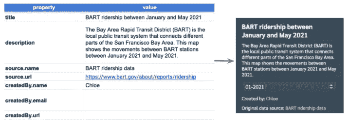

左边是原始数据，右边是最终结果

Flowmap.blue 是使用 Mapbox 构建的，所有视觉效果都托管在 Flowmap 的 Mapbox 帐户上。如果您将地图嵌入网站并期望高流量，Flowmap.blue 鼓励用户使用自己的 Mapbox 访问令牌。

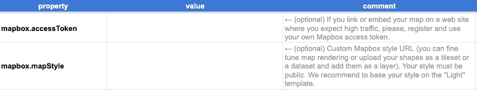

为 API 请求创建自己的地图框访问令牌(可选)

接下来，我们将通过为工具箱选择颜色、动画/聚类功能和文字选项来格式化地图。

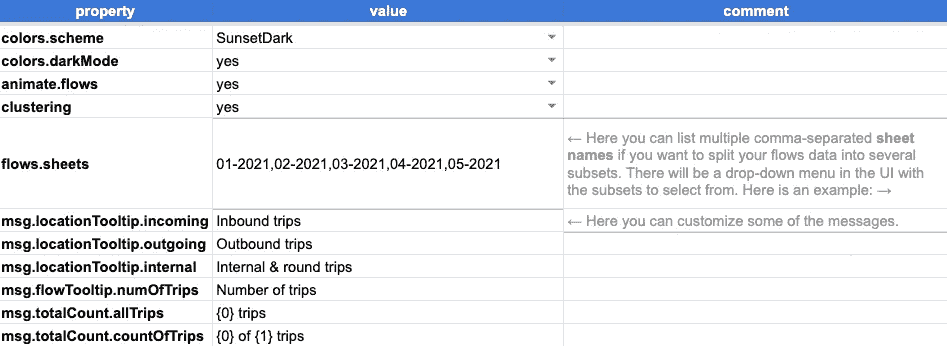

我在这里没有做太多的修改，除了您会注意到 flows . sheets“value”单元格包含逗号分隔的值。这些将告知您在下面看到的月/年下拉列表。对于每个下拉框值，您需要在模板上创建一个单独的选项卡。

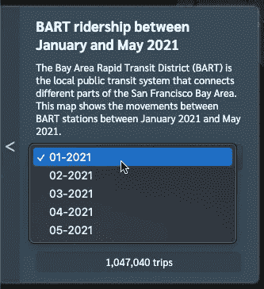

月/年下拉菜单

## 位置

填充位置，包括 GPS 坐标。如果只有位置名称而没有 GPS 坐标，可以使用 Flowmap.blue 的[地理编码工具](https://flowmap.blue/geocoding)。它将返回您指定位置的经纬度坐标。抽查以确保地理编码工具返回正确的坐标。将结果复制/粘贴到电子表格的“位置”选项卡上。

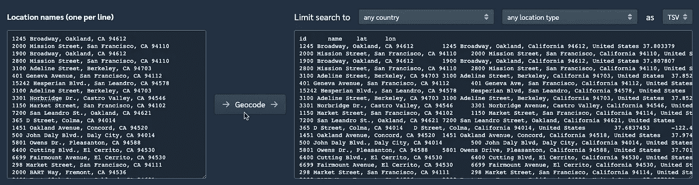

Flowmap.blue 的地理编码工具

接下来，返回到电子表格，按以下顺序输入数据:id、名称、纬度和经度。

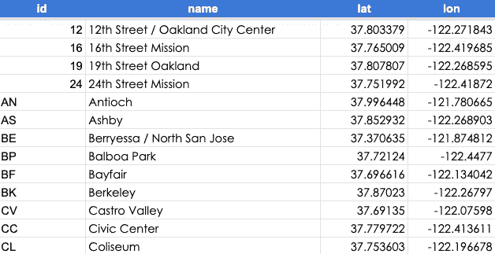

## 流

最后,“流量”选项卡将显示出发地和目的地之间的旅行次数。如果您对创建过滤器不感兴趣，您可以简单地填写“流”选项卡。但是，如果您想创建一个下拉菜单，您需要为您想添加到下拉菜单中的每个值创建一个新的选项卡(如下例所示)。

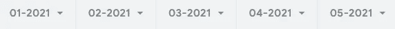

在每个选项卡上，输入始发地、目的地和累计行程数。

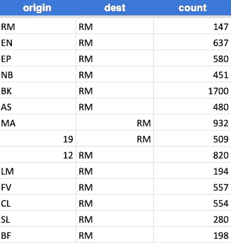

OD 流量

当你准备好可视化结果时，点击右上角的“分享”按钮，选择“任何有链接的人”

将链接复制/粘贴到 Flowmap.blue 上的专用框中。单击“打开”在 Flowmap.blue 中查看最终结果。

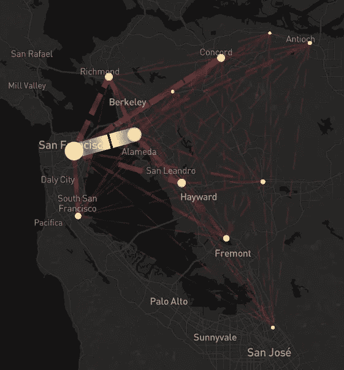

# 结论

我希望这个教程是有帮助的。在 Flowmap.blue 上随意查看[我自己的 OD 地图](https://flowmap.blue/1Ipp8FUeOTSXcrzXEg9cfW_V3Czpurkt59vvdFk3v1EA)你可以放大或缩小，使用下拉菜单过滤月份，或者切换设置(左下角)。虽然 Flowmap.blue 是一个方便、低代码和用户友好的工具，但还有其他工具可以可视化 OD 数据:ArcGIS、Tableau、R's stplanr 库、Kepler.gl 等。探索愉快！😊

*这篇文章最后编辑于 2021 年 7 月 3 日。这里表达的观点仅属于我自己，并不代表我的雇主的观点。*