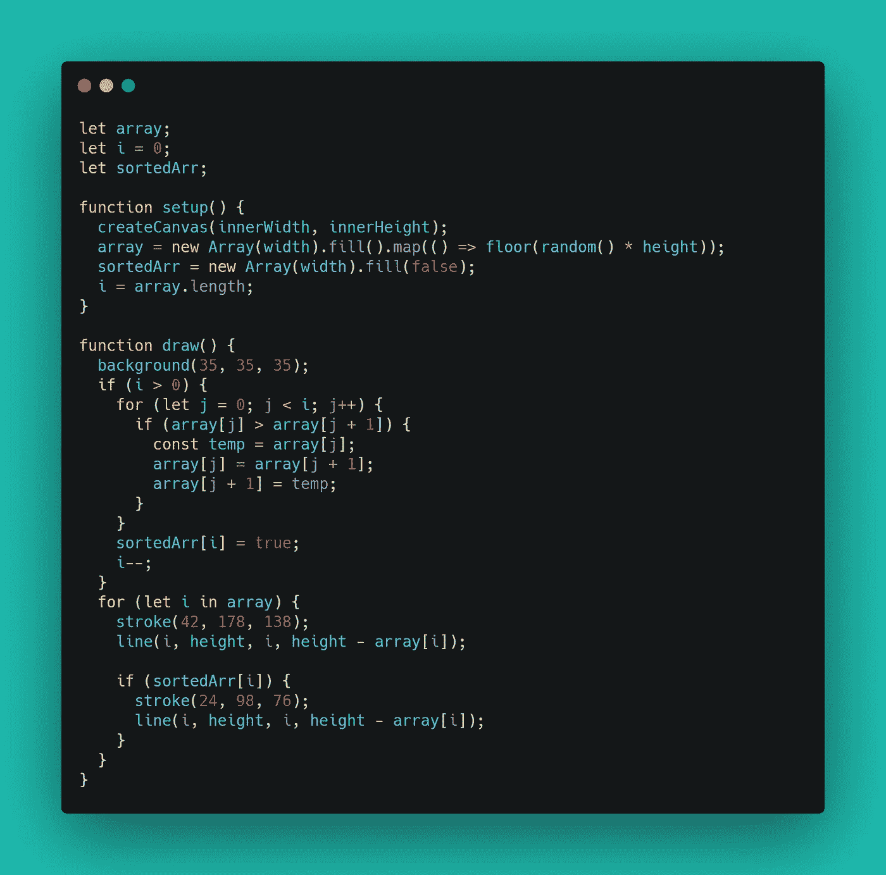
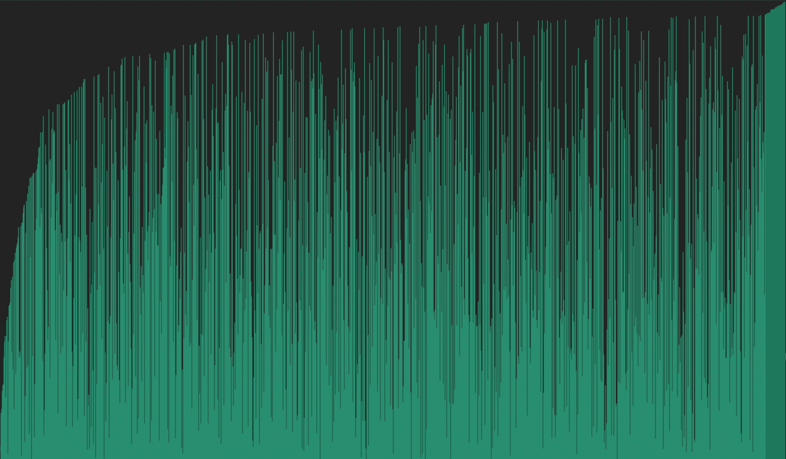
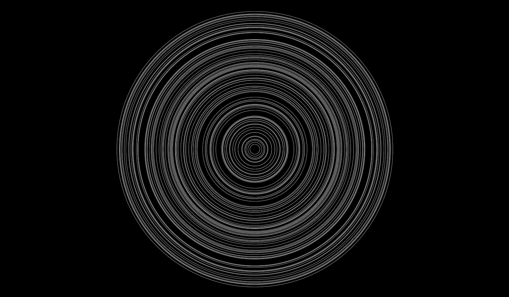

# 可视化冒泡排序

> 原文：<https://medium.com/nerd-for-tech/visualizing-bubble-sort-c5ee6173c986?source=collection_archive---------17----------------------->


我很确定你以前听说过冒泡排序算法。它可能是最简单也是最弱的排序算法。老实说，我从未觉得算法有趣，但我很幸运地发现了迈克·博斯托克的这篇文章。在这篇文章中，他解释了如何可视化不同的算法。他指出，你不需要一个数据集来可视化它。你可以用数学和逻辑的优雅来创造惊人的视觉效果。

我在网上搜索，发现了用简单算法创造的美妙的视觉艺术。所以我决定打开画笔，开始想象不同的算法。

由于我以前从未尝试过可视化算法，我想从简单而优雅的东西开始，我能记得的大学时代的唯一算法是冒泡排序算法。

# 冒泡排序算法

有很多文章可以比我更好地解释这种算法。但是我将尝试给出一个简短的概述，这样您就不必额外点击新标签。


这就是冒泡排序的工作原理。你把第一个元素和紧邻的元素进行比较，然后交换它们，它符合你的排序标准。


移动到下一个元素，再次将其与紧邻的下一个元素进行比较。重复这个过程，直到到达元素的末尾。此时，您应该在最右侧找到最大或最小的元素(基于您的标准)。


下一次循环遍历元素时，不需要考虑最后一个元素。这意味着我们将比前一次少循环一次元素。


既然枯燥的部分已经讲过了，我们可以可视化数据了。我说的数据是指我将生成的随机值。

## 排序随机高度

我在这里用 P5.js 来可视化这个算法。这是一个非常强大而简单的 JavaScript 库，用于处理 2D 和 3D 处理。



让我们看一下代码。这里，全局范围的两个函数— `setup`和`draw`由 P5.js 提供。setup 函数在执行开始时只运行一次。顾名思义，这个函数可以用来设置我们处理的初始状态。每一帧都会调用`draw`函数。所以我们实际上是在画布上画画。

我们有三个全局变量— `array, i and sortedArr`。`array` 是我存储元素的地方，以便以后过滤。`i`是跟踪循环进程的计数器，最后`sortedArr`是一个可选变量，我用它来改变排序元素的颜色。

**setup()—**setup 函数中的第一行是`createCanvas()`，它接受画布的两个参数— `width`和`height`。在下一行—

```
array = new Array(width).fill().map(() => floor(random() * height));
```

我正在创建一个新的数组，其元素数量等于用户浏览器的宽度，并用从 0 到浏览器高度范围内的随机值填充它们。

draw() — 在 draw 函数中，在设置了背景颜色之后，我正在进行 if 检查，这将运行冒泡排序算法。

```
if (i > 0) {
 for (let j = 0; j < i; j++) {
  if (array[j] > array[j + 1]) {
  const temp = array[j];
  array[j] = array[j + 1];
  array[j + 1] = temp;
  }
 }
 sortedArr[i] = true;
 i--;
}
```

这里需要一个`if` 条件来确保它在所有元素排序后停止排序，而不是继续每个后续的绘制方法。在循环内部，我检查两个相邻的元素，并根据排序标准(冒泡排序)切换它们。

```
for (let i in array) {
    stroke(42, 178, 138);
    line(i, height, i, height - array[i]);
}if (sortedArr[i]) {
      stroke(24, 98, 76);
      line(i, height, i, height - array[i]);
    }
 }
```

在这最后一段代码中，我根据元素的高度来画线。



## 排序随机灰度

让我们对灰度进行排序，而不是对线条的高度进行排序。灰度值是 2⁸位。这意味着它可以保存从 0 到 255 的值。0 是绝对的黑色，255 是绝对的白色。

```
array = new Array(width).fill().map(() => floor(random() * 255));
```

这里我生成 0-255 之间的随机值。

```
for (let i in array) {
   fill(array[i]);
   rect(i, 0, 2, height);
}
```

这一次我创建了宽度为 2 像素、高度为用户浏览器的矩形。用数组中随机生成的灰度值填充它们。

我无法上传用于灰度排序的 GIF。[点击此处预览。](https://ayushman-git.github.io/bubble-sort-visualization/pages/grayscale.html)

## 随机圆半径排序

如果我们根据圆的半径对它们进行排序，并从一个原点画出它们，那么对它们进行排序是没有用的，因为你只是改变了圆的位置，而且因为所有圆的中心都是相同的，所以不会改变视觉外观。所以我在这里改变了排序圆的颜色。最终，它的视觉效果非常好，尽管这样排序没有多大意义。

```
array = new Array(noOfCircles)
    .fill()
    .map(() => floor(random(1, height - 50)));
```

这一次我填充了从`1`到`height — 50`之间的随机值，以确保圆圈不会从浏览器的视图中溢出。



# 结论

可视化算法非常有趣，将来我会可视化一些高级算法。您可以使用 P5.js 或 unity 来可视化这些算法。如果你觉得这类事情很有趣，请阅读我在开头提到的文章。我建议你也看看这个 [youtube 频道](https://www.youtube.com/user/Cercopithecan)(除了他在 unity 中创建了精彩的模拟，我对这个家伙一无所知)。你也可以访问 [GitHub repo](https://github.com/ayushman-git/bubble-sort-visualization) 获取完整代码。下次再看其他的图像。