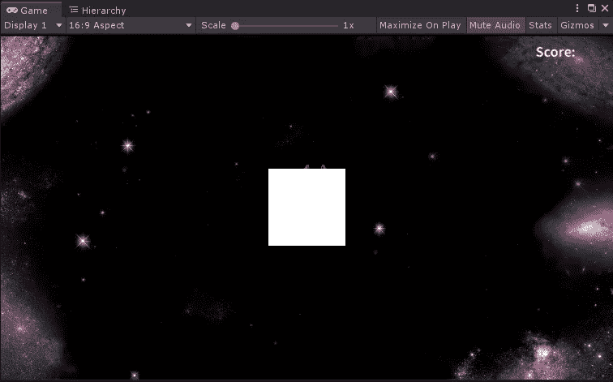
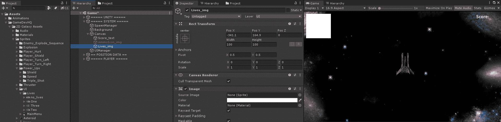
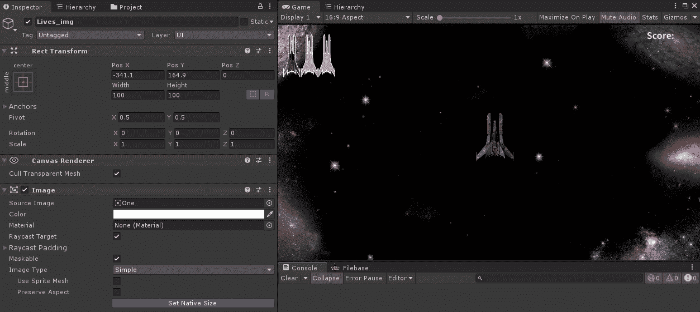
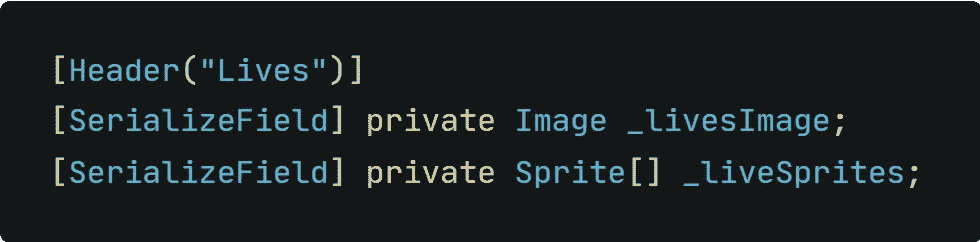
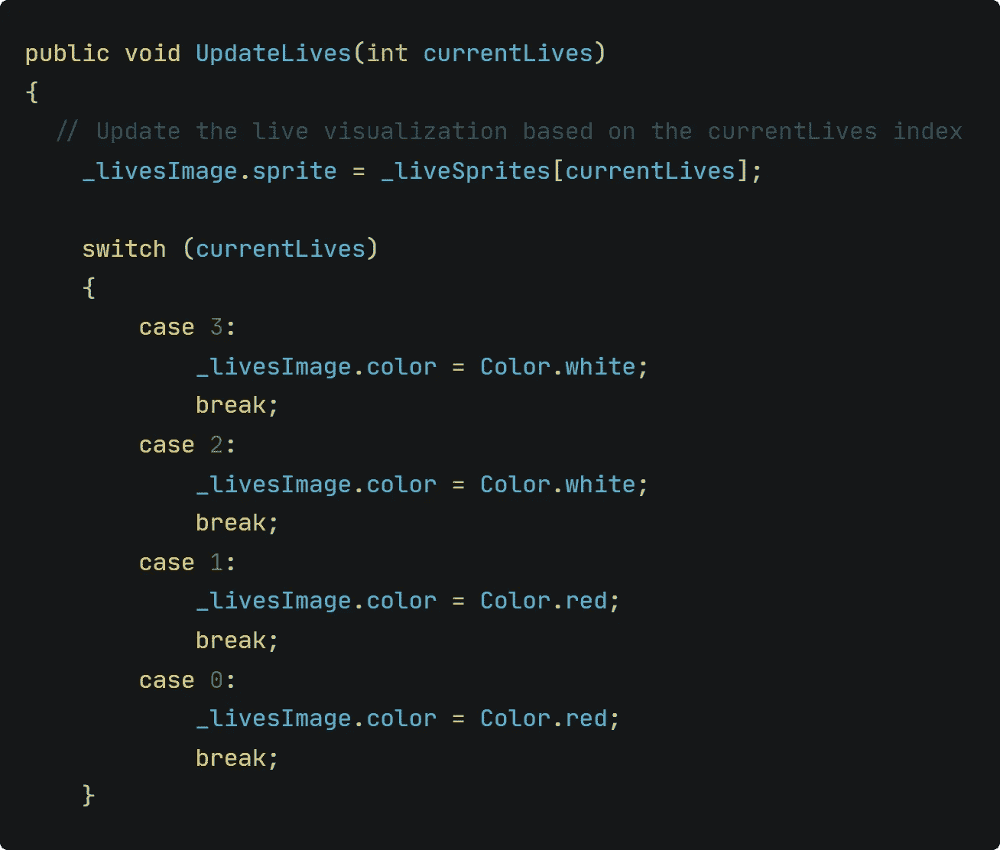
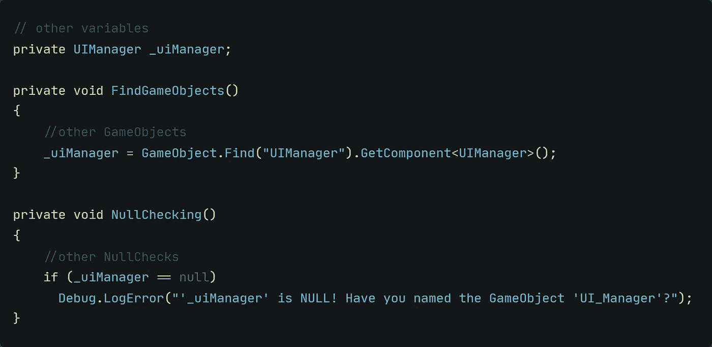
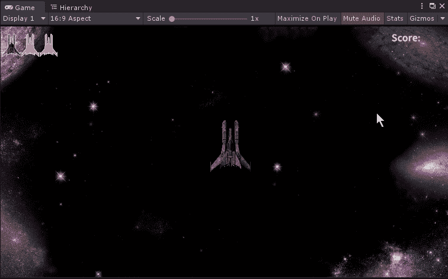
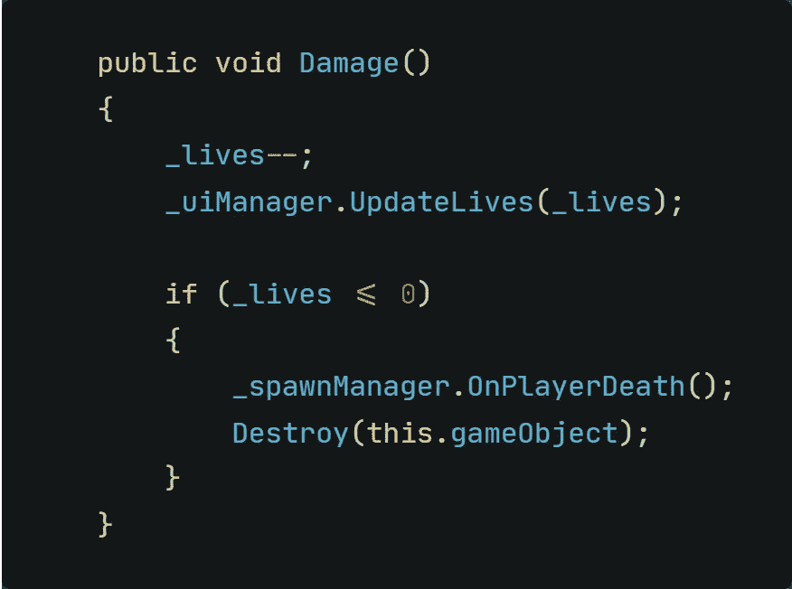

# 可视化玩家健康

> 原文：<https://medium.com/nerd-for-tech/visualizing-the-player-health-f70252304d45?source=collection_archive---------17----------------------->

## 在它结束之前我能承受多少打击？

我们现在有了完全正常工作的评分系统。UI 的第一部分完成了！太好了！现在让我们来看看 UI 的第二部分，玩家生活！

**创建 UI 元素**
我们从分数文本框开始同样的过程，我们创建 UI 元素！

*   *右键单击层级中的画布> UI >图像*

这样做就会呈现给你这个白色方块:
*别着急！这是正常的，因为我们还没有向 Unity 提供任何关于图像的信息。正方形只是一个占位符。*

刚刚创建的图像组件！

把它移到你认为合适的地方！我会把它放在左上角。

**分配目标图像** 为了显示实际的精灵而不是白盒，我们只需要为 Unity 提供一个源图像来显示。只需将文件从项目视图拖到检查器的“源图像”区域。你选择哪一幅图像并不重要。

指定源图像文件

**修复图像的怪异外观** 你可能已经注意到，图像看起来确实很怪异，而且是压在一起的。这是因为图像填满了图像游戏对象的整个空间。要解决这个问题，只需在检查器中单击图像组件内的复选框“*保留特征”*。

*   点击 lives_img >在检查器中查找图像组件>检查*保留特征*

固定目标图像的纵横比！

不要忘记将枢轴点更改为左上方的*,以避免其他屏幕上的生活显示位置错误，这可能与您的屏幕不同！*

*用代码让它工作！做完所有这些，我们现在有了游戏中的指示器。然而，这个图像只是静态的，并不代表玩家仍然拥有的真实生活。要解决这个问题，我们需要通过代码实现逻辑。让我们从声明变量开始吧！*

*   *我们需要一个对图像组件的引用，以便交换精灵来表示当前的生活。因此，我们需要一个*类型的变量 Image* 。*
*   *我们可以有四种生活状态。三，二，一，零。因此，我们需要的不仅仅是一个雪碧。我们可以用一个类型为 *Sprite* 的数组轻松解决这个问题。*
*   *为了让检查器中的脚本更加整洁，让我们添加一个*头。**

*这是你刚刚读到的代码:*

**

*我们需要一个函数来切换出代表当前生活的精灵。*

*   *创建一个新的*公共*函数，该函数需要传回一个返回当前生命数量的变量*
*   *我们希望根据玩家当前的生活更新图像的精灵。相应的精灵存储在我们刚刚创建的数组中。让我们访问它的索引来显示正确的精灵！*
*   *为了微妙地通知玩家只剩下一条命，我们可以改变图像的颜色。*

**

*当前生命存储在 *Player.cs* 脚本中。由于 UIManager 需要这些信息，我们必须在播放器脚本中创建 UIManager 的句柄。*

*   *创建 UIManager 类型的变量*
*   *找到组件并访问 UIManager 脚本*
*   *不要忘记空检查！*

**

*还记得我们在 UIManager 脚本中创建了一个公共函数吗？我们有这个函数，但是它不知道何时更新代表生命的精灵。*

*   *调用 *_uiManager。更新玩家伤害函数中的 Lives()* 方法，并放弃 *_lives* 变量*
*   *根据你之前在分配目标图像时选择的精灵，我们也应该在 *void Start()* 中调用这个函数。这将确保精灵将在游戏开始时更新为三个生命，不管选择的精灵是什么。
    *如果你没有这样做，并且你选择了“一个”或“两个”精灵作为源图像，这将在你开始游戏时发生:**

**

*如果这一切都完成了， *Player.cs* 的 *Damage()* 方法看起来会是这样的:*

**

*就是这样！现在，实时可视化正在按预期工作，玩家知道在“游戏结束”之前，这艘船还能承受多少打击时间！*

*接下来是游戏结束通知。敬请期待！*