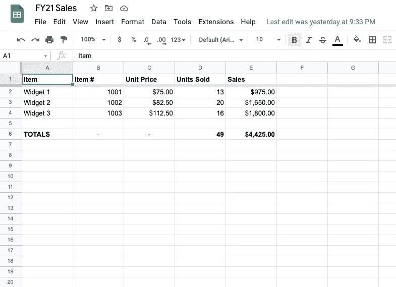
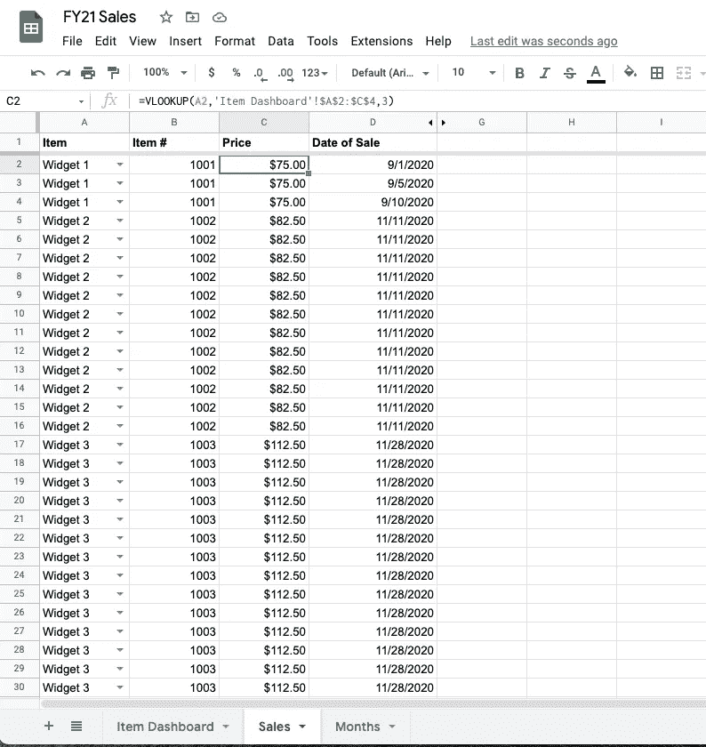
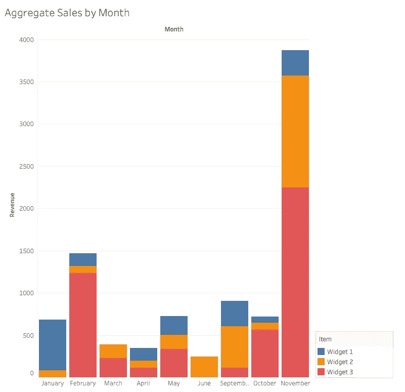
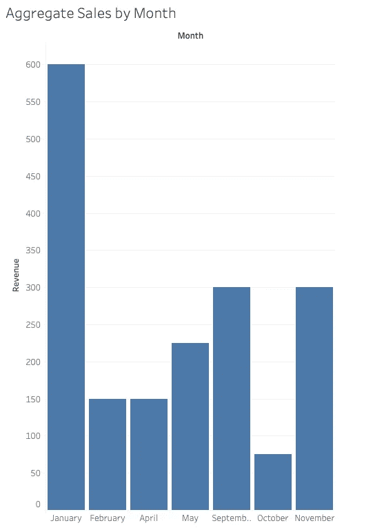
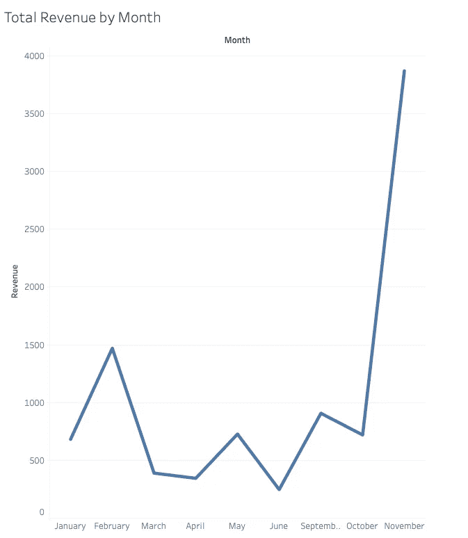

# VLOOKUP，和一个脚趾在 Tableau

> 原文：<https://medium.com/nerd-for-tech/vlookup-and-a-toe-in-tableau-36751952cc53?source=collection_archive---------4----------------------->

每当 Excel 出现在我与数据界人士的交谈中，我得到的第一个问题是关于 VLOOKUP 的，这是对我专业知识的一个评估。所以我觉得是时候探索一下这个小功能了。

VLOOKUP 有三个必需的参数:

*   **您要查找的值，或搜索词**
*   **你要搜索的范围**
*   **该范围内的列号。一旦搜索终止于某一行，该函数将返回指定列中该行的值。**

这来自 Python 和 JavaScript 领域，类似于一个 FOR 或 WHILE 循环，在一个列表(或一个数组的数组)中进行搜索。

首先，我制作了一个简单的工作簿来跟踪一家虚构公司的销售情况。仪表板存储总销售额和产品信息:



仪表板的屏幕截图。

在另一张表上，任何单个销售记录*从仪表板中查找*价格和商品编号信息。



“销售”选项卡的屏幕截图。

突出显示的单元格中的公式是:

```
VLOOKUP(A2, 'Item Dashboard'!$A$2:$C$4, 3)
```

在本例中，我们搜索的是售出的商品(A2 或 Widget 1)。我们在*项目仪表板*表上的小表中进行搜索，并检索第 3 列中的值。如果这是在 Python 中，它可能看起来像这样:

```
for l in item_list: if (l[0] == 'Widget 1'): print(l[2]) break
```

(Excel 有趣的地方当然是这些小算法一直在并行运行，而不仅仅是顺序运行。)

在这种情况下，我可以在 Excel 中看到相同结果的替代路径:IF 语句、SWITCH 等。但是强大的 VLOOKUP 很简洁，而且更有趣。

**表格中的分析**

我最近使用的另一个工具是 Tableau。这个强大的应用程序让我在网格中做梦。将我的简单幻想销售数据转储到它的引擎中，会产生这些按月汇总销售数据的可视化效果:



显示两年内所有三种产品的总销售额。

这些过滤器让我们很容易就能发现原本模糊不清的观点。虽然 Widget 1(在我编造的数据中)并不是最畅销的，但单从视觉上来看，它在今年年初还是相对受欢迎的:



仅显示小部件 1 的销售额。

合计所有三种产品揭示了总体趋势:



如果这个数据是真实的，我们可以对全年的产品需求做出合理的假设。这可以为我们的生产计划提供信息，并确定一年中有增长机会的时间。

**Finito**

多亏了 VLOOKUP，我免去了一个杂乱的包含 if 或 SWITCH 语句的 Excel 栏。现在我已经尝到了甜头，我很想用这种技术获得更多的数据，然后把它带到强大的 Tableau 中做一些分析！