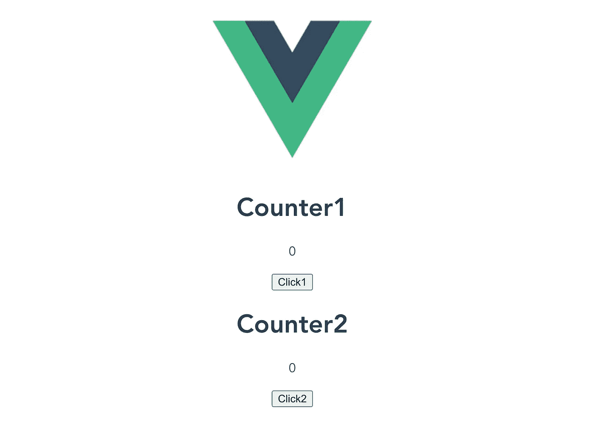
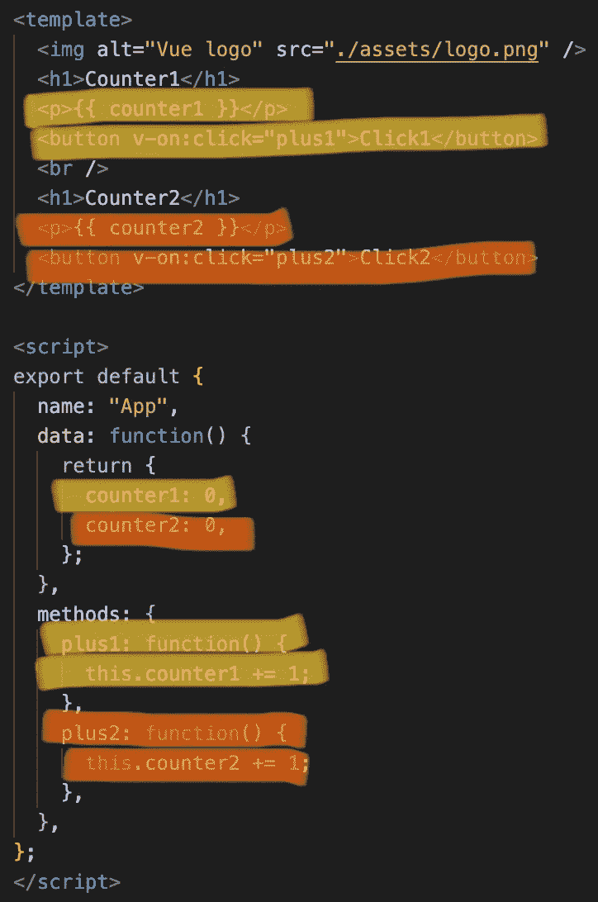
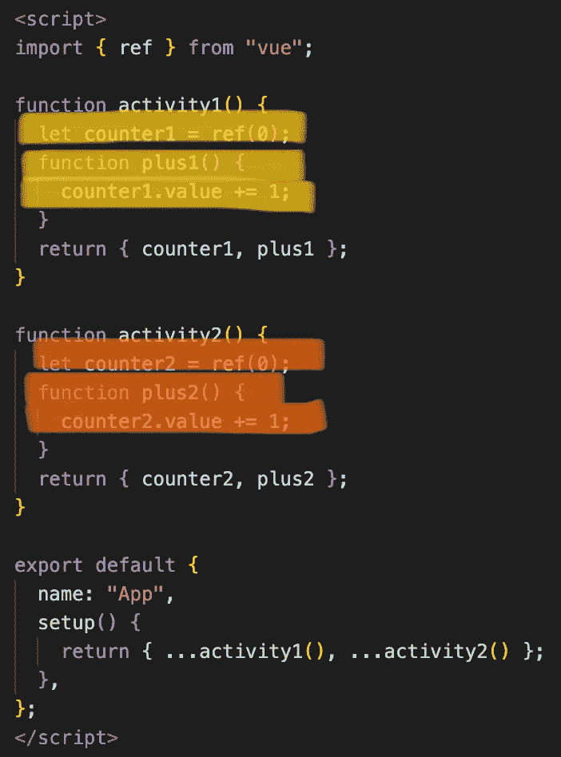

# Vue 组合 API:一瞥

> 原文：<https://medium.com/nerd-for-tech/vue-composition-api-a-first-glance-b90bb259ab9a?source=collection_archive---------18----------------------->

这里是对 Vue 3 中发布的新组合 API 的一个 hello-world 级别的介绍。想要更透彻的解释，你可能想参考 Vue [这里](https://v3.vuejs.org/guide/composition-api-introduction.html)的官方文档。

# TLDR

Vue 的 composition API 提供了一种以函数式编程风格编写 Vue 组件的方法，通过按目的组织变量和方法，而不是按传统方式(或称为 Options API)的类型。

# 第一眼

让我们把代码组织的区别放在伪代码中:

## 选项 API(常规架构)

> 数据:
> 
> -活动 1 的变量 1
> 
> -活动 2 的变量 2
> 
> ***方法:***
> 
> ***-活动 1 的功能 1***
> 
> ***-活动 2 的功能 2***

## 组合 API(来自 Vue 3 的新特性)

> *活动 1:*
> 
> -活动 1 的变量 1
> 
> ***-活动 1 的功能 1***
> 
> *活动 2:*
> 
> -活动 2 的变量 2
> 
> ***-活动 2 的功能 2***

当您的 Vue 组件变大并开始包含多个活动时，这样的组织会很有帮助。如果活动是在组合 API 中设计的，则添加或修改活动不需要编辑代码的多个部分。

# 一个例子

比方说，我们正在创建一个包含两个计数器的 Vue 应用程序。

您可能认为我们需要创建两个变量和两个函数来处理不同的活动。

下面是分别出现在 Options API 和 Composition API 中的相同代码。

## 选项 API:

对象按其类型排序。

变量存储在数据选项中。

函数存储在方法选项中。

## 合成 API:

使用 composition API，脚本部分中的对象可以重新排列成函数式编程风格的设计。

变量和方法现在按照它们的用途分组在一起。

# 说明

在上面非常简单的组合 API 示例中，引入了两个新的关键字:

## - setup():

充当组合 API 的单一入口点。脚本中定义的所有对象都需要在这里返回，并且在创建组件之前执行。

## -参考:

这是一个变量的包装器，允许在脚本部分的其他地方访问它们。在 Vue 3 中创建 ref 函数的快速推理在官方文档[这里](https://v3.vuejs.org/guide/composition-api-introduction.html#reactive-variables-with-ref)中提供。

需要注意的一点是，变量 wrapped 的值需要通过它的**来访问。值**属性。

# 最后的话

这里只是 Vue 3 中新引入的组合 API 的一个非常简单的例子。除了**数据**和**方法**，还有**计算**、 **props/emit** 等相关映射。从选项 API 到组合 API。如果您发现在函数式编程设计中组织代码更简洁，那么您可能希望将当前的 Vue 代码迁移到新的风格中。