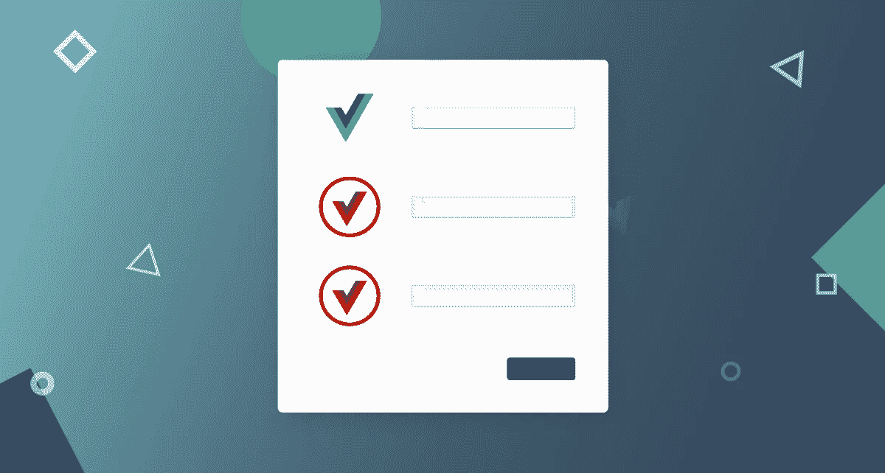

# Vue.js 和 Symfony 表单

> 原文：<https://medium.com/nerd-for-tech/vue-js-and-symfony-forms-ba5139f77f5f?source=collection_archive---------2----------------------->

如何将 **Symfony** 中的 **Vue.js** 请求作为正常表单提交处理

Symfony 为我们提供了`symfony/form`包，这使得处理呈现和提交表单比以往更加容易。很快，随着新的“[表单处理助手](https://symfony.com/blog/new-in-symfony-5-3-form-handler-helper)”的出现，这将变得更加容易，但这不是这里的重点。

当我第一次开始使用 **Vue.js** 时让我恼火的是，我非常喜欢对直接在**分支** ( *非常方便*)中呈现的表单说*再见*。

我已经开始为 **Vue.js** 寻找一些*表单生成器*包。有几个，但是到目前为止我一个都不喜欢。在最坏的情况下，我可以用类似于`/get-form-view`的某种 API 方法来呈现表单，但这与的 **Vue.js** 工作流/概念是如此的**。**

因此...我开始问自己并思考:

"*如何在****vue . js****中渲染表单，并在****Symfony****中处理？虽然我可以像 Twig 处理它一样停止渲染表单——但我肯定希望保留由* ***Symfony*** 提供的表单验证/处理功能。”

这里有几个问题需要解决:

*   **csrf** 令牌的处理，
*   重建**要求*”****其结构必须与****Symfony****标准格式提交* ***”、*** 中提供的结构相同

CSRF 令牌

# **后端**

默认情况下，用`symfony/form`包创建的每个表单都打开了 CSRF 令牌验证。这进一步意味着提供给表单处理器**的每个请求必须**包含 CSRF 令牌。这里有几个解决方案，我将使用我为我的案例找到的 2 个。

**坏的那个(除非只是你的私人项目)——*禁用 CSR 令牌验证***

每个表单类(意味着它从`Symfony\Component\Form\AbstractType`扩展而来)都允许我们关闭 CSRF 验证。

虽然这对于小型私人项目或内部项目来说没问题，但对于公众可访问的项目来说却是一个大问题。

**用 Vue.js 调用发送和处理 csrf 令牌** — **好办法**

1.  首先要做的是…像上面一样禁用`csrf_protection`。

2.现在我们需要`CsrfTokenValidatorService`

3.现在必须在两个地方检查令牌

*   正如我在另一篇文章中所写的那样( [**这里是**](/@Volmarg/vue-js-and-symfony-user-authentication-19ca983126d) )，每个请求都要经过`Authenticator`——所以请求必须在其中得到验证，因为这在触发`KernelRequestEvent`之前被称为
*   **`KernelRequest::REQUEST`**

****KernelRequestListener****

****认证者****

**4.我们还需要传递 CSRF 令牌的路线**

# **前端**

**现在，我没有在每个 **Axios** 调用中一遍又一遍地添加`getCsrf`，而是编写了自己的插件来处理带有 csrf 令牌调用的 post 调用。**

****插件****

**简单地说，这个插件做了两件事:**

*   **来电后端:"*嘿——给我 CSRF 令牌——为了这个****UUID****，***
*   ***然后打第二个电话“*嘿——我拿到了 UUID 的 CSRF，请检查一下，让我过去”****

***当然，没有人说必须在 ajax 调用完成的时候获取令牌，也可以在`beforeMount`中获取令牌，然后以表单形式提供，我认为没有理由这样做，因为我们无论如何都必须为令牌进行通信。***

***因此..如果我们提供假的 csrf 令牌，它实际上能正确工作吗？**是** —我用代码中的硬编码令牌做了一个测试，请求被**拒绝**。***

*****不是完美的解决方案*****

***虽然这听起来并不完美，但它的工作方式与 Symfony 处理 CSRF 令牌的方式非常相似:***

*   ***它使用`form_name`而不是`UUID`，***
*   ***它根据每个请求生成新的令牌，***

***RR**e 构建请求*****

***现在，一旦 CSRF 令牌验证开始工作，实际上最简单的部分就来了。我们只需要一个逻辑，它将*"接受****Axios****请求— json"* ，并将其转换成在 **Symfony** 中正常使用的适当请求数据。***

***就像这样使用它:***

*****我对这个方案的想法*****

***我在这里得到的唯一主要关注是，`getCsrf`路线应该隐藏在认证之后，并且只有`login`应该被允许不经过认证就通过它，否则根据“*伪造形式*”和复制的前端逻辑，任何人都可以很容易地获取 CSRF 令牌。***

***其他不错的“以防万一”保护将只是检查请求来自哪里——如果在我们的域之外——阻止它，因此没有人会得到令牌。***

***除此之外，只是需要花一点时间来理解如何生成 CSRF 令牌、验证它、处理请求等等——所以第一次这样做很耗时，但除此之外，它可以被复制和重新应用。***

***嘿……Symfony 表单验证正常工作了！***