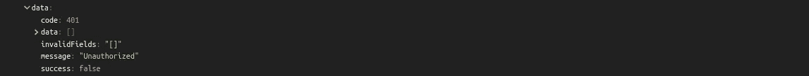
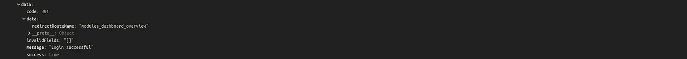

# Vue.js 和 Symfony —用户认证

> 原文：<https://medium.com/nerd-for-tech/vue-js-and-symfony-user-authentication-19ca983126d?source=collection_archive---------3----------------------->

*在****Symfony****—以****vue . js****为前端框架*

在本文中，我将跳过 Symfony 认证过程，因为这可以在官方文档中找到(它更多地是关于在使用 **Vue.js** 的情况下呈现解决方案):

*   [Symfony 认证](https://symfony.com/doc/current/components/security/authentication.html)，
*   [Symfony 登录表单](https://symfony.com/doc/current/security/form_login_setup.html)，
*   [赛峰守卫认证](https://symfony.com/doc/current/security/guard_authentication.html)，

基于 WT 令牌的认证——一定要这样吗？

**Vue.js** 允许我们创建一个 **SPA** ( **单页应用**)或者以混合的形式使用，在这种情况下，我们可以将组件注入到已经存在的代码中，或者使用 **Vue.js** 作为当前前端代码的扩展(*，在这种情况下，我经历了惨痛的教训，它可能会变得非常混乱——你可以在这里* 找到更多的)

就我个人而言，我甚至没有打算测试这两种解决方案，因为混合解决方案工作得非常好——但是——我已经有机会在 **Symfony** 中看到一些有趣/令人困惑的认证，通过使用 **JWT** 在基于 **Angular** 的前端上验证用户(在这种情况下*解决方案/最终目标不同于简单的登录表单*)。

总的来说，JWT 的解决方案确实有效，使一切都正常，没有任何问题——那么有什么意义呢？由于 **Vue.js** 是我自己使用的第一个现代 js 框架，我想知道:

我真的需要使用一些令牌吗，因为 Symfony auth 不再像它应该的那样工作了？现代 JS 都是这样的吗？”

长话短说——不需要这样，在认证过程中实际上不需要神奇的、特殊的令牌——尽管完整的 **SPA** 确实需要特殊的逻辑，但它仍然是“*几乎*标准的 **Symfony** 逻辑。

T他最简单的解决方案——混合认证

在这种情况下，来自 works 的登录是唯一一个完全由**分支**呈现的页面——这里没有使用 js 逻辑，因此使用了正常的认证过程。

1.  **认证页面** —简单的基于树枝的模板，带有登录路径

**2。认证路径** —返回登录页面的路径

就这样(自然假设 project 已经配置为使用上面链接中提供的 Symfony 身份验证)，身份验证已经在这一步工作了——只需向 **security.yaml** 添加一些规则，一切都会按预期工作。

请注意，用 **Vue-Router 添加的每个路由必须**也存在于 Symfony 中，否则后端如何知道访问了什么页面？毕竟 **Vue.js** 只推送浏览器历史中的新状态，除非使用简单的`location.pathname = url`。

A **添加** **Vue.js 路由到 Symfony**

就我个人而言，我有一个非常简单的解决方案，那就是定义一个方法(用基本树枝模板——它包含 **Vue-App** 的 **mounting #id** ):

1.  **后端处理器**

**2。安装编号为**的树枝

这样，如果我们打开 SPA 页面的“new”选项卡，它仍将工作，因为它只是模板，稍后将由 **Vue.js.** 重建/控制

**3。安装 Vue.js**

T **he 棘手的解决方案——API 调用认证**

在这个解决方案中，除了使用基**枝**模板之外，一切都在 **Vue.js** 中处理(*只需向上滚动到* ***“将 Vue.js 路由添加到 symfony】***)。

1.  **登录认证器(*后端* )**

*那么这个认证器有什么特别之处呢？*

响应——这很重要，它是每个调用在前端消耗的**JSON response**(BaseApiDTO)。

2.**处理 Vue.js 中的调用(*前端* )**

3.**回应**

未经授权的响应

授权响应

4.**注销用户**

S总结

这两种解决方案都非常有效，但是如果我要选择更快的一个，那么它肯定是**混合动力-one** 。

请记住，对于这两种解决方案，都需要将 **JsonResponse** 发送到前端，因此使用一些 **BaseResponse** 是个好主意，它将始终包含用户认证状态。