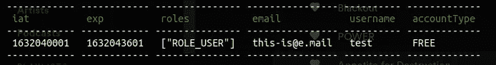

# Vue.js & Symfony —角色认证

> 原文：<https://medium.com/nerd-for-tech/vue-js-symfony-roles-authentication-f9c5ea00d750?source=collection_archive---------2----------------------->

使用基于**vue . js**&**Symfony**的项目验证用户角色和权限

# **用例**

所有基于角色的检查(在前面)都依赖于 JWT 令牌中的数据。一旦接收到 JWT 令牌，它就被存储在浏览器存储器中。

提取的 JWT 有效载荷如下所示:

JWT 有效载荷

# **设置 Vue.js 路线上的角色要求**

**Vue.js** route 对象有一个名为`meta`的特殊属性，允许设置所需的任何类型的附加数据。接下来，我只是这样设置`meta`属性`requiredRole`:

# **为角色检查设置 Vue.js 防护**

现在，此解决方案还需要配置`router`对象(它是 **vue-router** 包的一部分)，如下所示:

# **奖金—基于角色的组件**

按照所有的角色检查逻辑，我还添加了基于角色的小组件，将子组件包装到权限验证中。这样我就可以根据用户的角色来控制用户看到的内容(例如调试工具箱，它可以在任何环境下工作)。