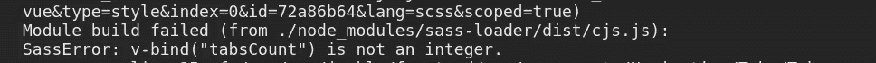

# Vue 3(3.2 . x)—CSS 中的 Vue 变量(样式部分)

> 原文：<https://medium.com/nerd-for-tech/vue3-3-2-x-vue-variables-in-css-style-section-2803047bf7f9?source=collection_archive---------1----------------------->

# 用例

最近我偶然发现了一个问题，我实现了一些简单的基于 **CSS** 的**标签**。最棒的是，它“已经存在”*、*、*、*、*“几乎开箱即用”。一旦我完成了基本案例(只有两个标签)，我就开始添加更多的标签，但是…事情并不像预期的那样。*

问题是, **SCSS** 代码有硬编码变量`$tab-count`,所有的宽度、高度等等。被计算出来，可点击的标签显示隐藏的内容。

我不想有硬编码的值，而是一个动态值，基于通过 prop 传递给`Tabs`组件的标签数。

> 最后，我所写的并没有解决我的问题，而是学到了新的功能，以及它不能工作的情况。

# 样式部分中的“v-bind”

Vue **3.2.x** 允许在`<style>`段直接使用`v-bind`。

下面是一个简单的例子:

以上是字面上的一切，有要做的工作。这也适用于 **SCSS** (以及瓦尔斯`$varName: v-bind()`)。

# 问题:v-bind 返回字符串

大多数情况下`v-bind`返回`string`就可以了。这可能会涵盖 90%的情况。但是它并没有覆盖我的，因为我需要像那样在 SCSS 绕圈:

*   `$tabCount: v-bind(tabsCount)`
*   `@for $i from 1 through $tabCount`

这导致了不可避免的错误，在我的用例中，这使得不可能在`style`部分使用`v-bind`。

