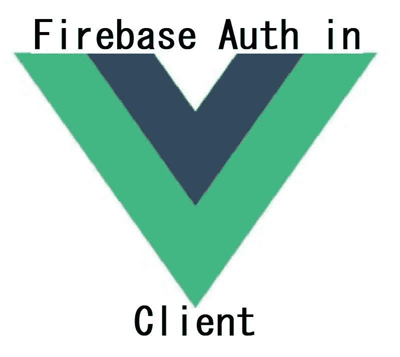
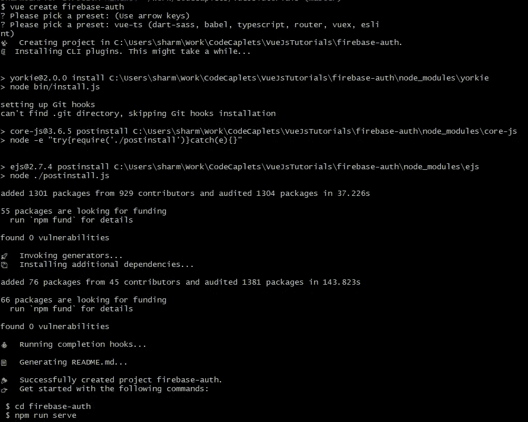
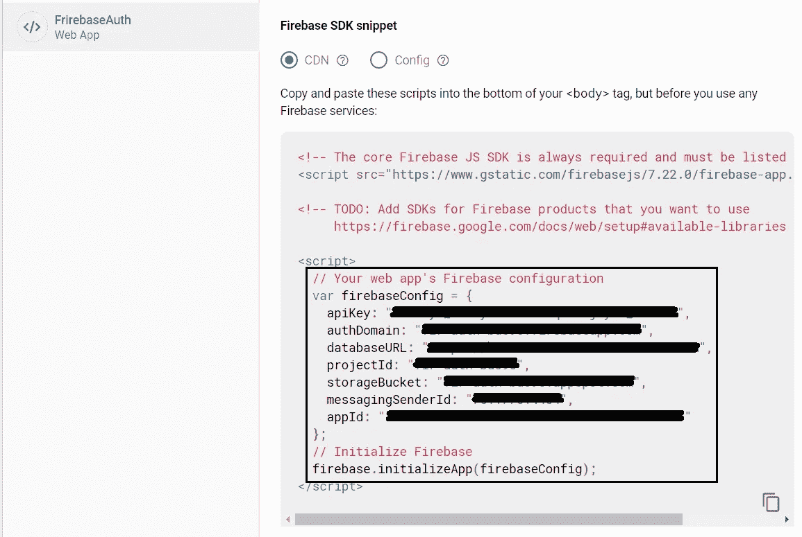
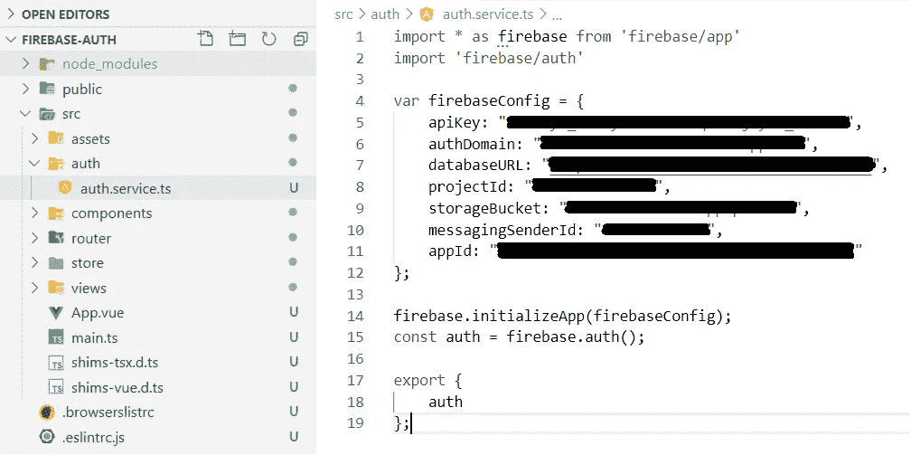
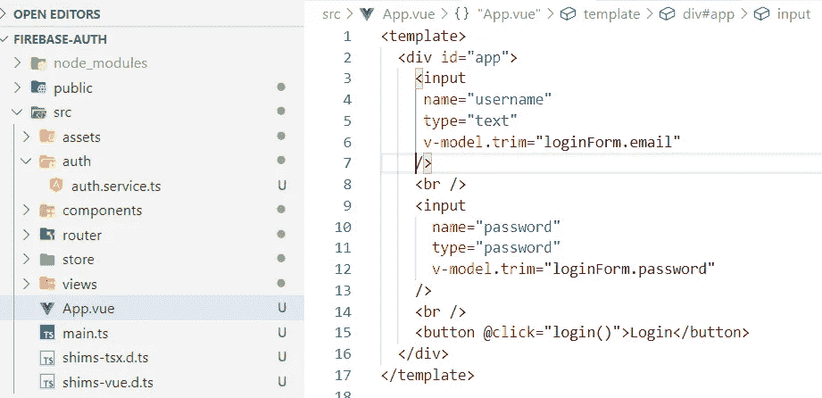

# vue js:vue js 客户端中的 Firebase Auth

> 原文：<https://medium.com/nerd-for-tech/vuejs-firebase-auth-in-vuejs-client-83c91a7cf4fd?source=collection_archive---------1----------------------->



VueJs 不需要介绍，前端应用程序中也不需要健壮的认证机制。设置一个认证服务器来接受所有的登录方式:电子邮件/密码、脸书、谷歌、推特等等。，维护用户会话并与您的客户机和资源服务器集成是一项相当艰巨的任务。Firebase 通过提供身份验证服务和现成的集成库，消除了一半以上的痛苦，让您可以将它集成到自己喜欢的框架中。在本帖中，我们将看到如何在 VueJs 前端应用中设置 firebase 认证。

# ***步骤#1*** :创建一个 Firebase 项目

创建一个 Firebase 项目并添加一个 web 应用程序。

在这里按照步骤[进行](/@sharma.vikashkr/firebase-how-to-setup-an-app-in-firebase-9ddbacfe8ad1)。

# ***第二步*** :创建一个 VueJs app

创建一个 VueJs 项目。我正在使用 Vue CLI 创建一个新项目。如果您没有安装 Vue CLI，请使用以下命令进行安装。

```
**npm install -g** [**@vue/cli**](http://twitter.com/vue/cli)
```

要创建一个 VueJs 项目，在您的项目文件夹中打开一个命令并运行 command(我将我的项目命名为'*firebase-auth*'；给出您选择的任何名称):

```
**vue create firebase-auth**
```



创建 VueJs 项目

# ***第三步*** :添加 firebase 依赖项

在新项目中使用控制台，并将' *firebase* '包添加到项目中。

```
**npm install — save firebase**
```

# ***步骤#4*** :创建一个授权服务

在您喜欢的 IDE 中打开项目。创建一个文件夹，在 src 中说' *auth* '。在这个文件夹中创建一个 javascript 文件' *auth.service.ts* '。使用 firebase 控制台中可用的 firebaseConfig 初始化 firebase。从模块中导出 firebase auth。



Firebase 控制台:Web 应用程序配置



授权服务. ts

# ***第五步*** :创建登录表单

更改 App.vue，在模板区域创建一个简单的登录表单。



登录表单

# ***步骤#6*** :将你的认证服务与登录挂钩

在 App.vue 的