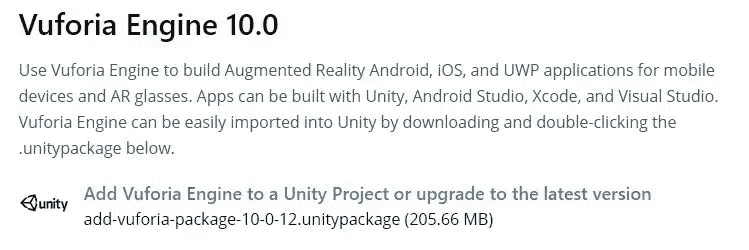
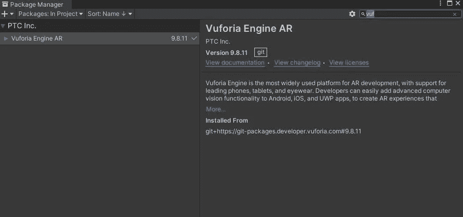
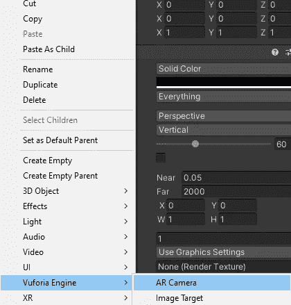
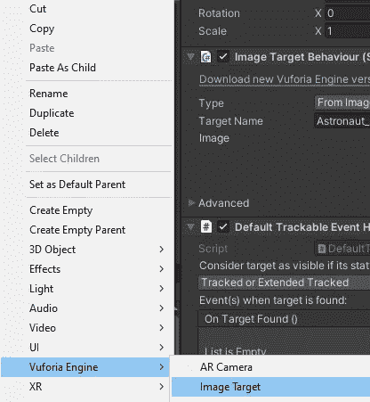
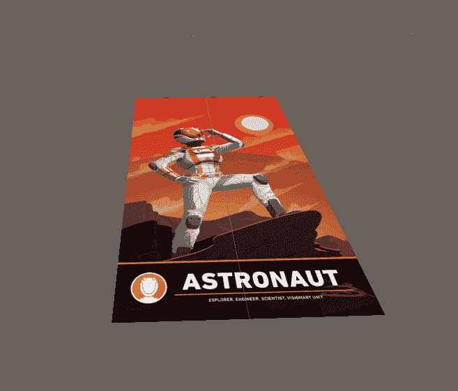

# Unity 101 中的 Vuforia SDK

> 原文：<https://medium.com/nerd-for-tech/vuforia-sdk-in-unity-101-c7a5bf31aa24?source=collection_archive---------8----------------------->

如果你读过我之前关于 AR 马解剖项目的文章([Unity 中的 AR 项目](/geekculture/progression-report-ar-project-in-unity-e61d628fd31))，那么你会知道我们在 Unity 中使用了 Vuforia SDK 来创建这个项目。如果没有，那么在本文中，我们将深入探讨如何在 Unity 中设置 Vuforia，以及如何创建您的第一个 AR 对象。

Vuforia 发动机

> 将 Vuforia 下载到 Unity

如果你使用的是 Unity 2019+，那么你可能在包管理器里找不到 Vuforia SDK。你需要去 Vuforia 网站下载安装包并导入到 Unity 中。

A.进入 Vuforia 网站: [SDK 下载| Vuforia 开发者门户](https://developer.vuforia.com/downloads/sdk)并选择“将 Vuforia 引擎添加到 Unity 项目”

B.这将提示您登录 Vuforia 网站，因此如果您没有帐户，请创建一个

C.这将下载一个 unity 包，所以当它下载的时候，打开你的项目

D.下载完成后，将软件包导入到您的 Unity 项目中

Unity 中的 Vuforia 包

> 使用 Vuforia 创建你的第一个 AR 对象

A.删除场景中的主摄像机。

B.从 **Vuforia 上下文菜单**中创建一个 **AR 摄像机**

AR 相机将允许您使用目标来检测 AR 对象，并通过设备的相机将它们显示在目标上。在 **AR 摄像机**检查器中，你会发现一个 **Vuforia 行为脚本**，将**世界中心模式**更改为*设备*。

C.最简单的 AR 形式是使用一个简单的图像，AR 相机将通过你的相机检测到并在其上显示一个对象。同样，通过 Vuforia 上下文菜单，添加一个**图像目标**到你的场景中。

D.在图像目标检查器中，添加您将用作目标的图像。您还需要打印这张图像，以便您的相机设备可以检测到它。在我们的项目中，我们添加了一个宇航员图像。

现在，为了通过你的 AR 相机在图像目标上显示任何对象，是通过在图像目标下子化一个游戏对象。确保对其进行缩放，并将其正确放置在图像目标上方。

给马定位

正如您所看到的，我们已经在图像目标下设置了马游戏对象的子对象，对其进行了缩放，并将其适当地放置在图像目标上方。

现在，如果您播放您的场景，将您打印的图像放在相机前面，那么相机会将该图像检测为目标，并在您的图像目标下显示您的任何子图像。

霍斯河