# Wafo vs VST:浓缩咖啡过滤篮分析

> 原文：<https://medium.com/nerd-for-tech/wafo-vs-vst-espresso-filter-basket-analysis-4e61085a9b4d?source=collection_archive---------0----------------------->

## 咖啡数据科学

## 展望浓缩咖啡篮的未来

Wafo 正在向市场推出一种新的浓缩咖啡篮，以及其他一些产品，打破了过去十年来稳定的精密篮子系列。我早些时候通过一个朋友的朋友得到了一个。我最初得到了 Wafo Classic，我买了一个 SOE/Spirit，我很快就会有一些数据。

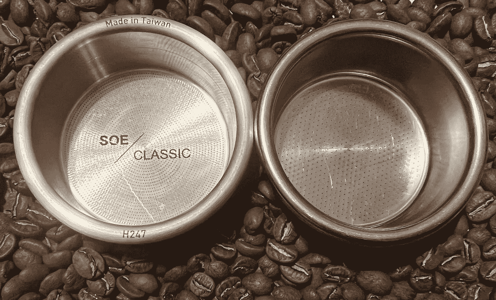

所有图片由作者提供

现在，我使用[孔分析](https://rmckeon.medium.com/espresso-baskets-and-related-topics-splash-page-ff10f690a738)来查看篮筐孔的顶部和底部。为了做到这一点，我从顶部和底部的过滤器成像，然后我使用生殖来对齐它们。这也修正了由于测量网篮底部(网篮在屏幕上上下颠倒)而导致的高度偏移。

手动图像对齐

后来，我检查了每个洞，并调整了顶部和底部之间的尺寸。

# Wafo 经典过滤篮

我看了孔的大小，有一些变化，但与以前的过滤器相比，这是相当令人期待的。

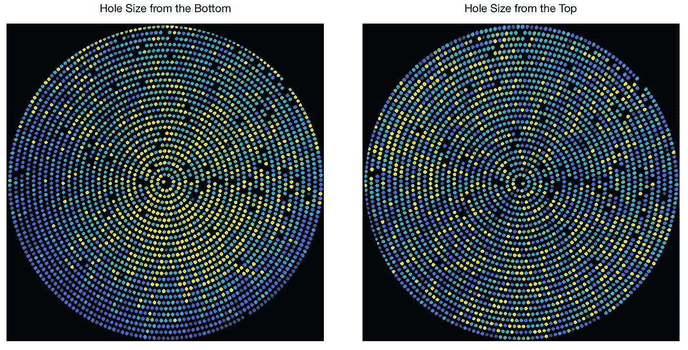

按大小着色的孔。黄色较大，然后颜色过渡到深蓝色。

顶部和底部之间的空穴分布也发生了变化。

我们也可以在过滤孔上看到这个比例。1:1 的比率意味着顶部和底部的孔直径相同。这显示了一些变化，其中一些孔比其他孔大。

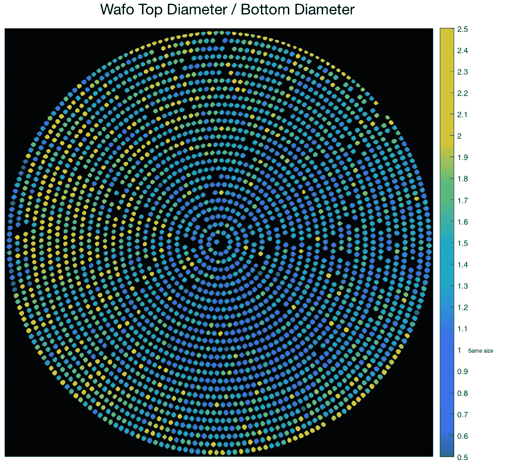

我们可以画出这些洞的顶部和底部，这显示了一个有趣的分布。

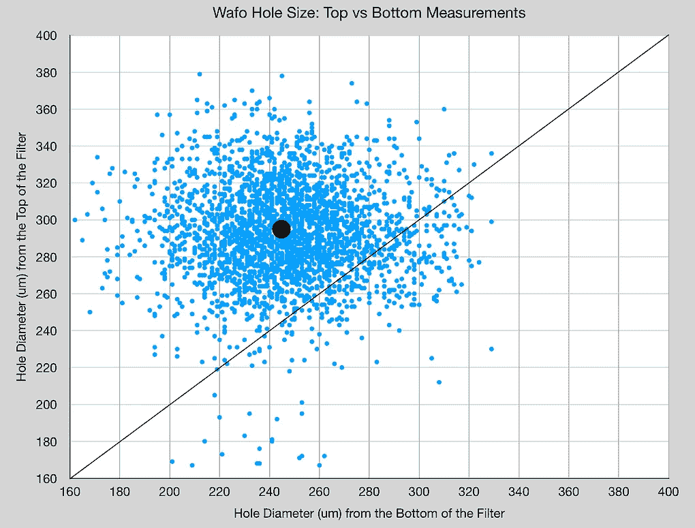

# 要比较的 VST 过滤篮

当然，这些数据在真空中没有多大意义，所以我对 VST 过滤篮做了同样的分析。

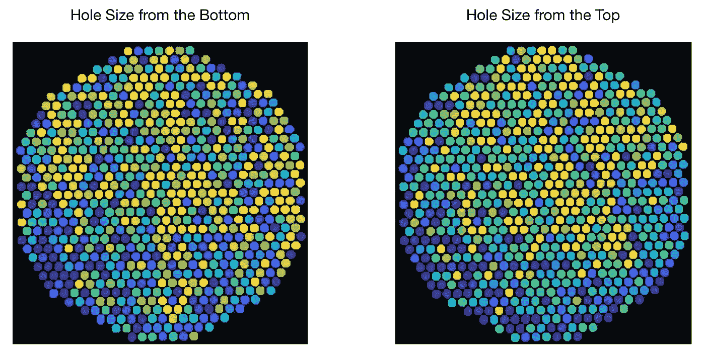

洞的分布显示了一些我以前没见过的东西。从顶部看，孔洞紧紧围绕在一个峰周围，但从底部看，分布更加分散。VST 有一条长尾巴，我不确定这种传播中有多少摄影错误。

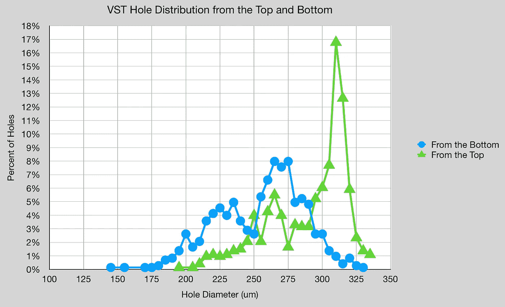

与 Wafo 相比，测量顶部和底部之间的比率是一种更严格的空间分布。

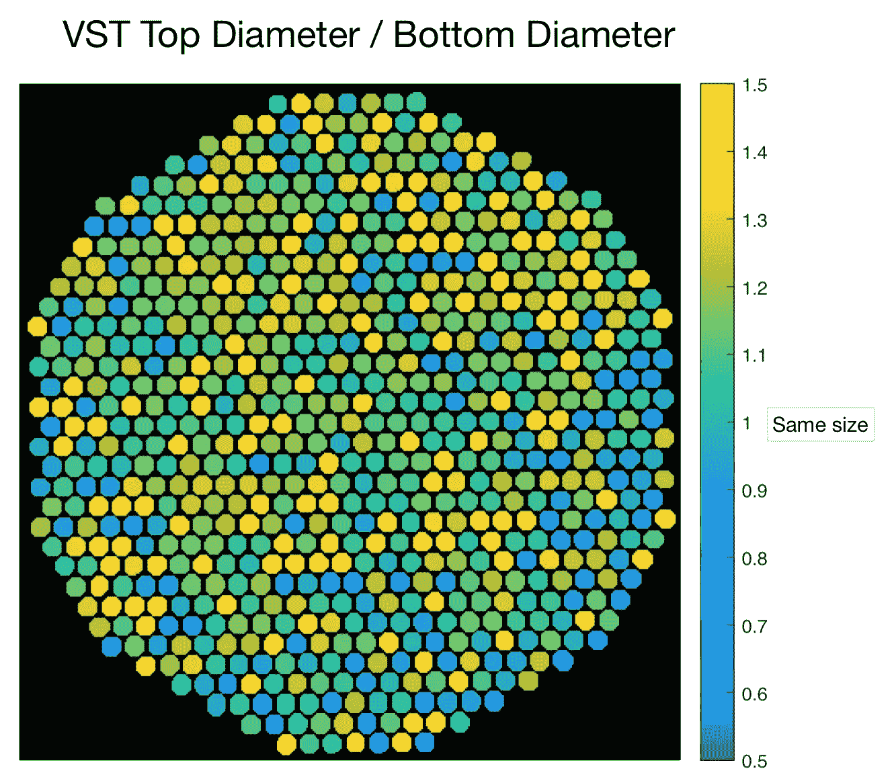

在散点图中，可以看到许多从顶部测量的孔具有底部孔测量的宽分布。

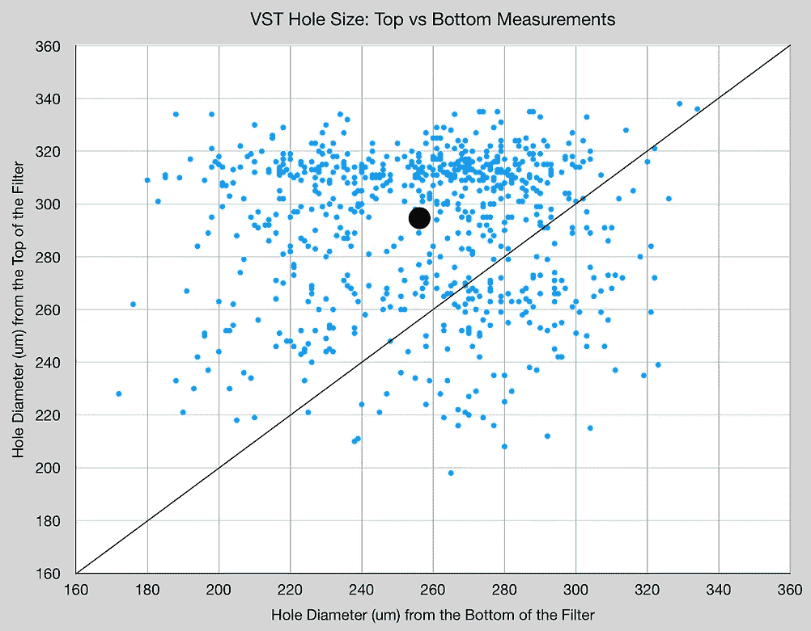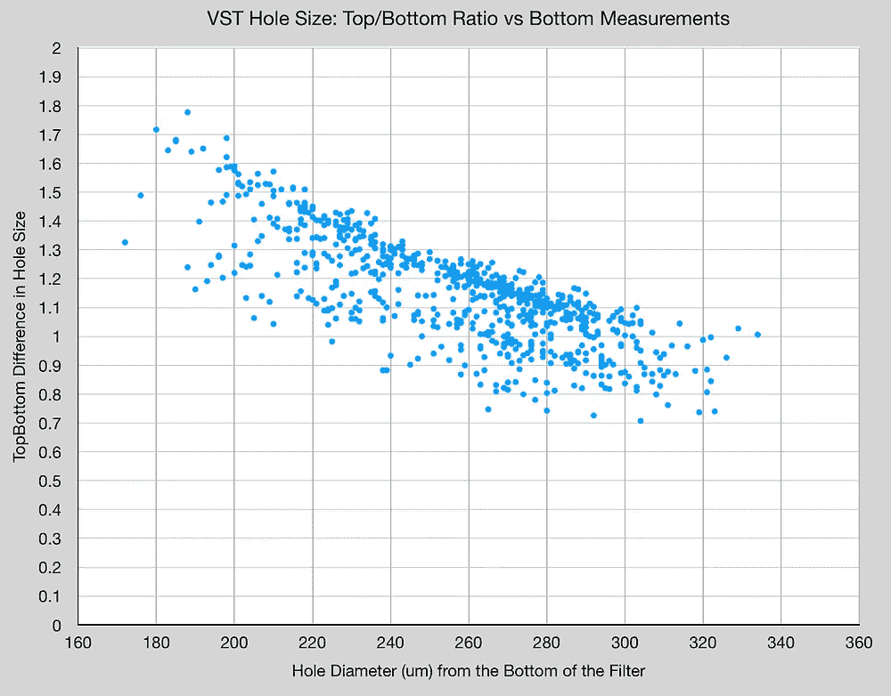

# Wafo Classic vs VST

叠加顶部/底部比与井底直径，VST 具有与 Wafo 相似的分布。

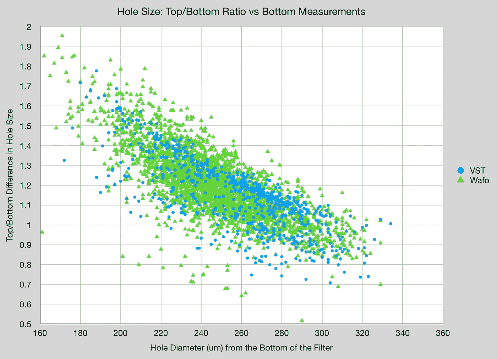

Wafo 具有较大的总开口，但孔径的平均值和标准偏差似乎大致相同。

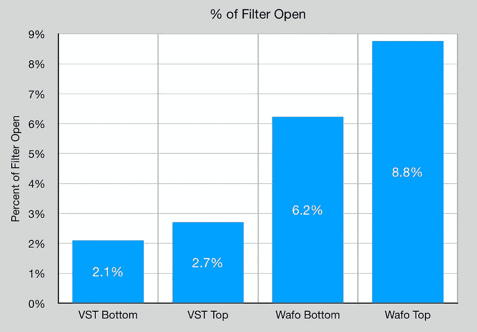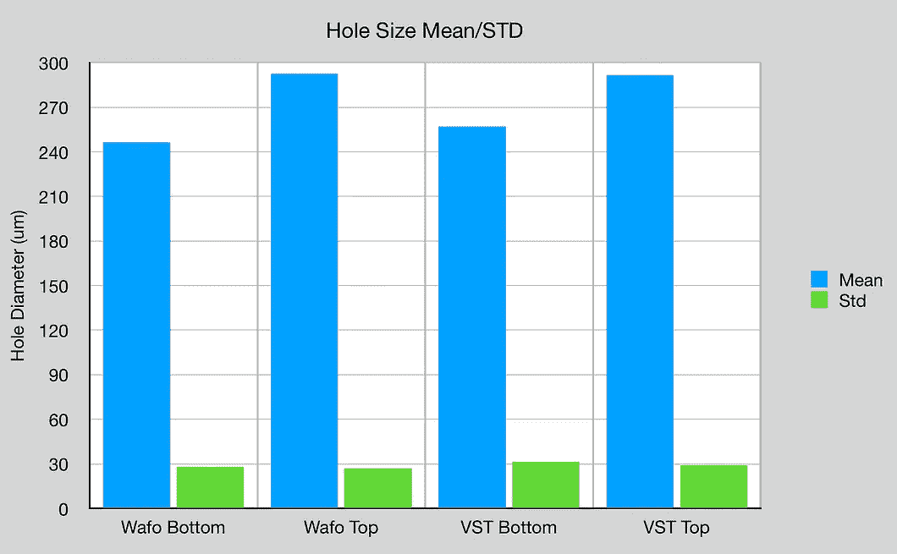

这个分析确实指出了更多可以理解的关于精确篮子的东西。我们在一个点上测量精度，但实际上，需要从过滤孔的顶部和底部测量精度，因为这将最终决定流量。我很好奇改变尺寸差异对流动有什么影响，我很期待 Wafo SOE/Spirit。

如果你愿意，可以在推特、 [YouTube](https://m.youtube.com/channel/UClgcmAtBMTmVVGANjtntXTw?source=post_page---------------------------) 和 [Instagram](https://www.instagram.com/espressofun/) 上关注我，我会在那里发布不同机器上的浓缩咖啡照片和浓缩咖啡相关的视频。你也可以在 [LinkedIn](https://www.linkedin.com/in/dr-robert-mckeon-aloe-01581595) 上找到我。也可以关注我在[中](https://towardsdatascience.com/@rmckeon/follow)和[订阅](https://rmckeon.medium.com/subscribe)。

# [我的进一步阅读](https://rmckeon.medium.com/story-collection-splash-page-e15025710347):

[我的书](https://www.kickstarter.com/projects/espressofun/engineering-better-espresso-data-driven-coffee)

[我的链接](https://rmckeon.medium.com/my-links-5de9eb69c26b?source=your_stories_page----------------------------------------)

[浓缩咖啡系列文章](https://rmckeon.medium.com/a-collection-of-espresso-articles-de8a3abf9917?postPublishedType=repub)

工作和学校故事集