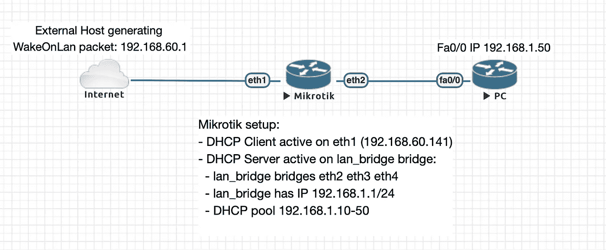
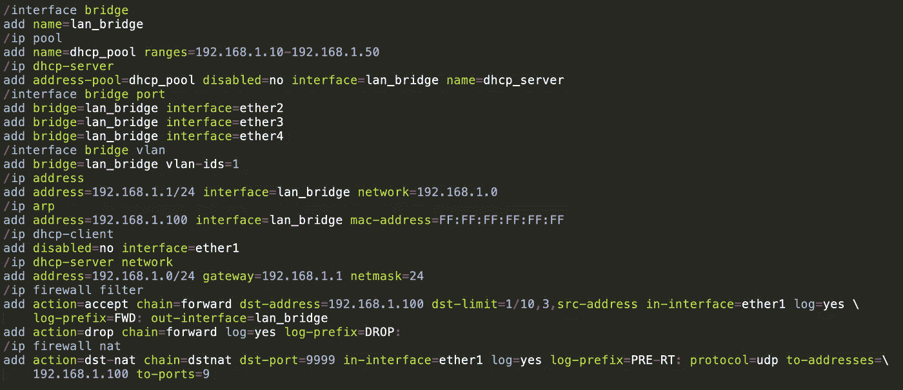
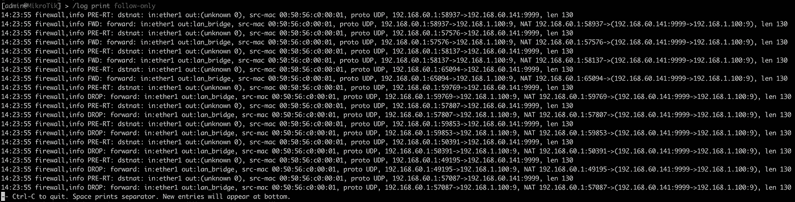
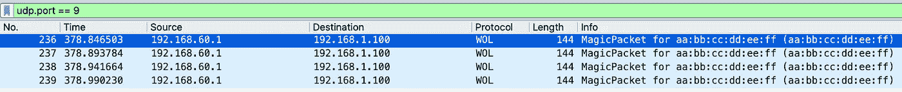
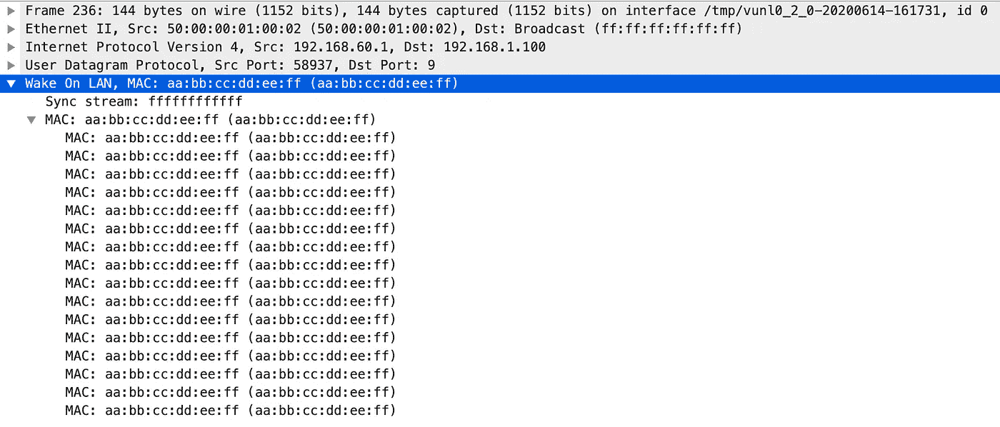
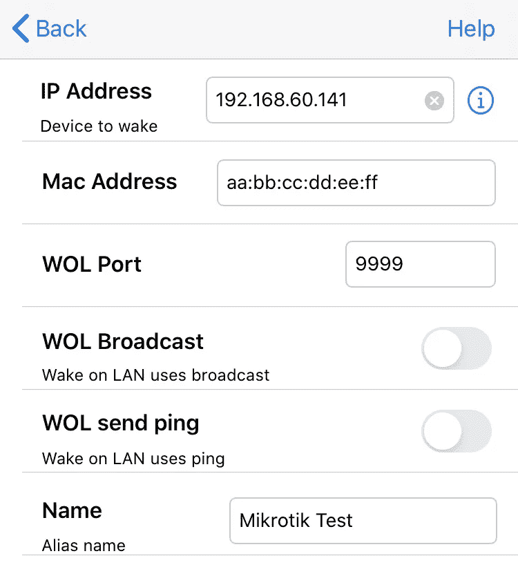

# 从公共网络唤醒局域网(MikroTik 实用示例)

> 原文：<https://medium.com/nerd-for-tech/wake-on-lan-from-public-network-mikrotik-practical-example-b48551d9191e?source=collection_archive---------1----------------------->

## 一些网络设备和个人电脑甚至可以在关机时监听其以太网接口上传入的特殊数据包，这用于允许它们通过特殊的*神奇数据包*通电，该数据包由 Wake-On-Lan(从现在的 WOL)使用。让我们看看如何在基于 RouterOS 的 Mikrotik 路由器上使用公共网络中的 WOL。

WOL 通常通过生成目的 IP 地址为网络广播地址(在常见的 192.168.0.0/24 网络中，它被定向到 192.168.0.255 或 255.255.255.255)的数据包来完成，这将生成一个带有 FF:FF:FF:FF:FF:FF:FF:FF 目的 mac 地址的以太网帧。该广播帧由 lan 网段中的所有主机处理。是什么让这包*变魔术*？它必须包含要被唤醒的设备的 Mac 地址，重复 16 次。当断电设备的以太网卡检测到这个特殊帧时，它会给设备加电。

通常魔术包是目的端口为 0、7 或 9 的 UDP 包，但这不是强制性的。顺便说一下，我将在示例中使用 UDP 端口 9。

你可以在维基百科上找到更多关于 WOL 的[信息。](https://en.wikipedia.org/wiki/Wake-on-LAN#Magic_packet)

# 从互联网上使用 WOL

假设您的家庭网络中有一个 NAS，您希望仅在需要时才打开它，以获取您存储在其上的一些文档，并且您的家庭网络中没有其他活动的设备可供您连接以使用 WOL，那么从互联网上使用 WOL 不是很有用吗？如何从公共网络在内部 LAN 上生成广播帧？

我在 Eve-NG network simulator 中构建了这个简单的设置，使用一个虚拟 MikroTik 路由器来模拟我们的家庭路由器，使用 eth1 作为 WAN 接口(我在 192.168.60.0/24 中使用私有 IP 地址，但将其视为在互联网上公开的公共地址),将 eth 2–3–4 分组到一个名为 *lan_bridge* 的网桥中，IP 地址为 192.168.1.1/24，DHCP 服务器启用了 192 . 168 . 1 . 10–10



我们可以生成一个指向我们家用路由器的公共 IP 地址的神奇数据包，但是我们如何强迫它将它变成一个广播数据包呢？我想到的第一个最简单的解决方案是使用目的地 NAT 将目的地为 192.168.60.141 的神奇数据包更改为 192.168.1.255，但在基于 MikroTik 或 Linux 的路由器上，这不起作用(我认为不支持定向广播转发),数据包被丢弃。

那么，我们如何在 192.168.1.0/24 lan 上生成神奇的数据包来启动我们的设备呢？我们可以实现以下技巧:

1.  分配 192.168.1.0/24 中未使用的 IP 地址，如 192.168.1.100
2.  在 MikroTik 路由器上定义静态 ARP 解析，将 FF:FF:FF:FF:FF:FF 设置为 192.168.1.100 mac 地址
3.  在 MikroTik 路由器上实施预路由目的地 nat 规则，以便通过将目的地地址更改为 192.168.1.100 并将目的地端口更改为 9，来更改定向到其面向互联网的接口和 UDP 端口 X(让我们选择 9999)的传入流量

现在，当您将使用目标端口 9999/UDP 向 192.168.60.141 发送神奇数据包时，MikroTik 预路由 NAT 处理会将目标地址更改为 192.168.1.100。然后，MikroTik 将数据包路由到位于该子网上的 lan_bridge，当它准备包含转发数据包的以太网帧时，它会将 FF:FF:FF:FF:FF:FF:FF 作为目的 Mac 地址，从而在内部 lan 上产生一个广播数据包，即使目的 IP 地址是单播 IP。

**安全警告:**使用路由器公共地址上的 9999/UDP 端口发送的数据包会在您的内部网络上生成广播数据包，因此强烈建议对转发的数据包数量进行速率限制。

# 米克罗提克构型

# 基本配置

```
# Bridge eth2-3-4
**/interface bridge** add name=lan_bridge
**/interface bridge vlan** add bridge=lan_bridge vlan-ids=1
**/interface bridge port** add bridge=lan_bridge interface=ether2
add bridge=lan_bridge interface=ether3
add bridge=lan_bridge interface=ether4

# Enable DHCP client on eth1 (WAN interface)
**/ip dhcp-client** add disabled=no interface=ether1

# Setup internal network and enable DHCP Server
**/ip address**
add address=192.168.1.1/24 interface=lan_bridge network=192.168.1.0
**/ip pool**
add name=dhcp_pool ranges=192.168.1.10-192.168.1.50
**/ip dhcp-server** add address-pool=dhcp_pool disabled=no interface=lan_bridge name=dhcp_server
**/ip dhcp-server network** add address=192.168.1.0/24 gateway=192.168.1.1 netmask=24
```

# ARP 解析“技巧”

```
**/ip arp add address=192.168.1.100** interface=lan_bridge **mac-address=FF:FF:FF:FF:FF:FF**
```

# 防火墙 NAT 和转发规则

如前所述，我们将实现一个转发规则，允许流量定向到 192.168.1.100，但带有一个速率限制检查，允许每 10 秒从一个特定的公共源地址发送一个数据包，突发 3 个(这实际上允许转发 4 个数据包，这可能是由于 MikroTik dst-limit 的工作方式，我没有深入研究这一点，因为实际效果与本指南的目的相同)。

```
**/ip firewall nat**
**add** **action=dst-nat** **chain=dstnat** dst-port=9999 in-interface=ether1 log=yes log-prefix=PRE-RT: protocol=udp \
    to-addresses=192.168.1.100 to-ports=9

**/ip firewall filter**
**add** **action=accept chain=forward** **dst-address=192.168.1.100** **dst-limit=1/10s,3,src-address** in-interface=ether1 log=yes \
    log-prefix=FWD: out-interface=lan_bridge
**add** **action=drop chain=forward** log=yes log-prefix=DROP:
```

**注意:**在上面的配置中，我记录了所有用于测试目的的丢弃，在实际设置中，我建议您对每个 src 地址的丢弃进行速率限制，以避免如果有人从互联网上向您发送大量邮件，您的日志收集器会收到大量邮件。

在这里，您可以看到整个配置的可读性更好，语法在 Sublime 文本中突出显示:



RouterOS 配置

# 测试 MikroTik 设置

为了测试我实现了什么，我在我的 MacBook Pro 上下载了 wakeonlan 软件包(来自 MacPorts)，并用以下命令连续生成了 10 个魔术包(sudo 只在第一次询问密码，因此该命令很快重复了 10 次):

```
% for i in $(seq 1 10) ; do sudo **wakeonlan -i 192.168.60.141 -p 9999 aa:bb:cc:dd:ee:ff** ; done
Sending magic packet to 192.168.60.141:9999 with aa:bb:cc:dd:ee:ff
Sending magic packet to 192.168.60.141:9999 with aa:bb:cc:dd:ee:ff
Sending magic packet to 192.168.60.141:9999 with aa:bb:cc:dd:ee:ff
Sending magic packet to 192.168.60.141:9999 with aa:bb:cc:dd:ee:ff
Sending magic packet to 192.168.60.141:9999 with aa:bb:cc:dd:ee:ff
Sending magic packet to 192.168.60.141:9999 with aa:bb:cc:dd:ee:ff
Sending magic packet to 192.168.60.141:9999 with aa:bb:cc:dd:ee:ff
Sending magic packet to 192.168.60.141:9999 with aa:bb:cc:dd:ee:ff
Sending magic packet to 192.168.60.141:9999 with aa:bb:cc:dd:ee:ff
Sending magic packet to 192.168.60.141:9999 with aa:bb:cc:dd:ee:ff
```

我选择了 *aa:bb:cc:dd:ee:ff* 作为被唤醒设备的 Mac 地址。让我们看看 MikroTik 日志，看看发生了什么:



Mikrotik 路由器上的日志

如您所见，**预路由 NAT (src-nat chain)规则因上述 10 个数据包而被触发 10 次，但允许流量通过的转发规则仅被触发 4 次**，其他 6 次我们都有丢弃。

我还在 PC 接口 Fa0/0(它是一个虚拟路由器，这就是接口有这样一个名称的原因)上开始了一个数据包捕获。Fa0/0 接口通过 eth2 MikroTik 接口连接到 MikroTik lan_bridge，实际上它通过 DHCP 获得 IP 地址:

```
PC#sh dhcp lease
Temp IP addr: 192.168.1.49 for peer on Interface: FastEthernet0/0
Temp sub net mask: 255.255.255.0
DHCP Lease server: 192.168.1.1, state: 5 Bound
DHCP transaction id: 18AE
Lease: 600 secs, Renewal: 300 secs, Rebind: 525 secs
Temp default-gateway addr: 192.168.1.1
Next timer fires after: 00:04:53
Retry count: 0 Client-ID: cisco-c202.0c94.0000-Fa0/0
Client-ID hex dump: 636973636F2D633230322E306339342E
303030302D4661302F30
Hostname: PC
```

Fa0/0 接口由于其 FF:FF:FF:FF:FF:FF 目的 mac 地址而接收到神奇数据包，但随后它会忽略该数据包，因为它不包含目的地为其 IP 地址的流量。PC 的唯一目的是在实验室中激活 lan 网段，并在内部 lan 上显示神奇的数据包接收。**在下图中，您可以看到包含 aa:bb:cc:dd:ee:ff mac 地址的 4 个魔术包出现了 16 次**:



局域网唤醒神奇数据包捕获

你也可以通过手机使用 IOS 上的 WOL 等应用程序来生成魔法包:



IOS WOL 应用程序界面

你可以配置你的家用路由器在类似 [No-IP](https://www.noip.com) 的服务上注册它的公共 IP 地址，然后用你注册的 FQDN 配置你的 WOL app(比如 myhomenetwork.no-ip.org*)。*

# *结论*

*这一想法归功于我的老板全球动力局，当我在考虑如何从公共网络触发内部局域网上的广播包时，他给我指出了正确的方向。我希望这将是一些快速 MikroTik How-Tos 的第一步，向您展示这些令人难以置信的低成本但功能强大的路由器的灵活性。我花了大约 70 欧元买了一个 MikroTik Hap 路由器，它能够管理我的 1Gbps 互联网连接，在 5Ghz 上有 4–500 Mbps 的无线数据速率峰值，有几十个防火墙规则，两个 pppoe 连接(一个在专用 vrf 中， 也许这将是下一篇文章的主题)和在后台运行以管理动态访问控制列表的脚本(我检查一些众所周知的 FQDNs 的 IP 地址，并将它们添加到具有到期时间的可信来源列表中，以便只允许一些公共 IP 地址访问我的家庭网络中的服务)。 如果你喜欢实验，看看 MikroTik 网站，如果你想不花一欧元进行实验，只需[下载 MikroTik 云路由器的虚拟映像](https://mikrotik.com/download)并在 [EVE-NG 网络模拟器](https://www.eve-ng.net/index.php/community/)中启动它，就可以玩得开心了！😉*

**原载于 2020 年 6 月 14 日 http://networkingpills.wordpress.com*[](https://networkingpills.wordpress.com/2020/06/14/wake-on-lan-from-public-network-mikrotik-practical-example/)**。***