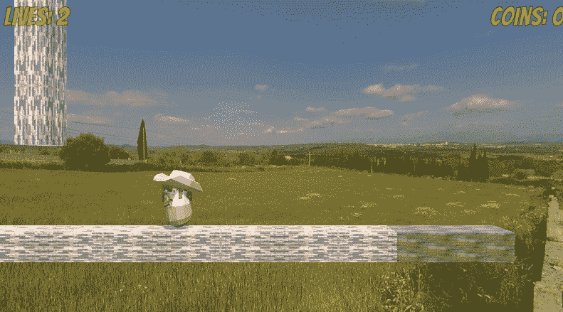
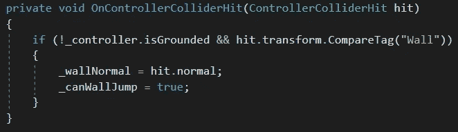
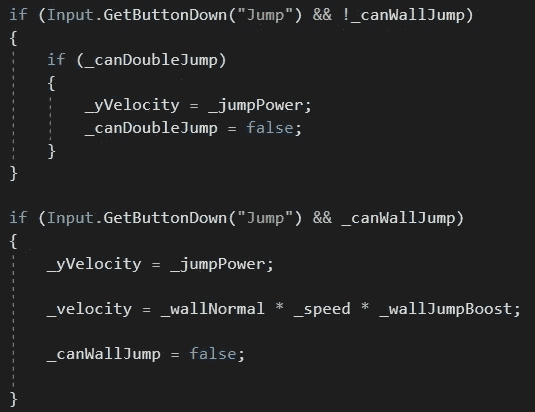

# 团结跳墙

> 原文：<https://medium.com/nerd-for-tech/wall-jumping-in-unity-371c9eb8d015?source=collection_archive---------25----------------------->

目标:允许我们的玩家进行跳墙。

跑酷！

为了实现跳墙，我们必须给我们的墙贴上这样的标签。现在，当我们的玩家*没有*接地*并且*撞到一面墙时，我们将存储撞击点的*法线*——垂直于撞击表面的向量。向这个向量的方向移动会把我们推离墙壁。我们还会将 *_canWallJump* 标记为 *true* 。

如果我们*不*接地，我们将到达*更新*方法的这一部分。如果玩家按下*跳跃*按钮*和*我们*不能*翻墙，如果可以的话我们会做一次双跳。

如果玩家按下*跳跃*按钮*和*我们*可以*墙壁跳跃，我们会像往常一样增加跳跃力，然后将我们的速度设置为撞击点的正常速度乘以一个特殊的 *_wallJumpBoost* 来增加一点“活力”然后我们将把我们的 *_canWallJump* 设置为 *false* ，这样我们就不能“双壁跳转”如果我们在接触地面之前碰到了另一面墙，这个过程会重新开始，给我们带来我们想要的效果！

