# 团结跳墙

> 原文：<https://medium.com/nerd-for-tech/wall-jumping-in-unity-393585161529?source=collection_archive---------15----------------------->

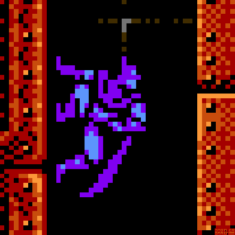

SUNSOFT 出版的《蝙蝠侠:NES》中的经典翻墙动作。

跳墙是平台游戏中一个受欢迎的游戏机制，有充分的理由，到达顶端是具有挑战性和令人满意的！我将快速向您展示如何使用工具内置的角色控制器在 Unity 中做到这一点。

为了进行跳墙，我们需要将规则限制在:

1.  必须离开地面
2.  计算曲面法线并垂直施加力。

听起来很难？别担心，Unity 会做所有的重活！

首先，我们将使用一个新工具，我们的玩家角色控制器！

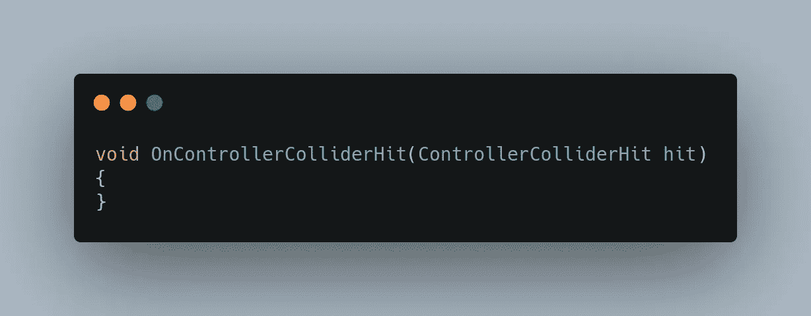

这看起来很像 OnColliderEnter 或 OnTriggerEnter，不是吗？我们可以利用它！

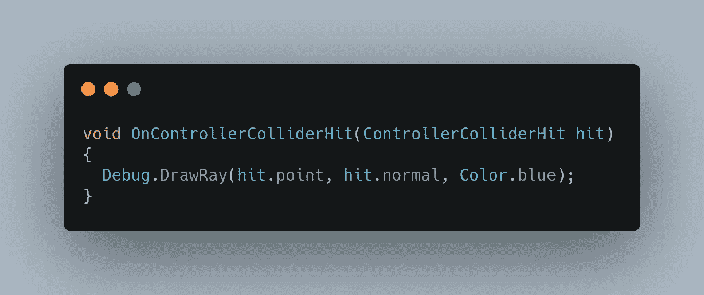

当我们运行这段代码时，我们将会看到一条蓝线，从玩家将会碰到的任何正常物体开始。

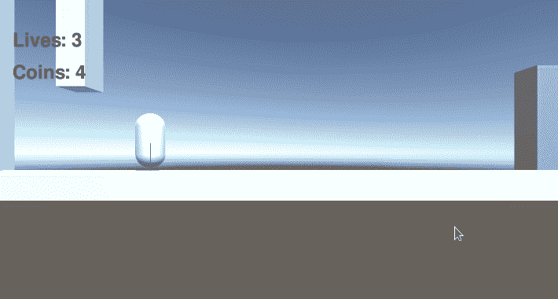

所以为了跳墙，我们需要知道我们在墙上。最简单的方法是选择任何垂直环境元素，并将它们标记为“墙”。

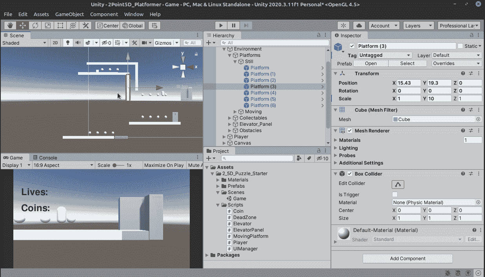

用“墙”标签标记垂直墙。

目前，我们的玩家可以在跳跃中改变主意。为了让跳墙成功，我们需要他在玩家落地的时候跳起来。

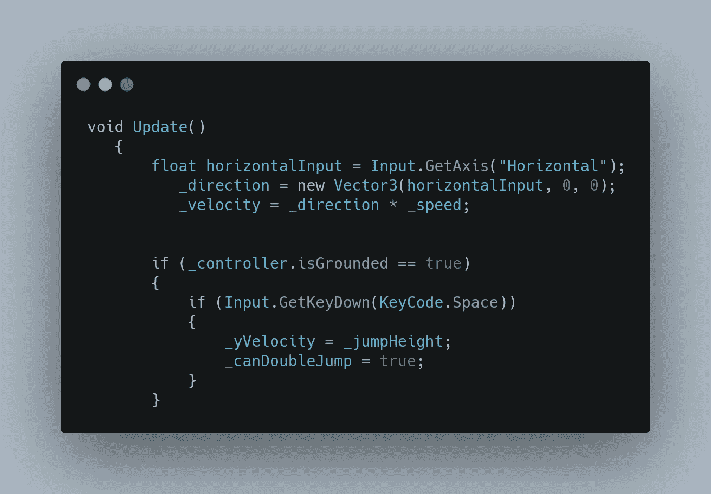

这个代码将允许玩家在跳中“改变主意”。

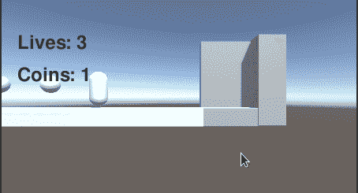

让我们把方向和速度变量移到。是一个圆形零件。

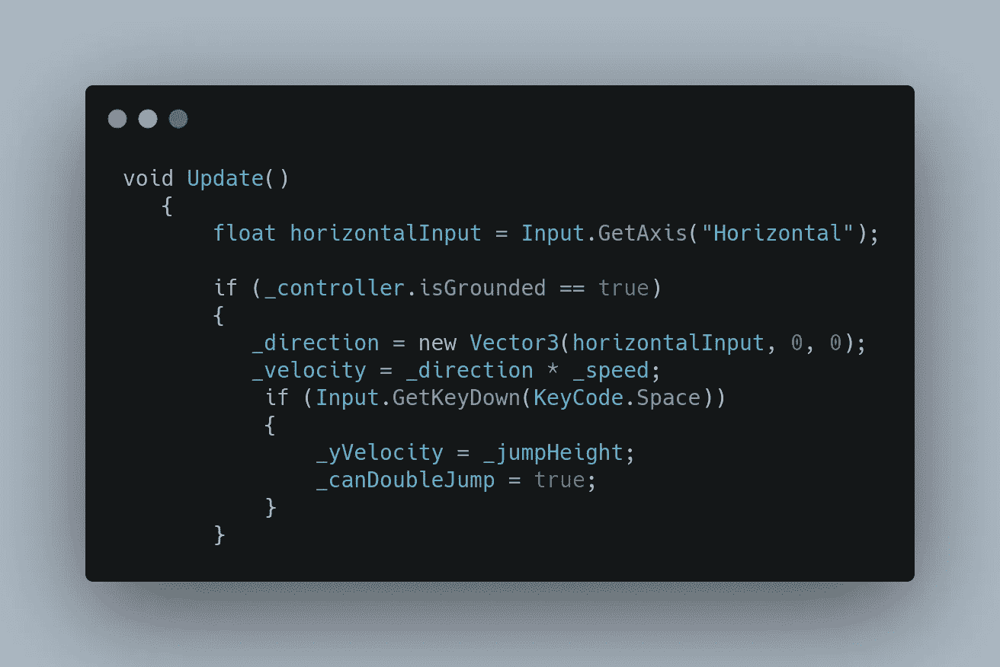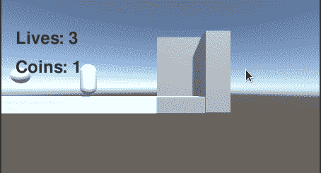

现在玩家一跳，就没有回头路了！这将有助于我们的墙跳。现在让我们开始编程！让我们创建一个 boolean 来获得 walljump 的许可。

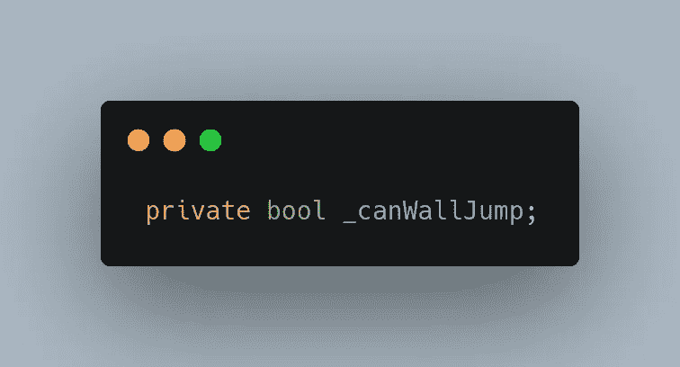

现在，在我们的控制器代码中，我们检查我们是否不在地面上，我们是否真的碰到了一堵墙，如果是这样，我们将把 _canWallJump 设置为 true。

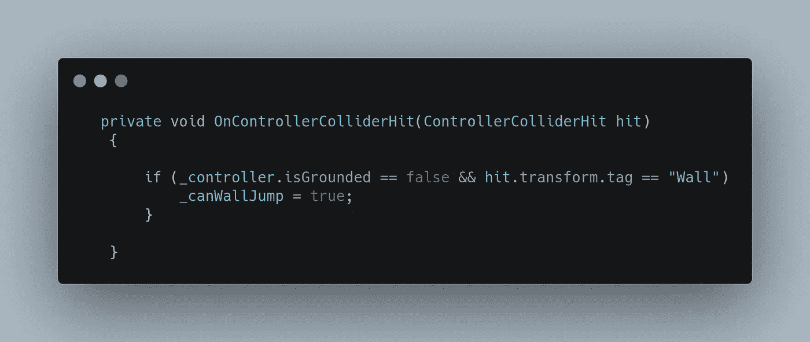

为了知道表面法线，我们需要一个名为 _wallNormal 的变量容器。

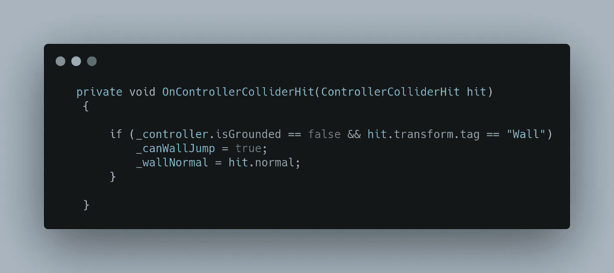

接下来我们需要思考的是，如果跳墙是真的，什么时候是假的？Update()下的第一个命令是一个很好的例子。

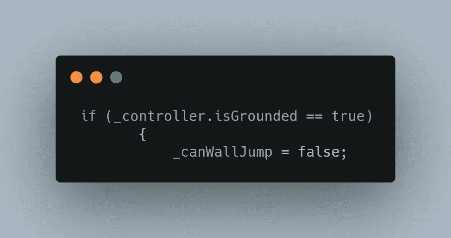

我们要跳墙的地方是 else 语句，玩家通常会第二次点击 jump。

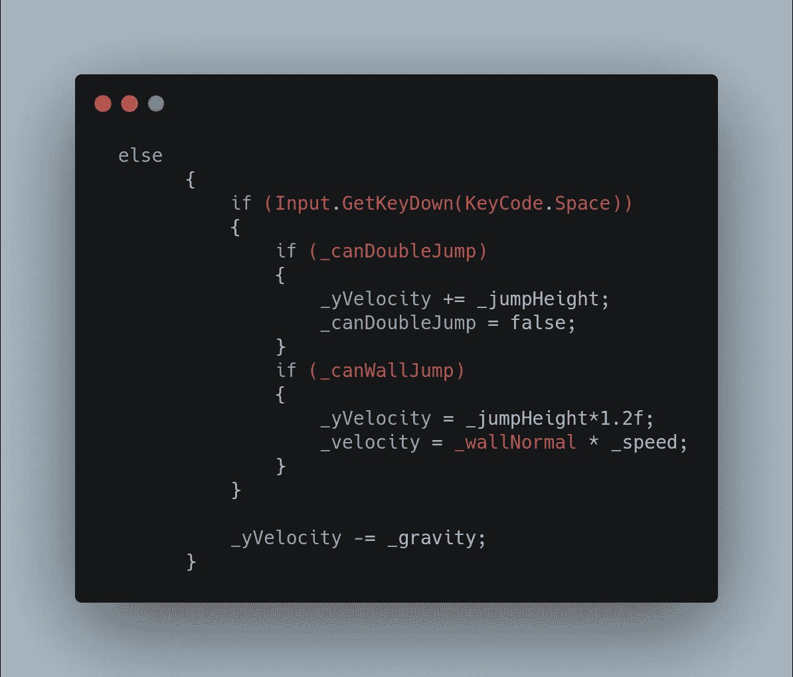

在这里，如果玩家可以两次跳跃，他们很好，但如果我们碰到一堵墙，并且 _canWallJump 为真，那么我们将 yVelocity 乘以 _jumpHeight。我还把它放大了 0.2 倍来增加一点活力。记住速度的公式是方向乘以速度，我们将把 _wallNormal(方向)乘以 _speed 放入 _velocity 变量中。

应该可以了！让我们看看它的实际效果吧！

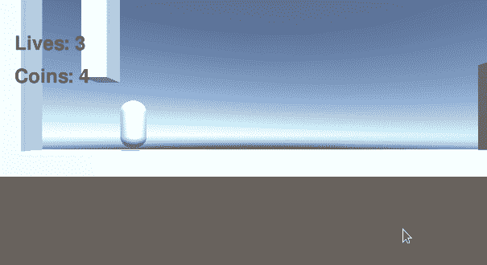

除了可见的小发明，我认为我们有一个功能性的墙跳！万岁。明天我们将学习推物体解谜。