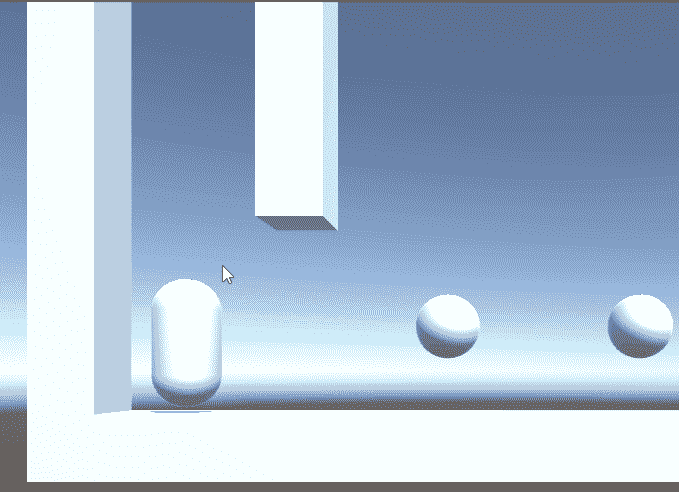

# 团结跳墙

> 原文：<https://medium.com/nerd-for-tech/wall-jumping-in-unity-670acd148768?source=collection_archive---------3----------------------->

//内置角色控制器组件

墙壁在跳动

在以前的一篇文章中，我谈到了给我们的播放器控制器添加一个双击。今天我们将探讨如何扩展我们的角色控制器脚本来升级我们的跳跃能力，使之包括跳墙。