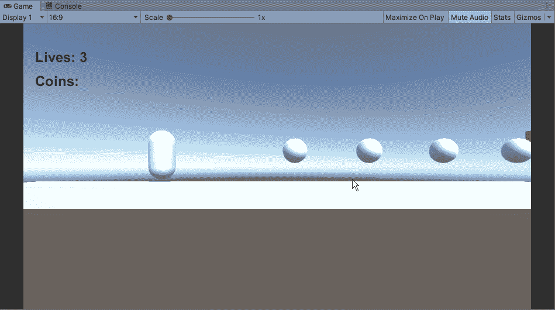
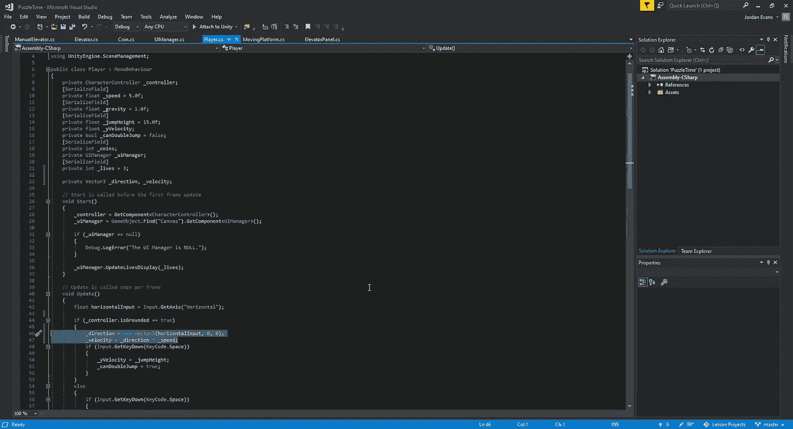
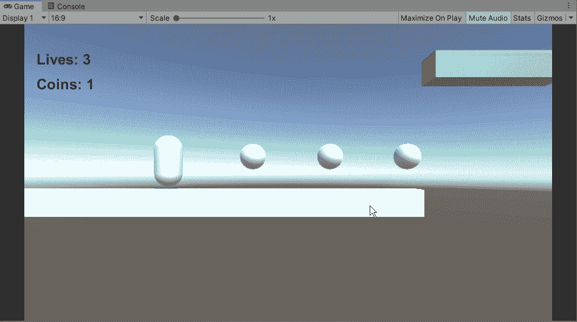
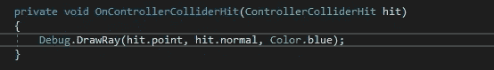
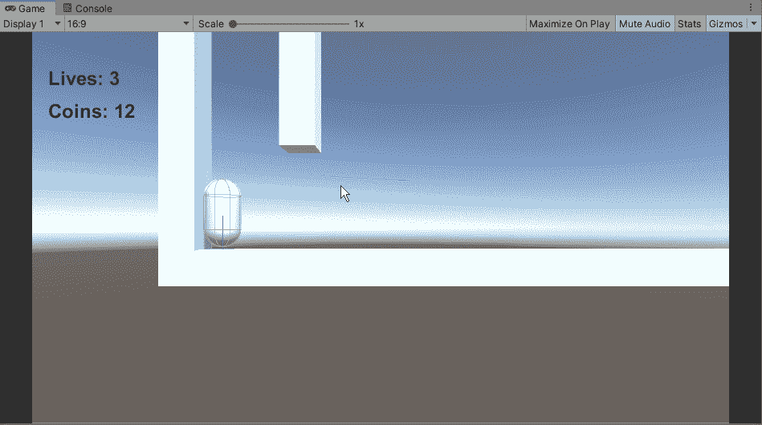
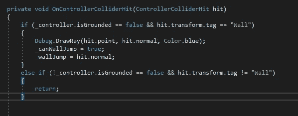
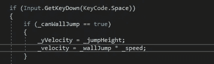

# 团结跳墙

> 原文：<https://medium.com/nerd-for-tech/wall-jumping-in-unity-9d02d20852c7?source=collection_archive---------9----------------------->

接下来，让我们来看看如何才能找出如何跳墙。首先我们需要调整的是玩家跳跃时的反应。就现在的情况而言，玩家可以在半空中自由地选择更多的方向，这在物理学上毫无意义:

为了调整这一点，我们将把我们的水平移动动作转移到 isGrounded 方法，这样当我们漂浮在空中时，它将阻止我们移动:

稍微调整一下我们的动作，我们可以看到它在游戏中的样子:

既然我们阻止了我们的玩家移动，让我们看看玩家如何与周围环境互动背后的一些逻辑:

通过这个快速调试，我们可以看到我们的玩家是如何接触表面的:

我们可以看到出现的蓝线，我们与地面和墙壁的接触点。从这里开始，我们必须想出一个方法，让我们的游戏垂直跳到另一边的墙上:

我们在这里做的是告诉 Unity 我们已经创建的新变量，wallJump，等于从墙壁接触的 hit.normal。至于返回方法，我们已经准备好了，这样 unity 就可以检查条件是否已经改变，从而激活 walljump。有了这个，我们可以进入我们的跳跃方法，并做一些补充，给这个方法穿墙跳跃:

我们在这里做的是使用新的 _wallJump 变量来把我们自己推下墙。从那里开始，当我们的玩家从墙上跳下时，我们需要给他们一点高度，这样他们就可以继续向上的轨迹:

现在我们已经有了跳墙，让我们看看如何与一个可移动的对象交互，这样我们就可以按下按钮继续前进。