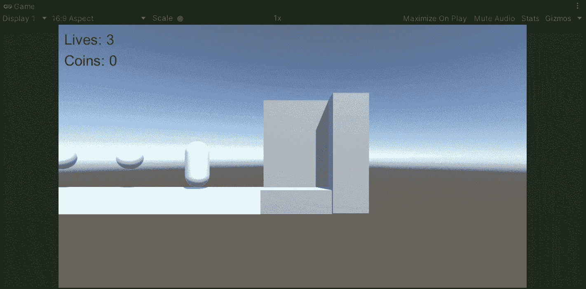
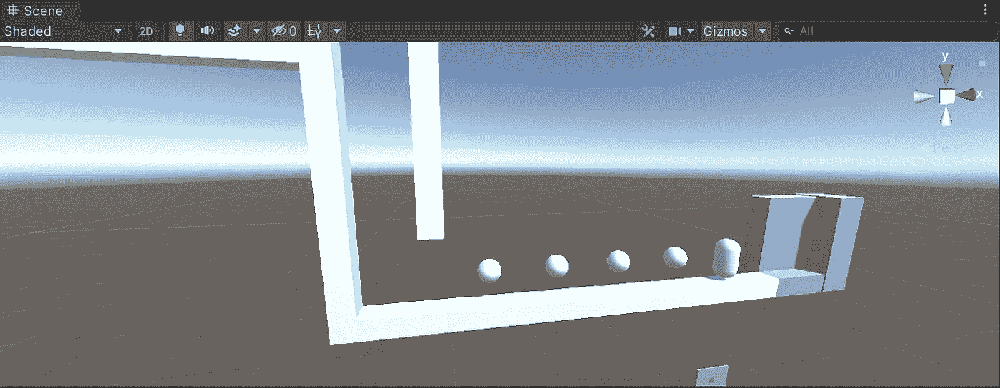
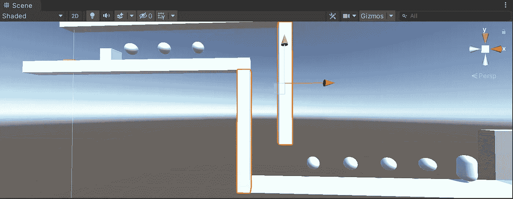
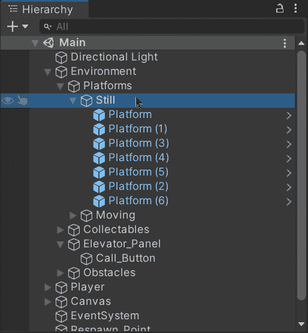
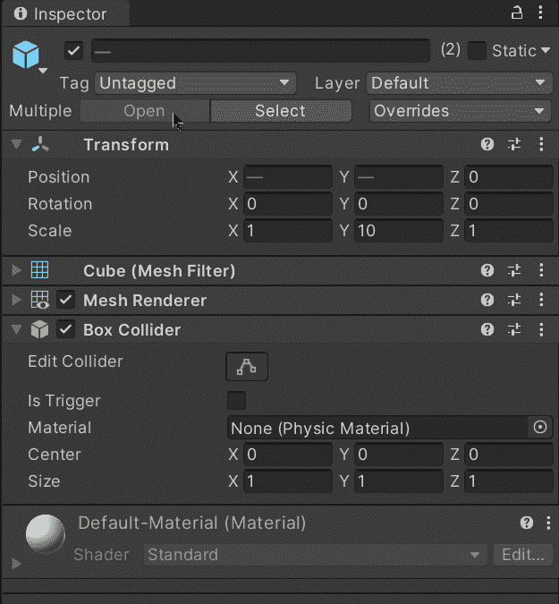
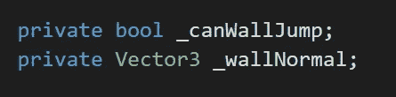
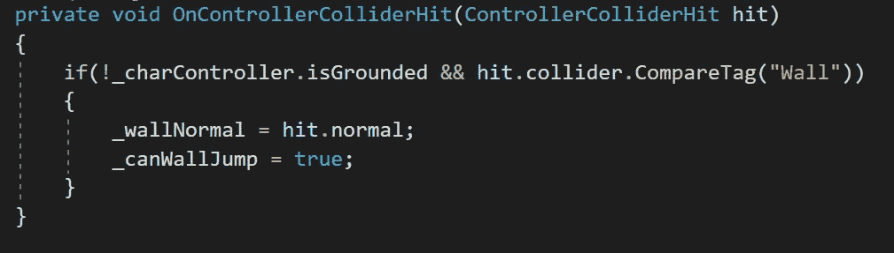
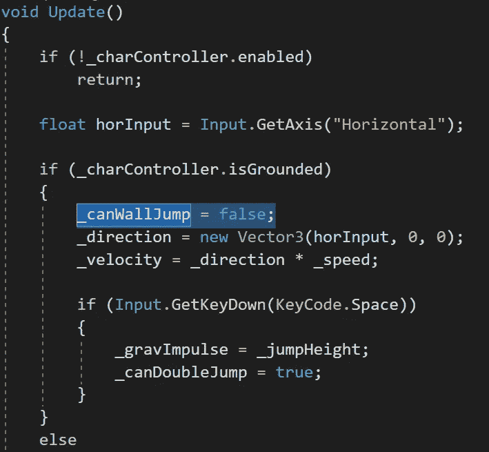
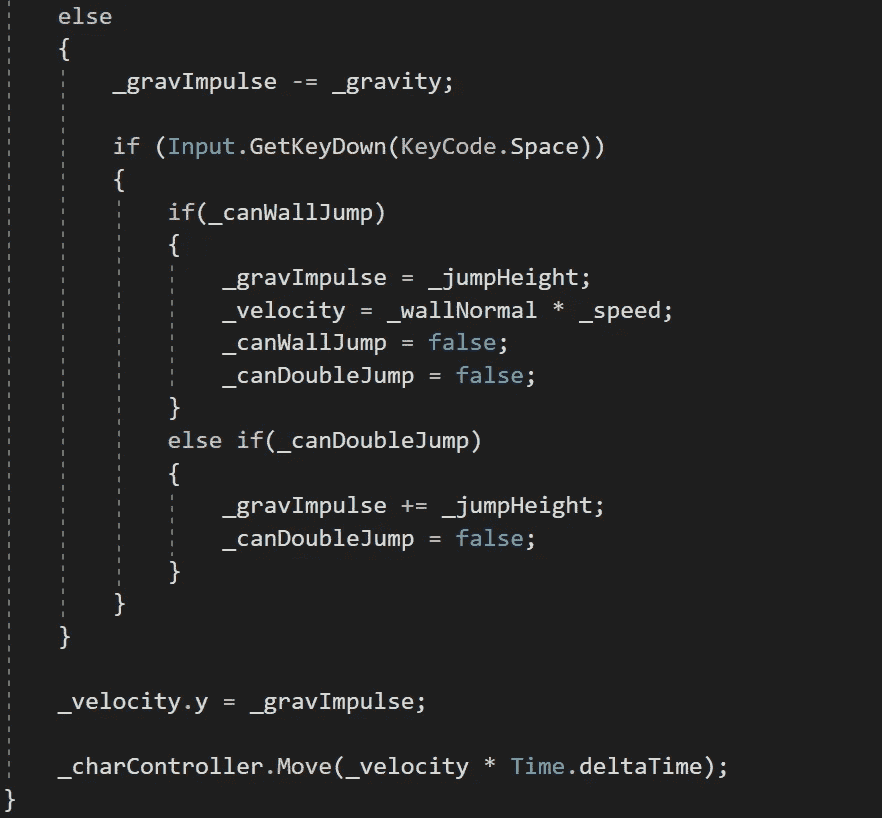
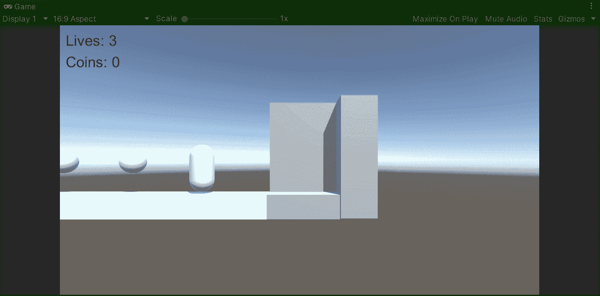

# 跳墙|团结

> 原文：<https://medium.com/nerd-for-tech/wall-jumping-unity-adba4072a64c?source=collection_archive---------0----------------------->

## 统一指南

## 关于如何在 Unity 中实现跳墙机制的快速指南

**目标**:实现一个跳墙机制，让玩家能够在 Unity 平台游戏中到达更高的地方。

在上一篇文章中，我介绍了[如何用 Unity](/nerd-for-tech/implementing-an-elevator-unity-2e2f5ad0514f) 实现电梯。现在，是时候实现一个跳墙机制，让玩家在我们的平台游戏中自己到达一个新的区域。

如果你还没有看到我创建了一个基于物理的角色控制器的旧帖子，那么我强烈建议你在实现跳墙机制之前检查一下:

 [## 创建基于物理的角色控制器| Unity

### 关于如何使用 Unity 创建基于物理的角色控制器的快速指南

medium.com](/nerd-for-tech/creating-a-physics-based-character-controller-unity-6c9f44473526)  [## 实现双跳|统一

### 关于如何为 Unity 玩家实现双跳的快速指南

medium.com](/nerd-for-tech/implementing-a-double-jump-unity-87a1e55e4e72) 

# 当前阶段

为了实现跳墙机制，我们将使用下一个阶段:

在舞台上，我们有几个经过修改的立方体来代表一个有墙的狭窄空间，玩家必须使用跳墙机制才能到达目的地:

# 实现跳墙机制

因此，为了实现跳墙机制，让我们从用 ***墙*** 标签标记各自的游戏对象开始:

这样，我们就能够识别玩家何时撞上了墙，从而实现双跳。

然后，让我们打开播放器脚本并创建一对新变量:

*   墙会跳吗

这个变量将存储一个布尔值，以表明玩家是否能够执行跳墙机制。

*   壁法线

该变量将存储 **Vector3** 值，该值将定义与玩家试图跳墙时接触的墙面法线相同的方向。

现在，让我们使用**OnControllerColliderHit**方法来检测玩家的角色控制器何时撞击另一个碰撞器。这样我们就能够识别玩家何时触墙，并采取相应的行动来启用跳墙机制。

因此，为了做到这一点，让我们检查角色控制器组件是否没有接触地面，以及碰撞中的碰撞体是否属于一面墙。如果是这种情况，让我们从击中中保存法线，并设置跳墙机制为启用:

如果您想了解更多关于**OnControllerColliderHit**方法的信息，您可以访问 Unity 文档:

 [## 单一行为。OnControllerColliderHit(控制器碰撞)

### 这个脚本使用 UnityEngine 推送角色接触的所有刚体；使用系统。收藏；公共课…

docs.unity3d.com](https://docs.unity3d.com/ScriptReference/MonoBehaviour.OnControllerColliderHit.html) 

现在，为了处理跳墙机制，让我们转到**更新**方法并执行下一步:

如果玩家接触地面→

*   计算影响玩家移动的方向和速度值。
*   通过将相应的 bool 值设置为 false 来禁用跳墙机制。

如果玩家没有接触地面→

*   如果按下空格键:
*   →如果启用了跳墙:
*   →→设置重力冲量为单跳的数值。
*   →→将速度设置为接近法线乘以玩家的速度。
*   →→禁用双人和跳墙力学。
*   →否则，如果启用，则执行双跳。

如果我们用 Unity 运行游戏，我们会看到玩家只能在与标记为 ***墙壁*** 的游戏对象发生碰撞时进行墙壁跳跃:

就这样，我们用 Unity 为我们的平台游戏实现了一个跳墙机制！:d .我会在下一篇文章中看到你，在那里我将展示如何用 Unity 推动物体来完成一个难题。

> *如果你想了解我更多，欢迎登陆*[***LinkedIn***](https://www.linkedin.com/in/fas444/)**或访问我的* [***网站***](http://fernandoalcasan.com/) *:D**