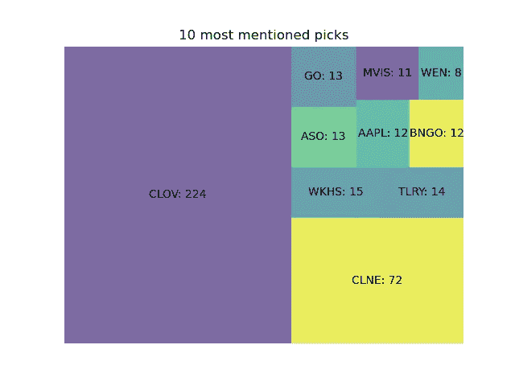
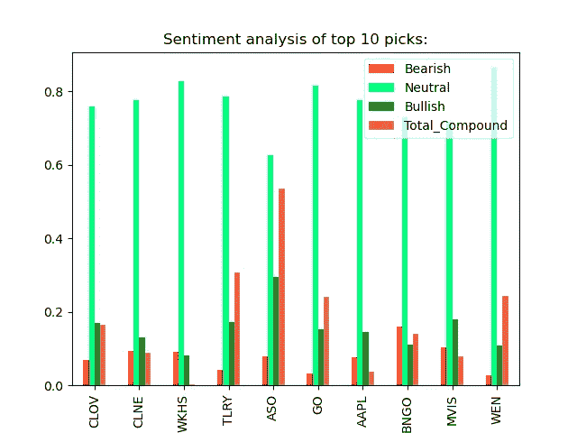
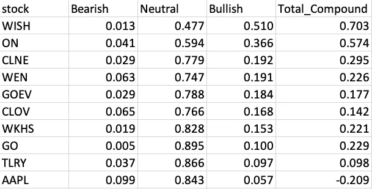

# 基于自然语言处理的股票价格情绪分析

> 原文：<https://medium.com/nerd-for-tech/wallstreetbets-sentiment-analysis-on-stock-prices-using-natural-language-processing-ed1e9e109a37?source=collection_archive---------1----------------------->

以下是一个正在进行的项目的第一部分，分析对著名的(或臭名昭著的？)subreddit，r/Wallstreetbets。这个价值百万美元的问题是:对 r/Wallstreetbets 的看涨或看跌情绪与股票基本面的结合能否用来建立一个预测特定股票价格方向的模型？

声明:这不是投资建议。如果你根据这篇文章或我写的任何东西做投资决定，你很可能会赔钱。请做好自己的研究，做出自己的投资决定。

**流程**

尽管这个项目仍处于研究阶段，但仍有许多有待发现。该项目将分为两个部分:

1.  收集数据和建立数据库。这包括为分析、可视化和建模准备而进行的清理优化。
2.  模型开发。这包括模型制定、特征工程、超参数调整、优化和测量性能。

数据 ETL 过程需要一些时间。以下是该过程的基本总结:

1.  生成当天 10 个最常提及的报价机，并分配情感类型和分数。例如:

图表鸣谢:EatTheBlocks YouTube 频道

图表鸣谢:EatTheBlocks YouTube 频道

1.  从 [TDAmeritrade 的开发者 API](https://developer.tdameritrade.com/apis) 中获取特定股票的价格和基本面信息
2.  在 100 天内每天运行这两个脚本
3.  通过 PostgreSQL 将每天的数据存储在个性化数据库中

生成大约 1，000 行数据后，我应该有足够的数据来开始分析股票价格的可预测性。当然，我将继续运行每日脚本以达到统计显著性(即:我们有足够的数据来确信我们的观察不是随机产生的)。

**数据**

任何有自尊的数据科学家都必须花时间来解释数据，它是如何产生的，以及为什么选择这个特定的数据。subreddit 生成的数据是纯文本:与关于股票和股票市场的对话相关的单词。我使用 Reddit API，它非常简单，但是非常健壮。价格和基本信息由 TDAmeritrade API 生成。

该理论认为，股票价格是其运营/财务表现和公众情绪的函数。一个企业的基本面(净利润率、市盈率、杠杆、市值等。)对价格有直接影响，而公众舆论(例如，华尔街的技术交易者和投机者)对价格有间接影响。目标是根据这些重要因素准确预测股票的走向。

**什么是情感分析？**

情感分析是自然语言处理中的一种机器学习方法，它通过分析单词的含义、上下文和频率来量化文本中的情感。例如，在 0 到 10 的范围内，0 表示最消极，10 表示最积极，以下句子的得分如下:

1.  " AAPL 绝对值得购买！"→ 10
2.  “我对 AAPL 持中立态度”→大约 5
3.  " AAPL 是个十足的卖家！"→ 0

Python 库自然语言工具包对分析文本非常有帮助。它包含一个预先确定的单词及其各自情感的词典。以下是算法如何处理 r/Wallstreetbets 上的每个评论的逻辑工作流:

1.  评论是通过 Reddit API 检索的
2.  删除所有标点符号
3.  删除停用词(例如:I、in、or 等。)，这不会增加上下文或含义的价值
4.  在词典中扫描每个评论中的单词，计算每个评论中正面和负面的数量。为每个评论计算每个类别的比例。positive _ score = # positive words/total # words，Neutral_score 以此类推
5.  将分数归一化，提取股票进行隔离。现在我们有了每只股票的极性分数

今天的情绪得分示例

简单吧？不对！

量化上下文和含义可能很棘手。例如，观察句子“我爱 AAPL”和“我爱 AAPL ”?嗯，对！”。这两句话用词相似，但感悟完全不同。第一个是正面/看涨，第二个是讽刺和负面。此外，第三种可能的变体“我喜欢吃 AAPLs”的上下文与前两种完全不同(相信我，像这样的奇怪评论是存在的)。对我们人类来说，这非常容易理解。但是机器学习模型怎么知道区别呢？

这就是复合分数发挥作用的地方。当看跌、中性和看涨的分数接近时，就会出现模糊性(例如:三个分数都接近 0.3，情绪是看跌、看涨还是中性？不清楚)。Total_Compound 分数是介于-1 和 1 之间的标准化加权综合分数。如果你只需要一个维度来预测情绪，这是最有用的指标。采用单一指标可能有助于消除看涨、看跌和中性情绪得分之间存在小差异的模糊性。

**财务数据**

股票价格信息和基本数据是通过 TDAmeritrade API 检索的。我在之前一篇名为[用 ARIMA 模型](/analytics-vidhya/forecasting-googles-stock-price-with-arima-modeling-1148cd8496c8)预测谷歌股价的文章中讨论了这个过程。我收集了很多信息，但这里有几个例子:

1.  收盘价格
2.  净价格变化
3.  价格波动
4.  52 周高/低
5.  市盈率
6.  市值
7.  纯利润率
8.  速动/流动比率
9.  还有更多…

每只股票大约有 90 列数据。想法是，使用价格数据结合基本面数据和情绪得分，我们可以开发一些模型来预测股票的方向。敬请关注…

**未来工作**

在几个星期内，我将有一个不断增长的数据库和适当的基础设施。我将更新这个项目的趋势和有趣的发现。看到我找到的东西超级兴奋。具体的代码示例可以查看我的 Github Repo。但是我会在下面列出代码片段。

**代号**

建立程序参数:在美国，市值> 1 亿美元、价格> 3 美元的每只股票。您可以根据自己的喜好更改这些参数。*黑名单*变量是为了不将 tickers 与‘YOLO’等常用词混淆。 *new_words* 帮助程序创建更准确的情感分数

主程序

要一步一步地了解这段代码，请查看作者# EatTheBlocks YouTube 频道

生成价格和基本数据

绘制情绪趋势

在 PostgreSQL 中运行以下脚本将设置数据库和表模式。为了节省时间，我将所有列都设置为文本。另外，数据类型可以很容易地在 Python 中转换。

请随时查看我的 [Github 回购](https://github.com/mdominguez2010)，如果您有任何问题/意见，请发电子邮件至[md.ghsd@gmail.com](mailto: md.ghsd@gmail.com)给我。

**开源致谢**

1.  非常感谢# EatTheBlocks YouTube 频道，他的 Python 代码对使用 Reddit API 有很大帮助。[点击这里](https://github.com/jklepatch/eattheblocks/tree/master/screencast/290-wallstreetbets-sentiment-analysis)查看他的 Github 回购。
2.  [自然语言工具包:Vader](https://www.nltk.org/_modules/nltk/sentiment/vader.html) 情感评分
3.  [维德情绪 Github 回购](https://github.com/cjhutto/vaderSentiment)
4.  安迪·金关于情感分析的 Ted 演讲
5.  [方形化](https://github.com/laserson/squarify)用于可视化提及
6.  Python 的开源库:Pandas 和 Matplotlib