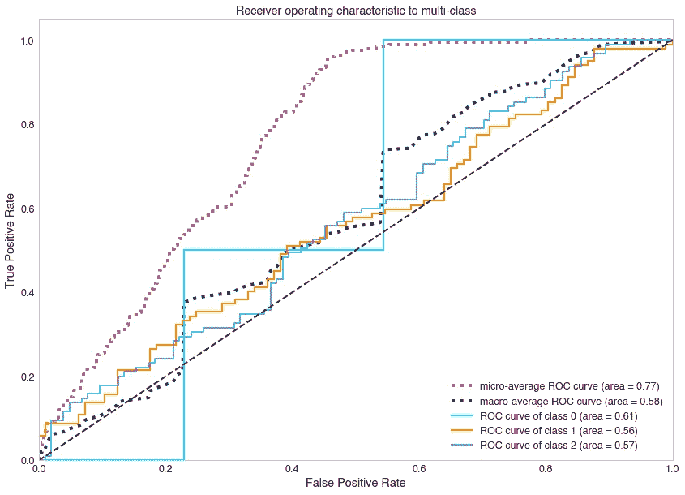
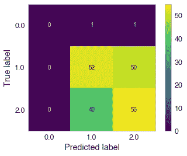
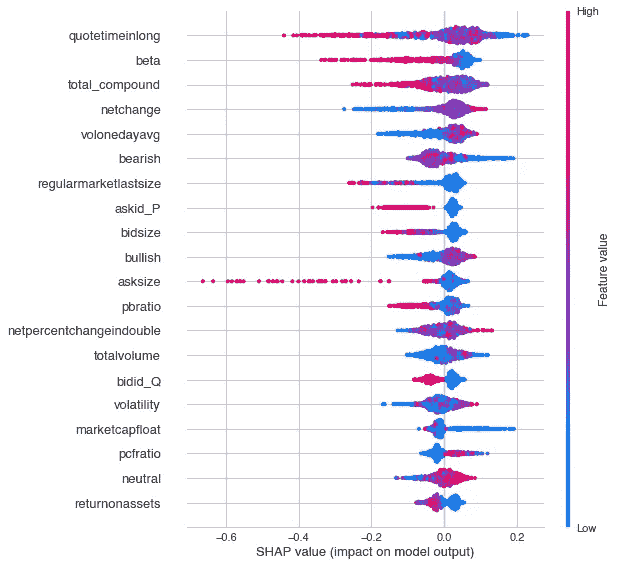
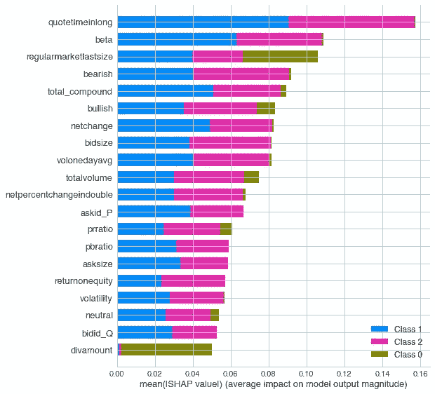
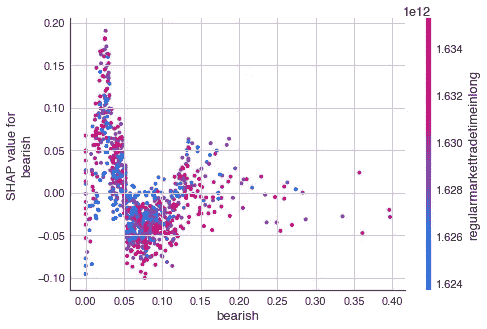
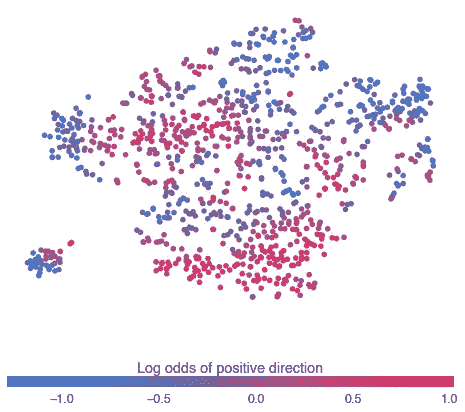

# 华尔街投资者情绪分析第二部分:预测股票市场

> 原文：<https://medium.com/nerd-for-tech/wallstreetbets-sentiment-analysis-part-2-predicting-the-stock-market-895422c172a7?source=collection_archive---------1----------------------->

以前，在华尔街的情绪分析上，我从情绪提取和数据库开发开始了这个项目。关于这个项目是如何建设的详细分析，见本系列的[第一部分。以下是关于数据库生态系统的详细信息:](/nerd-for-tech/wallstreetbets-sentiment-analysis-on-stock-prices-using-natural-language-processing-ed1e9e109a37)

1.  数据:来自 4 个子主题的情绪得分，关于公司业绩的信息(净收益利润率，债务股本比，等等。)，以及价格变动(调整后收盘)。
2.  数据被编译成 CSV 文件，然后存储在 PostgreSQL 数据库中。我发现从 CSV 文件进行研究更容易。存储在 PostgreSQL 中提供了额外的安全层，以防 CSV 文件发生问题。

我最终得到了大约 1300 行数据。我们试图预测价格的走向，而不是价格本身。所以这是一个编码如下的多分类问题(0 =不运动，1 =向上运动，2 =向下运动)。

在深入讨论实际模型之前，我们需要讨论所有重要的数据清理和处理。

**清理数据**

清理数据对于建模过程至关重要。虽然我会将代码发布到清理过程中，但是更详细的解释可以在 [GitHub Repo](https://github.com/mdominguez2010/wsb-sentiment-analysis) 中找到。我采取了以下步骤来去除数据中的不一致和噪音:

1.  删除重复的列。如果我们更深入地研究包含股息信息的列，我们会发现有重复的列。

2.正在删除标识符。这些列中的信息是标识符、重复项或空项。

3.删除具有 1 个唯一值的列，这可能不会增加可预测性。

**使用 Alpha Vantage API 引入价格数据**

现在我们有了过去 6 个月的情绪数据，让我们同步每天的情绪数据，以填补任何时间缺口。这样，我们可以计算 1 天、2 天和 5 天的回报。

代码有点多，所以我就把它放在这里。不复杂，但是很多。如果您对代码有任何疑问，请联系我。

这一次，我将使用的 API 是 Alpha Vantage，与上一篇文章不同。这里有一个链接指向 Alpha Vantage 的 API 文档。

**结果**

不再赘述，让我们看看结果:

*多级模型的 ROC-AUC*。类别 1 和类别 2 的 ROC 曲线下的区域(分别为橙色和蓝色实线)是这里的焦点。他们各自的面积是 0.56 和 0.57。将图表对角分成两半的黑色虚线的曲线下面积为 0.50(即:随机选择方向的概率)。总体而言，该模型预测类别 1(股价上涨)的正确率为 56%，预测类别 2(股价下跌)的正确率为 57%。这些结果充其量是平庸的，但这是一个开始。目标是逐步提高准确率到 70%-80%左右。

*精度&召回分数* : 0.57。原始分数为 0.54，但在对少数类(0)进行过采样后，分数略有增加。

*混乱矩阵*。如你所见，超过一半的预测被正确分类。

1.0 =股价上涨，2.0 =股价下跌

**模型解释**

最终模型是正则化梯度推进模型。XGBoost 是一个很棒的开源软件库，用于指导这些模型。

检查特征并考虑为什么模型预测它所预测的东西是很重要的。每个特征对最终预测和平均预测之间的差异有多大贡献？回答这些问题可以让我们在单个特征层面上充分理解模型。为了实现这一点，我们将使用 SHAP 价值观来解释我们的模型。

简而言之，SHAP (Shapley 附加解释)值有助于回答这个问题:“当从模型中移除特征 *j* 时，预测 *i* 如何变化？”要深入分析什么是 SHAP 值以及如何计算它们，请查看 Khuyen Tran 的文章 [SHAP:用 Python 解释任何机器学习模型](https://towardsdatascience.com/shap-explain-any-machine-learning-model-in-python-24207127cad7)。

*SHAP 总结剧情*。看来“报价时间”对股价是上涨、下跌还是保持中性有最大的影响。此图显示了主要要素及其对正类数据集的影响范围(价格变动增加)。以下是我们可以从这幅图中获得的一些见解:

*   随着“quotetimeinlong”的增加，股票不太可能增加
*   随着“贝塔”的增加，股票不太可能增加
*   随着“看跌”情绪的增加，该股不太可能上涨

*平均重要性条形图*。这将获取整个数据集的 SHAP 值的平均值，并将其绘制为一个简单的条形图。

*SHAP 依赖图*说明了相互作用的影响。下图显示了整个数据集的看跌特征。似乎与“regularmmarkettradingtimeinlong”有一些交互。在看跌值约为 0.025 时，这两个特征的 SHAP 值似乎存在垂直离差。这是由两个特征之间的相互作用驱动的。

看跌情绪变量的 SHAP 值

**结论**

嗯，我的模型只是比预测掷硬币稍微准确一点。好消息是，还有改进的空间！

**未来工作**

我将利用这些信息改进未来的模型。我进行了最小的特征工程，我相信这会带来巨大的不同。此外，我想提高情感分数的鲁棒性。我需要更多的情绪来源来捕捉市场上更多的信息。

使用 PCA 成分分析记录正向概率。你可以看到某些区域的红色浓度较高，而其他区域的蓝色浓度较高。对于未来的模型来说，这可能是有趣的。

**问题/评论？**

如果您有任何问题、意见或只是想聊聊 ML、股票市场或一般的数据科学，请随时联系我。

1.  电子邮件:md.ghsd@gmail.com
2.  [推特](https://twitter.com/mdcruz2010)
3.  [领英](https://www.linkedin.com/in/marcosdominguez2018/)