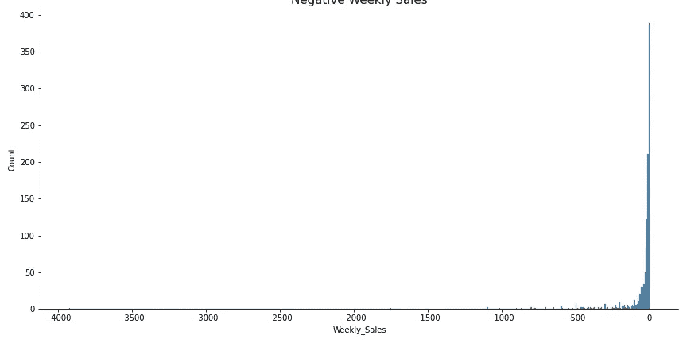
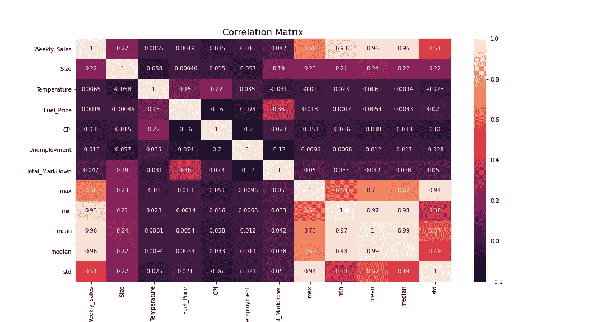
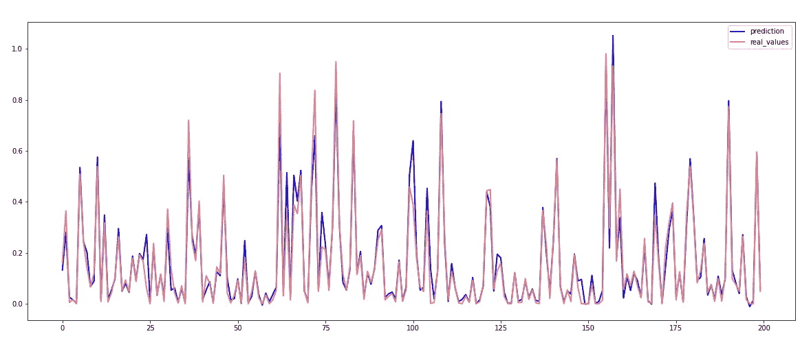
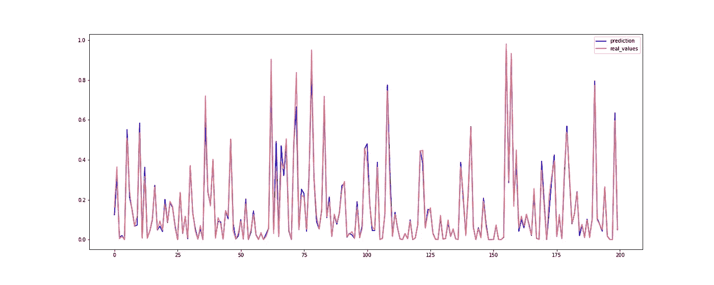
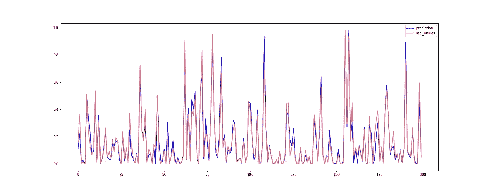
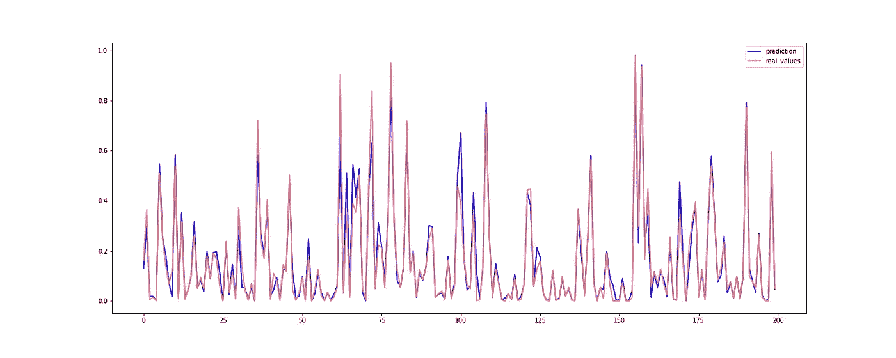
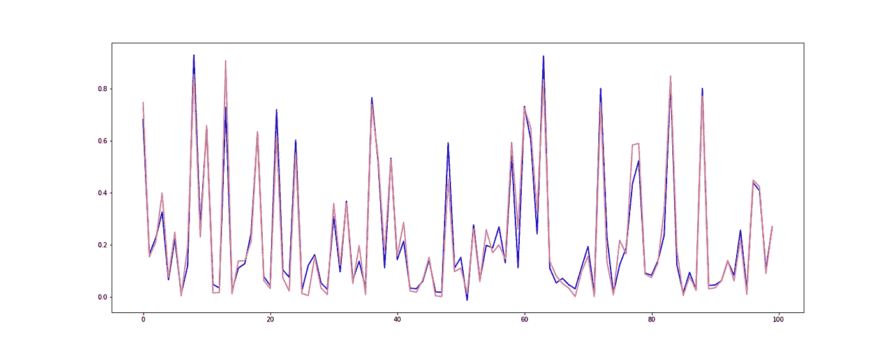
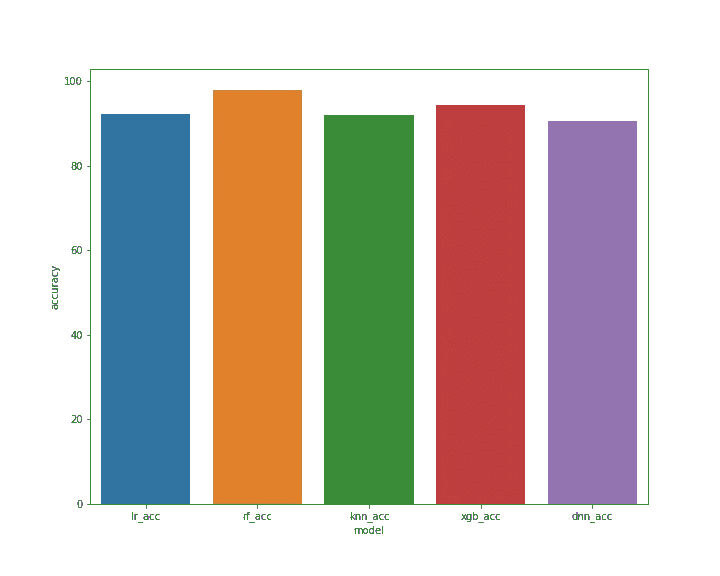

# 使用深度学习的沃尔玛销售时间序列预测

> 原文：<https://medium.com/nerd-for-tech/walmart-sales-time-series-forecasting-using-deep-learning-e7a5d47c448b?source=collection_archive---------5----------------------->

本博客涵盖了不同的机器学习和深度学习模型，用于使用不同的库(如 TensorFlow、Keras、pandas、sklearn 等)预测时间序列销售数据。你可以在我的 [**GitHub**](https://github.com/abhinav-bhardwaj/Walmart-Sales-Time-Series-Forecasting-Using-Machine-Learning) **上找到完整的代码、模型、情节、数据集。**

沃尔玛是一家美国跨国批发零售公司。2014 年，沃尔玛发布了这个数据集，作为一个招聘挑战，嗯，我对此很晚了，但我充满希望:)

让我们回顾一下时间序列的简短定义—

# 时间序列

时间序列是在均匀的时间间隔内记录的一系列数据点。例如:天气记录、销售记录、经济、股票市场数据、降雨量数据等等。只看例子，你也能理解分析时间序列和预测数据的重要性。

# 资料组

这个数据集可以在沃尔玛自己的 Kaggle 账户上找到。**沃尔玛招聘-门店销售预测**可从[https://www . ka ggle . com/c/Walmart-Recruiting-Store-Sales-Forecasting](https://www.kaggle.com/c/walmart-recruiting-store-sales-forecasting)下载。

完整的数据集分为三个部分:-

1.  **train.csv** —这是历史培训数据，涵盖 2010 年 2 月 5 日至 2012 年 11 月 1 日。
2.  **features.csv** —该文件包含与给定日期的商店、部门和区域活动相关的附加数据。
3.  **stores.csv** —该文件包含 45 家商店的匿名信息，指明了商店的类型和规模。

# **机器学习模型**

*   线性回归模型
*   随机森林回归模型
*   k 近邻回归模型
*   XGBoost 回归模型
*   Keras 深度神经网络回归模型

# **数据预处理**

首先，我们必须处理数据集中缺失的值。

## **处理缺失值**

*   要素数据集的 **CPI** 、**失业**有 **585** 空值。
*   **降价 1** 有 **4158** 空值。
*   **降价 2** 有 **5269** 空值。
*   **降价 3** 有 **4577** 空值。
*   **降价 4** 有 **4726** 空值。
*   **降价 5** 有 **4140** 空值。

使用 **fillna()** 和各列的**中值**填充所有缺失值。

## 合并数据集

*   主数据集与商店数据集合并。
*   结果数据集与要素数据集合并。
*   总计 **421570** **数据行**和 **15 个属性**。
*   **日期列**转换成 DateTime 数据类型。
*   将**日期属性**设置为组合数据集的索引。

## 拆分日期列

*   使用**日期**列，又创建了三列**年**、**月**、**周**

## 每周总销售额

*   **周销售额**的**中值**、**均值**、**最大值**、**最小值**、**标准值**被计算并创建为不同的列。

## 异常值检测和其他异常

*   降价汇总成 **Total_MarkDown。**
*   使用 **z 分数**移除异常值。
*   剔除异常值后， **375438 个数据行，**和 **20 列**。
*   负周销售额被删除。
*   移除后， **374247 数据行**和 **20 列**。

负周销售额和零周销售额图

## 一次热编码

*   **Store** 、 **Dept** 、 **Type** 列使用 get_dummies()方法进行一次热编码。
*   一次热编码后，列数变为 **145。**

## 数据标准化

*   使用**最小最大缩放器**在**范围 0 到 1** 内对数值列**进行归一化。**

## 递归特征消除

*   **随机森林回归器**用于计算特征等级和重要性，带有 **23 个估计器。**
*   选择保留的功能-

**指**、**中值**、**周**、**气温**、**最高**、 **CPI** 、**燃料 _ 价格**、**最低**、**标准**、**失业**、**月**、**总 _ 降价**、**部门 _1**

*   特征消除后的属性数量— **24**

表示为热图的关联矩阵

# 分割数据集

*   数据集分为 **80%用于训练**和 **20%用于测试。**
*   目标特写— **每周 _ 销售**

# 线性回归模型

*   线性回归器精度— **92.28%**
*   平均绝对误差— **0.030057**
*   均方误差— **0.0034851**
*   均方根误差— **0.059**
*   R2 — **0.9228**
*   `LinearRegression(copy_X=True, fit_intercept=True, n_jobs=None, normalize=False)`

实际与预测

# 随机森林回归模型

*   随机森林回归方程精度— **97.889%**
*   平均绝对误差— **0.015522**
*   均方差— **0.000953**
*   均方根误差— **0.03087**
*   R2 — **0.9788**
*   n _ 估算者— **100**
*   `RandomForestRegressor(bootstrap=True, ccp_alpha=0.0, criterion='mse', max_depth=None, max_features='auto', max_leaf_nodes=None, max_samples=None, min_impurity_decrease=0.0, min_impurity_split=None, min_samples_leaf=1, min_samples_split=2, min_weight_fraction_leaf=0.0, n_estimators=100, n_jobs=None, oob_score=False, random_state=None, verbose=0, warm_start=False)`

实际与预测

# k 近邻回归模型

*   KNeigbhbors 回归器准确度— **91.9726%**
*   平均绝对误差— **0.0331221**
*   均方误差— **0.0036242**
*   均方根误差— **0.060202**
*   R2 — **0.91992**
*   邻居— **1**
*   `KNeighborsRegressor(algorithm='auto', leaf_size=30, metric='minkowski', metric_params=None, n_jobs=None, n_neighbors=1, p=2, weights='uniform')`

实际与预测

# XGBoost 回归模型

*   XGBoost 回归器精度— **94.21152%**
*   平均绝对误差— **0.0267718**
*   均方误差— **0.0026134**
*   均方根误差— **0.05112**
*   R2 — **0.94211**
*   学习率— **0.1**
*   n _ 估算者— **100**
*   `XGBRegressor(base_score=0.5, booster='gbtree', colsample_bylevel=1, colsample_bynode=1, colsample_bytree=1, gamma=0, importance_type='gain', learning_rate=0.1, max_delta_step=0, max_depth=3, min_child_weight=1, missing=None, n_estimators=100, n_jobs=1, nthread=None, objective='reg:linear', random_state=0, reg_alpha=0, reg_lambda=1, scale_pos_weight=1, seed=None, silent=None, subsample=1, verbosity=1)`

实际与预测

# 定制深度学习 Keras 回归器

*   深度神经网络精度— **90.50328%**
*   平均绝对误差— **0.033255**
*   均方差**T21—**0.003867****
*   均方根平方误差— **0.06218**
*   R2 — **0.9144106**
*   在深度神经网络上使用 Keras 包装器构建
*   内核初始化器— **普通**
*   优化器— **亚当**
*   **输入层**带 **23 尺寸**和 **64 输出尺寸**和**激活功能为 relu**
*   **1 个隐藏层**与 **32 个节点**
*   **输出层**与 **1 节点**
*   批量大小— **5000**
*   纪元— **100**

实际与预测

# 比较模型

*   线性回归精度— **92.280797**
*   随机森林回归器精度— **97.889071**
*   k 近邻回归变量精度— **91.972603**
*   XGBoost 精度— **94.211523**
*   DNN 准确度— **90.503287**

## 在我的 GitHub 帐户上获取完整的代码、模型和绘图

 [## abhinav-bhardwaj/Walmart-销售-时间序列-预测-使用机器学习

github.com](https://github.com/abhinav-bhardwaj/Walmart-Sales-Time-Series-Forecasting-Using-Machine-Learning) 

# 引文

*   沃尔玛招聘-门店销售预测[https://www . ka ggle . com/c/Walmart-招聘-门店销售预测](https://www.kaggle.com/c/walmart-recruiting-store-sales-forecasting)