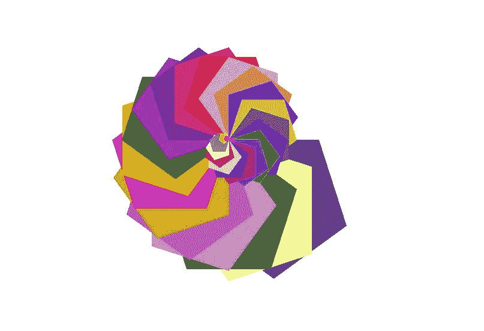

# 想用 Python 画图案吗？

> 原文：<https://medium.com/nerd-for-tech/wanna-draw-a-pattern-using-python-486bbab12cc8?source=collection_archive---------24----------------------->


在 [Unsplash](https://unsplash.com?utm_source=medium&utm_medium=referral) 上由 [Neven Krcmarek](https://unsplash.com/@nevenkrcmarek?utm_source=medium&utm_medium=referral) 拍摄的照片

各位编码员好，

有没有想过用 python 画一个图案或形状？

根据速度、颜色、形状和角度来画一个图案会很有趣。

让我们来看看。

1.  为此我将使用 turtle library，并推荐你也使用它。首先，你需要安装海龟库。

```
pip install turtle
```

现在让我们看一下代码。

> 完整的代码可以在我的 GitHub 库查看— [。](https://github.com/varchasa/Patterns-Turtle)

我会带上—

*   “n”是恒星的数量，
*   “I”是迭代器
*   “x”是外角
*   “角度”是旋转的角度。

# 程序步骤

*   导入库并设置五边形的速度。

```
from turtle import *
import random

speed(speed ='fastest')
```

*   现在选择随机整数来生成 RGB 值。

```
a = random.randint(0, 255)
b = random.randint(0, 255)
c = random.randint(0, 255)
```

*   设置轮廓和填充颜色。

```
pencolor(a, b, c)
fillcolor(a, b, c)
```

*   开始填满五角大楼。

```
begin_fill()
```

*   每个五边形循环一次。

```
for i in range(5):
    forward(5* n-5 *i)
    right(x)
```

*   颜色填充完成。

```
end_fill()
```

*   为下一个五角大楼旋转。

```
right(angle)
```

*   现在设置参数。

```
n = 30  
x = 72  
angle = 18 
```

> 要获得完整代码和更多模式，请查看我的 GitHub 知识库。

运行完整的程序后，您将得到这个模式作为输出。



> 发现我的文章有用，支持我，给个掌声👏。

谢谢，