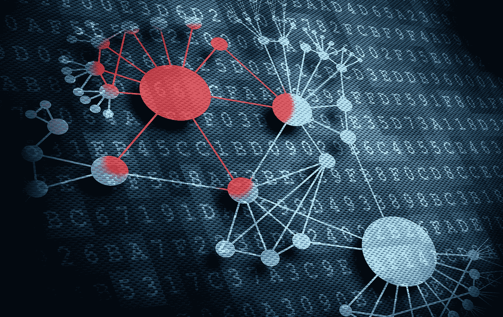

# 想遏制勒索病毒海啸？构建更好的软件

> 原文：<https://medium.com/nerd-for-tech/want-to-curb-the-ransomware-tsunami-build-better-software-fdb4a52049ed?source=collection_archive---------13----------------------->

软件可以成就你，也可以毁灭你。

它让微软、谷歌、亚马逊、苹果、脸书推特和许多其他公司的创始人成为亿万富翁科技巨头。

但是，当软件存在可利用的缺陷时，它可以让网络犯罪分子变得富有，同时摧毁从个人到公共和私人组织到现代社会运转所需的关键基础设施的受害者。

本月“攻破你”类别中的证据之一是 7 月 2 日俄罗斯黑客组织 REvil 针对 Kaseya Ltd .的勒索软件攻击，Kaseya ltd .是一家总部位于迈阿密的公司，为其他企业提供软件来帮助管理他们的网络。

管理网络的一部分是提供软件更新，这意味着提高安全性。但是如果攻击者可以用恶意代码破坏这些更新，结果就完全相反了。

卡塞亚就是这样。REvil 黑客能够利用该公司的虚拟系统/服务器管理员(VSA)软件中几个以前未知的(“零日”)漏洞，该公司正在修复其中一个漏洞。但黑客先攻击了他们，这意味着当 Kaseya 发出更新时，它正在向其客户分发勒索软件。

这些客户中有许多是托管服务提供商(MSP ),他们随后将损坏的更新分发给他们的客户。因此有了“供应链攻击”这个术语或者你可以称之为“涓滴”勒索软件，但它远不止涓滴。黑客们不必攻击成百上千个目标，只需攻破一个，然后让受害者将它分发给成千上万的其他人。

“攻击者能够利用 VSA 产品中的零日漏洞来绕过认证并运行任意命令执行，”该公司[在一份事件概述中表示。“这使得攻击者能够利用标准的 VSA 产品功能将勒索软件部署到终端。”](https://helpdesk.kaseya.com/hc/en-gb/articles/4403584098961)

或者像 Sophos Naked Security 博客[的 Paul Ducklin 所说的](https://nakedsecurity.sophos.com/2021/07/05/kaseya-ransomware-attackers-say-pay-70-million-and-well-set-everyone-free/?utm_source=feedburner&utm_medium=feed&utm_campaign=Feed%3A+nakedsecurity+%28Naked+Security+-+Sophos%29)，“你攻击的不是数以千计或数百万计的电脑，而是为所有这些电脑提供软件的公司，或者更糟的是——就像在这个案例中——你攻击的是为所有这些电脑提供软件的公司提供软件的公司。”

**不仅仅是损害，还有牵连**

损失的程度可能暂时还不知道。Kaseya 上周发布了一系列滚动更新,周二称其 60 名客户已经“直接受到此次攻击的影响”。虽然这些客户中有许多为其他多家公司提供 IT 服务，但我们知道，到目前为止，总共只有不到 1，500 家下游企业受到影响。”

但截至上周，REvil 声称约有 100 万台电脑受到影响。它为一次性支付解锁所有受影响系统的通用解密密钥提供了 7000 万美元的“批量折扣”，然后几天后[据报道](https://twitter.com/jackhcable/status/1411906687968161792)将折扣降至 5000 万美元。

上周晚些时候传来了一条可能的好消息，当时[传呼电脑](https://www.bleepingcomputer.com/news/security/revil-victims-are-refusing-to-pay-after-flawed-kaseya-ransomware-attack/)报告称，很少有受害者同意支付赎金，因为“应对此次袭击负责的 REvil 分支机构选择放弃标准策略和程序。”

尽管攻击规模巨大，影响了至少 1500 家企业，但该在线杂志称，“备份没有被删除，数据也没有被盗，因此勒索软件团伙对受害者几乎没有影响力”。

但是 Corellium 的首席运营官 Matt Tait 在 Lawfare 上的一篇[帖子中写道，这次攻击的影响比直接的损害更加不祥。](https://www.lawfareblog.com/kaseya-ransomware-attack-really-big-deal)

总的来说，他写道，“自动软件部署，尤其是在软件更新的背景下，是一件好事。但在这里，这一功能被彻底颠覆了[……]颠覆软件交付机制，成为安装勒索软件的一种手段。”

这使得这次攻击“可能是今年最重要的网络安全事件。比一月份中国对交易所的攻击还要严重。比[殖民管道](https://armerding.medium.com/colonial-pipeline-yet-another-cybersecurity-wake-up-call-e9d03498e34d)勒索病毒事件更大。是的，比去年的网络安全管理软件产品入侵事件更重要，”他补充道。

**大量警告**

但是无论损害和它的含义是什么，软件行业中没有人可以说他们没有被警告。

Christopher Krebs，美国国土安全部网络安全和基础设施安全局前局长，[5 月初](https://homeland.house.gov/imo/media/doc/2021-05-05-CIPI-HRG-Testimony-Krebs.pdf)在众议院国土安全小组委员会面前作证说,“勒索软件已经发展成为一个价值数十亿美元的全球骗局，威胁到对帮助我们共同度过疫情至关重要的服务的提供。简而言之，我们正处于一个不同类型的全球疫情的尖端，其驱动力是贪婪、可避免的脆弱数字生态系统和不断扩大的犯罪企业。”

当然，Krebs 并不孤单。两年多前，在亚特兰大、巴尔的摩和佛罗里达州的其他几个城市遭到破坏性的勒索病毒攻击后，我甚至警告过即将到来的[【勒索病毒海啸】](https://www.forbes.com/sites/taylorarmerding/2019/07/03/get-ready-for-a-ransomware-tsunami/#10c4b7f12de9)。

但克雷布斯证词中的关键词是“可避免的”。像这样的攻击不应该这么容易成功。对罪犯来说没必要这么好，对我们其他人来说没必要这么坏。因为有办法让网络攻击者更加难以下手:开发更好、更安全的软件，并保持更新。

是的，还有各种各样的其他建议来保护您的组织免受勒索软件的攻击:保留您的数据备份并保持它们与您的网络断开连接，保持您的程序和操作系统最新，培训员工不要落入钓鱼电子邮件或点击来自未知发件人的链接，使用 VPN 虚拟专用网络。

但它始于软件安全。一些未透露姓名的 Kaseya [前员工告诉彭博](https://www.bloomberg.com/news/articles/2021-07-10/kaseya-failed-to-address-security-before-hack-ex-employees-say)记者，从 2017 年到 2020 年，他们曾警告公司高管产品中的“严重”安全缺陷，包括使用旧代码、加密不佳以及软件补丁的日常故障。

Synopsys 软件完整性小组的高级安全策略师 Jonathan Knudsen 说，唯一重要的问题是，“如何防止这样的问题？勒索软件如此成功的原因是很少有组织做好了适当的准备。在选择、部署和操作软件时，他们通常只关注功能。他们努力让软件做他们想让它做的事情，但安全性往往被忽视或忽略。”

“软件是各种组织的强大工具，但它必须在安全和弹性的框架内进行选择、部署、操作和维护，”他说。

**工具可用**

这样做的方法现在已经很成熟了。它从[架构风险分析](https://www.synopsys.com/software-integrity/software-security-services/software-architecture-design/risk-analysis.html?cmp=pr-sig&utm_medium=referral)开始，以发现并修复设计缺陷，从[威胁建模](https://www.synopsys.com/software-integrity/software-security-services/software-architecture-design/threat-modeling.html?cmp=pr-sig&utm_medium=referral)开始，以识别恶意黑客可能攻击的方式。

接下来，[静态](https://www.synopsys.com/software-integrity/security-testing/static-analysis-sast.html?cmp=pr-sig&utm_medium=referral)、[动态](https://www.synopsys.com/software-integrity/application-security-testing-services/dynamic-analysis-dast.html?cmp=pr-sig&utm_medium=referral)和[交互](https://www.synopsys.com/software-integrity/security-testing/interactive-application-security-testing.html?cmp=pr-sig&utm_medium=referral)应用安全测试的自动化工具将在代码编写、运行和用户交互时检查代码缺陷。

由于大多数现代软件组件都是开源的，[软件组合分析](https://www.synopsys.com/software-integrity/security-testing/software-composition-analysis.html?cmp=pr-sig&utm_medium=referral)帮助开发者发现并修复这些组件中已知的漏洞和潜在的许可冲突。

并且在开发的最后，[渗透测试](https://www.synopsys.com/software-integrity/application-security-testing-services/penetration-testing.html?cmp=pr-sig&utm_medium=referral)可以模仿黑客，在软件产品部署之前发现仍然存在的弱点。如果一个组织不具备独自完成所有这些工作的专业知识或能力，MSP 可以提供帮助。

但是当然，正如 Kaseya 攻击所表明的，MSP 有更大的义务来构建和保持他们的软件安全。否则，它们可能会成为恶意软件感染的媒介，包括勒索软件。

最后，在这种情况下，阻止 REvil 攻击为时已晚。这意味着现在的焦点是是否支付赎金，以及如果支付，如何支付。

联邦调查局的官方建议是:不要付钱。有充分的理由。付钱只会引发更多的攻击。正如一些受害者从痛苦的经历中学到的，付钱并不能保证什么。毕竟，他们面对的是犯罪分子，在越来越多的情况下，他们不仅加密数据，还窃取数据。也就是说，如果受害者不再次付款，他们可能会威胁将此事公之于众。

但在很多情况下，数据丢失会威胁到企业的生存。生存的唯一方法就是付钱。

**扰乱加密货币？**

一些专家认为，遏制勒索软件猖獗扩张和破坏的唯一方法是扰乱保护攻击者匿名的加密货币系统。加州大学伯克利分校的研究员兼讲师尼古拉斯·韦弗(Nicholas Weaver)在 Lawfare 的一篇[帖子中写道，“我们没有勒索软件的问题，我们有比特币的问题。”](https://www.lawfareblog.com/ransomware-problem-bitcoin-problem)

“如果政府对比特币和其他加密货币采取有意义的行动，他们应该能够扰乱这种新的勒索病毒瘟疫，然后根除它，”他写道。

事实上，这看起来至少是可能的，因为在 Colonial Pipeline 支付了报道的 440 万美元后，[司法部宣布](https://arstechnica.com/gadgets/2021/06/us-seizes-2-3-million-colonial-pipeline-paid-to-ransomware-attackers/)已经通过追踪和扣押黑客使用的比特币钱包追回了其中的 230 万美元。

但是新思软件完整性小组的首席科学家萨米·米格斯说，适应性极强的网络罪犯很容易适应。“所有的攻击者都会转移他们的钱包，”他说。“如果封锁通常能收回 50%的钱，那么攻击者的要价就会翻倍。如果所有的数字钱包、数字货币和/或区块链都存在允许随机拦截的安全缺陷，那么修复这些缺陷只会成为一场军备竞赛。”

努森也不相信禁止是一个解决办法。“我可以自信地说，支付禁令是一个红鲱鱼，”他说。

“当我们谈论付款的时候，已经太晚了。罪犯总会找到一种被抓住的风险较低的方法来获取报酬。相反，我们应该谈论良好的安全卫生。”

米格斯表示同意。“更好的办法是激励组织明确地、持续地做主机、网络、云等的安全基础工作。以证明你成为机会目标的可能性很小，”他说。

“只要把你的安全门槛提高到你必须成为有意被攻破的目标，就能立即阻止大多数勒索软件攻击——以及许多其他数据泄露——得逞。”