# 战争！！

> 原文：<https://medium.com/nerd-for-tech/war-996e03efbf86?source=collection_archive---------12----------------------->

在这次大会的训练营中，我意识到在工作和个人生活之间找到平衡是非常具有挑战性的。我认为我很幸运，因为我被这种激情所驱动，但我再也不能数那些不眠之夜了。

我总是可以依靠音乐来放松，在作业间隙，我会反复听鲍勃·马利的歌。一定是那些歌里的东西。

然后我想这将是一个好主意，看看人们听这些歌曲时的感受，并使用一点点自然语言处理，只是为了保持肌肉运动！

我将使用 Youtube API 删除鲍勃·马利视频中的 100 条最相关的评论，并将其转换为数据帧以供进一步分析。我选择了雷鬼巨星的战争/不再有麻烦现场视频:

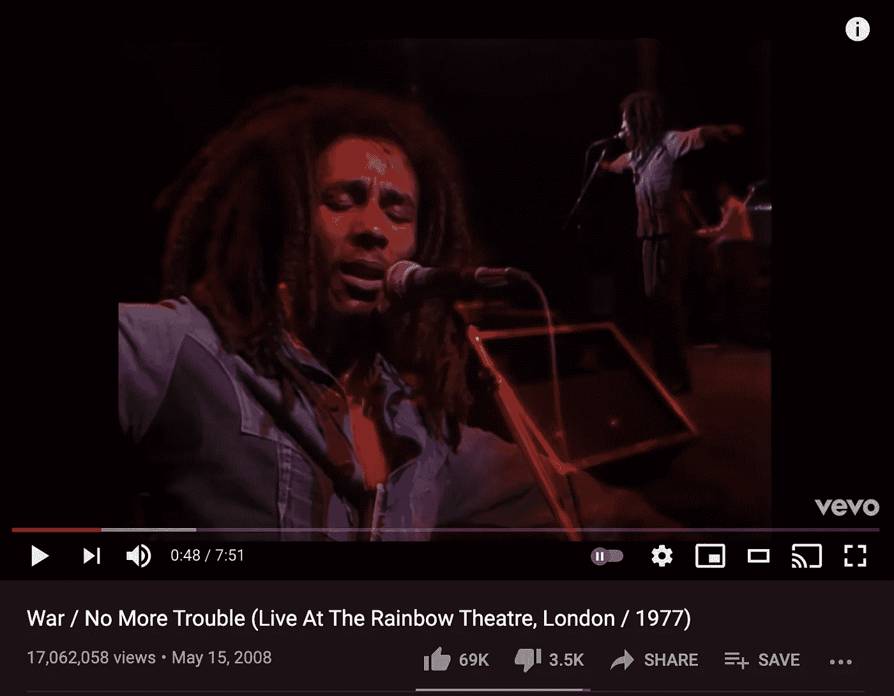

幸运的是，由于 Youtube API 上的大量文档，处理过程非常简单。我可以使用以下代码获得评论:

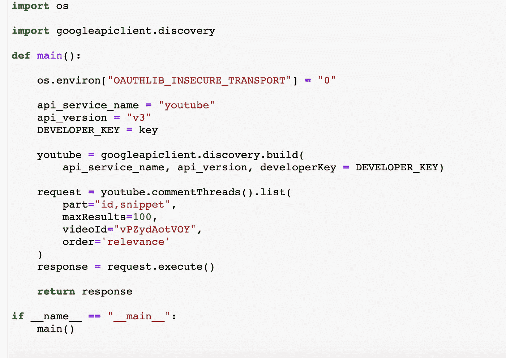

这里的参数是部分，它指定了我想要获得的实际信息、等于 100 的 maxResults、我必须输入唯一视频 Id 的 videoId 以及基于相关性的顺序。我还必须指定我必须获得一个键，这对于我到目前为止使用的大多数 API 来说是非常常见的。在这里，我可以无耻地将你重定向到我以前的帖子，以获得更多关于 API 和 Web 报废的详细信息！

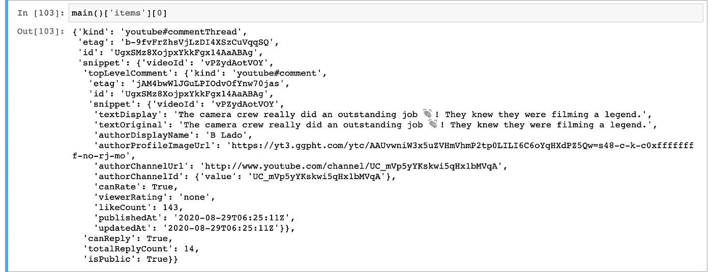

这里你可以看到我以 JSON 格式返回的 100 个值中的一个。我们只对这里的评论感兴趣，所以我们需要一点索引！

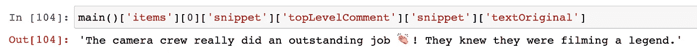

此时，我可以将 100 条评论添加到一个空列表中，并将其转换为数据框:

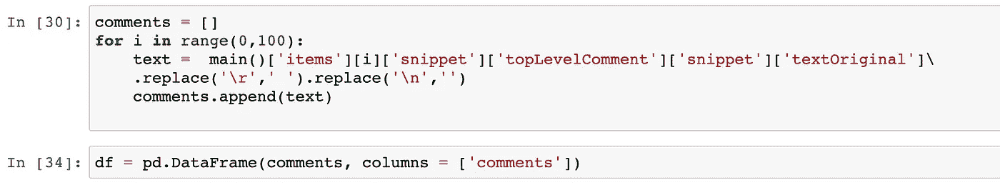

现在我有了一个数据框，里面有这个视频的 100 条最相关的评论。你认为我下一步会做什么？清洁和更多的清洁！这是 80%的工作…

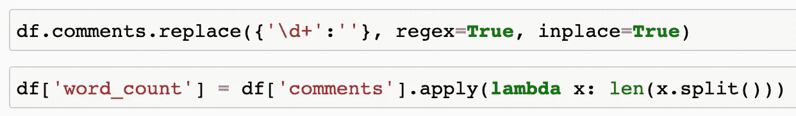

我做的第一件事就是把评论里的数字全部去掉。原因是我稍后将对这些评论进行“计数矢量化”，或者换句话说，将评论按词拆分，以分析它们的频率。在第二行中，我创建了一个 word_count 列，表示每个评论的字数。等等！我还没给你看数据框呢！

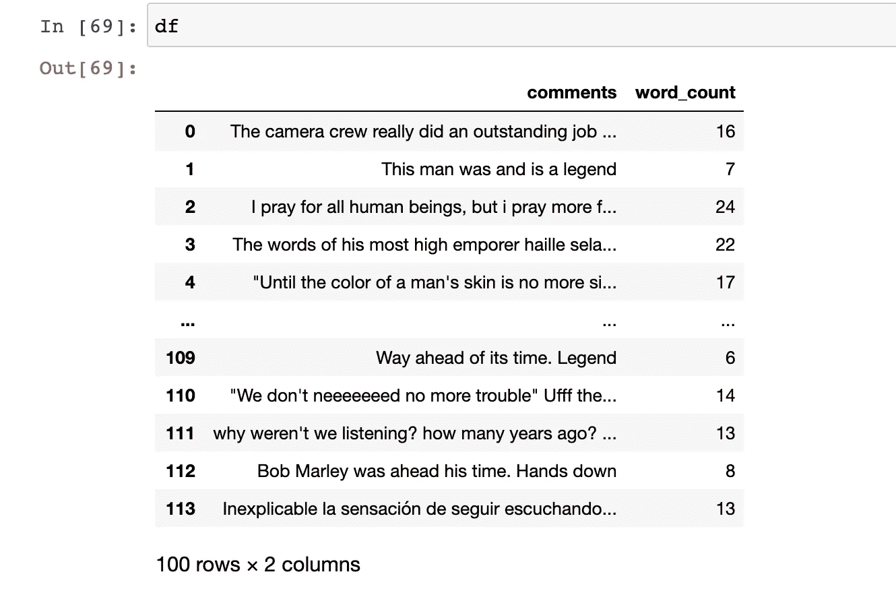

他当然是个传奇！如果我想知道人们是否和我一样，我应该就此打住，但是让我们再深入一点！让我们来看看 word_count 列的一些统计数据:

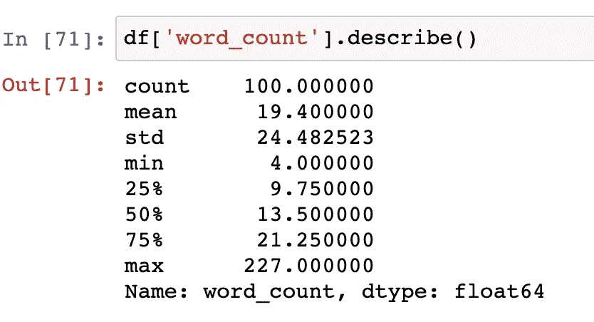

平均评论有 19 个字，最长的有 227 个字。那很长。我们来观察一下 word_count 分布:

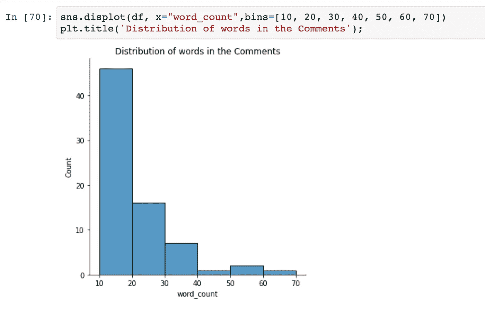

我的意思是你不必说很多；我完全同意。

下一步是初始化计数矢量器，使其适合数据框的注释列，并使用变换结果创建另一个数据框，将单词分配给列名:

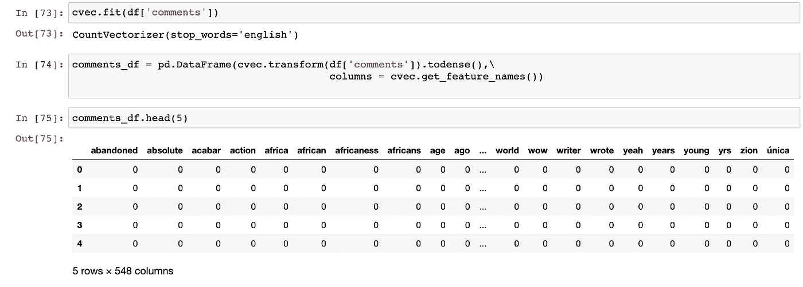

每一列都像是虚拟变量，指示一个单词是否出现在注释中。现在我已经做到了，我可以观察 20 个最常见的单词:

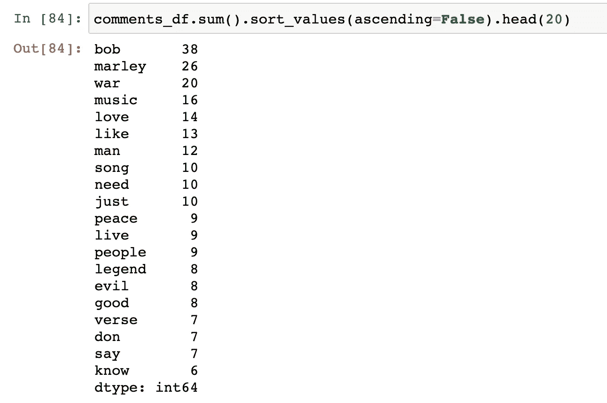

Bob 和 Marley 是非常明显的，我可以做的一件事是包含更多的停用词来删除这些值，但是为了时间的缘故，以及我用完红牛的事实，让我们忽略这个名称。现在我们有了音乐、爱情、喜欢、男人、歌曲或者像和平、传说、邪恶和善良这样的强烈词汇。我大概知道它的意思，但是让我们观察一些关于单词 war 的评论:

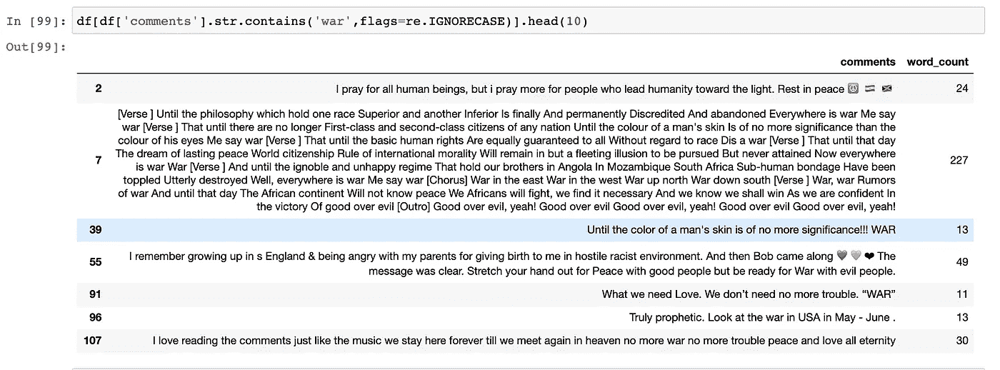

哇，有人甚至写了歌词，我喜欢！我可以引用一个评论:“直到一个人的肤色不再重要！！！战争”。我认为观察这一点是有意义的，因为它主要是一个负面的词，但在这里它被用于社会正义。邪恶呢？

啊…又是歌词！当然它包含每一个字。它还在这里提供了一个上下文:“善胜恶”。

总的来说，评论大多是正面的:

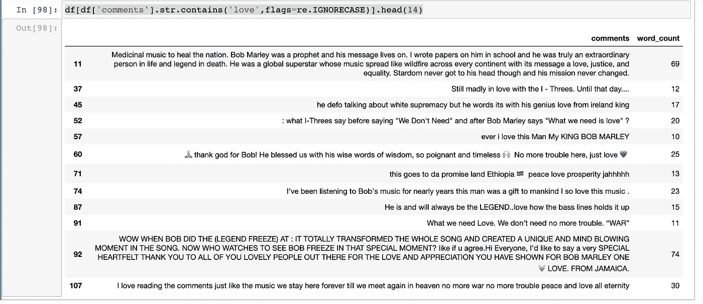

“疗救民族的医药音乐”。这是我听这首音乐时的感受，所以我的无效假设没有被拒绝！那些歌里有些东西。我想我需要添加每一个评论，并为这篇文章写第二部分，加上一些可视化和情感分析。

现在，“停下火车:我要走了”