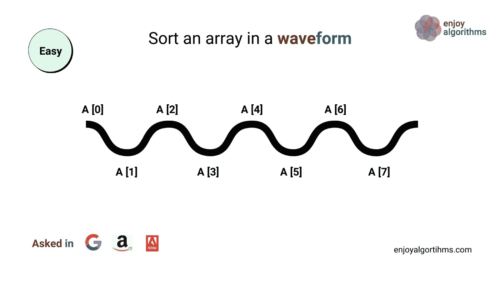
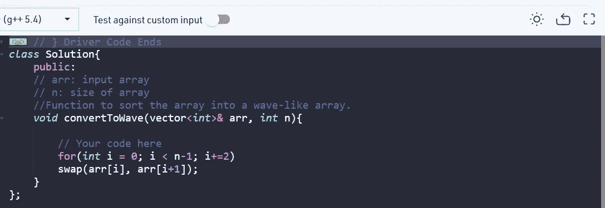

# 波阵

> 原文：<https://medium.com/nerd-for-tech/wave-array-8500bac01e13?source=collection_archive---------7----------------------->

**问题**:给定一个不同整数的排序数组 **arr[]** 。将数组排序为波浪式数组并返回。
换句话说，按照 arr[1]>= arr[2]<= arr[3]>= arr[4]<= arr[5]…..

```
**Example 1 : 
Input:** n = 5
arr[] = {1,2,3,4,5}
**Output:** 2 1 4 3 5 **Explanation:** Array elements after sorting it in wave form are 
2 1 4 3 5**Example 2 :
Input:** n = 6
arr[] = {2,4,7,8,9,10}
**Output:** 4 2 8 7 10 9 **Explanation:** Array elements after sorting it in wave form are 
4 2 8 7 10 9
```

**期望时间复杂度:** O(n)。
**期望辅助空间:** O(1)。

**约束:**
1≤n≤106
0≤arr[I]≤107



在上面的图像中，我们看到我们必须对数组进行排序，以使数组元素形成一个波形，也就是说，替换元素应该比相邻元素小。

例如取数组元素 1，2，3，4，5。
**先比较**:所以我们互换元素 1 和 2。
所以现在顺序是 2，1，3，4，5。

**第二次比较**:现在我们移动到索引 2，即移动两个元素
我们交换元素 3 和 4。
所以现在的顺序是:2，1，4，3，5

现在，因为 I 小于“n”，即元素的大小，所以我们不执行任何进一步的交换。

(提示:由于**数组是排序的**，我们只是交换相邻的元素来形成波形数组)

如果**数组没有排序**，我们需要先排序数组，然后进行交换。

这里我们得到的输出形式是:
2 > 1 < 4 > 3 < 5，它构成了波阵。

代码如下:



上述逻辑的时间复杂度将为 O(n)。因为交换需要 O(1)时间，而我们只交换 n/2 个元素，所以时间复杂度变成 O(n ),其中 n 是数组的大小。

**时间复杂度= O(n/2) ≡ O(n)**

希望这篇文章有所帮助！既然你喜欢看我的博客，为什么不请我喝杯咖啡，支持我的工作呢！！[https://www.buymeacoffee.com/sukanyabharati](https://www.buymeacoffee.com/sukanyabharati)☕