# 在 Unity 中用分支路径巡逻 AI，第 1 部分

> 原文：<https://medium.com/nerd-for-tech/waypoint-patrolling-ai-with-branching-paths-in-unity-part-1-5b6131dd5682?source=collection_archive---------2----------------------->

## 为了我的秘密项目，我必须做巡逻警卫。然而，我决定混合一些随机选择的替代路径，和一个“看方向”。

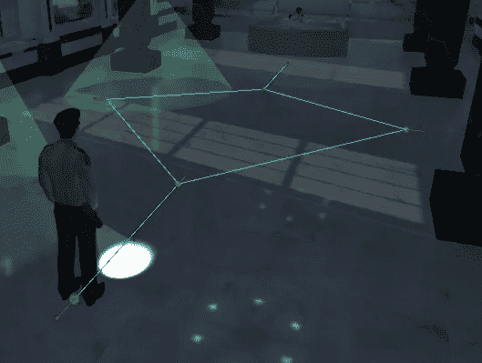

**今天的目标:**创造一个简单的模块化人工智能守卫，它会沿着一些路点巡逻，有时会选择两个路点中的一个去。

# 创建系统:

## 变量:

我创建了一个名为“***AIWaypointPatroller***的新类，它将保存沿着一组路点巡逻的所有 AI 代码。

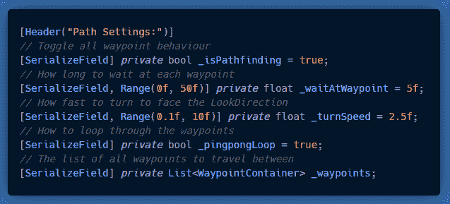

我想允许在每个航点面向一个指定的方向，加上备选航点位置的选项(我将在第 2 部分中添加)，所以我为**列表< >** 创建了一个自定义结构，而不仅仅是一个 **Vector3** 。

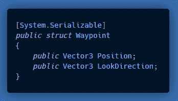

我还想在场景视图中显示航路点，以便于调试。

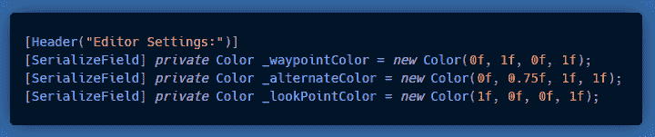

最后，私有变量:

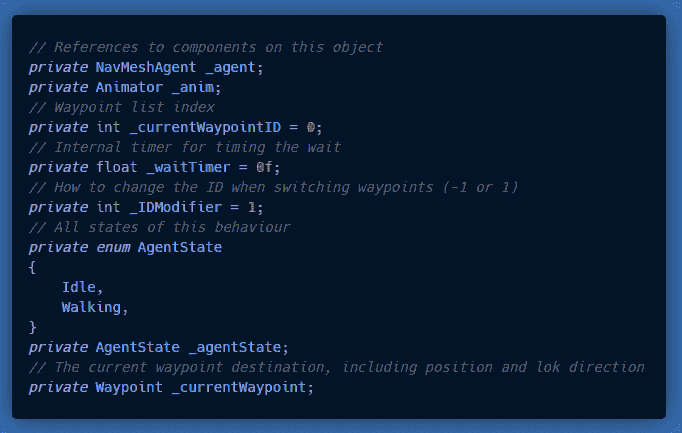

## 这些功能:

清醒:

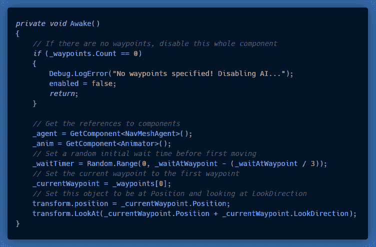

更新:

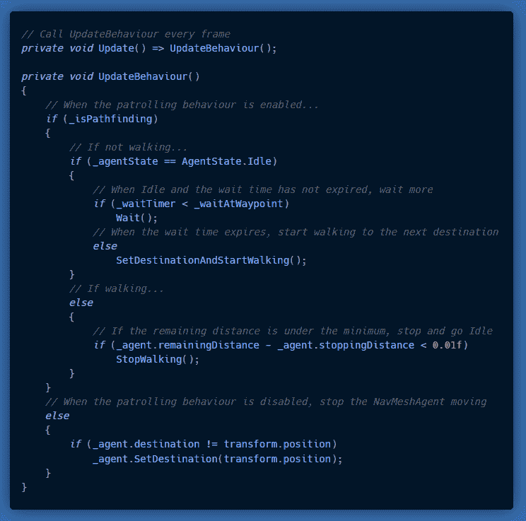

更新期间调用的函数:

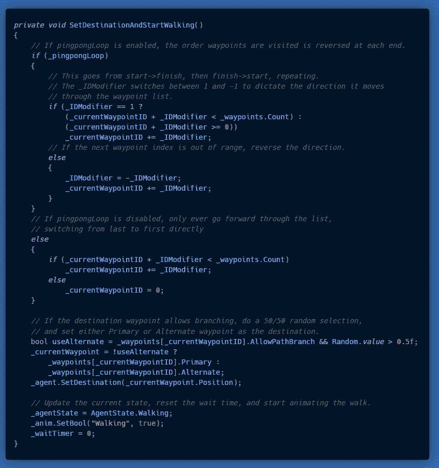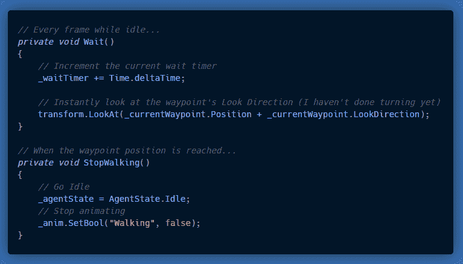

最后，为了在场景视图中绘制漂亮的调试行，创建一个 OnDrawGizmos()方法:

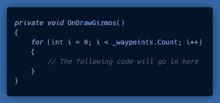

我想画三个部分:

*   当前位置，
*   路点和它们之间的线，
*   以及每个航点的观察方向。

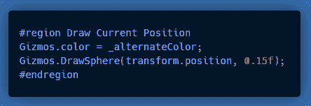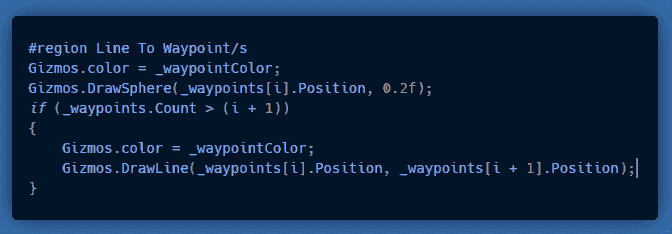

# 结果是:

最后，所有的工作都得到了回报，一个非常漂亮的航点系统！

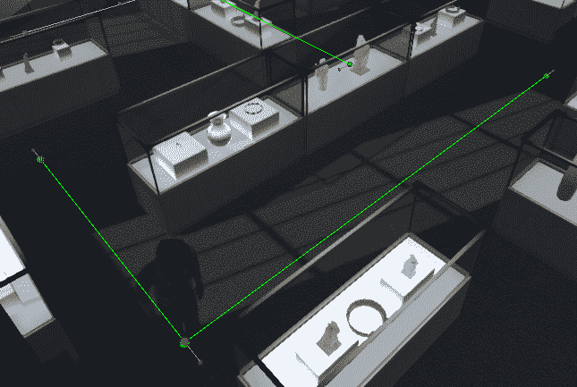

路径点路径

在我的下一篇文章**第二部分**中，我将增加**替换路径**的可能性，并增加缓慢转动**的功能**以面对*观察方向*。