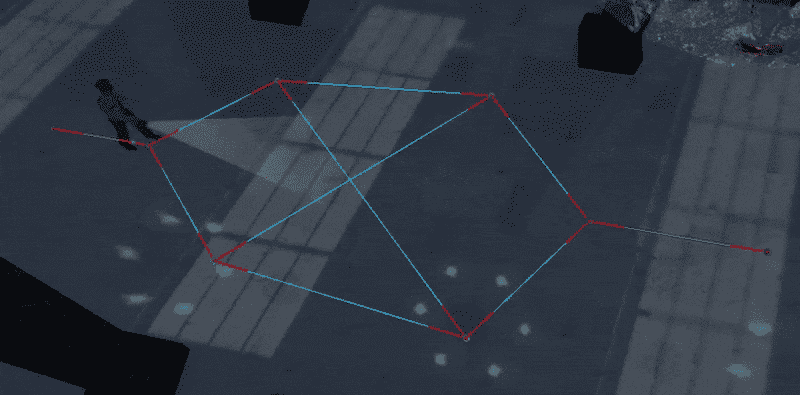
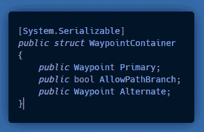
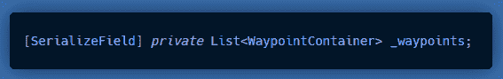
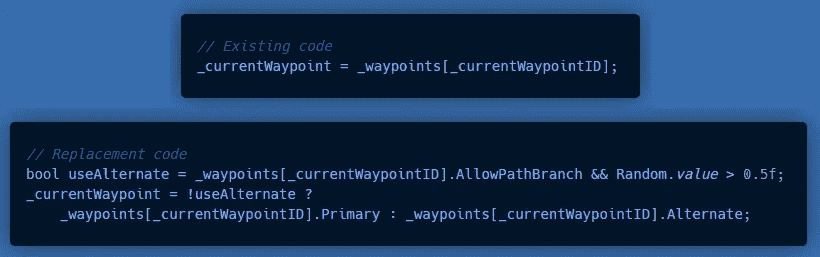
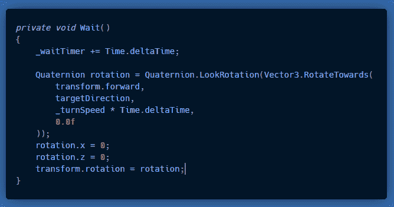
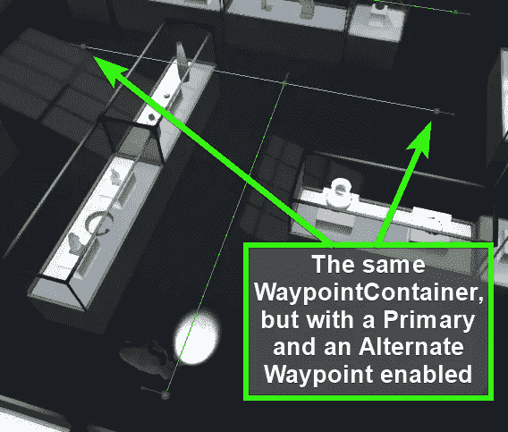
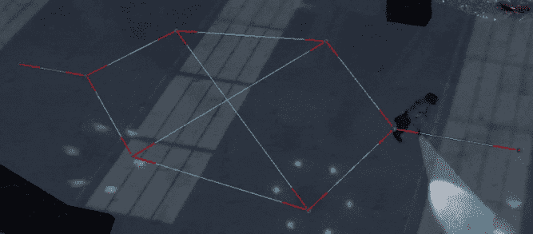
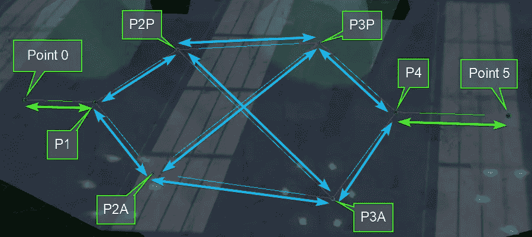

# 在 Unity 中用分支路径巡逻 AI，第 2 部分

> 原文：<https://medium.com/nerd-for-tech/waypoint-patrolling-ai-with-branching-paths-in-unity-part-2-db49f90e6ea7?source=collection_archive---------7----------------------->

## 为了我的秘密项目，我必须做巡逻警卫。然而，我决定混合一些随机选择的替代路径，和一个“看方向”。

这篇文章是第 1 部分的后续，所以如果你还没有看过的话，请先阅读一下。

启用时，警卫随机选择一个备用航路点位置。

**今天的目标:**在现有的航路点巡逻系统中添加备用航路点，允许警卫在特定航路点的 2 个点之间随机选择。

# 代码:

要添加替代点，我们需要修改本文第 1 部分中创建的一些现有代码，并编写一些额外的代码。

首先，在现有的 ***航路点*** **结构**下创建这个新的**结构**。**不要覆盖航路点结构。**

现在将**航路点列表**修改为**航路点容器列表**。

现在在现有的"***" SetDestinationAndStartWalking()***"方法中，用更新后的代码替换现有的代码:

这将随机选择主要或备用航路点作为目的地。

现在我将修改“ ***Wait( )*** ”方法来添加缓慢旋转以面对航点的***look direction***:

# 绘制所有场景视图调试线:

至此，“***OnDrawGizmos()”***方法已经变得相当大了(*120 行，比整个类*的一半还少一点)，所以我不会再展示如何绘制所有这些漂亮的调试行了。如果你跟着 **Part 1** 走，我相信你自己也能搞清楚。不过，这确实让使用**航路点**变得更加容易。

# 结果是:

尽管在这次测试中，他似乎特别喜欢一条路，但每个初选/备选选择都有 50%的机会。

在这里你可以看到所有的**航路点“主要”**，以及它们的“**备用”**(如果启用的话)。

你可能已经注意到，随着每个**航路点**的 ***观察方向*** 的红线和球体，也有 2 或 3 条红线部分覆盖了**航路点**之间的线。

这些是我没有在这里展示的一个改变，它允许人工智能代理在实际到达**航点**之前开始转向 ***观察方向*** 。这样看起来更自然。