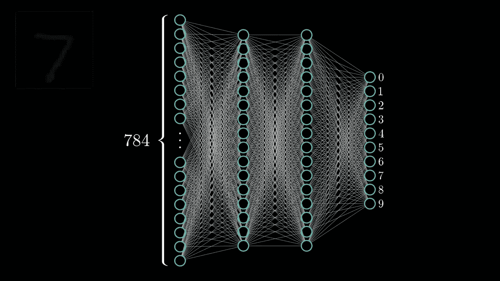
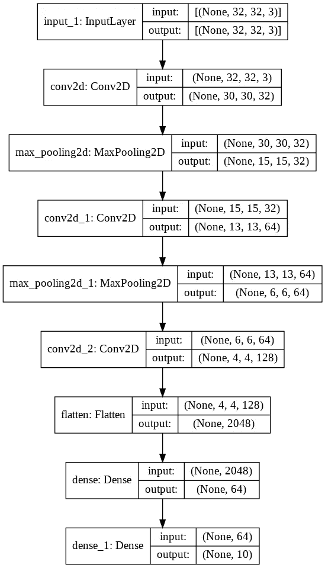
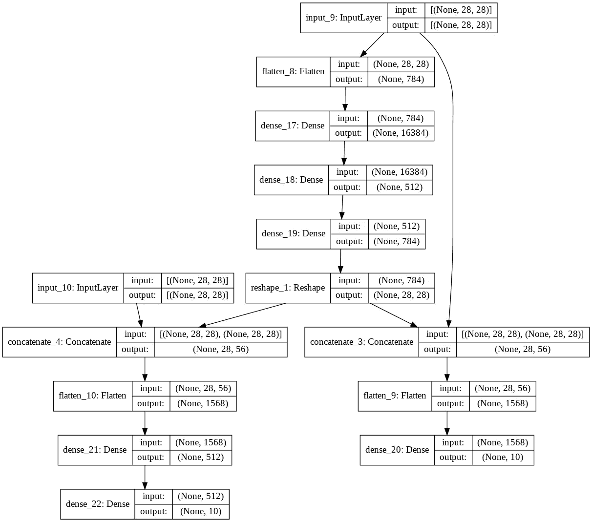

# 构建 Keras 模型的方法

> 原文：<https://medium.com/nerd-for-tech/ways-to-build-keras-models-198f6a643944?source=collection_archive---------4----------------------->

很高兴在长时间的休息后回来，我有很多并行的事情要做，所以我从这个系列中休息一下，但是我又带着一个基本但超级重要和有趣的主题回来了。

到目前为止，我们已经了解了[深度学习](https://sid-kalla99.medium.com/deep-learning-5fa04e493a7f)，我们如何使用[神经网络](/nerd-for-tech/neural-networks-68531432fb5)，算法背后的直觉和数学来实现它，但现在一个重要的问题出现了，我们是否有一个规定的结构或任何特定的模式来构建神经网络模型？

来源:gfycat.com

答案是肯定的，在构建神经网络时，有一些模式需要遵循，任何从事神经网络工作的人都知道这些模式，如果没有，他们绝对应该阅读这篇博客。

Keras 是一个开源库，用于构建神经网络和深度学习。它允许我们建立、训练和评估模型。构建模型的两种基本模式是顺序 API 和功能 API 模型。

## 顺序 API 模型:

这是可以使用 keras 建立和评估的最基本和最容易的模型。顾名思义，它允许我们以一种连续的形式、一层又一层的风格来构建模型。在这里，我们为模型创建了一个合适的单元，它包含了我们想要的模型中的所有层。该模型不能用于随机输入层和随机输出层格式，它遵循完全连续的构建顺序。

这是如何构建顺序模型的一个片段。这是我在上一篇博客[中为 cifar-10 数据集训练的同一个模型。你们都可以看到在构建这种类型的模型时遵循的模式，从导入](/nerd-for-tech/classification-on-cifar-10-32abe456302)[库](https://docs.python.org/3/library/)开始，如 [tensorflow](https://www.tensorflow.org/api_docs/python/tf) 和 keras，并调用 [tf.keras.Sequential](https://keras.io/api/models/sequential/) 。然后，我们必须使用我们的层来构建所需的模型，例如在本例中，我们使用了输入层，其图像大小为 32x32，以 [rgb 格式](https://www.mathworks.com/help/matlab/creating_plots/image-types.html)作为输入，然后是完整的架构。

顺序模型摘要

在这里，我们可以看到所有层一层一层地堆叠在一起，并遵循规定的顺序，并将根据给定的数据进行相应的训练。

## 功能 API 模型:

在这种类型的模型中，所有输入都可以直接连接到输出层。在这种类型中，我们简单地构建具有不同层的网络，并且可以手动声明输入和输出层，不需要最后一层必须是输出层，并且训练将根据我们的输入和输出层的指示进行，而不管架构如何。

这种类型的模型主要用于[转移学习](https://chroniclesofai.com/transfer-learning/)的情况，如果我们不想进行到最后一层并恢复之前的值，以便可以在另一个模型中使用，我们不需要再次经历完整的模型，我们可以简单地转移权重。

这是一个例子，说明我们如何使用与上述相同的架构，在相同的数据集 [cifar-10](https://www.cs.toronto.edu/~kriz/cifar.html) 上使用[功能 API](https://keras.io/guides/functional_api/) 构建模型。您可以清楚地看到，在编写代码时，我们将前一层的输出作为下一层的输入，这导致了一系列类似图案的形成，其中各层一个接一个地堆叠。在顺序上没有限制，你可以固定任何你想要你的网络工作的顺序。

串联网络功能模型

这是另一个函数式 API 模型的例子，它将很容易解释多输入多输出模型的含义。我们可以很容易地看到，这个模型包含两个不同的输入层和两个输出层，中间还有连接两个不同层的[连接层](https://www.tensorflow.org/api_docs/python/tf/keras/layers/Concatenate)。请注意，进入连接层的两个层的形状应该相同，这样它们才能被连接。最后，当我们定义模型时，我们在不同的列表中声明了输入和输出。

这是一个成型的模型，它很容易向我们展示包括所有连接在内的架构。功能模型有着巨大而重要的作用，而构建模型允许复杂网络所需的多个输入和输出，这有助于我们优化我们的问题。

多输入多输出功能模型

因此，我希望现在你们理解了顺序和功能 API 的概念，现在你们可以根据自己的要求构建自己的神经网络模型，但正如我一直建议每个人适当阅读官方文档以获得任何概念的完整知识一样，我在这里再次提出同样的建议，并将删除 [keras.io](https://keras.io/api/models/) 的链接，在那里您可以阅读这些类型模型的文档并深入了解它们。

希望这是有用的，让你了解不同的方式建立模型。请留下你的回答，祝你学习愉快！！