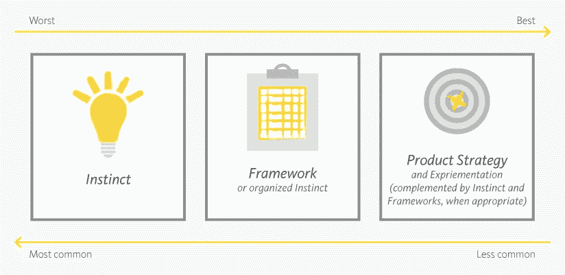
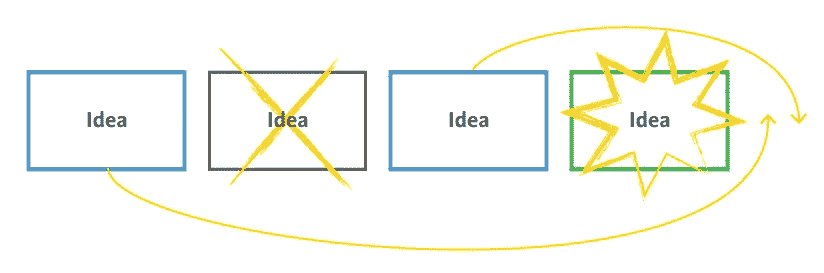
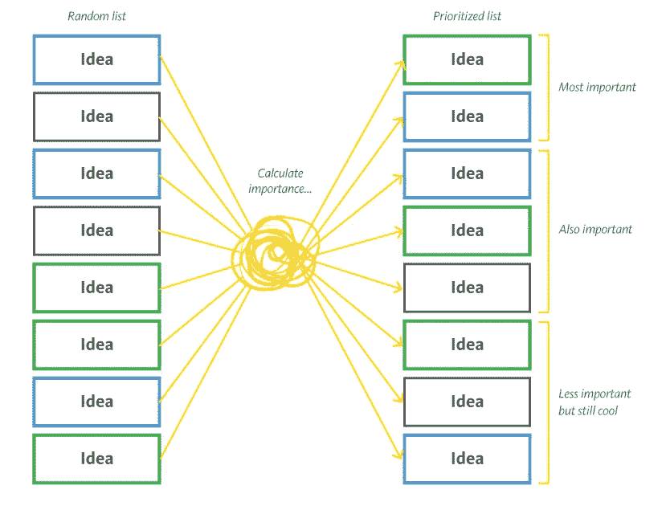
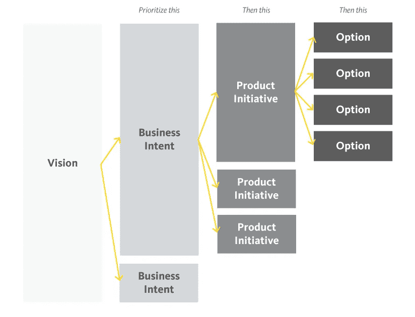

# 排列优先顺序的方法——从最差到最好

> 原文：<https://medium.com/nerd-for-tech/ways-to-prioritize-from-worst-to-best-43711a28aa94?source=collection_archive---------5----------------------->

经验告诉我们，我们永远不可能把想做的事情都做完。如果是这样，我们必须确保首先完成最重要的事情，否则我们将来就有可能没有机会做这些事情。这就是为什么优先顺序是至关重要的。

有很多方法可以区分轻重缓急。我敢说有些更差，有些更好。当然，它们都可以很好地工作，这取决于上下文。但是，从我亲眼所见，误用是常见的。你会明白我的意思。

我来带你看看这些方法:**本能优先**；**框架优先级**；以及**战略优先**。

# 本能优先化

仅仅优先考虑我们或他人的直觉是最不科学的方法。它需要一个很少有人能支持的信心水平，尽管许多人认为他们能做到。它可能对明显较低的悬挂果实有效，但不会更多。挂在较低位置的水果会很快被捡起来。

在我曾经工作过的一个产品上，房间里的河马(收入最高的人)真的相信他的想法是天才的，是他所有商业成功的原因。然而，几天后，他的天才想法不再是真的，出现了另一个闪亮的、同样自信的新想法。优先级随着风向而改变。它扼杀了团队的生产力和士气，尽管它声称在其他业务中创造了奇迹，但它取得的结果很差。

我明白了，缺乏严谨的分析会让我们很快改变主意。更糟糕的是，我们打开了与用户的真实需求失去联系的大门，我们变得对每一个功能请求都太敏感了。我们可以从想法和需求中获得极好的洞察力，但是将它们随意地放在路线图上很少会带来最好的结果。

 [## 我应该同意这项功能请求吗？

### 我们需要确保我们的产品始终是好的，尽管有各种力量试图干扰…

productcoalition.com](https://productcoalition.com/should-i-say-yes-to-this-feature-request-c4c7482ee980) 

# 框架优先排序

当面对本能优先排序的不确定性造成的混乱时，年轻的我会立即使用当时流行的优先排序框架。优先化框架通常是关于把想法放进桶里，或者关于一些虚构的数学公式来排列它们。

*   **莫斯科:** *肯定有*或*应该有*或*可能有*或*不会有*
*   **卡诺模型:** *预期需求*或*正常需求*或*兴奋需求*
*   **艾森豪威尔矩阵:** *做*(紧急且重要)或*决定*(重要但不紧急)或*委托*(不重要但紧急)或*删除*(不重要且不紧急)
*   *合意性* + *可行性* + *可行性*
*   **ROI** (投资回报) **:** *价值* / *努力*
*   **大米:** *达成* * *冲击* * *信心* / *努力*
*   **加权分数:**例如**。** *商业价值* (35%) + *成本* (25%)+ *风险* (40%)
*   **延期成本:** *延期成本* / *作业持续时间*

当我们从来不需要战略性地考虑如何区分优先顺序时，这些框架是很好的。引入结构迫使我们阐明、表达和排列我们的思想。这自然会导致更好地经受时间考验的决定。这将有助于我们传达这些决定，以达成共识。

然而，虽然它看起来简单明了，但它仍然是关于猜测的。我们在空中摇着手指说:“这看起来像是必须的！”；或者“这感觉像个 3+2+5”。这可能会产生误导，因为它提供了一种对数学的虚假信心。更糟糕的是，这可能会分散我们对产品独特价值定位的关注。或者弥补缺乏对产品策略的共同理解。

# 战略优先顺序

我获得的经验越多，我就越相信结果驱动的产品策略对于指导任何产品决策是至关重要的。

作为产品经理，我们的主要工作不是优先考虑想法。如果我们很难做到这一点，那么这意味着我们在一个注重产出的组织中。作为产品经理，我们的工作是以对企业可行的方式为用户创造价值。这需要一种结果思维，产品战略比优先策略更重要。

在没有产品战略的情况下，我们最重要的工作就是制定一个。

如果这种结果与产出的对话对你没有任何影响，我建议你在继续下一步之前阅读下面的文章。从现在开始，我使用的大多数术语都来自那里。

 [## 如何在结果的抽象世界中导航

### 对于公司来说，把创造功能和取得进步混为一谈是很常见的。但是特征并不能真正衡量…

medium.com](/swlh/how-to-navigate-the-abstract-world-of-outcomes-58a81cdbab95) 

## 战略使优先化更容易

通过产品策略，我们将期望的结果分解成树状结构。通过这种方式，我们缩小了竞争范围，使其更易于管理。我们不需要同时评估整棵树。我们可以简单地评估我们所在的分支。我们需要决定的事情会更少，也更容易分清主次。尝试排列 5 个计划的优先顺序比排列 50 个功能想法要容易。

在产品策略方面，我们也提供了明确的目标。我们希望做更有可能帮助我们实现预期结果的事情，这应该是我们确定优先顺序的原因。一个结果定义得越明确，就越容易对与之相符的项目进行优先排序。

*   当对**商业意图**进行优先排序时，我们需要选择那些对实现愿景有最大飞跃的商业意图。
*   当对**产品计划**进行优先级排序时，我们需要选择那些对我们的目标商业意图影响更大的计划。
*   当对**选项**进行优先级排序时，我们需要选择最能解决产品倡议提案的选项。

## 战略可以增强信心

所以，鉴于我们现在有更少的优先事项，并且有明确的目标，这次用我们的直觉不就可以了吗？还是求助于优先顺序框架？当然，取决于风险和我们的信心水平。但我们总能利用剩余的产能去风险，获得更多的信心。

最终，我们希望估计解决每一项会对我们期望的结果产生多大的影响。理想情况下，我们将通过使用来自市场、用户和财务的硬数据来做到这一点(而不是使用给我们一种虚假真实感的虚构数字)。然而，我们很可能需要实验来收集证据。

 [## 学会赚钱:实验指南

### 实验是为了学习，当你在赚钱的时候，更有效地解决问题。

bootcamp.uxdesign.cc](https://bootcamp.uxdesign.cc/learn-to-earn-an-experimentation-guide-94d4b07f2640) 

当我们知道哪个项目看起来最有希望时，我们会优先交付它。当我们了解它的表现时，我们要么转向另一个目标，要么尝试另一种选择。不管我们有多自信，我们都希望接受我们可能做出了错误决定的想法。优先化和其他事情一样是反复的。

说了这么多，让我们再来一遍，这次倒过来:

*   **产品战略**指导我们确保首先做最重要的事情。如果没有产品战略，我们需要制定一个。从大的方面来看，没有它，提供真正价值的优先化就不会有效。实验是我们下一个最好的朋友。
*   框架可以帮助我们以结构化的方式思考，并在需要时帮助我们传达决策。然而，我们需要明智地使用它们。它们并不能取代产品策略，我们也不应该成为它们的奴隶。
*   **本能**对明显的物品起作用。有时候没必要把事情复杂化。然而，我们永远不应该陷入过度自信或把我们的决定外包给他人的陷阱。产品管理不是一门严谨的科学，但也不是一门松散的艺术。

*如果你喜欢这篇文章，你可能也会喜欢这篇:*

 [## 现代路线图

### 虽然传统的路线图对于敏捷方法来说不够灵活，但是敏捷方法并没有填满战略…

medium.com](/geekculture/a-modern-roadmap-352ca01964f2)