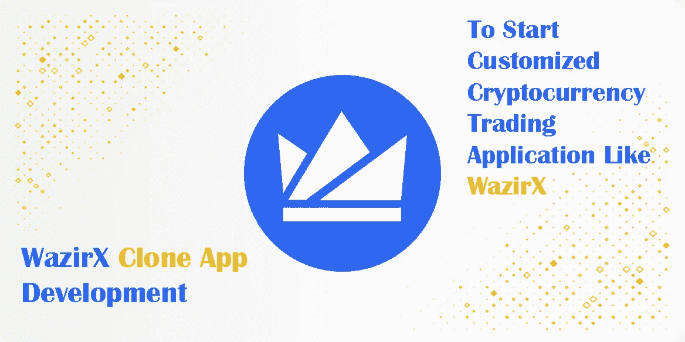
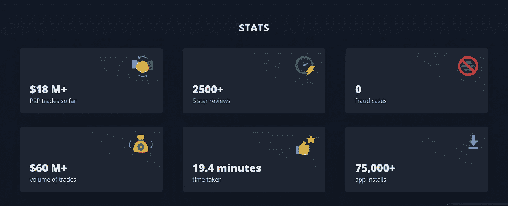
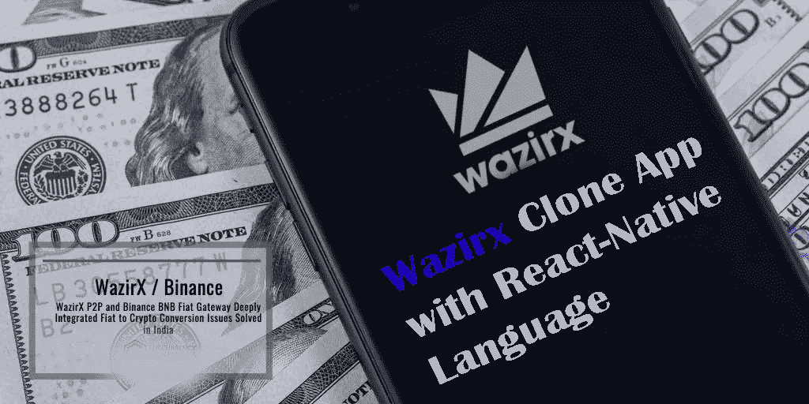
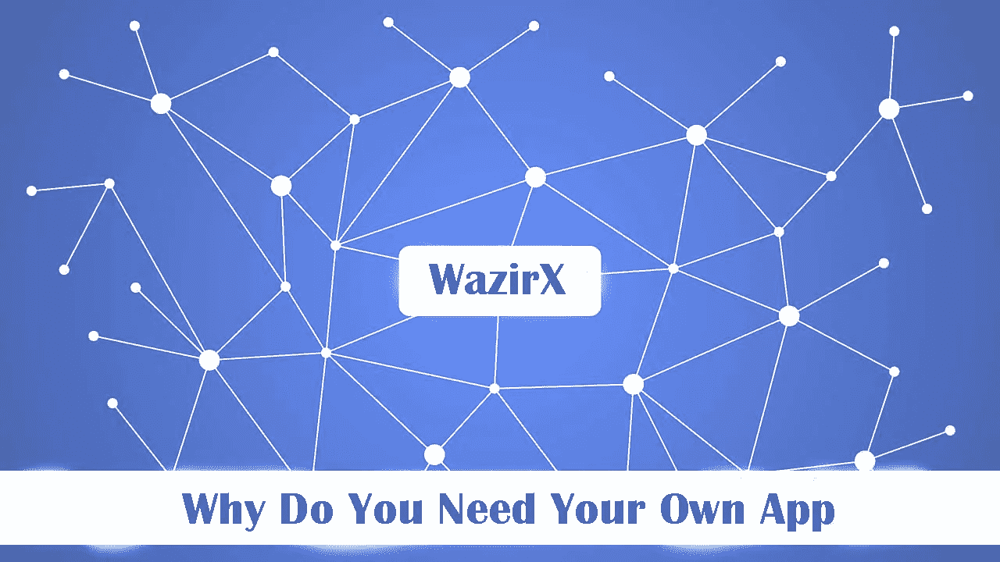

# 用于 Android 和 IOS 的 WazirX 克隆应用程序开发

> 原文：<https://medium.com/nerd-for-tech/wazirx-clone-app-development-for-android-ios-c4087ef4c9bc?source=collection_archive---------9----------------------->

说到应用程序开发，这通常意味着移动应用程序开发。当谈到智能手机的应用程序时，操作系统的流行程度决定了应用程序的兼容性。虽然绝大多数使用 Android 或 iOS 操作系统的智能手机用户可以访问所有应用程序，但可供使用替代操作系统的用户使用的应用程序要少得多。难怪，因为 97.5%的用户使用 Android 或 iOS 操作系统，许多公司在开发应用程序时都专注于这两个占据市场主导地位的系统。

[***WazirX 克隆 App***](https://radindev.com/wazirx-clone-script/?utm_source=medium&utm_medium=referral&utm_campaign=medium&utm_content=wazirx_clone_app) 是为了方便投资者在加密货币市场操作而设计和呈现的。创业公司和企业家可以在他们的 Android 和 IOS 版本的手机上轻松创建和启动 WazirX 应用程序，使用 WazirX 克隆随时随地进行加密货币市场的交易。

# **WazirX 概述**

WazirX 是印度最大、最受信任的加密货币交易所。3 月 3 日上线。截至目前，计划应用已有超 2018 次下载；而平均分是 20 万/ 4.4

从一开始，WazirX 的目标就是解决加密-菲亚特转换问题。他们认为这是加密货币传播的一个重大障碍。此外，该平台还以其 P2P 自匹配机制而闻名。

WazirX 交易所也提供点对点服务。然而，在点对点服务中，你只能交换 USDT。这个交易所有一个买家和卖家匹配软件，当你作为买家下单时，它会为你匹配合适的卖家。

# **什么是 WazirX** **克隆 App 开发？**

WazirX Clone app，一个现成的加密交换 App 解决方案，创业者可以即时启动一个加密交换 App。WazirX 克隆应用程序的开发旨在为网站加密交易者提供增强的交易体验。这款克隆应用可以在 Android、iOS 和 Windows 操作系统上运行。利用克隆移动应用程序的优势，您可以提高加密交易的活跃时间。

我们的 WazirX exchange 克隆应用程序经过了完整的测试过程，完全基于网络安全准则进行设计，因此使用 Radindev 的 WazirX 克隆应用程序构建的手机可以确保顶级的安全性，并且保持不可攻击性。我们的脚本的奇妙之处在于，创业者或初创公司可以根据自己的业务需求定制这个脚本，并在众多竞争对手中脱颖而出。

## **使用 Wazirx 克隆应用的优势**

快速启动

性价比高

高成功率

可扩展和可定制

节省时间

## **Wazirx 克隆应用的特点**

编程语言取决于应用程序的平台和类型。比如程序员用 React-Native 和 Flutter 做 Android 应用，iOS 应用，C#做 Windows 应用。

我们的带有 React-Native 语言的 Wazirx 克隆应用程序是一个白标加密交换解决方案，可以快速定制和启动。

图形加工遵循用户界面/UX 设计的标准，因此高质量图形与直观导航的最大用户友好性的兼容性在任何时候都是可能的。与此同时，它是关于最佳地利用单个设备的平台的可能性，并适应可能的限制。

重要的是，整体结果将企业标识放在企业设计的前台，并具有很高的识别价值。对于带有菜单项和输入窗口的图形界面，应用程序开发人员决定文件夹结构中各个功能的排列。

您可以通过白色标签为您的业务需求定制一个 100%交易网站。这将提高应用程序的质量。

如果您没有足够的技术知识来处理白标 Wazirx 克隆应用程序，我们将提供 24/7 小时的支持，以清除您的所有疑问和澄清。

## **启动 WazirX** **克隆应用**的 4 个简单阶段

检查一个来自可信公司的预构建的、贴有白色标签的、经过测试的 Wazirx 应用克隆。

向有经验的克隆应用提供商咨询。

启动定制的加密货币交易应用，如 [Wazirx](https://wazirx.com/) 。

我们将负责您所有的安装、更新和维护。

## **为什么选择 WazirX** **克隆 App 开发？**

高度安全

多种支付方式

多种语言的实时聊天

远期交易

快速行动

低佣金

使用生物识别进行认证

批准过程很短

使用方便

令人惊叹的用户界面/UX 设计

# **为什么需要自己的 App？**

数字化不仅指日可待，而且已经进入室内！由于经典手机向智能手机的进一步发展，社交、社交和经济生活已经转移到虚拟空间。虽然几年前人们还在书本中寻找信息，但现在人们已经开始使用网络了。

尚未适应进步的公司和初创企业将无法在国际经济市场上生存太久。

## **编写应用程序时应考虑什么？**

需求——首先，客户描述应用程序的预期用途，并提供应用程序的大致结构。应该澄清是否应该实现创造性的想法、功能需求、外部接口或特殊功能。描述越详细，应用程序就越容易实现。

创建移动版本是一个非常广泛的过程，需要大量的工作和时间。或者，使用响应式网页设计是有意义的。这个术语隐藏了关于移动使用的主页优化。

还有一点就是成本的问题。最后，预算决定了 app 的范围。因此，应在第一次会议上公开解释财务可能性。

平台——作为一项规则，人们不应该在 Android 或 iOS 应用之间做出选择。通常，应用程序是为两种平台设计的。

## **开发应用值得吗？**

拥有自己的应用程序可以在与其他提供商的持续竞争中发挥重要作用。加速的内部工作流程、改善的客户体验和简化的订购流程是您自己的应用程序最明显的优势。

作为针对公司流程优化定制的应用程序，它们为灵活的解决方案打开了大门，为客户提供显著的附加值，并让公司看起来像一个面向未来的创新合作伙伴，与时俱进，甚至超越时代。

# **哪里能找到最好的 WazirX 克隆应用？**

不知道从哪里开始寻找最好的加密交换平台？如果您重视移动期权交易，请查看我们的 Wazirx 克隆应用程序。

Radindev 通过有效的设计和有针对性的内容为品牌建立了一个强大而一致的形象。我们让网络产品独一无二，我们推广它。我们小心翼翼地将感兴趣的访问者带到我们客户的平台上。我们使用最先进的技术整合网站。

我们的技术专家团队是一群技术高超、经验丰富的人，他们总是将客户的每一项要求视为挑战，以提供最佳解决方案。我们从来不把我们的客户当作顾客，我们把他们当作在他们的业务中成长的伙伴。这是一个完整的证据，证明 Radindev 不仅是一个服务提供商，也是我们所有客户值得信赖的商业伙伴。请与我们联系，让我们立即构建软件。

## **遗言**

既然你已经知道如何制作一个像 Wazirx 这样的应用程序，你应该开始计划这个项目了。请记住，目前市场上有无数类似的应用程序。

因此，你的应用需要做一些不同的、独特的事情，才能脱颖而出。Wazirx 成功地在加密交易所中获得了这样一个位置，因为它是第一个提供此类服务的公司之一。即使你可能想开发一个类似 Wazirx 的应用程序，你也应该把重点放在区别上。