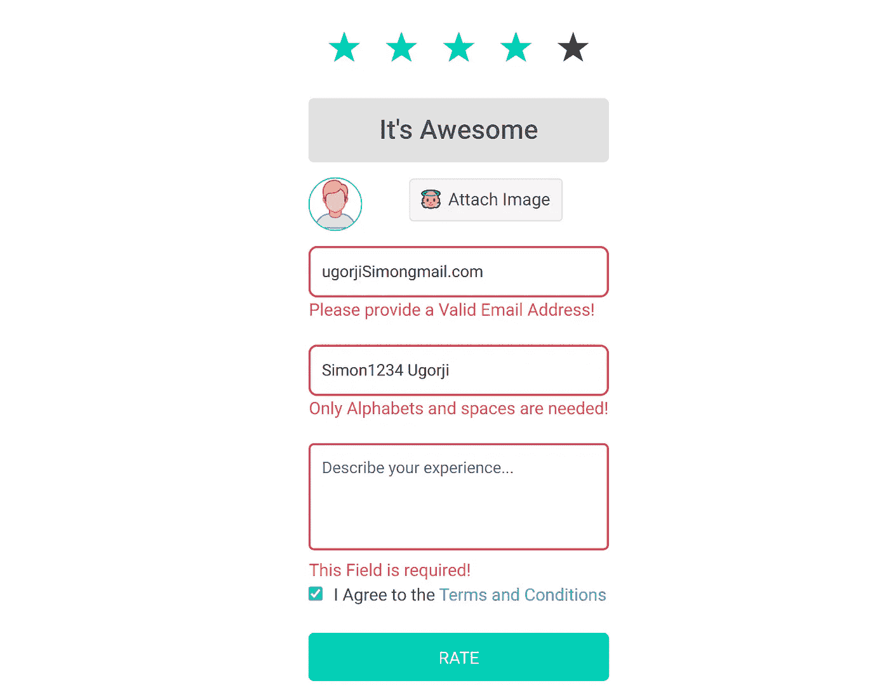
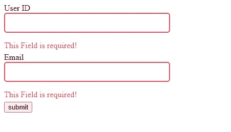
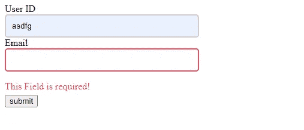
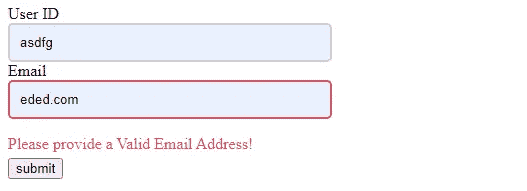

# 使用 JavaScript 的简单表单验证

> 原文：<https://medium.com/nerd-for-tech/we-will-create-a-basic-form-with-input-elements-and-we-will-give-these-input-elements-an-attribute-57c3018c0ed2?source=collection_archive---------4----------------------->

我最近接受了一个任务，用 JavaScript 开发一个简单的表单验证。我花了 2 个多小时完成这个任务，逻辑很简单。

## 我们的形式

我们将创建一个包含输入元素的基本表单，我们将为这些输入元素赋予属性 myValidator，然后我们将在该属性中指定验证规则。

*   r 表示(表格字段为必填)。
*   e 表示(表单输入必须是有效的电子邮件地址)。
*   n 表示(表单输入必须是有效数字)。

下面的代码将查找具有属性 **myValidator** 的输入元素，将验证规则存储在一个变量中，然后继续验证表单。

> 我选择将验证规则存储在变量中的原因是为了防止用户使用 inspect 工具删除 myValidator 属性，这是我们的验证工作所必需的。

这意味着一旦我们的页面加载完毕，它会检查所有*输入*元素中存在的验证规则，并使用语法将其存储在一个变量中。

## 我们的职能

让我们创建一个父函数来处理验证规则。当所有表单验证无误地完成时，我们的返回类型将是 *true* ，当有验证错误时，返回类型将是 *false* 。

我们将检查变量(validate)是否包含需要验证的输入，然后我们将遍历每个数据并执行必要的验证。

请记住，如果您将验证规则指定为；

*   *R* ，表示需要表单输入。
*   *E* ，表示该表单输入的值必须是有效的电子邮件地址。

然而，在循环中，我们需要一个变量 **continueValidation** ，它检查一个验证规则是成功通过还是失败。

如果这个变量的值是(0)，这意味着一个验证规则失败了，所以我们需要停止进一步的验证，直到这个特定的验证成功通过。

如果一个验证规则成功通过，我们将递增这个变量，以便可以执行下一个验证规则。

## 必需的验证规则

这条规则主要检查表单输入是否包含值。使用方法**。includes()** 我们能够遍历验证规则，找到一个匹配(R)的规则，R 代表**必需的**。

一旦找到匹配，我们将使用输入元素的 *id* 查询输入元素，然后检查该输入元素的值是否为空。

如果值为空，我们将向该输入元素附加一个错误，并附加一个事件侦听器，当验证无错误通过时，该事件侦听器将删除错误。

## 电子邮件验证规则

我们已经处理了必填表单字段的验证规则，它主要检查表单输入是否包含值。现在要执行电子邮件验证，我们需要一个 ***正则表达式*** 来检查有效的电子邮件地址。

如果提供的电子邮件无效，我们会将错误附加到表单中，并通过将变量 **continueValidation** 的值设置为零(0)来阻止我们的脚本处理下一个验证规则，直到该特定规则成功通过。

因此，我们的电子邮件验证规则将如下所示；

## 我们的验证规则

在验证任何规则时，我们将一个 **focusout** 事件监听器附加到特定的元素上，以便在提供值时自动重新验证表单输入。

现在，如果在验证期间出现错误，我们将通过函数 **myValidateNewError()** 将该错误附加到表单中，稍后当验证成功执行时，我们将通过函数**myValidateRemoveError()**删除该错误。

以下是函数:

## 试运转

为了测试这个脚本，我们需要将父函数( **myValidate()** )中的函数组合在一起，调用这个函数，然后在单击提交按钮时检查它的返回值。

如果返回值为**假**，这意味着存在验证错误。但是如果返回值为 **true** ，这意味着所有的验证都成功通过，表单可以处理了。

我们的剧本

我们的 HTML

将脚本复制到一个空白页面的脚本标记和同一页面内的 HTML 中，然后尝试在不提供值的情况下提交表单。

这是我得到的结果

现在，如果我应该输入一个值，并离开表单输入，focusOut 事件将被触发，它将清除表单错误。

请记住，我们添加了一个电子邮件验证规则。

如果我们提供了一个无效的电子邮件地址，然后尝试提交表格，这是我们得到的结果。

我已经解释了脚本是如何工作的。您可以添加表单验证规则，并且可以放心，这种验证只在客户端是完美的。您可能还需要在应用程序的服务器端进行重新验证。

我用 octaValidate 扩展了这个脚本，以支持更多的验证规则。您也可以通过提供您的验证规则来为此项目做出贡献。

在我的 [GitHub 上查看一下这里](http://github.com/Octagon-simon/octaValidate)