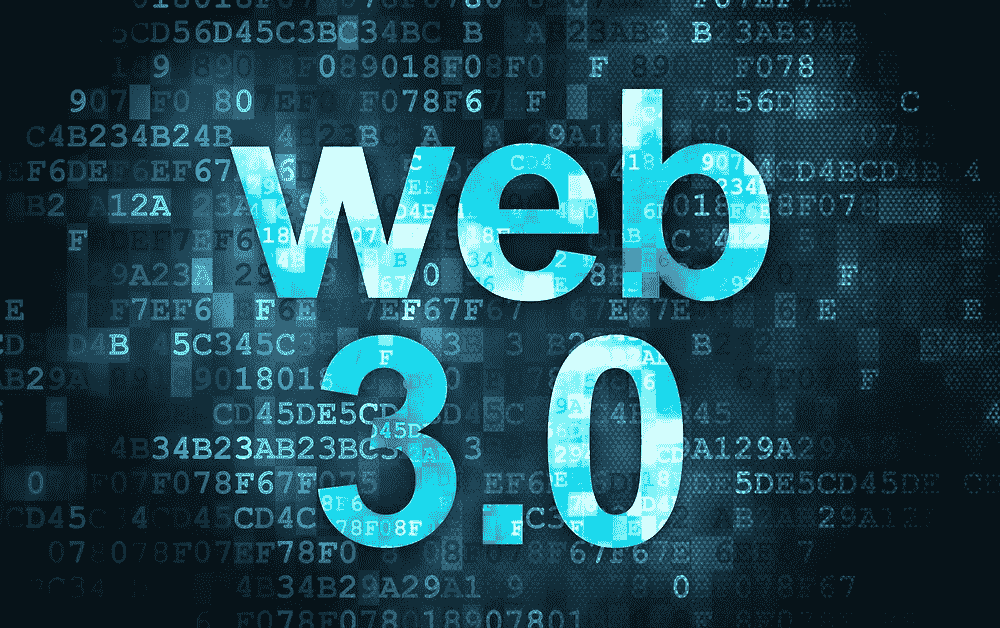
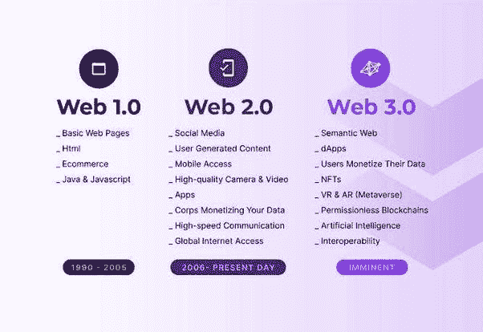

# Web 3.0

> 原文：<https://medium.com/nerd-for-tech/web-3-0-a7f648d09d73?source=collection_archive---------4----------------------->

来源:insights.sygnum.com

## 什么是 Web 3.0？

这些天我们听到了许多新术语，
NFTs，元宇宙，区块链…

我们可能遇到的另一个例子是— **Web 3.0**

但是在 3.0 之前，让我们也试着理解一下之前的版本

资料来源:Quora.com

## Web 1.0 -

这基本上是指第一阶段的**万维网**
通常在这些时候，静态网页被托管在网络服务器上

令人惊讶的是，在 Web 1.0 中，上网时网站上的广告
被禁止了！

它主要用于个人网站和显示静态内容。

## Web 2.0-

这指的是更注重用户生成的
内容、可用性和最终用户的互操作性的网站

随着 Web 2.0(比如 YouTube、脸书、Twitter)的出现，对用户输入做出响应的动态内容变得可用

API 是为通过软件应用程序供自己使用而开发的

大多数情况下，这支持了以下应用:
播客、博客、社交媒体等。

## Web 3.0

这指向了网络应用和交互的发展，其中
包括将网络变成数据库

这个 Web 3.0 的关键基础是:
**1)人工智能**
在线解码和过滤数据以供用户交互

**2)物联网** 帮助互联网&智能设备之间的互操作

**3)区块链** 在实现数据的去中心化存储

> Web 3.0 会对数字时代产生什么影响？

它有可能升级以消费者为中心、关注隐私和安全的未来网络

它将使机器和用户之间能够交换 P2P 基础设施的数据和价值

此外，它还会带来语义网，带来像 DAOs(去中心化自治组织)和 DAC(去中心化自治公司)这样的可能性

今天，**以太坊**是多个 Web 3.0
应用的领先基础！

这种第三代网站和网页将收集来自用户的数据
，并智能地对其进行处理，以针对每个用户进行定制。

相同的内容可以显示给不同的用户，
这将使得数据所有权从单个实体
转移到共享资源。

Twitter 的一名项目经理告诉记者，社交媒体公司
一直在研究将 Web 3.0 概念引入
社交网络的方法

Web 3.0 也将与元宇宙很好地融合，这将使买卖 NFT 变得更加容易，NFT 通常代表我们对虚拟事物的所有权！

就像任何其他科技问题一样，许多人认为这只是另一个幻想！

谈到 Web 3.0，特斯拉和 SpaceX 首席执行官埃隆·马斯克也是这样的批评家

嗯，Web 3.0 的想法听起来很有趣，而且它已经在新闻中出现很长时间了
我们将拭目以待，看它如何成为现实！