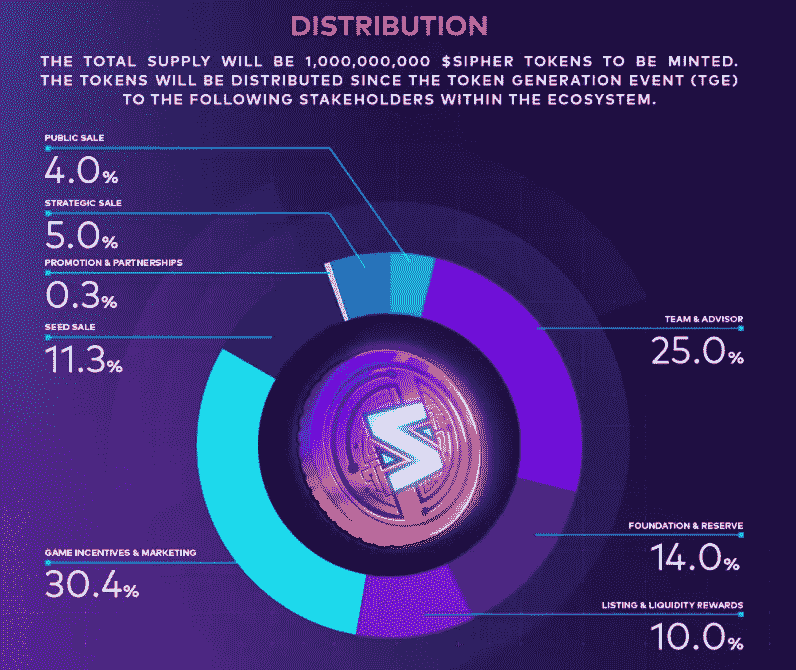
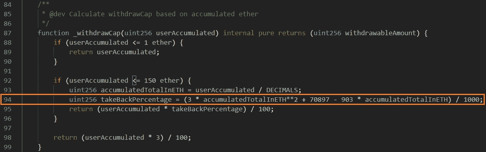
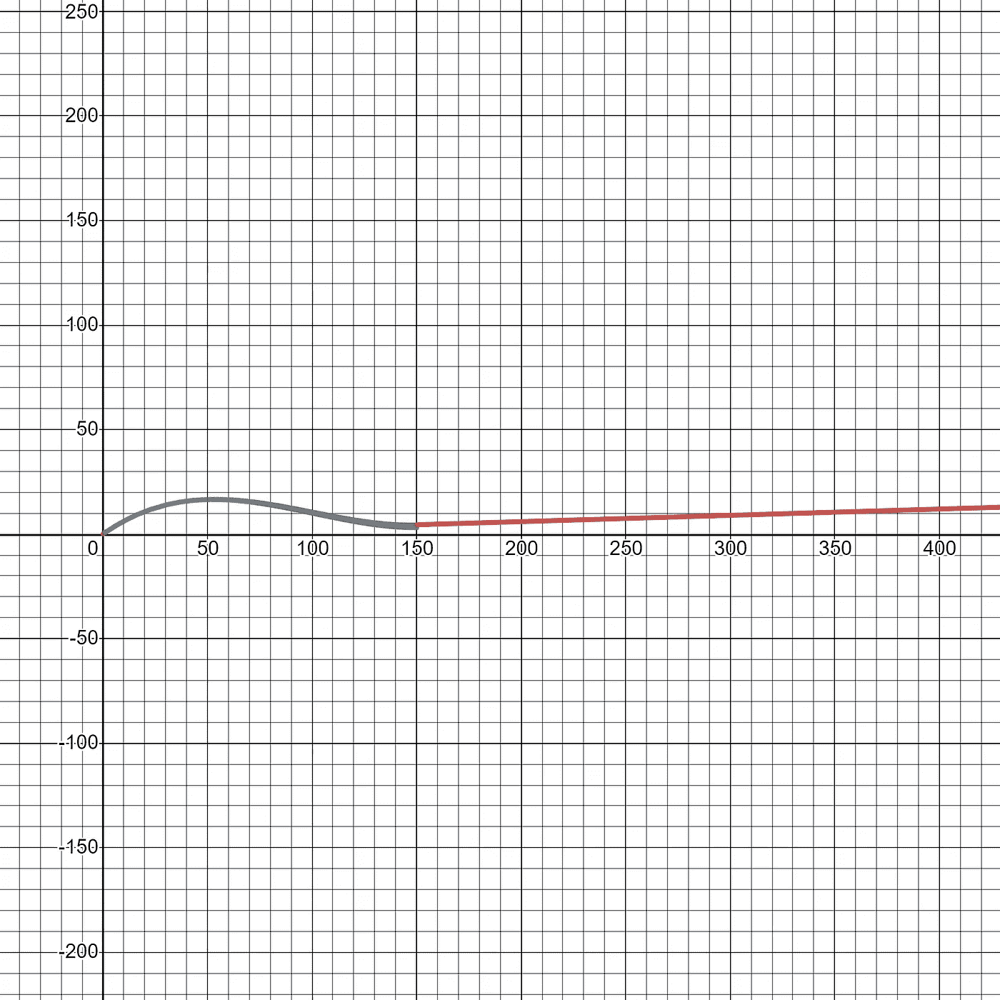
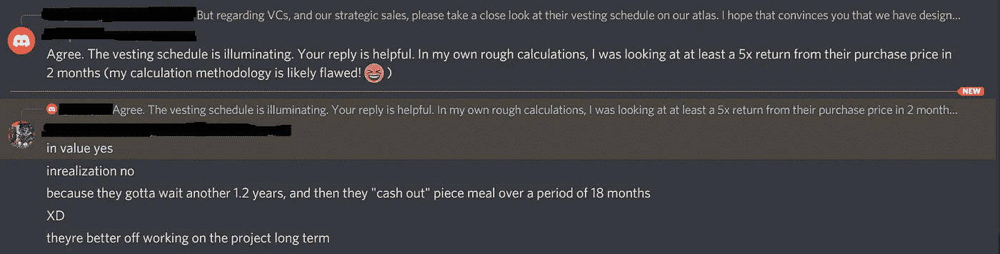
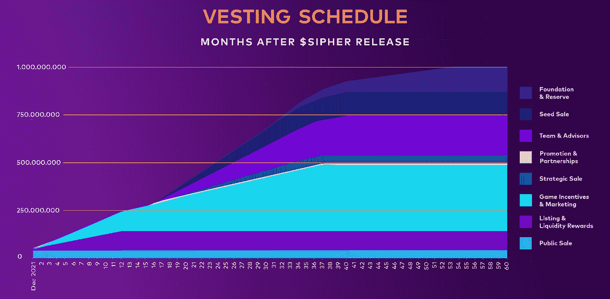
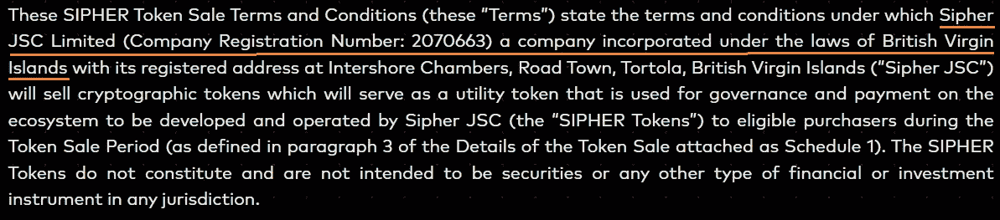
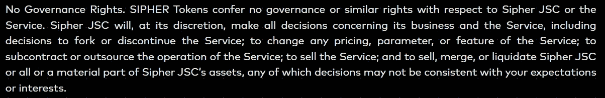
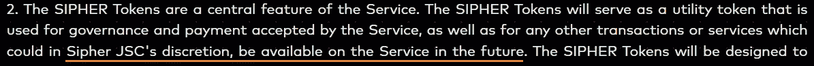

# Web 3.0:西弗、代码和博弈论

> 原文：<https://medium.com/nerd-for-tech/web-3-0-sipher-code-and-game-theory-b9c6d84b0623?source=collection_archive---------2----------------------->

## 为什么代码是 Web 3.0 的竞争优势…

> 随着 Web 3.0 的发展，最重要的技能之一是理解代码语言的能力。

***本期杂志着眼于一个活生生的例子，展示代码如何在我们的内部决策过程中发挥核心作用。***

奖励应该是世界第八大奇迹。在一个由编程语言驱动的世界中，这种动态表现在代码行的奥秘中。在一个由匿名参与者组成的“不信任”的世界里，一个人如何获得神圣的激励？

**通过建立理解代码语言的能力。**

## 此版本:

## [I]si pher 的背景

## [II]代码和博弈论

## [III]风险投资和博弈论

## [IV]分权与博弈论

## 西弗

Sipher 成立于 2011 年 3 月，是一款总部位于区块链的 PvP(玩家对玩家)、PvE(玩家对环境)视频游戏，面向所有年龄层。

来自公司:

> SIPHER 是一个真人动作，轻度角色扮演，程序生成，合作和竞争的地牢爬虫和战斗竞技场游戏，有一个伟大的故事和有趣的可玩角色。世界将设定在科幻奇幻世界。这种环境会让有抱负的角色有身临其境的感觉，这将让玩家在未来几年保持参与。

Sipher 目前正在进行其$SIPHER 代币的首次代币销售(称为“ *IBCO* ”，初始债券曲线报价)。该公司希望通过出售 4%的股份来筹集 1500 万加元。该游戏有一个活跃的 Discord 社区(约 20 万成员)。

2010 年 10 月 21 日，知名风险投资人投资了不到 700 万美元。哈希德的主要投资者也是流行的加密游戏 Axie Infinity 的主要投资者。

**针对$SIPHER 的用例**

从公司

> $SIPHER 是 Sipher Universe 的多功能治理令牌，在游戏中和现实世界政策中都有应用。
> 
> $SIPHER 用于克隆新角色、游戏中物品的市场交易费以及从 SIPHER 实验室购买特殊物品。
> 
> $SIPHER 可用于 SIPHER 金库管理的赌注，并获得赌注奖励，激励所有为 Sipher 世界做出贡献的参与者。

**记号组学**

美元西佛代币的终生供应量= 10 亿。

初始代币销售额= 4000 万英镑(希望筹集约 1500 万美元)。

资料来源:Sipher

## **【二】代码与博弈论**

在 Web 3 世界中，智能合约代码的开源特性意味着任何人都可以在引擎盖下寻找乐趣。

西弗是建立在以太坊区块链。首次代币发售申请人可在首次代币发售结束前自由撤回其 ETH。

但是， ***他们不能 100%撤回自己申请的*** 。

**下面是 SIPHER 智能合同中最有趣的一段代码，它引起了我们的注意。这是一段智能合约代码的摘录，该代码规定了申请人在 IBCO 交易结束前可以提取的金额。有趣的部分用橙色突出显示。**

西弗智能代码摘录

对于申请≤1 ETH(第 88-89 行)的客户，在首次代币销售期间允许全额提款。

对于申请> 150 ETH 的申请人，提款上限为 3%。

**有趣的部分在第 94 行，它包括*硬编码的二次系数，具有复杂的撤销特征。*在此区域(存款> 1 ETH 且≤ 150 ETH):对于某些 ETH 值，取款上限功能允许更大的取款，然后急剧下降(类似倒 U 形)。**

**提款概况**看起来是这样的:x 轴是申请的 ETH，y 轴显示根据智能合同代码，申请的 ETH 可以被提取多少。

基于 SIPHER 智能合同代码的取款配置文件。

为了理解为什么可能会采取这种限制撤出的做法，看一看 IBCO 进程本身的定价机制是有益的。

**IBCO 定价机制**

来自公司，(摘编为流量。粗体强调我们的)。

> 在我们的$SIPHER 首次公开销售中，将预铸 40，000，000 (4%)的$SIPHER 代币，并将其发送至代币销售智能合同。**每个 SIPHER 代币的价格将从＄0.36 开始，并且考虑到作为 IBCO 的一部分使用的债券曲线方法，每次投入资金时，代币的结算(最终)价格将会增加。这是遵循需求/供给理论。或者，提取资金将降低每个人代币的结算(最终)价格**。
> 
> **为什么限制提款？**
> 
> ……这种机制对于防止鲸鱼在合同中承诺大量的$ETH 至关重要，其唯一意图是抬高$SIPHER 代币的价格，阻止我们的社区参加 IBCO，结果是他们在最后一刻撤回了大部分捐款，这将使鲸鱼以低于实际公平市场价值的价格获得承诺给 IBCO 的大部分$SIPHER 代币。
> 
> 💡理解 IBCO 价格发现机制的一个简单方法是下面的例子:
> 
> 假设:最初，IBCO 有 1000 个$SIPHER 代币出售，起价为每个代币 1 美元。
> 
> 第一次互动:
> 
> -个人 A 贡献了 1000 美元
> 
> -现在在$SIPHER 初始代币销售合同中有$1000 和 1000 $SIPHER 代币
> 
> -当前价格为每个$SIPHER 代币 1 美元
> 
> 第二次互动:
> 
> -B 人贡献了 1000 美元
> 
> -现在在$SIPHER 初始代币销售合同中有$2000 和 1000 $SIPHER 代币
> 
> -当前价格为每个$SIPHER 代币 2 美元
> 
> 第三次互动:
> 
> -人 A 提取 500 美元
> 
> -现在在$SIPHER 初始代币销售合同中有$1500 和 1000 $SIPHER 代币
> 
> -当前价格为每个$SIPHER 代币 1.50 美元

*所以，*

***随着 IBCO 申请者存入 ETH，最终发现代币价格上涨。随着申请人撤销 ETH，最终发现价格下跌*** 。进(存款)的路上没有摩擦，出(取款)的路上摩擦很多。

发现价格=

> **收到的存款总额(XXX 百万美元)/待售代币(40 百万美元)**

截止到这篇博客，这是首次报价的第二天，目标金额的 71%已经收入囊中。

西弗将在 IBCO 发布所有 40 毫米代币，最终发现的价格。这意味着 IBCO 中应用的所有存款都将是最终加薪的一部分。团队和顾问有确保更高价格的天然动机。

**看来 Sipher 是有意吸引长期游戏玩家/霍德勒。**

或者，这可能是确保早期投资者获得良好投资回报的一种方式。

或者，也许两者都有？

## [III]风险投资和博弈论

风投在 2011 年 10 月投资了 Sipher。他们以 680 万美元(0.06 美元/辆)的价格得到了 [**113 毫米的西弗**](https://atlas.sipher.xyz/updated-faq-regarding-public-sale) **，** **对西弗的估值为 6000 万美元，完全稀释了市值**。团队和顾问有 [16 个月的锁定期，然后是 18 个月的授权期](https://atlas.sipher.xyz/tokenomic/token-vesting)。风险投资公司可能会拥有团队中略低于一半的股份& Advisors 完全稀释了 25%的股份。风险投资和团队激励都至少有 16 个月的视野。

从代币分布来看，**团队&顾问**持股= 25% (250 MM SIPHER 代币)。保守地假设 IBCO 发现的价格为 **$0.375/SIPHER** token(这只有在 IBCO 关闭后才能知道)， **Sipher 的市值将为 3.75 亿美元，而团队和顾问的股份价值将为 9400 万美元**。

这是一个有趣的摘录，是一个领导者和一个参与者之间的不和谐对话。对于风险投资家似乎在两个月内完成的一个加价问题，这位负责人给出了这样的回答。

不和谐聊天

2011 年 10 月，风投以 6000 万美元的估值投资了 Sipher。

**在首次象征性出售后，Sipher 的估值至少为 3.75 亿至 4 亿美元。**

首次代币出售结束后更新:最终价格为 1.1 美元/SIPHER 代币，使 SIPHER 的市值完全稀释为 11 亿美元。

> ***风投在两个月内获得了 18 倍(未实现)的溢价。***

要让 250 毫米口径的西弗代币流通需要十多年的时间。

**稀缺性(主要管辖区不能参与首次代币销售)+ IBCO 价格机制(上涨时灵活，下跌时限制)是首次销售时价格设定的良好组合。**

## 【四】放权？

Web 3.0 诱人的一面是去中心化的前景。假设是中央实体不能对参与者实施单边控制。

以下是来自**服务条款**的一些隐藏的精华

西弗本身是…一个中心实体！

**西弗令牌=什么治理？**

从不和谐聊天中可以明显看出，大多数参与者甚至对最初的代币销售的基本机制一无所知；更不用说所承担风险的总和了。

在价格上涨的环境下，这些担忧都不值得关注。

趋势如何转变将取决于游戏和博弈论的动态发展。