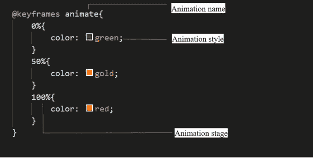
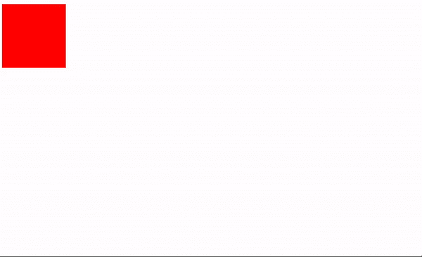
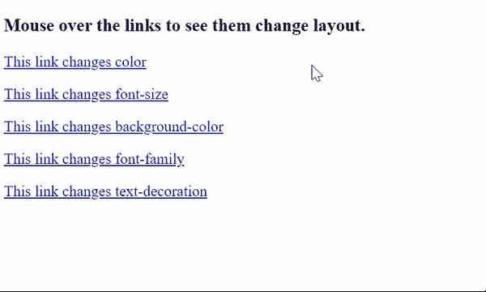
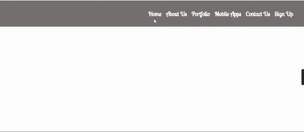
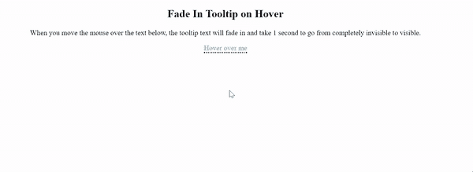

# 使用 HTML 和 CSS 的网页动画

> 原文：<https://medium.com/nerd-for-tech/web-animations-with-html-and-css-dfe3e014d557?source=collection_archive---------7----------------------->


弗洛里安·奥利佛在 [Unsplash](https://unsplash.com?utm_source=medium&utm_medium=referral) 上拍摄的照片

你好！

如果你对开发网站感兴趣，你需要学习如何使你的网站更有吸引力和用户友好。所以，这篇文章是给你的！

**简介**

和过去相比，现在很多事情都变了。因此，web 开发人员注重为他们的网站增加视觉体验，而不是仅仅向用户显示信息而不吸引他们的注意力。

由于人眼的自然反射，开发人员透露，人类更倾向于关注移动的物体。通过在网站上增加视觉体验，开发者可以让用户留在他们的网站上，同时，突出网站上的重要区域/信息也很重要。

**什么是网页动画？**

让事物在网络上移动被简单地称为网络动画。网页动画可以用在各种网页上。它们可以是当访问者在网站上滚动以引起对某个元素的注意时的小型网络动画，展示产品的动画，或者展示有趣和令人愉快的东西的促销网络动画。

如上所述，网页动画可以用来吸引人们的注意力，更有效地吸引人们，更清晰地交流。它不仅仅是一个静态的网页，它能吸引人们的注意力。网页动画应该流畅，有意义，并支持访问者的旅程。

目前，有数百个库、工具和插件可用于创建从简单到复杂的动画。有了 CSS 动画，就没有必要使用插件来降低网站的速度，因为用 CSS 可以很容易地制作动画。

我们可以识别另一种动画类型，称为过渡。CSS 转场也是动画。每当状态发生变化时，例如当它被悬停、聚焦、活动或定位时，您都可以用 CSS 转换来改变元素的外观和行为。

在这篇文章中，我将向你展示一些可以用 HTML 和 CSS 实现的动画和过渡。

**我可以制作哪些 CSS 属性的动画？**

当你添加动画时，你必须知道如何制作动画，以及在网络上制作什么动画。

一些 CSS 属性是可动画化的。这意味着可以在动画和过渡中使用。这些属性可以从一个值逐渐变为另一个值，例如大小、颜色、数字、形状、百分比等。

我们可以动画属性，如背景，背景色，边框颜色，过滤器，伸缩和字体。

**CSS 动画**

为了使用 CSS 动画，您必须首先为动画指定一些关键帧。在某些时候，关键帧保存元素将具有的样式。为了正确理解，我将解释我们将使用的基本属性。

**@关键帧**

我们使用关键帧来表示动画的开始和结束。它由三个基本要素组成:

动画名称

动画阶段

动画样式或 CSS 属性



作者截图

**动画属性**

定义@关键帧后，必须添加动画属性才能使动画正常工作。

这主要用于定义动画应该如何发生。动画属性被添加到要制作动画的 CSS 选择器(或元素)中。

有两个属性对于注意动画的效果非常重要。它们是动画名称和动画持续时间。

还有其他属性，如:

*   动画-计时-功能:定义动画的速度曲线或速度。您可以使用以下预定义的计时选项来指定计时:缓动、线性、缓入、缓出、缓入、缓出、初始、继承。
*   animation-delay:这个属性定义了动画开始的时间。该值以秒(s)或毫秒(ms)为单位定义。
*   animation-iteration-count:该属性指定动画应该播放的次数。
*   animation-direction:这个 CSS 属性设置动画应该向前播放、向后播放，还是在向前和向后播放序列之间来回切换。
*   animation-fill-mode:该属性指定当动画不播放时(开始前、结束后或两者)元素的样式。
*   animation-play-state:该属性指定动画是正在运行还是暂停。

例子



使用动画属性的示例

半铸钢ˌ钢性铸铁(Cast Semi-Steel)

```
div {width: 100px;height: 100px;background-color: red;position: relative;animation-name: example;animation-duration: 4s;animation-delay: 2s;}@keyframes example {0% {background-color:red; left:0px; top:0px;}25% {background-color:yellow; left:200px; top:0px;}50% {background-color:blue; left:200px; top:200px;}75% {background-color:green; left:0px; top:200px;}100% {background-color:red; left:0px; top:0px;}}
```

超文本标记语言

```
<div></div>
```

**CSS 过渡**

有许多不同种类的过渡在网站中被广泛使用，在用户体验中扮演着非常重要的角色。

如前所述，一个元素必须有一个状态变化才能发生转换，并且必须为每个状态识别不同的样式。确定不同状态的样式的最简单方法是使用伪类:hover、focus、active 和 target。

他们中的少数人:

**悬停**

`:hover`选择器用于在鼠标经过时选择元素。这样，当用户将鼠标悬停在某个项目上时，它就有能力抓住用户的注意力。这是一种显示哪些元素是可点击的有用方式。

我已经展示了一些例子悬停模式，我们可以使用下面的链接。

CSS 语法

```
:hover {
 css declarations;
 }
```

**链接悬停**

示例 1



链接悬停示例

半铸钢ˌ钢性铸铁(Cast Semi-Steel)

```
a.ex1:hover {color: red;}a.ex2:hover {font-size: 150%;}a.ex3:hover {background: yellow;}a.ex4:hover {font-family: cursive;}a.ex5:hover {text-decoration: none;}
```

超文本标记语言

```
<p><a class=”ex1" href=”default.asp”>This link changes color</a></p><p><a class=”ex2" href=”default.asp”>This link changes font-size</a></p><p><a class=”ex3" href=”default.asp”>This link changes background-color</a></p><p><a class=”ex4" href=”default.asp”>This link changes font-family</a></p><p><a class=”ex5" href=”default.asp”>This link changes text-decoration</a></p>
```

示例 2



链接悬停示例 2(导航栏链接悬停模式)

半铸钢ˌ钢性铸铁(Cast Semi-Steel)

```
ul li{list-style: none;}.navigation-bar{width:100%;height:100px;background: rgba(117, 113, 113,1);padding: 0 5px;font-size: 25px;font-weight: 700;padding-top: 10px;}.navigation-bar li{margin: 5px 5px;display: inline-block;list-style: none;}.navigation-bar li a{color:white;text-decoration: none;}.cool-link::after{content: ‘’;display: block;width: 0px;height: 2px;background-color: #fff;transition: width .3s;}.cool-link:hover::after{width: 100%;transition: width .3s;}.nav-right{width: 55%;font-family: ‘Lobster Two’, cursive;float: right;}.nav-right ul li {padding: 0px 2px; text-align: center;}.nav-right ul li:last-child{border-right: none;}
```

超文本标记语言

```
<div class=”navigation-bar”><div class=”nav-right”><ul><li><a href=”#” class=”cool-link”>Home</a></li><li><a href=”#” class=”cool-link”>About Us</a></li><li><a href=”#” class=”cool-link”>Portfolio</a></li><li><a href=”#” class=”coollink”>Mobile Apps</a></li><li><a href=”#” class=”cool-link”>Contact Us</a></li><li><a href=”#” class=”cool-link”>Sign Up</a></li></ul></div><! — nav-right -></div><! — navigation-bar ->
```

**图像悬停**

例子


图像悬停示例

半铸钢ˌ钢性铸铁(Cast Semi-Steel)

```
.social ul{list-style: none;}.social ul li{display:inline-block;padding: 5px 5px 5px 20px ;}.social ul li img:hover{transform: scale(1.2);}
```

超文本标记语言

```
<div class=”social”><ul><li><a href=”#”></a></li><li><a href=”#”></a></li><li><a href=”#”></a></li><li><a href=”#”></a></li><li><a href=”#”></a></li></ul></div><! — social ->
```

**工具提示**

工具提示通常用于在用户将鼠标指针移动到某个元素上时，指定关于某些内容的额外信息。

换句话说，它是当用户与图形用户界面(GUI)中的元素交互时出现的一条简短的信息性消息。

示例**(淡入工具提示)**



淡入工具提示(动画)

半铸钢ˌ钢性铸铁(Cast Semi-Steel)

```
.tooltip {position: relative;display: inline-block;border-bottom: 2px dotted black;color:deepskyblue;}.tooltip .tooltiptext {visibility: hidden;width: 120px;background-color: black;color: #fff;text-align: center;border-radius: 6px;padding: 5px 0;position: absolute;z-index: 1;bottom: 100%;left: 50%;margin-left: -60px;/* Fade in tooltip — takes 1 second to go from 0% to 100% opac: */opacity: 0;transition: opacity 1s;}.tooltip:hover .tooltiptext {visibility: visible;opacity: 1;}
```

超文本标记语言

```
<div class=”tooltip”>Hover over me<span class=”tooltiptext”>Tooltip text</span></div>
```

**菜单**

在 UI/UX 中，菜单上的动画起着很大的作用。菜单是一种动画，它让用户感到惊奇并保持互动，这样就可以在整个页面上看到所有的内容。

**装载**

加载是非常重要的，因为它有助于让用户在加载过程中得到娱乐。用户还会被告知进度水平，或者离加载完成还有多长时间。

**结论**

在这篇文章中，我向你展示了一些你需要知道的关于网络动画的事情。请记住，这是一个非常广泛的话题，但我知道你已经看到了动画的重要性，以及为什么你应该考虑在你的项目中使用 CSS 动画。希望你学到有用的东西！💖

[](https://www.buymeacoffee.com/sachinibhagya)