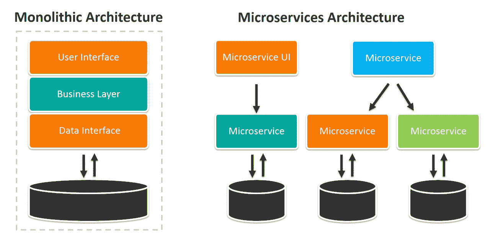
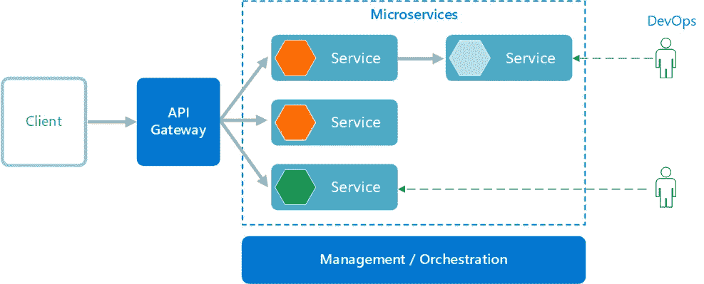
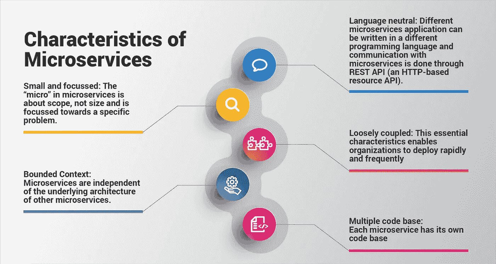
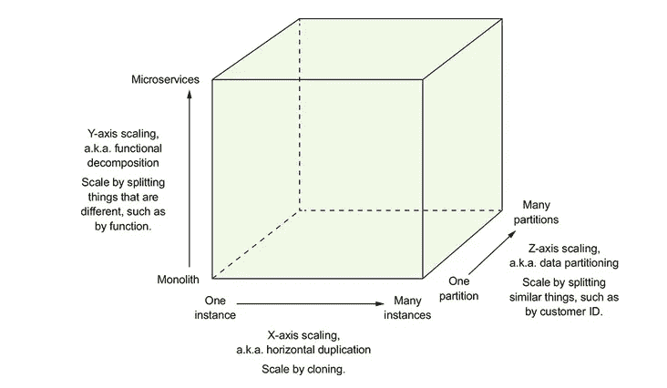
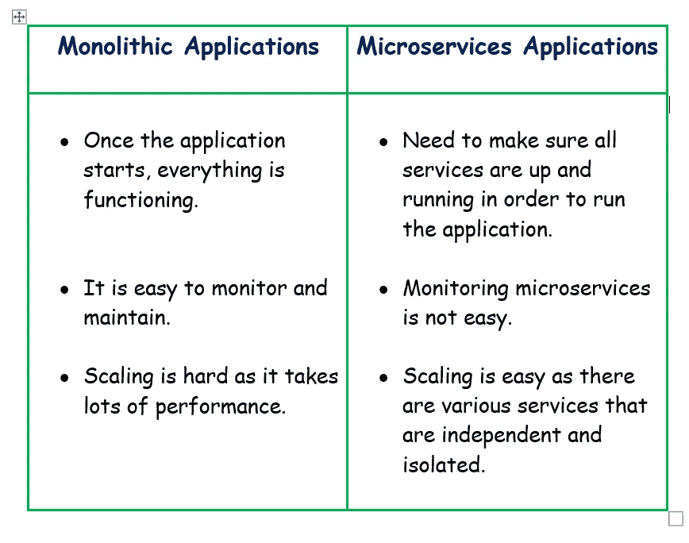
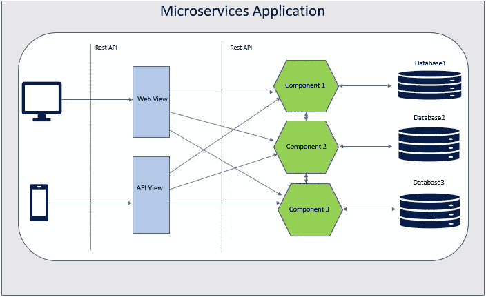

# 微服务的网络应用

> 原文：<https://medium.com/nerd-for-tech/web-applications-to-microservices-c0d4192c2dc9?source=collection_archive---------19----------------------->

2013 年，随着 Martin Fowler 的书和关于微服务的几次讨论，人们开始思考 web 应用程序的新架构视图。让我们关注如何从 web 应用迁移到微服务。

我们使用单片应用程序。整体架构由整个应用程序的单个可执行文件组成。这也可以是一场战争，耳朵或其他一些档案。单片应用程序的基本规则是将整个应用程序打包到一个文件中。

## 单片应用的缺点

📍如果您想做一个单独的更改(比如 UI/UI 颜色/简单的业务逻辑)，您可能需要压缩整个文件。为什么这很重要，因为你必须这样做；

📎测试整个应用程序(回归测试)

📎执行整个应用程序

📎可能会下载整个应用程序，将其发送到离线状态，然后发送到新版本

📎笨重的

📍必须维护一个庞大的代码库。

当生产中出现问题、诊断问题或任何事情时，您可能必须经历单独的支持流程，因为没有人知道代码的每个部分。即使你想调试，你也不知道它从哪里来，到哪里去。因此，调试过程变得非常艰难。

📍部署过程很艰难。

发生这种情况是因为你需要确定；

📎对方在抢交通？

📎所有模块、应用程序和依赖项都被离线发送或重新路由流量？

📎进行部署或安装？

因此，整个团队必须通宵工作，以确保一切顺利转移到新版本/新构建中。

## 单片应用的优势

💠容易测试。

集成测试变得很容易，因为我们可以编写一个测试用例，因为没有依赖。可以访问模拟对象中的所有内容。

💠易于监控。

因为它是一个应用程序，并且您知道确切的路径，所以监控该应用程序变得很容易。

参赛:https://images.app.goo.gl/3kFSYpg33CyC2nJg9

# 微服务架构

微服务基本上是一种实践或架构视图，它执行面向服务的架构所包含的一些有用的特性。

根据 Martin Fowler 的书，微服务架构的定义如下:

> “微服务架构风格是一种将单个应用程序开发为小型服务的**套件的方法，每个**在其自己的进程**中运行，并与轻量级机制(通常是 HTTP 资源 API)进行通信。”**

参考号:[https://images.app.goo.gl/UnHxGjreATdCGFUJ8](https://images.app.goo.gl/UnHxGjreATdCGFUJ8)

# 微服务的特点

参考:https://images.app.goo.gl/8QbntmHZZJgtYVuM6

●微服务有专门的生活目的。(领域驱动开发)

●需要对微服务有一个精确定义的范围。

●应该运行自己的流程；即:自己的 web 容器

●微服务不依赖他人。

●它们可以通过轻量级机制与其他服务通信。

Ex:主要是 HTTP(但不限于 HTTP)

●应该能够作为单独的服务进行扩展和部署，同时尽可能保持分散控制。

●应该能够使用不同的语言实现。

●应该能够利用小团队进行开发。(通常人数应该在 8-12 人之间)

让我们考虑一下微服务的可扩展性。

**➞ X 轴:数据克隆**

应用程序应该能够通过 x 轴向外扩展。万一一个实例不够用，您应该能够产生另一个实例并继续下去。

使聚集

添加更多数据中心

**⬆︎ Y 轴:按功能、服务或资源划分**

应该可以进行功能分解。微服务来了，适合那里。

可单独扩展。

**⬈ Z 轴:通过查找进行分割**

应该能够分片(数据库分片)

应该能够在地理上划分流量。

例如:欧洲客户被定向到欧洲服务器，亚洲客户被定向到亚洲服务器，等等。

# 如何开发微服务应用

●每项服务应能使用不同的语言。

如果你使用 Java，你可以使用诸如 Spring Boot、下拉向导等框架。

●领域驱动的设计

你需要确保你的服务不依赖于其他因素。

●您的服务应该能够随时从系统中移除和插入。

●在部署您的服务时，您不应该对其他服务有硬性依赖。

●必须实现服务弹性和容错。

例如:假设您将从您的服务 a 中调用另一个服务 B。如果服务 B 超时/失败/不工作，您应该能够维持这种情况。这就是你所谓的“容错”我们可以通过以下方式实现这一目标:

故障转移机制

代理

断路器模式

# 实施微服务时的要求

●应该具有从消费者到后端的可见性。

●你需要重组你的团队，团队成员应该来自:

UI —用户界面

DB —数据库

Java /服务开发

QA——质量保证

文学学士——商业分析

你需要一个全栈团队。

实现微服务和重构的一个方面是在整个团队中分配职责。

# 实施微服务的优势

💠如果发生任何生产问题，团队都知道发生了什么。因此，很容易理解和诊断问题，因为一个团队由 10-12 名成员组成，这些成员了解整个服务。

💠尽管它很复杂，但是服务是独立的。所以，这只是你的服务。因此，通过故障隔离减少了停机时间。

💠服务是独立可扩展的。

💠如果开发团队觉得所实现的语言没有达到预期效果，并且框架已经过时，那么很容易迁移到另一种语言或框架，因为该服务与其他服务没有任何依赖关系。

💠节省成本，因为它是按需和弹性产卵可以应用。

💠保持团队成员之间的沟通变得很容易，因为每个团队都可以进行面对面的沟通或跨越不同的全球区域。

💠重组团队很容易，一个团队必须包括不同开发领域的所有专业知识。

# 实施微服务的缺点

♨️:当我们分散复杂性时，很难监控应用程序。(因为这不是单个应用，而是多个服务)

♨️微服务与其他服务对话需要一些延迟。

♨️:测试并不容易，因为你的服务是孤立的。执行集成测试真的很难。

♨️应该注意版本控制和部署，因为如果您更改版本，依赖的服务可能会有影响。

# **单片和微服务应用之间的差异**

参赛:https://images.app.goo.gl/dQtMM7wwKJKWkUwQ7

# 微服务应用

💡**理念:你建造它，你拥有它！**

✹服务应该有一个专门的目标。

✹服务应该能够独立扩展。

✹服务应该能够由一个单独的团队来维护。团队对你的申请负责。

✹服务应该能够以任何期望的语言实现。

参考号:[https://images.app.goo.gl/1iHMR8nstvFRMNwA9](https://images.app.goo.gl/1iHMR8nstvFRMNwA9)

# 参考