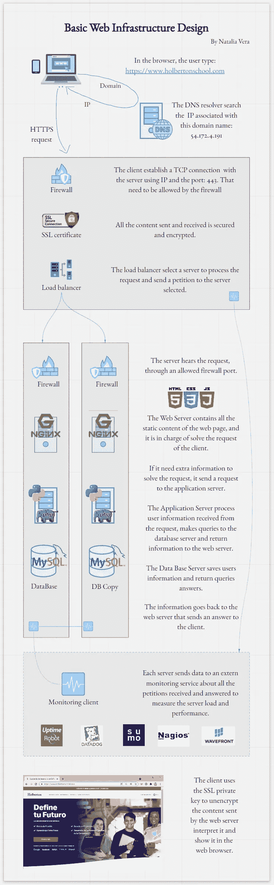
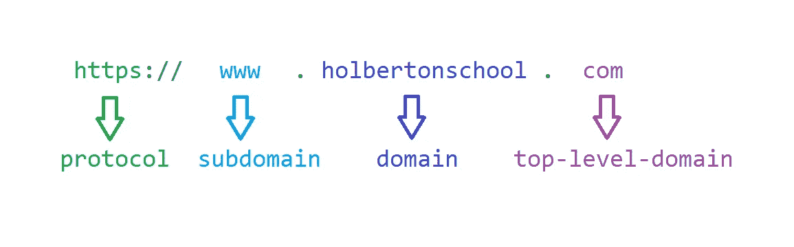
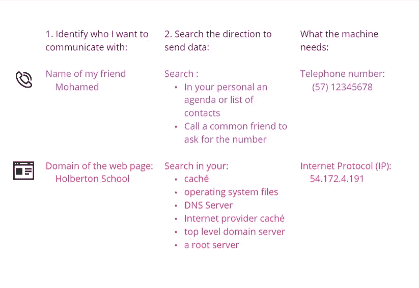
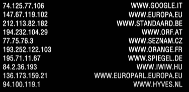
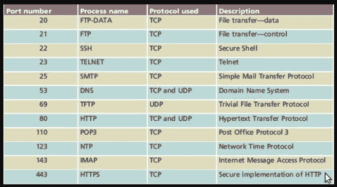
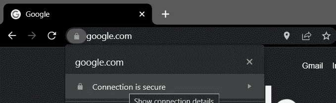

# 软件开发人员的网络基础

> 原文：<https://medium.com/nerd-for-tech/web-browser-magic-d5a8f676812f?source=collection_archive---------8----------------------->

神奇！你按下回车键，几乎瞬间你就可以在浏览器中看到你朋友的照片和其他朋友的评论，格式非常漂亮。

[https://www.holbertonschool.com](https://www.holbertonschool.com)

这是一个 URL。让我们来看看当你在电脑上输入网址时，你的视线背后发生了什么。你的浏览器向互联网发送哪些信息，信息是如何处理和发回的，信息是如何以你能理解的方式到达你的手中。

# 简历

# 电话隐喻

当你想给某人打电话时，你会记得他或她的名字。然后，您或您电话的自动系统需要找到正确的号码来发送开始呼叫的请求。

纤维网方向的部件。

如果你没有这个号码，你可以让一个普通的朋友和你分享这个号码，然后你就可以开始拨打这个号码了。

在电话呼叫和互联网连接之间开始通信的过程。

互联网连接的情况也是如此。

你的网页有了域名，你的浏览器需要找到相关的号码。这个数字被称为互联网协议或 IP，你的电脑会搜索你自己的多个议程和其他服务器的议程，直到你能找到它。

IP 地址和域名的示例

在我们的例子中，浏览器从域名 [www.holbertonschool](http://www.holbertonschool.com.) 开始。并在不同的议程中搜索，直到找到相关的 IP 号码:54.172.4.191

# **DNS 请求**

我的浏览器搜索多个议程意味着什么？
让我们看看，当 IP 未在浏览器缓存中注册时，我们的浏览器会向哪个或哪些所有者寻求帮助。

*   您的浏览器运行“gethostbyname”功能。它检查该域或主机名是否在操作系统的本地“hosts”文件中注册。
*   您的浏览器向 DNS 服务器发送请求。域名系统服务器首先在自己的 caché中进行搜索，然后:
    -您的互联网提供商 caché
    -向顶级域名发送请求。它是一个服务器，保存根域服务器的副本，关于所有带有特定后缀为'的网页。' com '。有些与国家相关联(。co，。es，。mx)或网页用途(。博物馆，。航空，。电视，。coop)。
    -向根服务器发送请求。包含世界各地网页的信息。这种有 13 个。

注册可以直接包含 IP，也可以包含另一个域名。在这种情况下，浏览器会根据给定的域再次开始搜索 IP。

> 当浏览器找到或收到 IP 地址时，它就准备好发送一个建立连接的请求！

# 发送信息的方式

> 发送和接收数据有多种方式。其中一些关注数据的可靠性，另一些关注传输速度。

想一分钟。如果你正在进行视频通话，你不在乎在这个过程中丢失一些图像，但你需要它感觉好像对方在同一个地方。这个协议叫做 UDP。

另一方面，当我们共享一个网页时，我们需要发送它的服务器和接收它的服务器中的每一个单词和像素都是平等的。

> 网页通常通过 TCP 传输。

传输控制协议是通过 IP 地址上的网络连接发送/接收信息的一种可靠且有序的方式。

在发送下一个包裹之前，每个包裹的接收都被确认。它包括一个识别包裹丢失或损坏的临时标签。这保证了接收的每个字节都与发送的字节相同。

如果这两个服务器是绅士，它的对话将听起来像这样:

1.建立连接:

> -早上好先生，你有时间吗？早上好，先生。我有空。我怎么帮你？

2.请求网页

> -你能把网页发给我吗？

3.发送构成网页的不同部分或文件。

> -是的，当然，这是第一部分。
> -第一部分已经收到，谢谢。
> -太好了，让我们进行第二部分。
> ——收到。

请记住，网页是由 HTML 文档构成的，由 CSS 文档格式化，通过 javascript 文档获得功能，还可以包含图像和图标。

# 防火墙

作为一家拥有一个通用电话号码和一些分机号码来与组织的不同部门进行通信的公司，服务器拥有自己的 IP 地址和许多端口。

每个端口都被配置为接收特定类型的信息，以特定的方式进行处理，并使用特定的协议或格式进行响应。

最常见的端口号、通过该端口进行通信所使用的协议以及最常见的用途。

服务器有许多私有和机密信息、业务逻辑和与数据库连接的凭证。

服务器通常关闭大多数端口，并试图通过安全连接接收所有请求。

> 根据称为防火墙的一组规则，允许或禁止传入的连接。

防火墙就像办公室的守夜人。对请求进行分析，以查看要使用哪个端口进行连接、发送方的 IP 方向、请求的内容或请求的操作。

> 网页通常通过端口 443 传输，一些安全性较低的旧网页通过 80 传输。

在 HTTPS 连接中，请求将通过端口 443 被侦听和应答，通过其他端口的流量将被禁止，以避免黑客攻击、信息窃取以及他人控制服务器。

# HTTPS/SSL

我的网络浏览器如何知道我有一个安全的连接？安全连接是什么意思？

在通过互联网传输信息的许多方式和端口之间，有许多协议可以被拦截，内容可以被不同于发送者和预期接收者的人清楚地处理。

> 末尾带有 S 的 HTTPS 被定义为实现安全连接协议。

它基于 HTTP 协议，意思是“超文本传输协议”。并且最初被创建来发送纯文本，作为标记语言 HTML 或 CSS。

它允许在向端口 80 发送请求时显示所有网页内容，唯一的问题是安全性。在安全套接字层出现之前，任何人都可以看到服务器和客户端之间发送的数据。

SSL 是一种协议，通过加密来保护两台机器之间发送的数据(如密码、个人数据、信用卡号和其他内容)。目前，它几乎被用于互联网上的每一个网页，尤其是在线商务。它使用 IP 地址和端口 443 来建立网络连接。

> 当你访问一个网页时，你可以通过查看浏览器的地址栏来知道该网页是否有地址栏。

网页 URL 前的挂锁。

它的工作原理类似于电子邮件服务中实现的安全性。每个人都知道你的电子邮件地址，可以给你发邮件，但只有你知道密码才能打开所有收到的邮件。

> 这就是逻辑。服务器向每个人发送其公钥并发送请求，但是内容只对拥有私钥的服务器可用。

内容不受密码保护，相反，它被加密成没有可读性的纯文本。私钥允许您将内容翻译成可读且有意义的文本。

> 在对网页的组织所有者进行调查以确定该网页内容的责任后，该网页将收到此证书。

服务器有两个密钥，一个公钥和一个私钥。公钥在证书中，客户端用它来加密将要发送的内容。加密的内容只能用只有服务器才有的密钥打开和读取。

用户发送的内容是它自己的公钥，因此服务器可以用它来加密发送给用户的信息，并且只有客户端可以读取。

# 负载平衡器

> 网页不能依赖于唯一的机器来提供内容。

通常他们有许多服务器，接收我们请求的服务器通常会将请求发送到另一个服务器。第一个称为负载平衡器。

负载平衡器使用一种算法来决定哪个服务器将发送请求。例如，它可以按轮次为每个服务器分发一个请求(循环法)，将下一个请求发送到活动连接数最少的服务器(最少的连接数)，或者将来自同一 IP 地址的所有请求发送到同一服务器(IP 哈希)。

在任何情况下，请求都被发送到一个 web 服务器，该服务器将生成应答和服务页面的请求。

# 网络服务器

终于！这个服务器会回应你的请求。

> web 服务器是一种软件，它通过万维网接收和回答来自客户机的 HTTP 或 HTTPS 请求。

它包含所有静态内容(在不同用户、国家和 IP 之间不会改变的内容)，如图像、HTML 通用结构、CSS 样式表或纯文本文件。

在互联网上运行网络服务器最常用的软件是 pache 和 Nginx。

# 应用服务器

并非所有的页面都是静态的，或者向每个人显示相同的信息。脸书向我的朋友展示了不同于你的朋友、我的数据和我的照片。

> 动态网页需要进行计算来获取和处理来自其他 API 或数据库的数据。

动态网站允许用户保存自己的数据并与页面内容交互:在购物车中保存订单、关联用户信息、拥有个人资料等等。

为此，网页内容需要由运行应用程序、通过查询与数据库通信以及管理用户信息的应用服务器生成。

> 应用服务器识别数据库或 API 需要什么信息，发出调用，接收数据，并对其进行处理。

然后，将它返回给 web 服务器，该服务器将个性化数据放入 web 页面的其余部分，并将响应发送给浏览器！

编写应用服务器最常用的编程语言是 PHP、Node、Python 和 C++。

# 数据库服务器

数据库保存信息。

它可以保存在关系或非关系数据库中。它接收查询，并根据请求返回组织好的答案。

最常见的数据管理系统是 SQL、MySQL、Oracle、MongoDB 和 PostgreSQL。

现在…继续享受互联网的魔力吧！

# 关于我

我是一名热情的 Python 后端开发人员，有两年创建 API 和 web 应用程序后端的经验。我在这里创建的内容对指导其他人了解软件开发的基础很有用。

如果你想和我建立联系，请在 [GitHub](https://github.com/Naveduran) 、 [Twitter](https://twitter.com/NaVeDuran1) 或 [Linkedin](https://www.linkedin.com/in/naveduran/) 上关注我。

我希望你喜欢这次阅读！

娜塔莉亚·维拉·杜兰制作。

# 参考

 [## 网络如何工作-学习网络开发| MDN

### 《网络工作原理》提供了一个简单的视图，展示了在电脑上的网络浏览器中查看网页时会发生什么…

developer.mozilla.org](https://developer.mozilla.org/en-US/docs/Learn/Getting_started_with_the_web/How_the_Web_works)  [## 什么是顶级域名(TLD)？

### 顶级域名(TLD)是网站的后缀或扩展名。大约一半的网站使用顶级…

raventools.com](https://raventools.com/marketing-glossary/top-level-domain/)  [## 防火墙是如何工作的

### 防火墙是如何工作的？当您的计算机有防火墙保护时，进出它的所有东西都…

www.bullguard.com](https://www.bullguard.com/es/bullguard-security-center/pc-security/computer-security-resources/how-does-a-firewall-work.aspx)  [## 什么是 TCP/IP？

### 最初由 DARPA(美国国防高级研究计划局)于 20 世纪 70 年代开发，TCP/IP 开始…

www.avg.com](https://www.avg.com/en/signal/what-is-tcp-ip)  [## DNS 如何工作

### 解释当你浏览一个网站时会发生什么的漫画。

豪登斯工厂](https://howdns.works/)  [## 为什么选择 SSL？使用 SSL 证书的目的

### SSL 是我们安全互联网的支柱，它保护您的敏感信息在世界各地传输…

www.sslshopper.com](https://www.sslshopper.com/why-ssl-the-purpose-of-using-ssl-certificates.html)  [## HAProxy 和负载平衡概念介绍|数字海洋

### HAProxy 代表高可用性代理，是一个流行的开源软件 TCP/HTTP 负载均衡器和…

www.digitalocean.com](https://www.digitalocean.com/community/tutorials/an-introduction-to-haproxy-and-load-balancing-concepts)