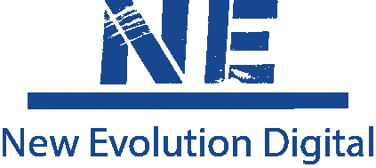

# 网页设计——销售风格！

> 原文：<https://medium.com/nerd-for-tech/web-design-sales-style-f9cac8813a90?source=collection_archive---------21----------------------->

约翰·施诺布里奇在 [Unsplash](https://unsplash.com/s/photos/sales?utm_source=unsplash&utm_medium=referral&utm_content=creditCopyText) 上的照片

本周，我在 JavaScript 生活方式播客中提到，杰西·梅德拉诺和我已经开始组建一个名为“新进化数字”的网络机构。这不是偶然的。首先，找到和你一起工作的人是非常重要的。第二，我们都来自销售背景，提供了一种独特的方法来进行 web 开发，而不是大多数人所说的经典 web 开发。

在某种程度上，我们是从落后的方向而不是正面来看待它的。当然，了解顾客想要什么始终是关键。但是，客户需要什么来实现他们追求的目标要重要得多。有时可能会有点好斗，但这是有道理的。有时候撕掉创可贴会疼。

我们到目前为止建立的所有冷线索都必须有重大改变，以使它们在合理的水平上发挥作用。现实情况是，有大量的临时网站在运行，但现实情况是，它们需要彻底改革，才能成功实现它们真正想要做的事情。这就是我的目的。我想更进一步。我想把这些破旧的网站变成一个销售发电站，最终用户在使用后会说“哇！”。

那么这看起来像什么？度量标准。数字。确凿的证据。这里面有很多东西，虽然我可以谈论其中的一些，但我不能把多年的销售经验打包给其他人消费。

首先，找到合适的客户。通常，我要联系的客户都在我的区域内，因为我是老派的销售人员，喜欢与人面对面坐下来进行一对一的交流。他们的网站会有问题。这可能是因为他们正在使用 Wix 或 Squarespace 之类的网站构建器，也可能是因为他们有一个可以追溯到 21 世纪初的网站。

其次，在与潜在客户会面或沟通之前，我会花时间写一份报告。这份报告实际上是许多不同报告的组合，为我提供了各种指标。这是钥匙:

*   表演
*   WCAG(无障碍)
*   安全性

这是我最想讨论的三个话题。特别是如何利用增长来促进更好的有机增长。这与经验和设计相结合，就网站而言，可以将失误转化为成功。

我不能告诉你有多少网站错过了使用 H1-h6 标签的正确规则。有多少网站没有使用语义 HTML，或者有多少网站臃肿不堪。

这里有一些必须要谈的要点。

*   装入时间

这非常重要。你的客户应该在几毫秒内进入并使用你的网站。如果花费的时间超过这个时间，你会让很多人放弃你的网站，因为他们只是不想浪费时间。我们是一种文化，是追求即时满足的一代，如果你的网站跟不上，那么你就失去了顾客。那是谁的错？网站所有者。他们有能力确保他们的网站正在全力以赴。

减少这种情况的一个快速方法是使用一个 SPA，比如 React.js 应用程序或 Next.js 应用程序(如果有后端，Next 在技术上更好，因为您可以利用服务器端呈现……)

*   易接近

> “越来越明显，主要的搜索引擎，如谷歌，正在宣传网页可访问性技术的 SEO 好处。看看几个月前发生的事情，谷歌推出了 Lighthouse，这是一款开源的自动化辅助工具，供 web 开发人员用来提高网页质量。虽然这个工具并不是唯一的，但是有很多这样的工具。然而，这是值得注意的，因为 Lighthouse 附带了谷歌为网络开发人员提供的[工具](https://developers.google.com/web/tools/chrome-devtools/)，这些用户已经在测试网站和应用的性能。
> 
> 回顾过去，我们可以看到网站的可访问性与搜索引擎优化(SEO)的基本要素有着密切的关系。几乎无一例外，谷歌在有机搜索中更好地对元数据、内容、视觉设计和开发中包含的可访问性技术的网站进行排名。为什么？搜索引擎爬虫看不见也听不见，只用一个键盘，和很多残疾人差不多。此外，爬虫依赖内容来评估、确定相关性和对站点进行排名，而不是图像、音频或视频(目前还不是)。虽然这有利于视力、听力和运动技能受限的人，但它也可以帮助网站访问者应对认知挑战，如阅读障碍和英语作为第二语言(ESL)。
> [来源](https://blogs.perficient.com/2018/01/12/website-accessibility-benefit-seo/#:~:text=Almost%20without%20exception%2C%20Google%20ranks,development%20better%20in%20organic%20search.&text=Also%2C%20crawlers%20rely%20on%20content,%2C%20or%20video%20(yet).)

如果你擅长测试，这是有意义的，因为这些爬虫几乎只是测试你的站点，看看你是否有关键组件。因此，如果你的网站没有语义 HTML、Aria 角色、Alt 标签和其他关键的易访问性标签和结构，那么你基本上从一开始就失败了。具有讽刺意味的是，如果您只是将它合并到您的构建过程中，检查以确保每个元素都被错误地锁定，这不是您将来必须要解决的事情。您可能会注意到，即使是这些文章，也几乎总是有一个 Alt 标签。

*   设计

设计在很多方面都是主观的。你会像数百万其他人一样有几乎相同的想法，但是你如何实现它们以及以什么样的顺序实现它们会有很大的不同。例如，我喜欢关注点击量，让我的客户到达我希望他们到达的地方。如果我想让顾客买东西，我希望他们能够访问我的登录页面上的项目。我想让他们了解并开始看到我在销售产品。如果我是销售服务，我想有一个联系方式，并从我的主页方便安排时间见面。具有讽刺意味的是，我的下一个项目将是编写我们自己的预订组件，以更好地满足我们的需求。如果你想要一个预建的选项，仔细看看日历。就其本身而言，它做得相当不错。

现在安全是显而易见的。您需要确保自己不会受到跨站点攻击，比如拥有私人数据等。我完全建议您在工作流程中添加类似 0Auth 的东西，而不是保护用户名和密码，在您的网站中添加类似 Stripe 的支付处理器来处理信用卡号码也是如此。如果出现漏洞，您将依靠价值数十亿美元的基础架构来保护客户和顾客数据。与密码和信用卡号可能造成的损害相比，暴露地址和电话号码算不了什么。

这是一个冷酷的事实，我们大多数人没有足够的资源来完全充实一个安全的认证和支付系统。我们可以拥有数据，并做我们能做的事情，但最终，拥有加密和安全的数据管道需要花费资金和资源，而大多数客户不愿意支付，或者根本没有资源来这样做。

现在，让我们说清楚。我没有给出任何信息，大多数人已经知道，如果你开发网站。那么，让我们来谈谈如何利用销售专业知识将销售提升到一个新的水平。所有这些都属于 UI/UX 设计选择的范畴。

*   行动呼吁

你要求你的顾客做什么？你的信息清晰简洁吗？它是否引发了正确的反应，或者说它没有给人留下深刻的印象？

*   点击以优化内容

让客户点击多少次才能让你赚钱？超过 5 了吗？这在大多数情况下太多了(主观)。把每一次点击想象成一秒钟。我们想让顾客在 1-2 秒内到达我们想要的地方，因为我们想让他们觉得他们得到了即时的满足。

*   接触

有没有快速联系你的方法？你在使用 Mailto & tel 链接吗？你在重要的地方有联系方式吗，以确保你的客户觉得你愿意与他们交谈？

*   电子商务

顾客结账需要多长时间？从找到一件商品到获得订单确认需要多少次点击？10 -15?太可怕了。仔细看看你的搜索是如何工作的，你是否在你的发明者搜索的时候重新渲染他们，这样他们就不用点击搜索按钮了？你可以考虑一下。

我在无线和汽车销售部门工作了很多年，他们之间有一个共同的关键部分。植入式广告。转移库存，并确保在向客户展示时展示出最好的一面。一个网站也不例外。这是你在互联网上的脸，如果你有蓬乱的胡子，看起来像一年没洗澡，你就不会被录用。如果你的穿着给人留下深刻印象，看起来平易近人，你就会赢得顾客，如果你做得对，你会给他们带来惊人的顾客体验。

新进化数字蓝色标志

感谢您的阅读，敬请关注新进化数码的更多信息！

想了解更多关于 JavaScript 生活方式播客的信息，请访问这个页面！：

JavaScript 生活方式播客哪里听:[这里！](https://www.notion.so/kyleswillard/Where-to-Listen-a9aadbdbfc3041ada4846d4e82f0d1f3)