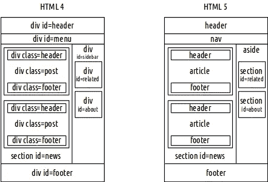
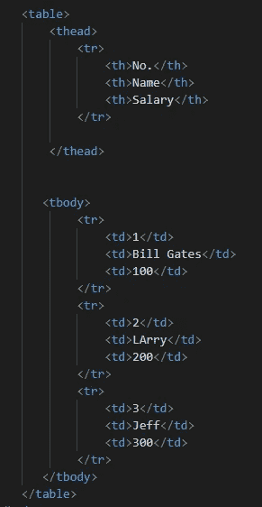
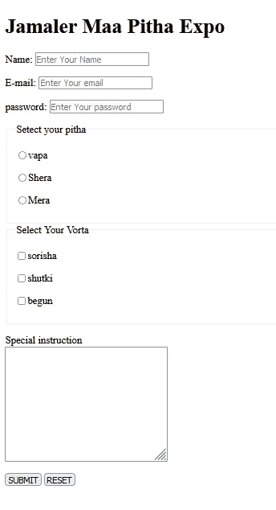
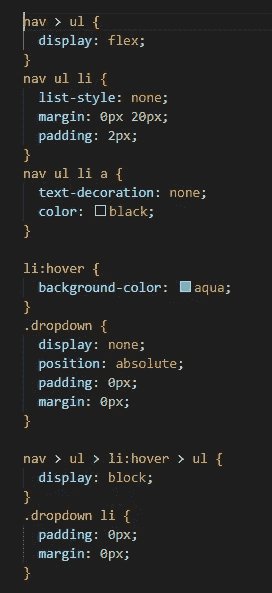
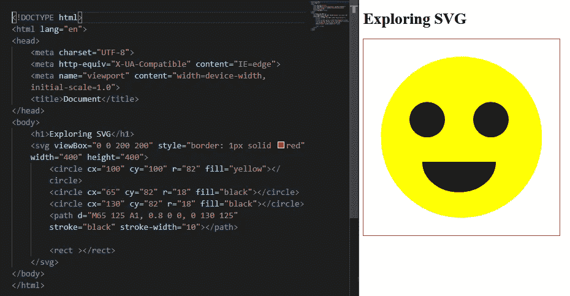

# Web 开发第 7 天(里程碑 2:响应性 Web 布局)

> 原文：<https://medium.com/nerd-for-tech/web-dev-streak-day-7-3bf05fc0ba9b?source=collection_archive---------19----------------------->

> 模块 6: HTML 重温(语义标签、音频、视频、表格、表单、下拉列表、SVG)

# 1.HTML5 音频、视频、Youtube 视频、嵌入 iframe

> 标签用于在文档中嵌入声音内容，比如音乐或其他音频流。标签包含一个或多个具有不同音频源的标签。浏览器将选择它支持的第一个信号源。标签和之间的文本只会在不支持元素的浏览器中显示。HTML 支持三种音频格式:MP3、WAV 和 OGG。不要忘记设置控制，否则您的音频将不会加载到网页上。
> 
> 标签用于在文档中嵌入视频内容，如电影剪辑或其他视频流。标签包含一个或多个具有不同视频源的标签。浏览器将选择它支持的第一个信号源。标签和之间的文本只能在不支持元素的浏览器中显示。
> 
> 如果您想在网页中嵌入任何网站的任何视频，您可以在共享选项中找到嵌入代码。只需从那里复制代码并粘贴即可。例如，在 youtube 的例子中，你可以在共享选项中找到嵌入代码。只是做一个复制粘贴。
> 
> 标签指定了一个内嵌框架。内嵌框架用于在当前 HTML 文档中嵌入另一个文档。

# 2.HTML5 语义标签部分文章页眉页脚主页面

> 在谷歌上搜索“HTML 4 Vs HTML5”，看看两者的区别。通常，我们使用
> 
> 标签设计网页的所有块，但是这没有意义，并且在抓取时也给谷歌搜索引擎带来了问题。因此，为了解决这个问题，HTML5 引入了一些语义标签，如，使网页更有意义，也更容易抓取。它还介绍了标签和标签。

HTML4 与 HTML5

> 除此之外，它还增加了许多新功能，将 HTML5 带入了另一个维度。

# 3.HTML 表格，表头，表体，表格行，表格数据

> 标签定义了一个 HTML 表格。每个表格行都定义有一个标签。每个表头都定义了一个
> 
> | 标签。每个表格数据/单元格用一个 | 标签定义。 |
> 
> 默认情况下，元素中的文本为粗体并居中。元素中的文本是规则的，左对齐。

一张桌子

# 4.Html 表单输入标签字段集图例文本区提交

> 你已经知道一些常见的输入标签，如文本、电子邮件、密码和单选按钮。单选和复选框类型输入应包含在
> 
> 标签用于将表单中的相关元素分组。它在相关元素周围画一个框。标签用于定义
> 
> <fieldset>元素的标题。</fieldset>

> 标签定义了一个多行文本输入控件。它经常在表单中使用，用来收集用户输入，如评论或评论。

# 5.简单的导航条和文件间的内部导航

> 标签定义了一组导航链接。注意，并不是文档的所有链接都应该在一个
> 
> 元素中。元素仅用于导航链接的主要部分。
> 
> 在
> 
> 标签中使用一个
> 
> *   包含所有的导航链接。现在，按照你的想法来设计它们，比如去掉文本装饰，让显示变得灵活，增加一些空白。您也可以添加一些颜色，并给出一个“:悬停”的效果。

导航栏

# 6.鼠标悬停时添加嵌套菜单下拉选项

> 使用
> 
> *   和在现有导航链接内创建一些超链接，然后将显示更改为无，使其不可见。稍后，使用“nav > ul > li”选择父导航链接，并添加伪悬停类“nav> ul> li:hover ”,现在还可以通过“nav>ul>li:hover>ul”选择悬停时必须显示的链接，并将显示更改为 block。此外，将新添加的下拉选项位置设置为 absolute，以固定菜单的位置，否则它会将其他内容推到它下面。

下拉菜单 CSS

# 7.(高级)探索 SVG，创建 SVG 笑脸

> 你可以很容易地在你的网站上画画。为此，您必须借助于定义 Web 图形的<svg>标签。SVG 代表可缩放矢量图形。SVG 有几种绘制路径、方框、圆、文本和图形图像的方法。<circle>、<rect>、<arc>、<polygon>、<path>。</path></polygon></arc></rect></circle></svg>

绘制笑脸的 SVG

> 只是试着去探索，对它有一些了解。现在不需要为此烦恼。

# 8.所有的 HTML 标签，你需要知道的关于 HTML 的一切

> 现在，你的工作是在谷歌上搜索所有的 HTML 标签，并一个接一个地浏览它们。花些时间阅读它们。不知道所有的标签也没关系，但是你应该知道所有经常使用的标签。

 [## 所有 HTML 标签列表

### 在这个页面包含所有 HTML 标签列表与描述(涵盖最新的 HTML5 标签)。以前的 HTML 版本标签是…

way2tutorial.com](https://way2tutorial.com/html/tag/index.php) 

> 以后，如果你需要使用任何标签，你可以在某人或谷歌的帮助下轻松地学会使用，这应该是你的目标。因为你不需要知道所有的事情就可以开始。

# 9.所有 HTML 属性标题属性、注释、替换、数据

> 每个 HTML 标签都有一些属性，可以根据不同的目的进行设置。因此，您必须知道属性以及使标签工作的值，但是不一定要知道所有的属性和值。你会在前进的过程中学习它们。但是，永远要热衷于了解和学习会为你带来很多机会的东西。

 [## HTML 属性

### 组织良好，易于理解的网站建设教程，有很多如何使用 HTML，CSS，JavaScript 的例子…

www.w3schools.com](https://www.w3schools.com/tags/ref_attributes.asp) 

> 您可以使用“Ctrl + /”轻松注释掉 HTML 或 CSS 中的一行。
> 
> “data-*”属性用于存储页面或应用程序专用的自定义数据。这个属性使我们能够在所有 HTML 元素上嵌入定制的数据属性。

# 10.包好所有东西

> 当你做练习时，做些笔记，这对你以后复习所有这些题目会有帮助。它能在几分钟内让你的大脑变得明亮。所以，请认真考虑这个建议。

# 暂时就这些了……

## &虚拟的👏👏👏拍手不会让手掌疼😏😏