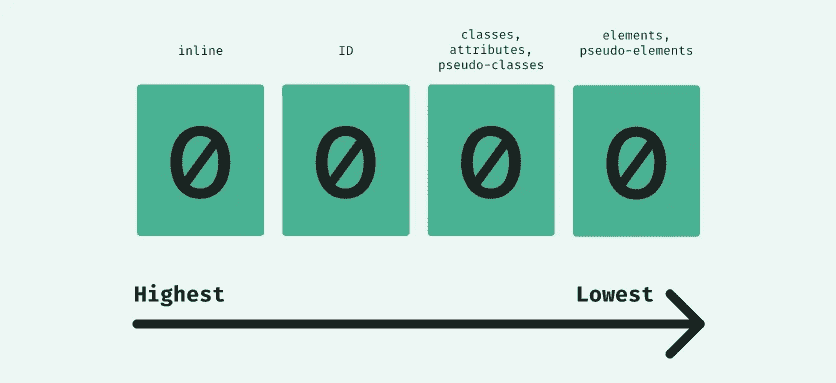
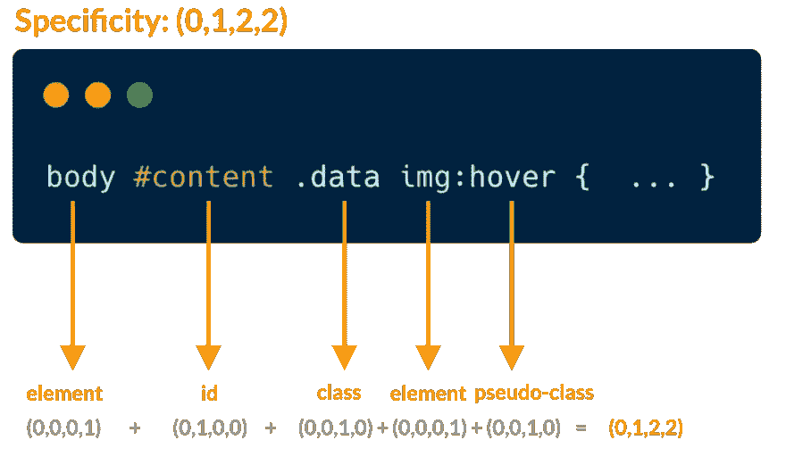
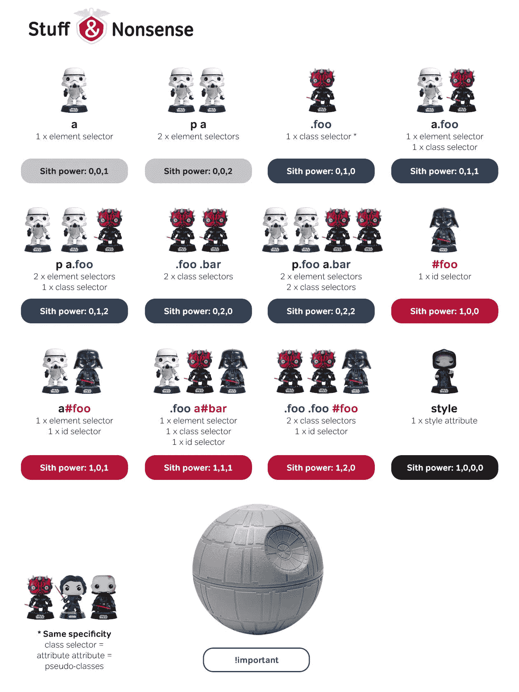
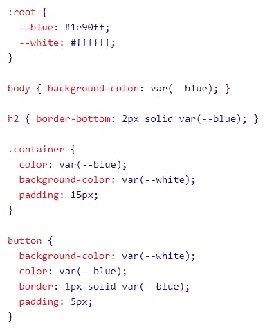
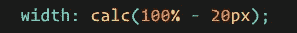
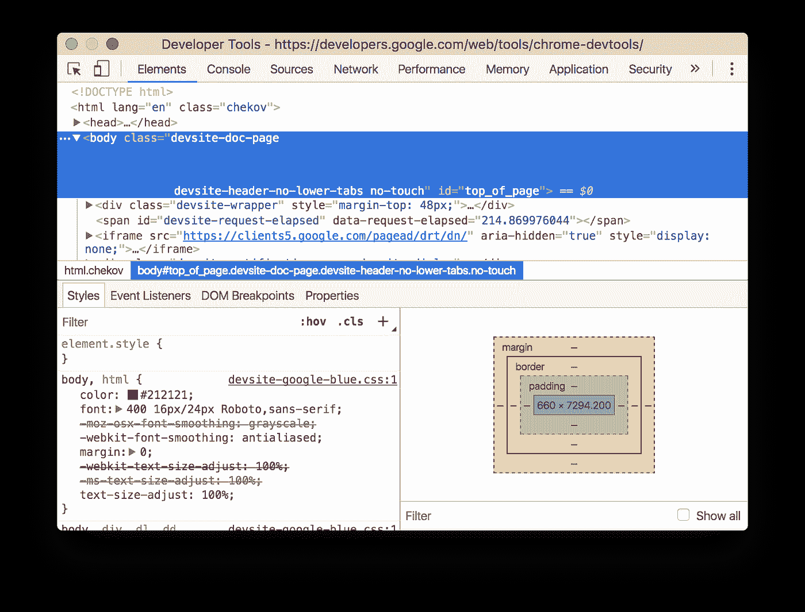

# Web 开发第 10 天(里程碑 2:响应性 Web 布局)

> 原文：<https://medium.com/nerd-for-tech/web-dev-streaks-day-10-1a0ec3b9552c?source=collection_archive---------16----------------------->

> 模块 8.5: CSS 概述、调试和未来策略

# 1.CSS 特异性，风格优先&！重要的

> 毕竟，这些 CSS 的实践，在你的头脑中是否遇到过“CSS 的意义是什么？”
> 
> CS 代表**【层叠样式表】**虽然你知道样式和表的意思，但你可能不知道**层叠这个词的意思。**你最好在谷歌上搜索一下，它会告诉你它的意思是**(水)快速大量地向下倾泻**
> 
> 因此，从这里你可以了解 CSS 是如何工作的，它主要从**向下**工作。相同属性的最新规则仅在**覆盖**之前的规则时有效。
> 
> 还有一种叫做**特异性**的东西你应该知道。如果有两个或更多的 CSS 规则指向同一个元素，浏览器会遵循一些规则来确定哪一个是最具体的，从而胜出。将**特殊性**想象成一个分数/等级，它决定了最终将哪些样式声明应用于一个元素。

## **特异性层次:**

> 内联样式> id >类、属性和伪类>元素和伪元素

**特异性层级**

## 这就是你应该如何**计算**特异性:

> 从 0 开始，样式属性加 1000，每个 ID 加 100，每个属性、类或伪类加 10，每个元素名或伪元素加 1。给你举个例子:

**计算特异性**

> 最重要的是，有一张**王牌**对你来说是用来比普通的&增加财产/价值的重要性，那就是**！CSS 中重要的"**规则。

> 事实上，如果你使用**"！重要的"**规则，它将覆盖该元素上该特定属性的所有先前样式规则！
> 
> 但是当没有其他选择时，您应该使用这个属性。所以，**使用**时要小心**！重要"**

# 2.(高级)CSS 自定义属性，变量和计算

> " **var( )"** 函数[自定义属性]用于插入 CSS 变量的值。使用 CSS 变量的一个好方法是当涉及到你设计的颜色时。您可以将它们放在变量中，而不是一遍又一遍地复制和粘贴相同的颜色。函数的作用是插入一个 CSS 变量的值。
> 
> **变量(- - *名称，值* )** 【变量名必须以两个破折号**(-)**开头，并且区分大小写！]

> 要创建具有全局范围的变量，请在 **":root"** 选择器中声明它。 **:root"** 选择器匹配文档的根元素。要创建具有局部范围的变量，请在将要使用它的选择器中声明它。
> 
> “**calc()”**函数执行一个将被用作属性值的计算。

> 有很多 **calc( )** 的用法，这有助于简化计算。

# 3.使用 chrome devtool 元素选项卡调试 CSS

> 了解 Chrome 的 Devtool 对于调试来说极其重要。

Chrome 开发工具

> 在你要调试的网页上点击右键，选择 **Inspect** 或者按 **Ctrl+Shift+I** 或者按 **F12** ，一个窗口将会打开。现在，转到 **DevTools** 的**元素**面板。在这里，您可以轻松地对文件进行更改，并立即看到结果，还可以调整许多您想象不到的东西。你可以给一个元素添加一个 CSS 声明，给一个元素添加一个 CSS 类，给一个类添加一个伪状态，改变一个元素的尺寸，改变 **FlexBox** 的方向，还可以玩 **CSS 网格**。

# 4.高级选择器，Airbnb CSS 样式指南，BEM

> 当你的网站变得很大时，管理所有的 CSS 代码就变得很困难。一个像样的网站，有几千行代码甚至是 lac。所以，最好维护任何**已被证实的过程**来管理所有的 CSS 文件。
> 
> 有一些你必须知道的**高级选择器**，比如**属性选择器、子选择器、兄弟组合器**(相邻兄弟组合器、通用兄弟组合器)**伪类**(动态伪类，:第一个孩子，语言伪类)**、CSS 3 伪类**(:目标，UI 元素状态伪类) **CSS 3 结构伪类**(:第 n 个孩子，:)如果你想了解更多，你可以遵循以下内容:

 [## 驯服高级 CSS 选择器-粉碎杂志

### 快速总结↬ CSS 是网页设计师可用的最强大的工具之一(如果不是最强大的)…

www.smashingmagazine.com](https://www.smashingmagazine.com/2009/08/taming-advanced-css-selectors/) 

> 因此，为了管理大量的 CSS 代码，你可以试着为每件事情使用单独的文件，比如为变量或表格保存一个文件，等等。
> 
> 有一些成熟的策略，如 **OOCSS、SMACSS、SUITCSS、Atomic、BEM** (块、元素和修饰符)等。所以，最好像 **BEM** 一样跟着他们中的一个。如果你想了解更多关于 **BEM** 的信息，可以在这里浏览:

 [## BEM 101

### 以下是嘉宾乔·理查森、罗宾·伦德尔和一群 CSS-Tricks 工作人员的合作帖子。乔…

css-tricks.com](https://css-tricks.com/bem-101/) 

> 还有一件事，你必须遵循一些 CSS 指南，因为通过遵循它们，你会知道如何写规则，你应该使用多少空间，如何缩进代码，如何注释。您可以从这里查看"**Airbnb CSS/Sass style guide "**:

 [## Airbnb/CSS

### “规则声明”是赋予一个选择器(或一组选择器)的名称，伴随着一组…

github.com](https://github.com/airbnb/css) 

> 如果你想的话，请遵循所有这些指导方针。这些只是我对你的改进的建议。

# 5.你对 HTML(HTML5)和 CSS(CSS3)的未来策略

> 现在我来说一些铺平学习道路的策略。如果我是你，我会跟着他们。你愿意还是不愿意取决于你。
> 
> 所以，**首先，**你应该至少看一遍所有以前的文件，以便和**打招呼！**不，开玩笑的，至少检查一下，你能提醒所有那些话题吗？如果你能，那没关系；如果你不能，那也没关系。再看一遍，就够了。
> 
> **其次，**你应该把所有的 HTML5 标签再看一遍，努力记住每个标签的工作。如果你做不到也没关系。然后试着看看效果如何。但是你必须把它们都吃完。不要试图去记忆任何一个标签，通过使用越来越多，你会自动知道它们。
> 
> 第三，用**“CSS 属性”玩同样的游戏。**

> 第四，也是最重要的一点，学习时不要灰心丧气。因为迷茫和迷失方向是很正常的。只要保持通过搜索学习的能力，以及如何有效地使用这些东西，就可以了。是时候在你的脑海里来一次小小的旋转木马之旅了。还有，接受你会忘记大部分事情的事实，这是人类的天性。
> 
> 但真正的问题是，“**你愿意重新学习吗？”** **还是不是？**

> 如果你什么都知道，那么高级开发人员、项目经理甚至技术主管的工作是什么？😂😂

> **所以，就顺其自然吧，保持动力&不断学习！！！**

# **😁**😉😋😎🤑**！！！啊呜！！！！**🤑😎😋**😉**😁

## &虚拟的👏👏👏拍手不会让手掌疼😏😏