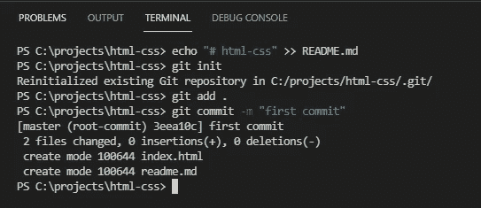
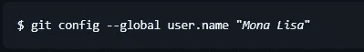
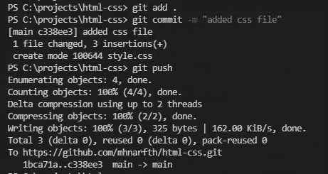
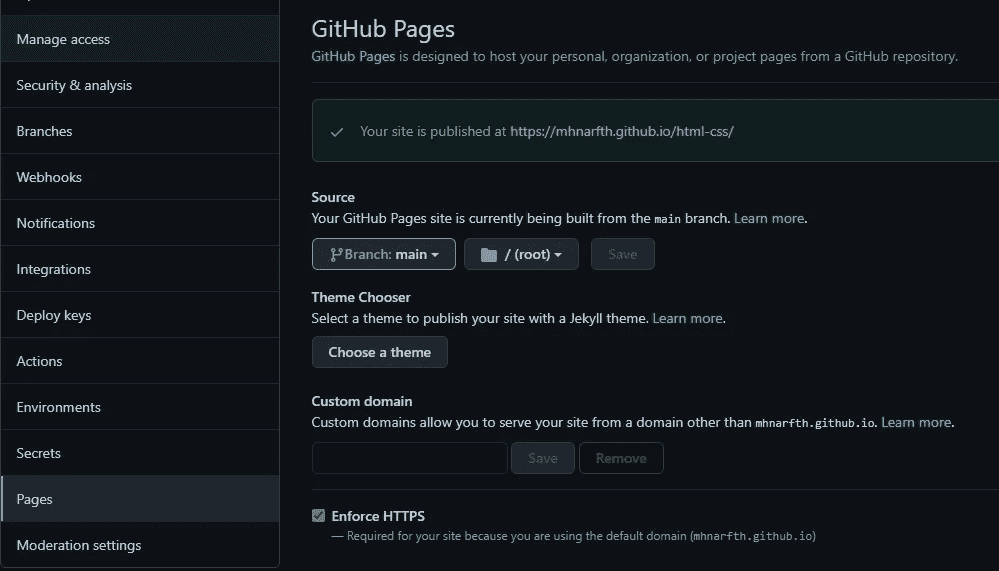

# 网站开发冲刺第三天(里程碑 1:个人作品集)

> 原文：<https://medium.com/nerd-for-tech/web-dev-streaks-day-3-bbd59e9cc935?source=collection_archive---------30----------------------->

> 模块 3: GitHub:把你的代码放在安全的地方

# 1.GitHub 简介

> GitHub 是一个 Git 存储库托管服务，但是它增加了许多自己的特性。虽然 Git 是一个命令行工具，但 GitHub 提供了一个基于 Web 的图形界面。它还为每个项目提供了访问控制和几个协作功能以及基本的任务管理工具。
> 
> 现在你需要在 [GitHub](https://github.com/) 中拥有一个帐户，并从这里开始在你的系统中安装 GitHub scm，

 [## 下载

### Git 带有内置的 GUI 工具(git-gui，gitk ),但是有几个第三方工具供用户寻找一个…

git-scm.com](https://git-scm.com/downloads) 

# 2.创建 Git 存储库

> 登录后，创建一个新的存储库(它表示您可以存储一些东西的存储库),并随意命名，但是要确保包含您所有代码的文件夹的名称与这个存储库名称相匹配。

> 现在，有几种方法可以做到这一点。但是在开始之前，请用命令提示符(又名 CMD)介绍一下自己。打开 CMD，尝试一些命令，如 cd，ls 等。[谷歌一下了解更多信息]

# 3.Git 初始化，Git 添加，Git 提交

> 现在打开 VS Code，打开之前创建的文件夹。利用前两天的知识设计一个网页。现在转到 VS 代码的终端，写下你会在终端中找到的第一个命令行，这将创建一个名为“README.md”的文件。稍后写下这个命令“git init ”,并按 Enter 键，这将初始化你的 git。让我们使用命令“git add”添加所有文件。现在，您必须提交 git，它接受下面的命令" git commit-m " new commit "[您可以命名任何东西]。这是我的一张快照:

VS 代码终端

# 4.设置起点、Git 推送、Git 拉取和回购概述

> 如果您第一次提交 git，那么您可能会遇到询问作者身份的错误，然后使用您在创建 GitHub 帐户时使用的电子邮件地址编写这个命令。

> 然后这个保存着你的用户名，

> 现在，您必须再次提交，因为第一次提交不成功。因此，再次输入 commit 命令。现在，它会告诉你一些文件改变了，bla，bla，blaaa…..
> 
> 现在，输入这个“git branch -M main ”,然后从那里复制下一行并粘贴到终端中，看起来有点像“git remote add origin https://github.com/mhnarfth/html-css.git"并按 enter，这将作为接收者的地址。是时候使用这个命令“git push -u origin main”把你提交的所有东西都推送到 GitHub 了。

# 5.向 GitHub 发送少量增量更改

> 如果您在代码中更改或添加了某些内容，那么您必须在 git 中添加、提交和推送这些代码，以便在 GitHub 中看到更改。您可以通过下面的三个命令来做到这一点，

向 git 中添加新更改的命令

> 每次你改变一些东西的时候，你必须抛出这三个命令来让 GitHub 发生这些变化。

# 6.使用 GitHub-Pages 在 GitHub 中托管一个简单的网站

> 如果你想发布你的网页，那么你只需使用 GitHub Pages 即可。为此你要做的就是，
> 
> 进入 GitHub 库的设置>进入“页面”标签>在源文件部分选择“主”分支并保存。

GitHub-页面

> 他们会给你提供一个网页的相对链接。现在，你可以在任何地方使用它来查看你的网页😁

# 7.新开发人员面临的常见 GitHub 相关问题

> 您可能会面临几个问题，但常见的是，
> 
> 在添加、提交或推送之前保存您的文件，否则您将看不到回购中的更改。
> 
> 您可以在打开一个新的 repo 后尝试添加或更改一些东西，但问题是在 terminal 或 Git bash 中原点仍然保持不变。
> 
> 如果您没有将 HTML 文件命名为“index.html ”,那么在通过 GitHub Pages 发布后，您将看不到您的网页，如果您想要实时观看，请确保您这样做。
> 
> 如果你遇到更多的问题，试着用谷歌解决，如果你不能，你可以在下面评论。

# 8.[高级]创建 Git 分支，合并分支

> 如果几个人在同一个回购部门工作，可能会有冲突。因此，创建单独的分支，然后合并它们是一个安全的赌注。因此，要创建一个新的 git 分支，您只需编写这个命令“git branch [branch-name]”，要合并几个分支，您必须通过“git checkout main”切换到主分支，然后尝试使用“git merge [branch-name]”命令将新添加的缺口与主分支合并。

# 9.[高级] Git 拉取、切换分支、合并冲突

> 不管你是一个人工作，你都可以随心所欲地工作。如果你在团队中工作，不要在主分支上工作，总是使用子分支，也就是特征分支。你可以通过“git branch”来检查有多少个分支，特别是你现在在哪一个分支上。如果你想从 Git 获取代码，那么使用“git pull”命令。因此，要创建一个新的分支并移动到那里，您可以使用“git checkout -b [branch-name]”。现在，如果你改变一些东西，然后试图推入 git，你将面临一个致命的错误，因为原点仍然是 main。为此，您必须使用这个命令“git push-set-upstream origin[branch-name]”再次将 origin 更改为新添加的 branch 和 push。这一次 git 推送将会成功。
> 
> 现在要将新添加的分支与主分支合并，您必须移动到主分支，然后尝试合并它们。如果您在合并时遇到任何问题，请遵循上面的第 8 条说明。
> 
> 如果在主分支上做了一些更改，然后在子分支中有人在相同的位置更改了代码，然后试图将那个子分支与主分支合并，那么合并冲突就会发生。在合并冲突的情况下，您可以选择接受当前的更改还是以前的更改。相应选择。
> 
> 然后做 git 添加、提交和推送。现在，您之前的推送问题将得到解决，git 推送将会成功👌

# 10.Git 命令帮助之手

> 如果你遇到任何关于这些命令的问题，你可以访问这里，

 [## joshnh/Git-命令

### 常用 Git 命令列表。在 GitHub 上创建一个帐户，为 joshnh/Git-Commands 的开发做出贡献。

github.com](https://github.com/joshnh/Git-Commands) 

# 享受使用 GitHub 保护代码的乐趣😉

## &虚拟的👏👏👏拍手不会让手掌疼😏😏