# 网站开发冲刺第 4 天(里程碑 1:个人作品集)

> 原文：<https://medium.com/nerd-for-tech/web-dev-streaks-day-4-bec2efee5bf1?source=collection_archive---------14----------------------->

> 模块 4:个人投资组合

# 1.项目概述和 Git 设置

> 现在，是时候利用前三天的知识来建立一些东西了。
> 
> 首先，去 GitHub 开一个新的回购。如你所愿命名它，最好命名为“developer-portfolio ”,并在你的系统中创建一个文件夹，它也与你的 git 库同名。在 VS 代码中打开该文件夹。在文件夹中创建一个 HTML 文件“index.html”。现在，输入“！”并按 Tab/Enter 键获得 HTML 网页的框架。根据您的需要更改标题，创建一个名为“style.css”的 CSS 文件，并将其与“index.html”链接
> 
> 现在转到您的终端，编写您将在 repo 中找到的所有命令，以便连接您的 git repo。确保你的成功推送，或者在遇到任何问题时，尝试根据前几天的指导进行故障排除。

# 2.简单的图像背景删除，设置一个花哨的背景

> 你需要一张漂亮的照片来装饰你的文件夹。如果你有 photoshop 技能那就太好了，但是你正在学习网站开发，假设你没有。所以，在一些网站的帮助下，你可以很容易地设置一个花哨的背景。要做到这一点，使用任何背景去除器，通过搜索谷歌。移除照片背景后，使用下面的网站添加一个酷炫的背景:

 [## 在线照片编辑器

### 免费的在线照片编辑器支持 PSD，XCF，素描，XD 和 CDR 格式。(Adobe Photoshop，GIMP，素描 App，Adobe XD…

www.photopea.com](https://www.photopea.com/) 

> 看起来几乎像 adobe photoshop。

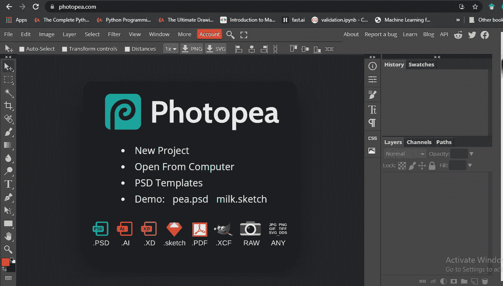

> 因此，作业完成后，导出您的照片并将其下载到您的项目文件夹中。

# 3.设置 Google 字体并安装 Live 服务器进行自动刷新

> 现在转到你的“index.html”开始工作。要使用 google 的漂亮的“Poppins 字体”[我们将使用版本“Regular 400”]，在 Google 中按此名称搜索，然后复制链接(如下所示)并粘贴到 CSS 文件链接行之前的 head 部分。

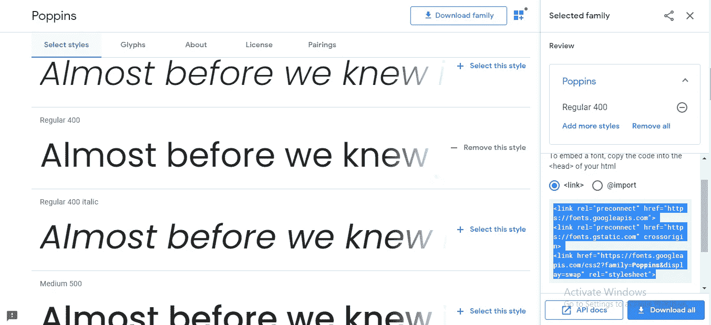

> 在“style.css”文件中，将该规则写入正文部分，因为该字体将在整个正文部分使用

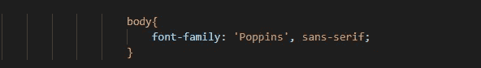

> 由于编写代码、保存代码，然后通过在 web 浏览器中重新加载页面来查看更改的任务相当枯燥，因此可以通过在 VS 代码中安装一个 live server 来进行排序(在扩展中搜索“live server”，然后安装)。注意，回到你的“index.html”文件，点击“Alt+L”然后“Alt+O”一个新的页面将会在你的浏览器中打开。
> 
> 现在，无论你在代码中做了什么改变，都可以在浏览器中自动看到，而不需要重新加载[如果过一会儿还是不行，试着再次打开服务器并关闭前一个标签]

# 4.使用的表头部分样式

> 使用标签改变你名字的颜色。另外，在标签中添加一个类，然后给“style.css”文件中的类着色并保存它。现在，看看变化。另外，在
> 
> 标签中，在你的名字下添加一些关于你的信息。

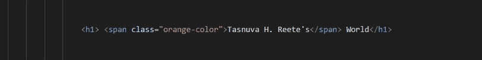

使用标签

> 结果会是这样的，

局部造型的结果

# 5.放置容器，并排，图像大小，链接按钮样式

> 现在添加“雇用我”超文本，并将其链接到你的 LinkedIn 帐户，还有你的肖像图像，这是你之前在段落下方准备好的，使用两个
> 
> 容器分别封装两个部分，并进一步将所有内容封装在标签中。稍后，在“style.css”文件中按照您的意愿对它们进行样式化。

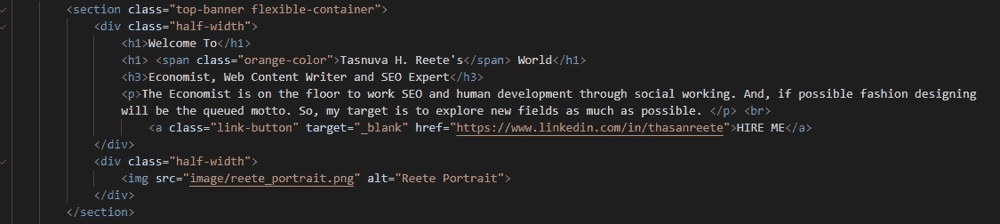

HTML 代码

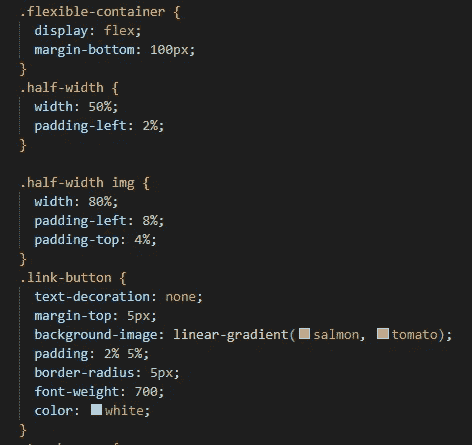

CSS 代码

# 6.梦的区域，背景图像，背景-重复

> 将您的部分包含在名为“top-banner”的类中，并进一步包含在“style.css”文件样式中，该文件样式使用横幅图像作为顶部横幅。使用“背景-图像:url(您的图像位置)”进行设置。之后，设置“背景-重复:不重复”,否则你会看到你的横幅广告重复很多次。此外，将“主体”的边距设置为零，并查看变化。

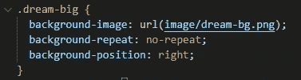

CSS 代码

完成到这里后，你的网页将看起来像……..

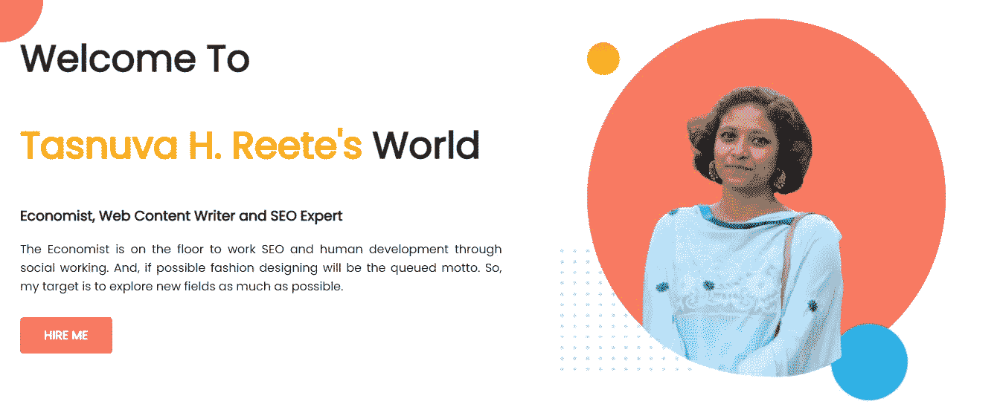

网页的第一部分

> 现在通过复制前一个创建一个新的部分。你所要做的就是镜像前面的部分。只需将图像放在左边，并在右边的
> 
> 内写些东西。

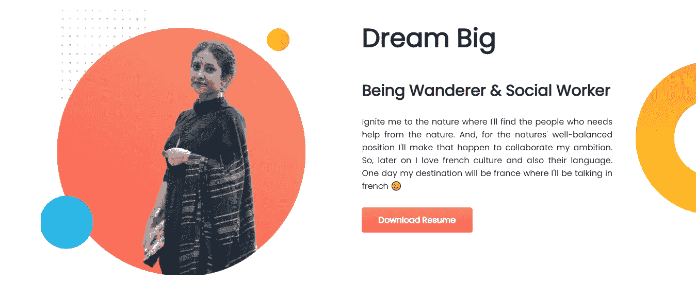

网页的第二部分

# 7.体验区，重构灵活容器，有意义的类名

> 每次更改或添加代码时，不要忘记将代码推入 GitHub。现在，你需要再创建一个部分，这个部分与前一个部分有点不同，也有点困难。所以，让我们开始吧。
> 
> 创建一个部分，并在该部分中创建两个
> 
> 。一个用于保存“经验”标题，另一个用于保存两个以上的同样，在那些中使用
> 
> # 和
> 
> 标签添加标题和段落。使用柔性容器{ display:flex；}来强制它们内联。之后，使用一些填料，使
> 
> 看起来很漂亮。你可以从下面得到帮助，

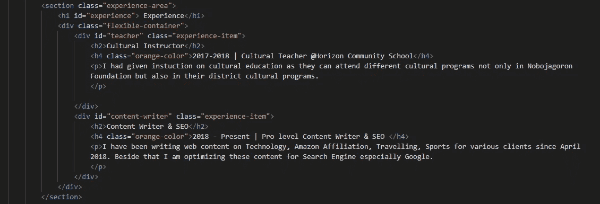

HTML 代码

# 8.方框阴影，背景图像

> 给你的字幕添加一些颜色，并添加背景图片。
> 
> 现在，关键的部分来了，那就是添加盒子阴影。你最好在谷歌上搜索“CSS 中的框阴影”，并在这些
> 
> 中给出一个框阴影。它类似于{box-shadow:10 px 10px 40px gray}，表示阴影在 X 轴和 Y 轴上的偏移区域，以及阴影颜色后面的模糊半径。你差不多完成了。

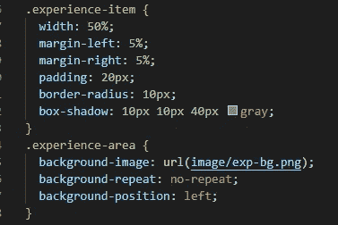

CSS 代码

# 9.边框图像和页脚

> 你必须在那些
> 
> 边框的左边添加一些渐变效果。因此，对于这一点，你所要做的就是使用{背景图像:线性梯度(橙色，鲑鱼)}添加一些边界梯度。同样，对于你的同类信息，边界图像由不同的切片(1-9)组合而成。所以，这就是为什么你必须添加切片数，否则你的梯度将不可见。

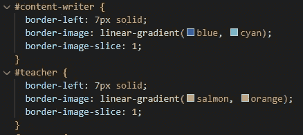

两个CSS 代码都使用 ID

> [现在，是时候使用
> 
> 标签为你的网页添加页脚了。

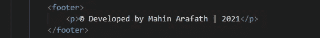

页脚 HTML 代码

> 你也可以给你添加的段落一些风格。

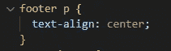

页脚 CSS 代码

> 经过所有这些努力，你的网站看起来会像这样，

 [## Reete 的投资组合

### 2018 年至今|专业级内容作家& SEO 我一直在撰写关于技术、亚马逊联盟的网页内容…

mhnarfth.github.io](https://mhnarfth.github.io/developer-portfolio/index.html) 

# 10.使用 GitHub 托管发布您的页面并获得实时链接

> 现在，是时候用 GitHub 发布你的网页了。你可以很容易做到这一点。转到您的存储库设置>页面>选择此分支并保存它。你会得到一个你的网站的网址。瞧，你的网站上线了。现在坐好放松。你可以通过展示你的网站来向你最亲密的朋友炫耀😉
> 
> 如果你在编码时有任何问题，你可以从我的知识库中得到帮助。

 [## mhnarfth/开发者组合

### 在 GitHub 上创建一个帐户，为 mhnarfth/developer-portfolio 开发做贡献。

github.com](https://github.com/mhnarfth/developer-portfolio) 

> 我只想给你一个建议，不要重复不要直接复制粘贴代码，至少在看完之后打字。过段时间就好了。

# 干杯！…!….！….！😋

# 😀 😀 😀 😀…下次见…😀 😀 😀 😀

## &虚拟的👏👏👏拍手不会让手掌疼😏😏