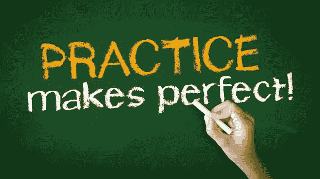
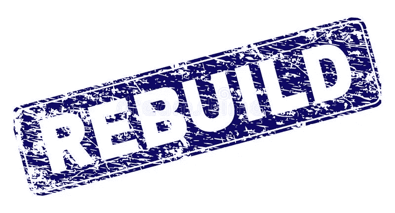

# 网站开发冲刺第 5 天(里程碑 1:个人作品集)

> 原文：<https://medium.com/nerd-for-tech/web-dev-streaks-day-5-d7cb31455c25?source=collection_archive---------27----------------------->

> 模块 4.5:复习/练习日，建立一个全新的网站

今天我们不会学习任何新东西，而是练习我们到目前为止所学的所有模块。

# 1.练习-不需要帮助

> 你的工作是练习第四天的全部任务，不需要从博客或知识库中获得帮助。你可以通过谷歌搜索任何你不知道或困惑的东西。

# 2.观察、思考和提问

> 现在，看着那个网站，逆向思考。思考如何制作第一部分，需要什么标签来设计它。你如何给一行文字中的一小部分文字着色？图像是如何设置的，需要什么标签。网站上有多少部分？盒子阴影是如何工作的？盒影的参数是什么，有哪些？你怎么做页脚？页脚是如何工作的？如何强制块元素具有内联属性？

> 问自己类似这样的问题，试着在不借助博客的情况下找到答案。

# 3.从头开始制作网站

> 现在，开始重新创建你自己的网站。以某种方式完成它。如果看起来和以前不一样完全没问题。80-90%的匹配就可以了。

# 4.建立一个全新的网站

> 在你自己重新创建了投资组合网站后，你一定已经在 basic 上获得了一个据点。不，是时候建立一个全新的网站了。什么都有可能。

> 但是如果你问我一些想法，我会告诉你在“食品网络”上做一个
> 
> 把它当成我分配给你的任务。
> 
> 如果你需要一些想法或者需要帮助，你可以从我的知识库中得到。

 [## mhnarfth/foodNet

### 在 GitHub 上创建一个帐户，为 mhnarfth/foodNet 的发展做出贡献。

github.com](https://github.com/mhnarfth/foodNet) 

> 制作完网页后，使用 GitHub Pages 托管来部署它。如果你愿意，你可以向我提供你的知识库和实时网站链接，以便进一步评估。尝试遵循以下格式:
> 
> 直播网站:【https://mhnarfth.github.io/foodNet/ 
> 
> GitHub 资源库:【https://github.com/mhnarfth/foodNet 

# 如果你正在读这封信，谢谢😊对我的宽容。

## &虚拟的👏👏👏拍手不会让手掌疼😏😏