# 网站开发冲刺第 6 天(里程碑 1:个人作品集)

> 原文：<https://medium.com/nerd-for-tech/web-dev-streaks-day-6-735ce923dba0?source=collection_archive---------25----------------------->

> 模块 5:重温 CSS

# 1.了解内联、块、内联块元素

> 块元素占用整个块，而行内元素只使用包含行内内容的空间。
> 
> 您可以在 VS 代码中使用一些快捷方式来快进您的任务。你可以用
> 
> " div*3 "并按回车键轻松创建三个
> 
> 的骨架
> 
> " div*3>h2" →在每个
> 
> 中也有一个
> 
> ## 标签
> 
> " div*3>h2" →在每个
> 
> 中也有一个
> 
> ## 标签
> 
> " div*3>h2+p" →每个
> 
> 中有一个
> 
> ## 和
> 
> 标记
> 
> " div*3>h2{Room-$}+p{some text}" →您将有一个包含" Room-$ "的
> 
> ## 标记[它充当数字变量，如 1、2、3、…。]和一个包含“一些文本”的
> 
> 标签。
> 
> 您可以使用“Shift+End”来选择一整行，使用“Shift+Alt+向下箭头”来复制选定的一行或多行。
> 
> 现在，在谷歌上搜索“块和内联元素”，看看所有的“块元素标签”和“内联元素标签”。
> 
> 但是您也可以使用{display: inline}或{display: block}强制块元素像内联元素一样工作，反之亦然。您还可以将内联元素设置为{display: inline-block}，强制它具有内联的块元素的属性。此外，Block 元素有宽度和高度属性，您可以根据自己的需要设置这些属性，而 inline 元素没有这些属性。

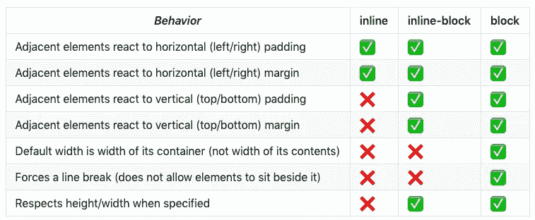

块、内联和内联块元素的行为

> 在边距的情况下，block 元素拥有它，但是 inline 元素只拥有左边距和右边距，而没有顶部和底部。

# 2.CSS 盒子模型，div vs span，边框图像切片

> 把网站想象成一个大盒子，所有其他的盒子就像标题、段落和 div 一样放在里面。因此，如果它们保存块属性，它们将代替整个块，否则它们将只保存包含的位置。此外，网站上的所有东西就像一个盒子里的积木，它们一个接一个地装饰在里面，一个接一个。除此之外，还有一些块驻留在盒子中的另一个块内。这被称为 CSS 盒子模型。因此，您现在可以探索在这些元素中添加一些填充、边框和边距。

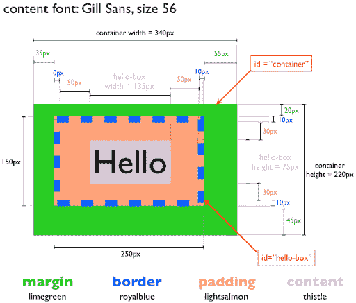

> span 和 div 的区别在于，span 元素是**内嵌的**，通常用于一行中的一小块 HTML(比如一个段落中)，而 div (division)元素是 **block-line** (基本上相当于在它的前后有一个换行符)，用于对较大的代码块进行分组。
> 
> border-image-slice CSS 属性将 border-image-slice 指定的图像分为九个区域:四个角、四个边和一个中间。这是通过指定 4 个向内偏移来实现的，这通常会创建一个 3*3 的网格。

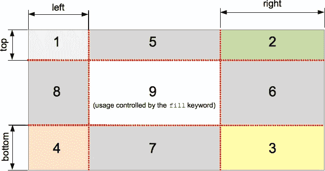

# 3.伪类悬停、类悬停、已访问、焦点

> CSS **伪类**是添加到选择器中的一个关键字，指定所选元素的特殊状态。例如，当用户的指针悬停在按钮上时，可以使用“:hover”来改变按钮的颜色。

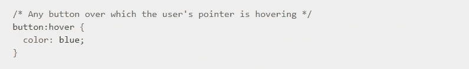

> 伪类允许您将样式应用于元素，不仅与文档树的内容相关，还与外部因素相关，如导航器的历史(例如:visited)、内容的状态(如:在某些表单元素上选中)或鼠标的位置(如:hover，它让您知道鼠标是否在元素上)。

# 4.第一个孩子，第 n 个孩子，伪元素 Before After

> “:第一个孩子” [CSS](https://developer.mozilla.org/en-US/docs/Web/CSS) [伪类](https://developer.mozilla.org/en-US/docs/Web/CSS/Pseudo-classes)表示一组同级元素中的第一个元素。

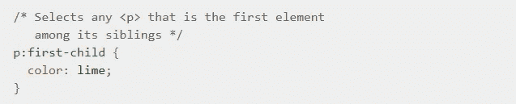

> “:n-child(n)”选择器匹配作为其父元素的第 *n* 个子元素的每个元素，而不考虑其类型。" *n"* 可以是数字、关键字或公式。

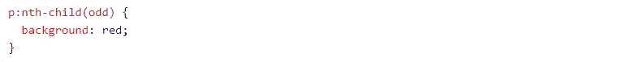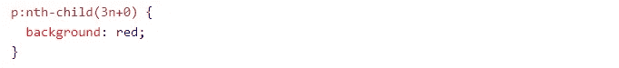

> CSS 伪元素用于样式化元素的指定部分。例如，它可以用于:
> 
> 样式元素的第一个字母或第一行
> 
> 在元素内容之前或之后插入内容
> 
> CSS 中的::before 和::after 伪元素允许您将内容插入到页面中，而无需包含在 HTML 中。虽然最终结果实际上并不在 DOM 中，但它看起来好像在页面上，并且基本上是这样的:

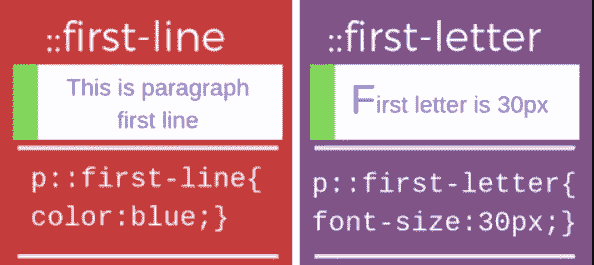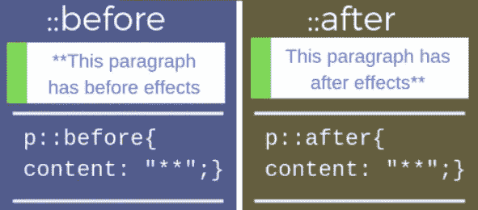

# 5.位置静态相对绝对固定粘滞 z 索引

> position 属性指定用于元素的定位方法的类型。有五种不同的位置值:

## 1.静态，2。相对的，3。固定，4。绝对，5。粘的

> 然后使用 top、bottom、left 和 right 属性定位元素。但是，除非先设置“位置”属性，否则这些属性将不起作用。根据位置值的不同，它们的工作方式也不同。

## 1.位置:静态；

> 默认情况下，HTML 元素是静态定位的。静态定位的元素不受 top、bottom、left 和 right 属性的影响。
> 
> 具有{ position:static；的元素；}没有任何特别的定位。它总是根据页面的正常流向进行定位:

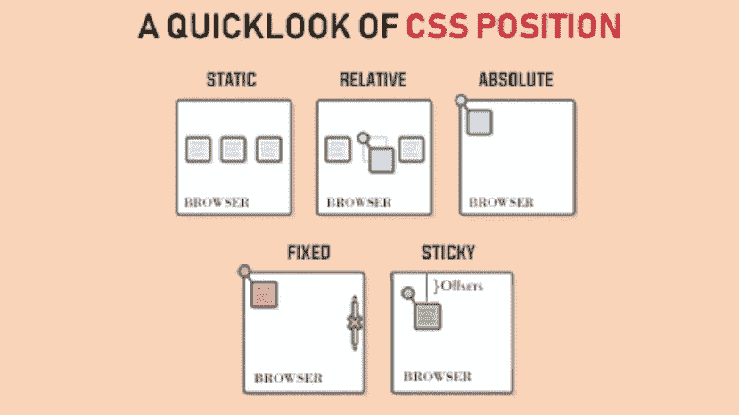

## 2.位置:相对；

> 具有{ position:relative；的元素；}相对于其正常位置定位。设置相对定位的元素的 top、right、bottom 和 left 属性将导致该元素被调整到远离其正常位置。其他内容将不会被调整以适合元素留下的任何间隙。

## 3.位置:固定；

> {位置:固定的元素；}相对于视区定位，这意味着即使页面滚动，它也总是停留在同一位置。top、right、bottom 和 left 属性用于定位元素。
> 
> 固定元素不会在页面中它通常所在的位置留下间隙。

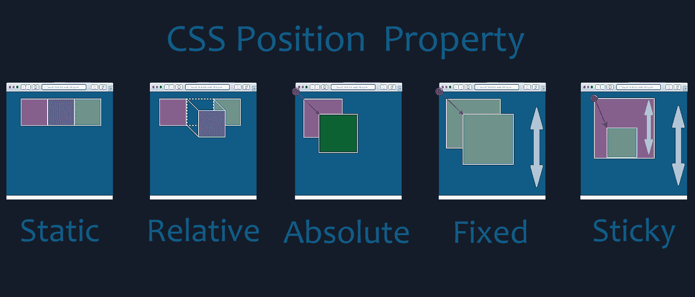

## 4.位置:绝对；

> 具有{ position:absolute；的元素；}相对于最近定位的祖先定位(而不是相对于视口定位，如 fixed)。
> 
> 然而；如果绝对定位的元素没有定位的祖先，它使用文档正文，并随着页面滚动而移动。
> 
> **注意:**“定位”元素是其位置不是“静态”的元素。

## 5.位置:粘性；

> 具有{ position:sticky；的元素；}基于用户的滚动位置定位。粘性元素根据滚动位置在相对和固定之间切换。它是相对定位的，直到在视口中遇到给定的偏移位置，然后它“粘”在适当的位置(像位置:固定；).

## **重叠元素* *

> 定位元素时，它们可以与其他元素重叠。
> 
> “z-index”属性指定元素的堆栈顺序(哪个元素应该放在其他元素的前面或后面)。
> 
> 一个元素可以有正或负的堆栈顺序:

# 今天到此为止。下次见……🥱

## &虚拟的👏👏👏拍手不会让手掌疼😏😏